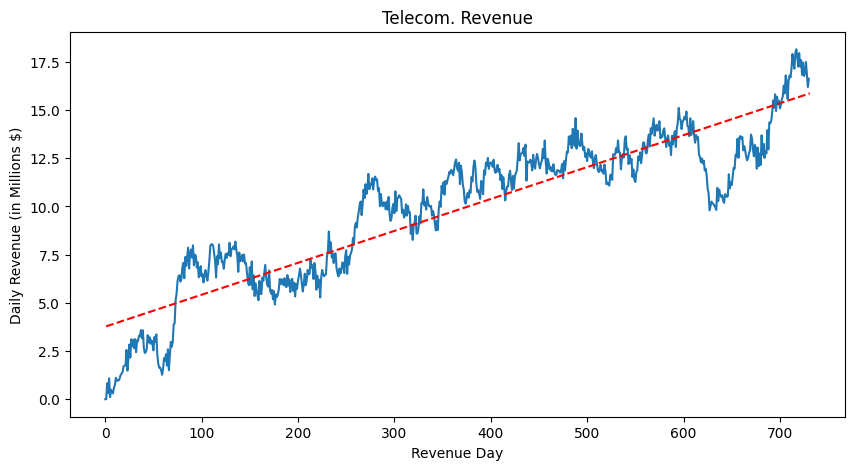
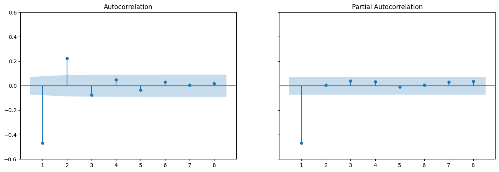

# D213 Advance Data Mining - Performance Assessment
## **NLM3 — NLM3 TASK 1: TIME SERIES MODELING**
\
******************************
> <b>Sudhir Ranjan Pradhan </br>
  Student ID : 011329744 </br>
  WGU - MSDA Program

---
******************************
\
## Table of Contents

<ul>
  <li><a href="#Part-I">Part I: Research Question</a>
    <ul>
      <li><a href="#Part-I-A1">A1. Question</a></li>
      <li><a href="#Part-I-A2">A2. Objective</a></li>
    </ul>
  </li>
  <li><a href="#Part-II">Part II: METHOD JUSTIFICATION</a>
    <ul>
      <li><a href="#Part-II-B">B. SUMMARY OF ASSUMPTIONS</a></li>
    </ul>
  </li>
  <li><a href="#Part-III">Part III: DATA PREPARATION</a>
    <ul>
      <li><a href="#Part-III-C1">C1. LINE GRAPH VISUALIZATION</a></li>
      <li><a href="#Part-III-C2">C2. TIME STEP FORMATTING </a></li>
      <li><a href="#Part-III-C3">C3. STATIONARITY</a></li>
      <li><a href="#Part-III-C2">C4. STEPS TO PREPARE THE DATA </a></li>
      <li><a href="#Part-III-C2">C5. PREPARED DATASET </a></li>
    </ul>
  </li>
  <li><a href="#Part-IV">Part IV: MODEL IDENTIFICATION AND ANALYSIS</a>
    <ul>
      <li><a href="#Part-IV-D1">D1. REPORT FINDINGS AND VISUALIZATIONS </a></li>
      <li><a href="#Part-IV-D2">D2. ARIMA MODEL </a></li>
      <li><a href="#Part-IV-D3">D3. FORECASTING USING ARIMA MODEL </a></li>
      <li><a href="#Part-IV-D4">D4. OUTPUT AND CALCULATIONS </a></li>
      <li><a href="#Part-IV-D5">D5. CODE </a></li>
        </li>
    </ul>

  </li>
    <li><a href="#Part-V">Part V: DATA SUMMARY AND IMPLICATIONS</a>
      <ul>
        <li><a href="#Part-V-E">E. RESULTS </a>
        </li>
        <li><a href="#Part-V-F">F. ANNOTATED VISUALIZATION  </a>
        </li>
        <li><a href="#Part-V-G">G. RECOMMENDATIONS </a>
        </li>
      </ul>
  </li>

  </li>
    <li><a href="#Part-V">Part VI: REPORTING</a>
      <ul>
        <li><a href="#Part-V-E">E. REPORTING </a>
        </li>
        <li><a href="#Part-V-F">F. SOURCES FOR THIRD PARTY CODE </a>
        </li>
        <li><a href="#Part-V-G">G. SOURCES </a>
        </li>
      </ul>
  </li>
   
</ul>


<a id='Part-I'></a>
## Part-I: Research Question

<a id='Part-I-A'></a>
### A1. Realistic Question

My research question is `Can we accurately forecast the daily revenue of the telecom company for the next quarter?`, It offers forecasting the daily revenue of a telecom company for the next quarter offers a powerful tool for strategic decision-making. By accurately predicting its income, the company can:

- `Optimize resource allocation`: Ensure proper staffing, inventory, and infrastructure management by anticipating future needs based on revenue projections.
- `Guide investment decisions`: Equip investors with valuable information to make informed choices regarding buying or selling stocks, or investing in the company's growth.
- `Shape business strategies`: Set realistic sales targets, determine appropriate pricing strategies, tailor marketing campaigns to maximize return, and guide long-term business direction, including product development and market expansion.


#### A2. Objective of the analysis


The goal of the research question `Can we achieve dimensionality reduction by pinpointing the critical variables that drive the data's most significant variations, enabling efficient and accurate analysis?` is it aims to determine whether it's possible to create reliable predictions of how much money a telecom company will make each day over the next three months (a quarter).

To answer the above question we may follow the methos like,
How to Answer the Question

- `Data collection`: Gather historical revenue data over several quarters or years.
- `Analysis`: Look for trends, seasonality (busy/slow months), and factors that influence revenue (customer activity, promotions, competitor actions, economic conditions, etc.).
- `Forecasting models`: Use statistical techniques or machine learning models suitable for time-series forecasting to predict daily revenue for the next quarter.
- `Evaluation`: Compare the forecasts to actual revenue once the quarter is over to assess accuracy and identify areas for improvement.


## PART-II : Method Justification

<a id='Part-I-B'></a>
#### B. SUMMARY OF ASSUMPTIONS

Time series models rely on several key assumptions to ensure accurate and reliable predictions. Two critical assumptions are:

1. Stationarity, meaning a time series is considered stationary if its statistical properties (mean, variance, and autocorrelation) remain constant over time. This implies the data doesn't exhibit trends, seasonality, or structural changes.
This is important, because stationarity allows for building models based on past observations that are still relevant for future predictions. Non-stationary data can lead to misleading or inaccurate forecasts.

2. Autocorrelation, meaning the autocorrelation refers to the correlation between a time series and its lagged versions. It measures how much a specific data point is related to its previous values.
This is important because, understanding the presence and nature of autocorrelation is crucial for choosing appropriate models and interpreting results. Ignoring autocorrelation can lead to inefficient models and unreliable predictions.

3. Some additional Assumptions could be,Linearity & Normality

 The `Linearity`, is the relationship between the variables in the model is assumed to be linear.
 And the `Normality`, is the errors in the model are assumed to be normally distributed.

It's also important to note that, the real-world data often deviates from these assumptions to some extent. Techniques like differencing and transformations can be used to address non-stationarity.
Model selection and analysis methods consider the presence of autocorrelation.

<a id='Part-III'></a>
## Part-III: Data Preparation

###### Data Load


```python
# Necessary python modules / packages
# !pip install tabulate
# !pip install ipywidgets
!pip install pmdarima
!pip install statsmodels

import pandas as pd
import numpy as np
import os
import math
import time
import random
from pandas.api.types import CategoricalDtype

# VISUAL PLOTTING
# import tabulate
# import ipywidgets as widgets
import seaborn as sb
import matplotlib
import matplotlib.pyplot as plt
from matplotlib import axis
from IPython.display import Markdown, display, HTML, display_html


# DATA PREPROCESSING
from dateutil.parser import parse
import statsmodels.api as sm
from statsmodels.tsa.stattools import adfuller
from pmdarima import auto_arima
import statsmodels.tsa.arima.model

from statsmodels.tsa.seasonal import seasonal_decompose
from statsmodels.graphics.tsaplots import plot_acf
from scipy.signal import periodogram


# STATISTICAL TESTING
from sklearn import metrics
from scipy import stats
from sklearn.pipeline import make_pipeline


# Change color of Matplotlib font
import matplotlib as mpl
COLOR = 'black'
mpl.rcParams['text.color'] = COLOR
mpl.rcParams['axes.labelcolor'] = COLOR
mpl.rcParams['xtick.color'] = COLOR
mpl.rcParams['ytick.color'] = COLOR

import warnings
warnings.filterwarnings('ignore')

%matplotlib inline

# Visually inspect dataframe to facilitate exploration, spot problems
pd.set_option("display.max_columns", None)

# Utility function to export the figure to PDF
def export2pdf(fig, out_fname):
  from matplotlib.backends.backend_pdf import PdfPages
  pp = PdfPages(out_fname)
  pp.savefig(fig)
  pp.close()


def save_df_as_fig(df, path):
    from pandas.plotting import table

    fig, ax = plt.subplots(figsize=(15, 5)) # set image frame size
    ax.xaxis.set_visible(False)  # x axis hidden
    ax.yaxis.set_visible(False)  # y axis hidden
    ax.set_frame_on(False)  # Frame hidden
    tabla = table(ax, df, loc='upper right', colWidths=[0.17]*len(df.columns))
    tabla.auto_set_font_size(False) # Activate set fontsize manually
    tabla.set_fontsize(12) # if ++fontsize is necessary ++colWidths
    tabla.scale(1.2, 1.2) # Adjust table size
    print("Exporting Chi2 test output to image ....")
    plt.savefig(path, transparent=True)

CSS = """
.output {
    flex-direction: row;
}
"""

HTML('<style>{}</style>'.format(CSS))
```

    Collecting pmdarima
      Downloading pmdarima-2.0.4-cp310-cp310-manylinux_2_17_x86_64.manylinux2014_x86_64.manylinux_2_28_x86_64.whl (2.1 MB)
         ━━━━━━━━━━━━━━━━━━━━━━━━━━━━━━━━━━━━━━━━ 2.1/2.1 MB 8.8 MB/s eta 0:00:00
    [?25hRequirement already satisfied: joblib>=0.11 in /usr/local/lib/python3.10/dist-packages (from pmdarima) (1.3.2)
    Requirement already satisfied: Cython!=0.29.18,!=0.29.31,>=0.29 in /usr/local/lib/python3.10/dist-packages (from pmdarima) (3.0.8)
    Requirement already satisfied: numpy>=1.21.2 in /usr/local/lib/python3.10/dist-packages (from pmdarima) (1.25.2)
    Requirement already satisfied: pandas>=0.19 in /usr/local/lib/python3.10/dist-packages (from pmdarima) (1.5.3)
    Requirement already satisfied: scikit-learn>=0.22 in /usr/local/lib/python3.10/dist-packages (from pmdarima) (1.2.2)
    Requirement already satisfied: scipy>=1.3.2 in /usr/local/lib/python3.10/dist-packages (from pmdarima) (1.11.4)
    Requirement already satisfied: statsmodels>=0.13.2 in /usr/local/lib/python3.10/dist-packages (from pmdarima) (0.14.1)
    Requirement already satisfied: urllib3 in /usr/local/lib/python3.10/dist-packages (from pmdarima) (2.0.7)
    Requirement already satisfied: setuptools!=50.0.0,>=38.6.0 in /usr/local/lib/python3.10/dist-packages (from pmdarima) (67.7.2)
    Requirement already satisfied: packaging>=17.1 in /usr/local/lib/python3.10/dist-packages (from pmdarima) (23.2)
    Requirement already satisfied: python-dateutil>=2.8.1 in /usr/local/lib/python3.10/dist-packages (from pandas>=0.19->pmdarima) (2.8.2)
    Requirement already satisfied: pytz>=2020.1 in /usr/local/lib/python3.10/dist-packages (from pandas>=0.19->pmdarima) (2023.4)
    Requirement already satisfied: threadpoolctl>=2.0.0 in /usr/local/lib/python3.10/dist-packages (from scikit-learn>=0.22->pmdarima) (3.3.0)
    Requirement already satisfied: patsy>=0.5.4 in /usr/local/lib/python3.10/dist-packages (from statsmodels>=0.13.2->pmdarima) (0.5.6)
    Requirement already satisfied: six in /usr/local/lib/python3.10/dist-packages (from patsy>=0.5.4->statsmodels>=0.13.2->pmdarima) (1.16.0)
    Installing collected packages: pmdarima
    Successfully installed pmdarima-2.0.4
    Requirement already satisfied: statsmodels in /usr/local/lib/python3.10/dist-packages (0.14.1)
    Requirement already satisfied: numpy<2,>=1.18 in /usr/local/lib/python3.10/dist-packages (from statsmodels) (1.25.2)
    Requirement already satisfied: scipy!=1.9.2,>=1.4 in /usr/local/lib/python3.10/dist-packages (from statsmodels) (1.11.4)
    Requirement already satisfied: pandas!=2.1.0,>=1.0 in /usr/local/lib/python3.10/dist-packages (from statsmodels) (1.5.3)
    Requirement already satisfied: patsy>=0.5.4 in /usr/local/lib/python3.10/dist-packages (from statsmodels) (0.5.6)
    Requirement already satisfied: packaging>=21.3 in /usr/local/lib/python3.10/dist-packages (from statsmodels) (23.2)
    Requirement already satisfied: python-dateutil>=2.8.1 in /usr/local/lib/python3.10/dist-packages (from pandas!=2.1.0,>=1.0->statsmodels) (2.8.2)
    Requirement already satisfied: pytz>=2020.1 in /usr/local/lib/python3.10/dist-packages (from pandas!=2.1.0,>=1.0->statsmodels) (2023.4)
    Requirement already satisfied: six in /usr/local/lib/python3.10/dist-packages (from patsy>=0.5.4->statsmodels) (1.16.0)


<style>
.output {
    flex-direction: row;
}
</style>


```python
# To load a CSV file from GitHub, we need to provide pandas with a URL to the raw CSV file.
# The cleaned data CSV file given in the assessment is uploaded to github, and loaded back without any formatting or styling.
data_file_url = 'https://raw.githubusercontent.com/smartechie-repo/ms-da-data-cleaning/main/data-files/d213_teleco_time_series.csv'

revenue_df = pd.read_csv(data_file_url)
# Check data types and number of values, as well as overall size of dataframe
revenue_df.info()
```

    <class 'pandas.core.frame.DataFrame'>
    RangeIndex: 731 entries, 0 to 730
    Data columns (total 2 columns):
     #   Column   Non-Null Count  Dtype  
    ---  ------   --------------  -----  
     0   Day      731 non-null    int64  
     1   Revenue  731 non-null    float64
    dtypes: float64(1), int64(1)
    memory usage: 11.5 KB


```python
# Get an idea of dataset size
print("revenue_df.shape: ", revenue_df.shape)
```

    revenue_df.shape:  (731, 2)


```python
# Examine the features of the dataset
print("revenue_df.columns: ", revenue_df.columns)
```

    revenue_df.columns:  Index(['Day', 'Revenue'], dtype='object')


```python
# Examine first few records of dataset
display(revenue_df.head())
```


  <div id="df-29e575ca-6260-4c77-a917-2b29683d338a" class="colab-df-container">
    <div>
<style scoped>
    .dataframe tbody tr th:only-of-type {
        vertical-align: middle;
    }

    .dataframe tbody tr th {
        vertical-align: top;
    }

    .dataframe thead th {
        text-align: right;
    }
</style>
<table border="1" class="dataframe">
  <thead>
    <tr style="text-align: right;">
      <th></th>
      <th>Day</th>
      <th>Revenue</th>
    </tr>
  </thead>
  <tbody>
    <tr>
      <th>0</th>
      <td>1</td>
      <td>0.000000</td>
    </tr>
    <tr>
      <th>1</th>
      <td>2</td>
      <td>0.000793</td>
    </tr>
    <tr>
      <th>2</th>
      <td>3</td>
      <td>0.825542</td>
    </tr>
    <tr>
      <th>3</th>
      <td>4</td>
      <td>0.320332</td>
    </tr>
    <tr>
      <th>4</th>
      <td>5</td>
      <td>1.082554</td>
    </tr>
  </tbody>
</table>
</div>
    <div class="colab-df-buttons">

  <div class="colab-df-container">
    <button class="colab-df-convert" onclick="convertToInteractive('df-29e575ca-6260-4c77-a917-2b29683d338a')"
            title="Convert this dataframe to an interactive table."
            style="display:none;">

  <svg xmlns="http://www.w3.org/2000/svg" height="24px" viewBox="0 -960 960 960">
    <path d="M120-120v-720h720v720H120Zm60-500h600v-160H180v160Zm220 220h160v-160H400v160Zm0 220h160v-160H400v160ZM180-400h160v-160H180v160Zm440 0h160v-160H620v160ZM180-180h160v-160H180v160Zm440 0h160v-160H620v160Z"/>
  </svg>
    </button>

  <style>
    .colab-df-container {
      display:flex;
      gap: 12px;
    }

    .colab-df-convert {
      background-color: #E8F0FE;
      border: none;
      border-radius: 50%;
      cursor: pointer;
      display: none;
      fill: #1967D2;
      height: 32px;
      padding: 0 0 0 0;
      width: 32px;
    }

    .colab-df-convert:hover {
      background-color: #E2EBFA;
      box-shadow: 0px 1px 2px rgba(60, 64, 67, 0.3), 0px 1px 3px 1px rgba(60, 64, 67, 0.15);
      fill: #174EA6;
    }

    .colab-df-buttons div {
      margin-bottom: 4px;
    }

    [theme=dark] .colab-df-convert {
      background-color: #3B4455;
      fill: #D2E3FC;
    }

    [theme=dark] .colab-df-convert:hover {
      background-color: #434B5C;
      box-shadow: 0px 1px 3px 1px rgba(0, 0, 0, 0.15);
      filter: drop-shadow(0px 1px 2px rgba(0, 0, 0, 0.3));
      fill: #FFFFFF;
    }
  </style>

    <script>
      const buttonEl =
        document.querySelector('#df-29e575ca-6260-4c77-a917-2b29683d338a button.colab-df-convert');
      buttonEl.style.display =
        google.colab.kernel.accessAllowed ? 'block' : 'none';

      async function convertToInteractive(key) {
        const element = document.querySelector('#df-29e575ca-6260-4c77-a917-2b29683d338a');
        const dataTable =
          await google.colab.kernel.invokeFunction('convertToInteractive',
                                                    [key], {});
        if (!dataTable) return;

        const docLinkHtml = 'Like what you see? Visit the ' +
          '<a target="_blank" href=https://colab.research.google.com/notebooks/data_table.ipynb>data table notebook</a>'
          + ' to learn more about interactive tables.';
        element.innerHTML = '';
        dataTable['output_type'] = 'display_data';
        await google.colab.output.renderOutput(dataTable, element);
        const docLink = document.createElement('div');
        docLink.innerHTML = docLinkHtml;
        element.appendChild(docLink);
      }
    </script>
  </div>


<div id="df-4f3d7739-6749-4516-a173-ee9949941156">
  <button class="colab-df-quickchart" onclick="quickchart('df-4f3d7739-6749-4516-a173-ee9949941156')"
            title="Suggest charts"
            style="display:none;">

<svg xmlns="http://www.w3.org/2000/svg" height="24px"viewBox="0 0 24 24"
     width="24px">
    <g>
        <path d="M19 3H5c-1.1 0-2 .9-2 2v14c0 1.1.9 2 2 2h14c1.1 0 2-.9 2-2V5c0-1.1-.9-2-2-2zM9 17H7v-7h2v7zm4 0h-2V7h2v10zm4 0h-2v-4h2v4z"/>
    </g>
</svg>
  </button>

<style>
  .colab-df-quickchart {
      --bg-color: #E8F0FE;
      --fill-color: #1967D2;
      --hover-bg-color: #E2EBFA;
      --hover-fill-color: #174EA6;
      --disabled-fill-color: #AAA;
      --disabled-bg-color: #DDD;
  }

  [theme=dark] .colab-df-quickchart {
      --bg-color: #3B4455;
      --fill-color: #D2E3FC;
      --hover-bg-color: #434B5C;
      --hover-fill-color: #FFFFFF;
      --disabled-bg-color: #3B4455;
      --disabled-fill-color: #666;
  }

  .colab-df-quickchart {
    background-color: var(--bg-color);
    border: none;
    border-radius: 50%;
    cursor: pointer;
    display: none;
    fill: var(--fill-color);
    height: 32px;
    padding: 0;
    width: 32px;
  }

  .colab-df-quickchart:hover {
    background-color: var(--hover-bg-color);
    box-shadow: 0 1px 2px rgba(60, 64, 67, 0.3), 0 1px 3px 1px rgba(60, 64, 67, 0.15);
    fill: var(--button-hover-fill-color);
  }

  .colab-df-quickchart-complete:disabled,
  .colab-df-quickchart-complete:disabled:hover {
    background-color: var(--disabled-bg-color);
    fill: var(--disabled-fill-color);
    box-shadow: none;
  }

  .colab-df-spinner {
    border: 2px solid var(--fill-color);
    border-color: transparent;
    border-bottom-color: var(--fill-color);
    animation:
      spin 1s steps(1) infinite;
  }

  @keyframes spin {
    0% {
      border-color: transparent;
      border-bottom-color: var(--fill-color);
      border-left-color: var(--fill-color);
    }
    20% {
      border-color: transparent;
      border-left-color: var(--fill-color);
      border-top-color: var(--fill-color);
    }
    30% {
      border-color: transparent;
      border-left-color: var(--fill-color);
      border-top-color: var(--fill-color);
      border-right-color: var(--fill-color);
    }
    40% {
      border-color: transparent;
      border-right-color: var(--fill-color);
      border-top-color: var(--fill-color);
    }
    60% {
      border-color: transparent;
      border-right-color: var(--fill-color);
    }
    80% {
      border-color: transparent;
      border-right-color: var(--fill-color);
      border-bottom-color: var(--fill-color);
    }
    90% {
      border-color: transparent;
      border-bottom-color: var(--fill-color);
    }
  }
</style>

  <script>
    async function quickchart(key) {
      const quickchartButtonEl =
        document.querySelector('#' + key + ' button');
      quickchartButtonEl.disabled = true;  // To prevent multiple clicks.
      quickchartButtonEl.classList.add('colab-df-spinner');
      try {
        const charts = await google.colab.kernel.invokeFunction(
            'suggestCharts', [key], {});
      } catch (error) {
        console.error('Error during call to suggestCharts:', error);
      }
      quickchartButtonEl.classList.remove('colab-df-spinner');
      quickchartButtonEl.classList.add('colab-df-quickchart-complete');
    }
    (() => {
      let quickchartButtonEl =
        document.querySelector('#df-4f3d7739-6749-4516-a173-ee9949941156 button');
      quickchartButtonEl.style.display =
        google.colab.kernel.accessAllowed ? 'block' : 'none';
    })();
  </script>
</div>

    </div>
  </div>


```python
# Get an overview of descriptive statistics
revenue_df.describe()
```


  <div id="df-119f1baa-b28d-44f6-8a25-7accc98ff794" class="colab-df-container">
    <div>
<style scoped>
    .dataframe tbody tr th:only-of-type {
        vertical-align: middle;
    }

    .dataframe tbody tr th {
        vertical-align: top;
    }

    .dataframe thead th {
        text-align: right;
    }
</style>
<table border="1" class="dataframe">
  <thead>
    <tr style="text-align: right;">
      <th></th>
      <th>Day</th>
      <th>Revenue</th>
    </tr>
  </thead>
  <tbody>
    <tr>
      <th>count</th>
      <td>731.000000</td>
      <td>731.000000</td>
    </tr>
    <tr>
      <th>mean</th>
      <td>366.000000</td>
      <td>9.822901</td>
    </tr>
    <tr>
      <th>std</th>
      <td>211.165812</td>
      <td>3.852645</td>
    </tr>
    <tr>
      <th>min</th>
      <td>1.000000</td>
      <td>0.000000</td>
    </tr>
    <tr>
      <th>25%</th>
      <td>183.500000</td>
      <td>6.872836</td>
    </tr>
    <tr>
      <th>50%</th>
      <td>366.000000</td>
      <td>10.785571</td>
    </tr>
    <tr>
      <th>75%</th>
      <td>548.500000</td>
      <td>12.566911</td>
    </tr>
    <tr>
      <th>max</th>
      <td>731.000000</td>
      <td>18.154769</td>
    </tr>
  </tbody>
</table>
</div>
    <div class="colab-df-buttons">

  <div class="colab-df-container">
    <button class="colab-df-convert" onclick="convertToInteractive('df-119f1baa-b28d-44f6-8a25-7accc98ff794')"
            title="Convert this dataframe to an interactive table."
            style="display:none;">

  <svg xmlns="http://www.w3.org/2000/svg" height="24px" viewBox="0 -960 960 960">
    <path d="M120-120v-720h720v720H120Zm60-500h600v-160H180v160Zm220 220h160v-160H400v160Zm0 220h160v-160H400v160ZM180-400h160v-160H180v160Zm440 0h160v-160H620v160ZM180-180h160v-160H180v160Zm440 0h160v-160H620v160Z"/>
  </svg>
    </button>

  <style>
    .colab-df-container {
      display:flex;
      gap: 12px;
    }

    .colab-df-convert {
      background-color: #E8F0FE;
      border: none;
      border-radius: 50%;
      cursor: pointer;
      display: none;
      fill: #1967D2;
      height: 32px;
      padding: 0 0 0 0;
      width: 32px;
    }

    .colab-df-convert:hover {
      background-color: #E2EBFA;
      box-shadow: 0px 1px 2px rgba(60, 64, 67, 0.3), 0px 1px 3px 1px rgba(60, 64, 67, 0.15);
      fill: #174EA6;
    }

    .colab-df-buttons div {
      margin-bottom: 4px;
    }

    [theme=dark] .colab-df-convert {
      background-color: #3B4455;
      fill: #D2E3FC;
    }

    [theme=dark] .colab-df-convert:hover {
      background-color: #434B5C;
      box-shadow: 0px 1px 3px 1px rgba(0, 0, 0, 0.15);
      filter: drop-shadow(0px 1px 2px rgba(0, 0, 0, 0.3));
      fill: #FFFFFF;
    }
  </style>

    <script>
      const buttonEl =
        document.querySelector('#df-119f1baa-b28d-44f6-8a25-7accc98ff794 button.colab-df-convert');
      buttonEl.style.display =
        google.colab.kernel.accessAllowed ? 'block' : 'none';

      async function convertToInteractive(key) {
        const element = document.querySelector('#df-119f1baa-b28d-44f6-8a25-7accc98ff794');
        const dataTable =
          await google.colab.kernel.invokeFunction('convertToInteractive',
                                                    [key], {});
        if (!dataTable) return;

        const docLinkHtml = 'Like what you see? Visit the ' +
          '<a target="_blank" href=https://colab.research.google.com/notebooks/data_table.ipynb>data table notebook</a>'
          + ' to learn more about interactive tables.';
        element.innerHTML = '';
        dataTable['output_type'] = 'display_data';
        await google.colab.output.renderOutput(dataTable, element);
        const docLink = document.createElement('div');
        docLink.innerHTML = docLinkHtml;
        element.appendChild(docLink);
      }
    </script>
  </div>


<div id="df-b202c9b1-281e-4ef1-96e8-75418a07aada">
  <button class="colab-df-quickchart" onclick="quickchart('df-b202c9b1-281e-4ef1-96e8-75418a07aada')"
            title="Suggest charts"
            style="display:none;">

<svg xmlns="http://www.w3.org/2000/svg" height="24px"viewBox="0 0 24 24"
     width="24px">
    <g>
        <path d="M19 3H5c-1.1 0-2 .9-2 2v14c0 1.1.9 2 2 2h14c1.1 0 2-.9 2-2V5c0-1.1-.9-2-2-2zM9 17H7v-7h2v7zm4 0h-2V7h2v10zm4 0h-2v-4h2v4z"/>
    </g>
</svg>
  </button>

<style>
  .colab-df-quickchart {
      --bg-color: #E8F0FE;
      --fill-color: #1967D2;
      --hover-bg-color: #E2EBFA;
      --hover-fill-color: #174EA6;
      --disabled-fill-color: #AAA;
      --disabled-bg-color: #DDD;
  }

  [theme=dark] .colab-df-quickchart {
      --bg-color: #3B4455;
      --fill-color: #D2E3FC;
      --hover-bg-color: #434B5C;
      --hover-fill-color: #FFFFFF;
      --disabled-bg-color: #3B4455;
      --disabled-fill-color: #666;
  }

  .colab-df-quickchart {
    background-color: var(--bg-color);
    border: none;
    border-radius: 50%;
    cursor: pointer;
    display: none;
    fill: var(--fill-color);
    height: 32px;
    padding: 0;
    width: 32px;
  }

  .colab-df-quickchart:hover {
    background-color: var(--hover-bg-color);
    box-shadow: 0 1px 2px rgba(60, 64, 67, 0.3), 0 1px 3px 1px rgba(60, 64, 67, 0.15);
    fill: var(--button-hover-fill-color);
  }

  .colab-df-quickchart-complete:disabled,
  .colab-df-quickchart-complete:disabled:hover {
    background-color: var(--disabled-bg-color);
    fill: var(--disabled-fill-color);
    box-shadow: none;
  }

  .colab-df-spinner {
    border: 2px solid var(--fill-color);
    border-color: transparent;
    border-bottom-color: var(--fill-color);
    animation:
      spin 1s steps(1) infinite;
  }

  @keyframes spin {
    0% {
      border-color: transparent;
      border-bottom-color: var(--fill-color);
      border-left-color: var(--fill-color);
    }
    20% {
      border-color: transparent;
      border-left-color: var(--fill-color);
      border-top-color: var(--fill-color);
    }
    30% {
      border-color: transparent;
      border-left-color: var(--fill-color);
      border-top-color: var(--fill-color);
      border-right-color: var(--fill-color);
    }
    40% {
      border-color: transparent;
      border-right-color: var(--fill-color);
      border-top-color: var(--fill-color);
    }
    60% {
      border-color: transparent;
      border-right-color: var(--fill-color);
    }
    80% {
      border-color: transparent;
      border-right-color: var(--fill-color);
      border-bottom-color: var(--fill-color);
    }
    90% {
      border-color: transparent;
      border-bottom-color: var(--fill-color);
    }
  }
</style>

  <script>
    async function quickchart(key) {
      const quickchartButtonEl =
        document.querySelector('#' + key + ' button');
      quickchartButtonEl.disabled = true;  // To prevent multiple clicks.
      quickchartButtonEl.classList.add('colab-df-spinner');
      try {
        const charts = await google.colab.kernel.invokeFunction(
            'suggestCharts', [key], {});
      } catch (error) {
        console.error('Error during call to suggestCharts:', error);
      }
      quickchartButtonEl.classList.remove('colab-df-spinner');
      quickchartButtonEl.classList.add('colab-df-quickchart-complete');
    }
    (() => {
      let quickchartButtonEl =
        document.querySelector('#df-b202c9b1-281e-4ef1-96e8-75418a07aada button');
      quickchartButtonEl.style.display =
        google.colab.kernel.accessAllowed ? 'block' : 'none';
    })();
  </script>
</div>

    </div>
  </div>


```python
#Detect missing values
revenue_df.isnull().sum()
```


    Day        0
    Revenue    0
    dtype: int64


```python
# Detect duplicated entries
revenue_df.duplicated()
```


    0      False
    1      False
    2      False
    3      False
    4      False
           ...  
    726    False
    727    False
    728    False
    729    False
    730    False
    Length: 731, dtype: bool


```python
revenue_df.info()
```

    <class 'pandas.core.frame.DataFrame'>
    RangeIndex: 731 entries, 0 to 730
    Data columns (total 2 columns):
     #   Column   Non-Null Count  Dtype  
    ---  ------   --------------  -----  
     0   Day      731 non-null    int64  
     1   Revenue  731 non-null    float64
    dtypes: float64(1), int64(1)
    memory usage: 11.5 KB


<a id='Part-II-C1'></a>
#### C1. Line Graph Visualization

A line graph visualization, also called a time series plot, is a common and effective way to represent data that changes over time in time series analysis. It helps in understanding trends, patterns, and changes in the data over various periods.


```python
fig = plt.figure(figsize=(10, 5))
plt.plot(revenue_df.Revenue)
plt.title('Revenue Chart')
plt.xlabel('Revenue Day')
plt.ylabel('Revenue in millions ($)')
plt.grid(True)
plt.show()
export2pdf(fig, 'c1-line_graph_viz.pdf')
```


    

    


```python
# Trend Line

# Set the figure size
fig = plt.figure(figsize=[10, 5])

# Prettify the graph
plt.title("Telecom. Revenue")
plt.xlabel("Revenue Day")
plt.ylabel("Daily Revenue (in Millions $)")

# Plot time series data
plt.plot(revenue_df.index, revenue_df['Revenue'])

# Generate trend line
x = np.arange(len(revenue_df.index))
y = revenue_df['Revenue'].values
z = np.polyfit(x, y, 1)
p = np.poly1d(z)

# Generate x-axis dates
x_dates = revenue_df['Day']

# Plot trend line
plt.plot(x_dates, p(x), "r--")

plt.show()
```


    

    


<a id='Part-II-C2'></a>
#### C2. Time Series Step Formatting


The dataset contained daily revenue data for 731 days. Each day had a unique identifier (Day) ranging from 1 to 731, with no missing entries. To enable easier analysis and manipulation, the "Day" column was converted into a "Date" format using a DateTime object. This allows for potential aggregations (e.g., calculating weekly or monthly totals) or other time-based operations.


```python
revenue_ts_df = revenue_df.copy()
# Lets assume the start date of the dataset is 2020-01-01
start_date = pd.to_datetime('2020-01-01')
# Create the time series for rest of the dataset
revenue_ts_df['Date'] = start_date + pd.to_timedelta(revenue_ts_df['Day'] - 1, unit='D')

# Drop the 'Day' column
revenue_ts_df.drop('Day', axis=1, inplace=True)

# With datetime column established, set this as index
revenue_ts_df.set_index('Date', inplace=True)

# Visually inspect final dataframe to verify appearance as expected
print(revenue_ts_df.head())
print(revenue_ts_df.tail())
```

                 Revenue
    Date                
    2020-01-01  0.000000
    2020-01-02  0.000793
    2020-01-03  0.825542
    2020-01-04  0.320332
    2020-01-05  1.082554
                  Revenue
    Date                 
    2021-12-27  16.931559
    2021-12-28  17.490666
    2021-12-29  16.803638
    2021-12-30  16.194813
    2021-12-31  16.620798


```python
fig = plt.figure(figsize=(10, 5))
plt.plot(revenue_ts_df.Revenue)
plt.title('Revenue Chart')
plt.xlabel('Revenue Date')
plt.ylabel('Revenue in millions ($)')
plt.grid(True)
plt.show()
export2pdf(fig, 'c1-line_graph_viz.pdf')

```


    

    


```python
# Trend Line

# Set the figure size
fig = plt.figure(figsize=[10, 5])

# Prettify the graph
plt.title("Telecom. Revenue")
plt.xlabel("Revenue Date")
plt.ylabel("Daily Revenue (in Millions $)")

# Plot time series data
plt.plot(revenue_ts_df.index, revenue_ts_df['Revenue'])

# Generate trend line
x = np.arange(len(revenue_ts_df.index))
y = revenue_ts_df['Revenue'].values
z = np.polyfit(x, y, 1)
p = np.poly1d(z)

# Generate x-axis dates
x_dates = revenue_ts_df.index.date

# Plot trend line
plt.plot(x_dates, p(x), "r--")

plt.show()
```


    

    


###### Rolling Mean & Standard Deviation


```python
rolling_mean = revenue_ts_df.rolling(window=12).mean() # Monthly level
rolling_std = revenue_ts_df.rolling(window=12).std()
rolling_df = revenue_ts_df.copy()
rolling_df['rolling_mean'] = rolling_mean
rolling_df['rolling_std'] = rolling_std
display(rolling_df)
```


  <div id="df-dcc435e2-1fbf-48cd-a36e-7a0ac66afe5f" class="colab-df-container">
    <div>
<style scoped>
    .dataframe tbody tr th:only-of-type {
        vertical-align: middle;
    }

    .dataframe tbody tr th {
        vertical-align: top;
    }

    .dataframe thead th {
        text-align: right;
    }
</style>
<table border="1" class="dataframe">
  <thead>
    <tr style="text-align: right;">
      <th></th>
      <th>Revenue</th>
      <th>rolling_mean</th>
      <th>rolling_std</th>
    </tr>
    <tr>
      <th>Date</th>
      <th></th>
      <th></th>
      <th></th>
    </tr>
  </thead>
  <tbody>
    <tr>
      <th>2020-01-01</th>
      <td>0.000000</td>
      <td>NaN</td>
      <td>NaN</td>
    </tr>
    <tr>
      <th>2020-01-02</th>
      <td>0.000793</td>
      <td>NaN</td>
      <td>NaN</td>
    </tr>
    <tr>
      <th>2020-01-03</th>
      <td>0.825542</td>
      <td>NaN</td>
      <td>NaN</td>
    </tr>
    <tr>
      <th>2020-01-04</th>
      <td>0.320332</td>
      <td>NaN</td>
      <td>NaN</td>
    </tr>
    <tr>
      <th>2020-01-05</th>
      <td>1.082554</td>
      <td>NaN</td>
      <td>NaN</td>
    </tr>
    <tr>
      <th>...</th>
      <td>...</td>
      <td>...</td>
      <td>...</td>
    </tr>
    <tr>
      <th>2021-12-27</th>
      <td>16.931559</td>
      <td>17.419551</td>
      <td>0.468451</td>
    </tr>
    <tr>
      <th>2021-12-28</th>
      <td>17.490666</td>
      <td>17.448285</td>
      <td>0.460647</td>
    </tr>
    <tr>
      <th>2021-12-29</th>
      <td>16.803638</td>
      <td>17.352852</td>
      <td>0.466114</td>
    </tr>
    <tr>
      <th>2021-12-30</th>
      <td>16.194813</td>
      <td>17.189523</td>
      <td>0.501611</td>
    </tr>
    <tr>
      <th>2021-12-31</th>
      <td>16.620798</td>
      <td>17.093854</td>
      <td>0.490434</td>
    </tr>
  </tbody>
</table>
<p>731 rows × 3 columns</p>
</div>
    <div class="colab-df-buttons">

  <div class="colab-df-container">
    <button class="colab-df-convert" onclick="convertToInteractive('df-dcc435e2-1fbf-48cd-a36e-7a0ac66afe5f')"
            title="Convert this dataframe to an interactive table."
            style="display:none;">

  <svg xmlns="http://www.w3.org/2000/svg" height="24px" viewBox="0 -960 960 960">
    <path d="M120-120v-720h720v720H120Zm60-500h600v-160H180v160Zm220 220h160v-160H400v160Zm0 220h160v-160H400v160ZM180-400h160v-160H180v160Zm440 0h160v-160H620v160ZM180-180h160v-160H180v160Zm440 0h160v-160H620v160Z"/>
  </svg>
    </button>

  <style>
    .colab-df-container {
      display:flex;
      gap: 12px;
    }

    .colab-df-convert {
      background-color: #E8F0FE;
      border: none;
      border-radius: 50%;
      cursor: pointer;
      display: none;
      fill: #1967D2;
      height: 32px;
      padding: 0 0 0 0;
      width: 32px;
    }

    .colab-df-convert:hover {
      background-color: #E2EBFA;
      box-shadow: 0px 1px 2px rgba(60, 64, 67, 0.3), 0px 1px 3px 1px rgba(60, 64, 67, 0.15);
      fill: #174EA6;
    }

    .colab-df-buttons div {
      margin-bottom: 4px;
    }

    [theme=dark] .colab-df-convert {
      background-color: #3B4455;
      fill: #D2E3FC;
    }

    [theme=dark] .colab-df-convert:hover {
      background-color: #434B5C;
      box-shadow: 0px 1px 3px 1px rgba(0, 0, 0, 0.15);
      filter: drop-shadow(0px 1px 2px rgba(0, 0, 0, 0.3));
      fill: #FFFFFF;
    }
  </style>

    <script>
      const buttonEl =
        document.querySelector('#df-dcc435e2-1fbf-48cd-a36e-7a0ac66afe5f button.colab-df-convert');
      buttonEl.style.display =
        google.colab.kernel.accessAllowed ? 'block' : 'none';

      async function convertToInteractive(key) {
        const element = document.querySelector('#df-dcc435e2-1fbf-48cd-a36e-7a0ac66afe5f');
        const dataTable =
          await google.colab.kernel.invokeFunction('convertToInteractive',
                                                    [key], {});
        if (!dataTable) return;

        const docLinkHtml = 'Like what you see? Visit the ' +
          '<a target="_blank" href=https://colab.research.google.com/notebooks/data_table.ipynb>data table notebook</a>'
          + ' to learn more about interactive tables.';
        element.innerHTML = '';
        dataTable['output_type'] = 'display_data';
        await google.colab.output.renderOutput(dataTable, element);
        const docLink = document.createElement('div');
        docLink.innerHTML = docLinkHtml;
        element.appendChild(docLink);
      }
    </script>
  </div>


<div id="df-cc5e277d-8859-4b9c-9422-4dbb057265aa">
  <button class="colab-df-quickchart" onclick="quickchart('df-cc5e277d-8859-4b9c-9422-4dbb057265aa')"
            title="Suggest charts"
            style="display:none;">

<svg xmlns="http://www.w3.org/2000/svg" height="24px"viewBox="0 0 24 24"
     width="24px">
    <g>
        <path d="M19 3H5c-1.1 0-2 .9-2 2v14c0 1.1.9 2 2 2h14c1.1 0 2-.9 2-2V5c0-1.1-.9-2-2-2zM9 17H7v-7h2v7zm4 0h-2V7h2v10zm4 0h-2v-4h2v4z"/>
    </g>
</svg>
  </button>

<style>
  .colab-df-quickchart {
      --bg-color: #E8F0FE;
      --fill-color: #1967D2;
      --hover-bg-color: #E2EBFA;
      --hover-fill-color: #174EA6;
      --disabled-fill-color: #AAA;
      --disabled-bg-color: #DDD;
  }

  [theme=dark] .colab-df-quickchart {
      --bg-color: #3B4455;
      --fill-color: #D2E3FC;
      --hover-bg-color: #434B5C;
      --hover-fill-color: #FFFFFF;
      --disabled-bg-color: #3B4455;
      --disabled-fill-color: #666;
  }

  .colab-df-quickchart {
    background-color: var(--bg-color);
    border: none;
    border-radius: 50%;
    cursor: pointer;
    display: none;
    fill: var(--fill-color);
    height: 32px;
    padding: 0;
    width: 32px;
  }

  .colab-df-quickchart:hover {
    background-color: var(--hover-bg-color);
    box-shadow: 0 1px 2px rgba(60, 64, 67, 0.3), 0 1px 3px 1px rgba(60, 64, 67, 0.15);
    fill: var(--button-hover-fill-color);
  }

  .colab-df-quickchart-complete:disabled,
  .colab-df-quickchart-complete:disabled:hover {
    background-color: var(--disabled-bg-color);
    fill: var(--disabled-fill-color);
    box-shadow: none;
  }

  .colab-df-spinner {
    border: 2px solid var(--fill-color);
    border-color: transparent;
    border-bottom-color: var(--fill-color);
    animation:
      spin 1s steps(1) infinite;
  }

  @keyframes spin {
    0% {
      border-color: transparent;
      border-bottom-color: var(--fill-color);
      border-left-color: var(--fill-color);
    }
    20% {
      border-color: transparent;
      border-left-color: var(--fill-color);
      border-top-color: var(--fill-color);
    }
    30% {
      border-color: transparent;
      border-left-color: var(--fill-color);
      border-top-color: var(--fill-color);
      border-right-color: var(--fill-color);
    }
    40% {
      border-color: transparent;
      border-right-color: var(--fill-color);
      border-top-color: var(--fill-color);
    }
    60% {
      border-color: transparent;
      border-right-color: var(--fill-color);
    }
    80% {
      border-color: transparent;
      border-right-color: var(--fill-color);
      border-bottom-color: var(--fill-color);
    }
    90% {
      border-color: transparent;
      border-bottom-color: var(--fill-color);
    }
  }
</style>

  <script>
    async function quickchart(key) {
      const quickchartButtonEl =
        document.querySelector('#' + key + ' button');
      quickchartButtonEl.disabled = true;  // To prevent multiple clicks.
      quickchartButtonEl.classList.add('colab-df-spinner');
      try {
        const charts = await google.colab.kernel.invokeFunction(
            'suggestCharts', [key], {});
      } catch (error) {
        console.error('Error during call to suggestCharts:', error);
      }
      quickchartButtonEl.classList.remove('colab-df-spinner');
      quickchartButtonEl.classList.add('colab-df-quickchart-complete');
    }
    (() => {
      let quickchartButtonEl =
        document.querySelector('#df-cc5e277d-8859-4b9c-9422-4dbb057265aa button');
      quickchartButtonEl.style.display =
        google.colab.kernel.accessAllowed ? 'block' : 'none';
    })();
  </script>
</div>

  <div id="id_ff427c64-8744-496b-ac5c-25a87a4c0281">
    <style>
      .colab-df-generate {
        background-color: #E8F0FE;
        border: none;
        border-radius: 50%;
        cursor: pointer;
        display: none;
        fill: #1967D2;
        height: 32px;
        padding: 0 0 0 0;
        width: 32px;
      }

      .colab-df-generate:hover {
        background-color: #E2EBFA;
        box-shadow: 0px 1px 2px rgba(60, 64, 67, 0.3), 0px 1px 3px 1px rgba(60, 64, 67, 0.15);
        fill: #174EA6;
      }

      [theme=dark] .colab-df-generate {
        background-color: #3B4455;
        fill: #D2E3FC;
      }

      [theme=dark] .colab-df-generate:hover {
        background-color: #434B5C;
        box-shadow: 0px 1px 3px 1px rgba(0, 0, 0, 0.15);
        filter: drop-shadow(0px 1px 2px rgba(0, 0, 0, 0.3));
        fill: #FFFFFF;
      }
    </style>
    <button class="colab-df-generate" onclick="generateWithVariable('rolling_df')"
            title="Generate code using this dataframe."
            style="display:none;">

  <svg xmlns="http://www.w3.org/2000/svg" height="24px"viewBox="0 0 24 24"
       width="24px">
    <path d="M7,19H8.4L18.45,9,17,7.55,7,17.6ZM5,21V16.75L18.45,3.32a2,2,0,0,1,2.83,0l1.4,1.43a1.91,1.91,0,0,1,.58,1.4,1.91,1.91,0,0,1-.58,1.4L9.25,21ZM18.45,9,17,7.55Zm-12,3A5.31,5.31,0,0,0,4.9,8.1,5.31,5.31,0,0,0,1,6.5,5.31,5.31,0,0,0,4.9,4.9,5.31,5.31,0,0,0,6.5,1,5.31,5.31,0,0,0,8.1,4.9,5.31,5.31,0,0,0,12,6.5,5.46,5.46,0,0,0,6.5,12Z"/>
  </svg>
    </button>
    <script>
      (() => {
      const buttonEl =
        document.querySelector('#id_ff427c64-8744-496b-ac5c-25a87a4c0281 button.colab-df-generate');
      buttonEl.style.display =
        google.colab.kernel.accessAllowed ? 'block' : 'none';

      buttonEl.onclick = () => {
        google.colab.notebook.generateWithVariable('rolling_df');
      }
      })();
    </script>
  </div>

    </div>
  </div>


```python
# Actual vs. rolling average revenue
# Set the figure size
fig = plt.figure(figsize=[16, 5])
orig = plt.plot(rolling_df['Revenue'], color = 'blue', label='Actual Revenue')
mean = plt.plot(rolling_df['rolling_mean'], color ='red', label='Rolling Mean')
std = plt.plot(rolling_df['rolling_std'], color='black',label='Rolling Std')
plt.xlabel("Revenue Date")
plt.legend(loc='best')
plt.title('Rolling Mean & Standard Deviation')
plt.show(block=False)
```


    

    


```python
fig=plt.figure(figsize=(15,6))
sb.lineplot(data=rolling_df)
plt.tick_params(
    axis='x',
    which='both',
    bottom=False,
    top=False,
    labelbottom=False)
plt.show()

```


    

    


#### C3. Check Stationarity


Here we will use ADF, the Augmented Dickey-Fuller test (ADF) is a widely-used statistical tool to assess whether a time series exhibits stationarity. It's a popular choice for this analysis due to its effectiveness.


The test is very much straight forward. The statsmodels library offers a convenient implementation through the `adfuller()` function, located in `statsmodels.tsa.stattools`. This function provides valuable outputs for interpreting the test results, including:

- The `p-value`: This indicates the statistical significance of the test and helps determine stationarity.
- The `test statistic`: This value is compared to critical values to assess stationarity.
- The `number of lags used`: This represents the number of past observations included in the analysis.
- The `critical value cutoffs`: These values serve as benchmarks to interpret the test statistic and p-value.


```python
print ('Results of Dickey-Fuller test: ')

dftest = adfuller(revenue_ts_df['Revenue'], autolag='AIC')
dfoutput = pd.Series(dftest[0:4], index=['Test Statistic','p-value','#Lags Used','No. of Observations'])

for key,value in dftest[4].items():
	dfoutput['Critical Value (%s) '%key] = value # Critical Values should always be more than the test statistic

display(dfoutput)
```

    Results of Dickey-Fuller test: 


    Test Statistic            -1.924612
    p-value                    0.320573
    #Lags Used                 1.000000
    No. of Observations      729.000000
    Critical Value (1%)       -3.439352
    Critical Value (5%)       -2.865513
    Critical Value (10%)      -2.568886
    dtype: float64


```python
# Perform Augmented Dickey-Fuller on data
adfuller_results = adfuller(revenue_ts_df['Revenue'])

# Print resulting test-statistic and p-value
print(f"The test statistic of Dickey-Fuller test on this data is {round(adfuller_results[0], 4)}, \
which has a p-value of {round(adfuller_results[1], 4)}")
```

    The test statistic of Dickey-Fuller test on this data is -1.9246, which has a p-value of 0.3206


The Dickey-Fuller test results indicate that the analyzed data is non-stationary.The key points like,

- `Test Statistic`: -1.924612 (Negative value suggests potential stationarity)
- `p-value`: 0.320573 (Greater than 0.05, which is the common threshold for rejecting the null hypothesis)
- `Critical Values`: All three critical values (1%, 5%, and 10%) are more negative than the test statistic.

\
Since the p-value is greater than the chosen significance level (typically `0.05`) and the test statistic is less negative than all the critical values, we fail to reject the null hypothesis. This implies that we cannot statistically confirm the presence of a unit root (`non-stationarity`) in the data.

\
However, it's important to note that a high `p-value` like `0.32` in this case doesn't necessarily guarantee stationarity. It simply indicates weak evidence against non-stationarity.

###### Make Data Stationary


```python
# Take the difference of the dataset
# The diff() method returns a DataFrame with the difference between the values for each row and, by default, the previous row.
revenue_ts_trans = revenue_ts_df.diff().dropna()

# Perform Augmented Dickey-Fuller on data
adfuller_results = adfuller(revenue_ts_trans['Revenue'])

# Print resulting test-statistic and p-value
print(f"The test statistic of an augmented Dickey-Fuller test on this data is {round(adfuller_results[0], 4)}, \
which has a p-value of {round(adfuller_results[1], 8)}")

# Plot to verify stationarity
# revenue_ts_trans.plot()
plt.figure(figsize=(15,4))
plt.plot(revenue_ts_trans,label="Stationary Revinue")
plt.tick_params(
    axis='x',
    which='both',
    bottom=False,
    top=False,
    labelbottom=False)
plt.legend()
plt.xlabel("Revenue Date")
plt.legend(loc='best')
plt.title('Post Data Stationary')
plt.show()
```

    The test statistic of an augmented Dickey-Fuller test on this data is -44.8745, which has a p-value of 0.0


    

    


###### Comparing the after and before versions of time series


```python
plt.figure(figsize=(15,6))
plt.plot(revenue_ts_trans,label="after (i.e Stationary)")
plt.plot(revenue_ts_df,label="before (i.e Non-Stationary)")
plt.tick_params(
    axis='x',
    which='both',
    bottom=False,
    top=False,
    labelbottom=False)
plt.legend()
plt.xlabel("Revenue Date")
plt.legend(loc='best')
plt.title('Comparision of Before & After Data Stationary')
plt.show()
```


    

    


#### C4. Steps to prepare the Data


```python
from sklearn.model_selection import train_test_split

revenue_ts_train, revenue_ts_test = train_test_split(revenue_ts_trans, test_size=0.2, shuffle=False, random_state=369)

print("******* Train Dataset ....")
display(revenue_ts_train.info())
display(revenue_ts_train)
print("******* Test Dataset ....")
display(revenue_ts_test.info())
display(revenue_ts_test)
```

    ******* Train Dataset ....
    <class 'pandas.core.frame.DataFrame'>
    DatetimeIndex: 584 entries, 2020-01-02 to 2021-08-07
    Data columns (total 1 columns):
     #   Column   Non-Null Count  Dtype  
    ---  ------   --------------  -----  
     0   Revenue  584 non-null    float64
    dtypes: float64(1)
    memory usage: 9.1 KB


    None


  <div id="df-ebda96b6-934c-44ef-ab84-44939e9cfdc2" class="colab-df-container">
    <div>
<style scoped>
    .dataframe tbody tr th:only-of-type {
        vertical-align: middle;
    }

    .dataframe tbody tr th {
        vertical-align: top;
    }

    .dataframe thead th {
        text-align: right;
    }
</style>
<table border="1" class="dataframe">
  <thead>
    <tr style="text-align: right;">
      <th></th>
      <th>Revenue</th>
    </tr>
    <tr>
      <th>Date</th>
      <th></th>
    </tr>
  </thead>
  <tbody>
    <tr>
      <th>2020-01-02</th>
      <td>0.000793</td>
    </tr>
    <tr>
      <th>2020-01-03</th>
      <td>0.824749</td>
    </tr>
    <tr>
      <th>2020-01-04</th>
      <td>-0.505210</td>
    </tr>
    <tr>
      <th>2020-01-05</th>
      <td>0.762222</td>
    </tr>
    <tr>
      <th>2020-01-06</th>
      <td>-0.974900</td>
    </tr>
    <tr>
      <th>...</th>
      <td>...</td>
    </tr>
    <tr>
      <th>2021-08-03</th>
      <td>0.113264</td>
    </tr>
    <tr>
      <th>2021-08-04</th>
      <td>-0.531705</td>
    </tr>
    <tr>
      <th>2021-08-05</th>
      <td>-0.437835</td>
    </tr>
    <tr>
      <th>2021-08-06</th>
      <td>0.422243</td>
    </tr>
    <tr>
      <th>2021-08-07</th>
      <td>0.179940</td>
    </tr>
  </tbody>
</table>
<p>584 rows × 1 columns</p>
</div>
    <div class="colab-df-buttons">

  <div class="colab-df-container">
    <button class="colab-df-convert" onclick="convertToInteractive('df-ebda96b6-934c-44ef-ab84-44939e9cfdc2')"
            title="Convert this dataframe to an interactive table."
            style="display:none;">

  <svg xmlns="http://www.w3.org/2000/svg" height="24px" viewBox="0 -960 960 960">
    <path d="M120-120v-720h720v720H120Zm60-500h600v-160H180v160Zm220 220h160v-160H400v160Zm0 220h160v-160H400v160ZM180-400h160v-160H180v160Zm440 0h160v-160H620v160ZM180-180h160v-160H180v160Zm440 0h160v-160H620v160Z"/>
  </svg>
    </button>

  <style>
    .colab-df-container {
      display:flex;
      gap: 12px;
    }

    .colab-df-convert {
      background-color: #E8F0FE;
      border: none;
      border-radius: 50%;
      cursor: pointer;
      display: none;
      fill: #1967D2;
      height: 32px;
      padding: 0 0 0 0;
      width: 32px;
    }

    .colab-df-convert:hover {
      background-color: #E2EBFA;
      box-shadow: 0px 1px 2px rgba(60, 64, 67, 0.3), 0px 1px 3px 1px rgba(60, 64, 67, 0.15);
      fill: #174EA6;
    }

    .colab-df-buttons div {
      margin-bottom: 4px;
    }

    [theme=dark] .colab-df-convert {
      background-color: #3B4455;
      fill: #D2E3FC;
    }

    [theme=dark] .colab-df-convert:hover {
      background-color: #434B5C;
      box-shadow: 0px 1px 3px 1px rgba(0, 0, 0, 0.15);
      filter: drop-shadow(0px 1px 2px rgba(0, 0, 0, 0.3));
      fill: #FFFFFF;
    }
  </style>

    <script>
      const buttonEl =
        document.querySelector('#df-ebda96b6-934c-44ef-ab84-44939e9cfdc2 button.colab-df-convert');
      buttonEl.style.display =
        google.colab.kernel.accessAllowed ? 'block' : 'none';

      async function convertToInteractive(key) {
        const element = document.querySelector('#df-ebda96b6-934c-44ef-ab84-44939e9cfdc2');
        const dataTable =
          await google.colab.kernel.invokeFunction('convertToInteractive',
                                                    [key], {});
        if (!dataTable) return;

        const docLinkHtml = 'Like what you see? Visit the ' +
          '<a target="_blank" href=https://colab.research.google.com/notebooks/data_table.ipynb>data table notebook</a>'
          + ' to learn more about interactive tables.';
        element.innerHTML = '';
        dataTable['output_type'] = 'display_data';
        await google.colab.output.renderOutput(dataTable, element);
        const docLink = document.createElement('div');
        docLink.innerHTML = docLinkHtml;
        element.appendChild(docLink);
      }
    </script>
  </div>


<div id="df-45dec020-71af-44ed-97cd-6c7cc8214f65">
  <button class="colab-df-quickchart" onclick="quickchart('df-45dec020-71af-44ed-97cd-6c7cc8214f65')"
            title="Suggest charts"
            style="display:none;">

<svg xmlns="http://www.w3.org/2000/svg" height="24px"viewBox="0 0 24 24"
     width="24px">
    <g>
        <path d="M19 3H5c-1.1 0-2 .9-2 2v14c0 1.1.9 2 2 2h14c1.1 0 2-.9 2-2V5c0-1.1-.9-2-2-2zM9 17H7v-7h2v7zm4 0h-2V7h2v10zm4 0h-2v-4h2v4z"/>
    </g>
</svg>
  </button>

<style>
  .colab-df-quickchart {
      --bg-color: #E8F0FE;
      --fill-color: #1967D2;
      --hover-bg-color: #E2EBFA;
      --hover-fill-color: #174EA6;
      --disabled-fill-color: #AAA;
      --disabled-bg-color: #DDD;
  }

  [theme=dark] .colab-df-quickchart {
      --bg-color: #3B4455;
      --fill-color: #D2E3FC;
      --hover-bg-color: #434B5C;
      --hover-fill-color: #FFFFFF;
      --disabled-bg-color: #3B4455;
      --disabled-fill-color: #666;
  }

  .colab-df-quickchart {
    background-color: var(--bg-color);
    border: none;
    border-radius: 50%;
    cursor: pointer;
    display: none;
    fill: var(--fill-color);
    height: 32px;
    padding: 0;
    width: 32px;
  }

  .colab-df-quickchart:hover {
    background-color: var(--hover-bg-color);
    box-shadow: 0 1px 2px rgba(60, 64, 67, 0.3), 0 1px 3px 1px rgba(60, 64, 67, 0.15);
    fill: var(--button-hover-fill-color);
  }

  .colab-df-quickchart-complete:disabled,
  .colab-df-quickchart-complete:disabled:hover {
    background-color: var(--disabled-bg-color);
    fill: var(--disabled-fill-color);
    box-shadow: none;
  }

  .colab-df-spinner {
    border: 2px solid var(--fill-color);
    border-color: transparent;
    border-bottom-color: var(--fill-color);
    animation:
      spin 1s steps(1) infinite;
  }

  @keyframes spin {
    0% {
      border-color: transparent;
      border-bottom-color: var(--fill-color);
      border-left-color: var(--fill-color);
    }
    20% {
      border-color: transparent;
      border-left-color: var(--fill-color);
      border-top-color: var(--fill-color);
    }
    30% {
      border-color: transparent;
      border-left-color: var(--fill-color);
      border-top-color: var(--fill-color);
      border-right-color: var(--fill-color);
    }
    40% {
      border-color: transparent;
      border-right-color: var(--fill-color);
      border-top-color: var(--fill-color);
    }
    60% {
      border-color: transparent;
      border-right-color: var(--fill-color);
    }
    80% {
      border-color: transparent;
      border-right-color: var(--fill-color);
      border-bottom-color: var(--fill-color);
    }
    90% {
      border-color: transparent;
      border-bottom-color: var(--fill-color);
    }
  }
</style>

  <script>
    async function quickchart(key) {
      const quickchartButtonEl =
        document.querySelector('#' + key + ' button');
      quickchartButtonEl.disabled = true;  // To prevent multiple clicks.
      quickchartButtonEl.classList.add('colab-df-spinner');
      try {
        const charts = await google.colab.kernel.invokeFunction(
            'suggestCharts', [key], {});
      } catch (error) {
        console.error('Error during call to suggestCharts:', error);
      }
      quickchartButtonEl.classList.remove('colab-df-spinner');
      quickchartButtonEl.classList.add('colab-df-quickchart-complete');
    }
    (() => {
      let quickchartButtonEl =
        document.querySelector('#df-45dec020-71af-44ed-97cd-6c7cc8214f65 button');
      quickchartButtonEl.style.display =
        google.colab.kernel.accessAllowed ? 'block' : 'none';
    })();
  </script>
</div>

  <div id="id_27177f1b-5564-4eb7-869c-c1a0d9afb662">
    <style>
      .colab-df-generate {
        background-color: #E8F0FE;
        border: none;
        border-radius: 50%;
        cursor: pointer;
        display: none;
        fill: #1967D2;
        height: 32px;
        padding: 0 0 0 0;
        width: 32px;
      }

      .colab-df-generate:hover {
        background-color: #E2EBFA;
        box-shadow: 0px 1px 2px rgba(60, 64, 67, 0.3), 0px 1px 3px 1px rgba(60, 64, 67, 0.15);
        fill: #174EA6;
      }

      [theme=dark] .colab-df-generate {
        background-color: #3B4455;
        fill: #D2E3FC;
      }

      [theme=dark] .colab-df-generate:hover {
        background-color: #434B5C;
        box-shadow: 0px 1px 3px 1px rgba(0, 0, 0, 0.15);
        filter: drop-shadow(0px 1px 2px rgba(0, 0, 0, 0.3));
        fill: #FFFFFF;
      }
    </style>
    <button class="colab-df-generate" onclick="generateWithVariable('revenue_ts_train')"
            title="Generate code using this dataframe."
            style="display:none;">

  <svg xmlns="http://www.w3.org/2000/svg" height="24px"viewBox="0 0 24 24"
       width="24px">
    <path d="M7,19H8.4L18.45,9,17,7.55,7,17.6ZM5,21V16.75L18.45,3.32a2,2,0,0,1,2.83,0l1.4,1.43a1.91,1.91,0,0,1,.58,1.4,1.91,1.91,0,0,1-.58,1.4L9.25,21ZM18.45,9,17,7.55Zm-12,3A5.31,5.31,0,0,0,4.9,8.1,5.31,5.31,0,0,0,1,6.5,5.31,5.31,0,0,0,4.9,4.9,5.31,5.31,0,0,0,6.5,1,5.31,5.31,0,0,0,8.1,4.9,5.31,5.31,0,0,0,12,6.5,5.46,5.46,0,0,0,6.5,12Z"/>
  </svg>
    </button>
    <script>
      (() => {
      const buttonEl =
        document.querySelector('#id_27177f1b-5564-4eb7-869c-c1a0d9afb662 button.colab-df-generate');
      buttonEl.style.display =
        google.colab.kernel.accessAllowed ? 'block' : 'none';

      buttonEl.onclick = () => {
        google.colab.notebook.generateWithVariable('revenue_ts_train');
      }
      })();
    </script>
  </div>

    </div>
  </div>


    ******* Test Dataset ....
    <class 'pandas.core.frame.DataFrame'>
    DatetimeIndex: 146 entries, 2021-08-08 to 2021-12-31
    Data columns (total 1 columns):
     #   Column   Non-Null Count  Dtype  
    ---  ------   --------------  -----  
     0   Revenue  146 non-null    float64
    dtypes: float64(1)
    memory usage: 2.3 KB


    None


  <div id="df-c9bb2361-6063-4634-a353-c00f5302901b" class="colab-df-container">
    <div>
<style scoped>
    .dataframe tbody tr th:only-of-type {
        vertical-align: middle;
    }

    .dataframe tbody tr th {
        vertical-align: top;
    }

    .dataframe thead th {
        text-align: right;
    }
</style>
<table border="1" class="dataframe">
  <thead>
    <tr style="text-align: right;">
      <th></th>
      <th>Revenue</th>
    </tr>
    <tr>
      <th>Date</th>
      <th></th>
    </tr>
  </thead>
  <tbody>
    <tr>
      <th>2021-08-08</th>
      <td>-0.531923</td>
    </tr>
    <tr>
      <th>2021-08-09</th>
      <td>0.157387</td>
    </tr>
    <tr>
      <th>2021-08-10</th>
      <td>-0.644689</td>
    </tr>
    <tr>
      <th>2021-08-11</th>
      <td>0.995057</td>
    </tr>
    <tr>
      <th>2021-08-12</th>
      <td>-0.438775</td>
    </tr>
    <tr>
      <th>...</th>
      <td>...</td>
    </tr>
    <tr>
      <th>2021-12-27</th>
      <td>0.170280</td>
    </tr>
    <tr>
      <th>2021-12-28</th>
      <td>0.559108</td>
    </tr>
    <tr>
      <th>2021-12-29</th>
      <td>-0.687028</td>
    </tr>
    <tr>
      <th>2021-12-30</th>
      <td>-0.608824</td>
    </tr>
    <tr>
      <th>2021-12-31</th>
      <td>0.425985</td>
    </tr>
  </tbody>
</table>
<p>146 rows × 1 columns</p>
</div>
    <div class="colab-df-buttons">

  <div class="colab-df-container">
    <button class="colab-df-convert" onclick="convertToInteractive('df-c9bb2361-6063-4634-a353-c00f5302901b')"
            title="Convert this dataframe to an interactive table."
            style="display:none;">

  <svg xmlns="http://www.w3.org/2000/svg" height="24px" viewBox="0 -960 960 960">
    <path d="M120-120v-720h720v720H120Zm60-500h600v-160H180v160Zm220 220h160v-160H400v160Zm0 220h160v-160H400v160ZM180-400h160v-160H180v160Zm440 0h160v-160H620v160ZM180-180h160v-160H180v160Zm440 0h160v-160H620v160Z"/>
  </svg>
    </button>

  <style>
    .colab-df-container {
      display:flex;
      gap: 12px;
    }

    .colab-df-convert {
      background-color: #E8F0FE;
      border: none;
      border-radius: 50%;
      cursor: pointer;
      display: none;
      fill: #1967D2;
      height: 32px;
      padding: 0 0 0 0;
      width: 32px;
    }

    .colab-df-convert:hover {
      background-color: #E2EBFA;
      box-shadow: 0px 1px 2px rgba(60, 64, 67, 0.3), 0px 1px 3px 1px rgba(60, 64, 67, 0.15);
      fill: #174EA6;
    }

    .colab-df-buttons div {
      margin-bottom: 4px;
    }

    [theme=dark] .colab-df-convert {
      background-color: #3B4455;
      fill: #D2E3FC;
    }

    [theme=dark] .colab-df-convert:hover {
      background-color: #434B5C;
      box-shadow: 0px 1px 3px 1px rgba(0, 0, 0, 0.15);
      filter: drop-shadow(0px 1px 2px rgba(0, 0, 0, 0.3));
      fill: #FFFFFF;
    }
  </style>

    <script>
      const buttonEl =
        document.querySelector('#df-c9bb2361-6063-4634-a353-c00f5302901b button.colab-df-convert');
      buttonEl.style.display =
        google.colab.kernel.accessAllowed ? 'block' : 'none';

      async function convertToInteractive(key) {
        const element = document.querySelector('#df-c9bb2361-6063-4634-a353-c00f5302901b');
        const dataTable =
          await google.colab.kernel.invokeFunction('convertToInteractive',
                                                    [key], {});
        if (!dataTable) return;

        const docLinkHtml = 'Like what you see? Visit the ' +
          '<a target="_blank" href=https://colab.research.google.com/notebooks/data_table.ipynb>data table notebook</a>'
          + ' to learn more about interactive tables.';
        element.innerHTML = '';
        dataTable['output_type'] = 'display_data';
        await google.colab.output.renderOutput(dataTable, element);
        const docLink = document.createElement('div');
        docLink.innerHTML = docLinkHtml;
        element.appendChild(docLink);
      }
    </script>
  </div>


<div id="df-e27c039a-5478-4abf-be0e-6f3869d61db2">
  <button class="colab-df-quickchart" onclick="quickchart('df-e27c039a-5478-4abf-be0e-6f3869d61db2')"
            title="Suggest charts"
            style="display:none;">

<svg xmlns="http://www.w3.org/2000/svg" height="24px"viewBox="0 0 24 24"
     width="24px">
    <g>
        <path d="M19 3H5c-1.1 0-2 .9-2 2v14c0 1.1.9 2 2 2h14c1.1 0 2-.9 2-2V5c0-1.1-.9-2-2-2zM9 17H7v-7h2v7zm4 0h-2V7h2v10zm4 0h-2v-4h2v4z"/>
    </g>
</svg>
  </button>

<style>
  .colab-df-quickchart {
      --bg-color: #E8F0FE;
      --fill-color: #1967D2;
      --hover-bg-color: #E2EBFA;
      --hover-fill-color: #174EA6;
      --disabled-fill-color: #AAA;
      --disabled-bg-color: #DDD;
  }

  [theme=dark] .colab-df-quickchart {
      --bg-color: #3B4455;
      --fill-color: #D2E3FC;
      --hover-bg-color: #434B5C;
      --hover-fill-color: #FFFFFF;
      --disabled-bg-color: #3B4455;
      --disabled-fill-color: #666;
  }

  .colab-df-quickchart {
    background-color: var(--bg-color);
    border: none;
    border-radius: 50%;
    cursor: pointer;
    display: none;
    fill: var(--fill-color);
    height: 32px;
    padding: 0;
    width: 32px;
  }

  .colab-df-quickchart:hover {
    background-color: var(--hover-bg-color);
    box-shadow: 0 1px 2px rgba(60, 64, 67, 0.3), 0 1px 3px 1px rgba(60, 64, 67, 0.15);
    fill: var(--button-hover-fill-color);
  }

  .colab-df-quickchart-complete:disabled,
  .colab-df-quickchart-complete:disabled:hover {
    background-color: var(--disabled-bg-color);
    fill: var(--disabled-fill-color);
    box-shadow: none;
  }

  .colab-df-spinner {
    border: 2px solid var(--fill-color);
    border-color: transparent;
    border-bottom-color: var(--fill-color);
    animation:
      spin 1s steps(1) infinite;
  }

  @keyframes spin {
    0% {
      border-color: transparent;
      border-bottom-color: var(--fill-color);
      border-left-color: var(--fill-color);
    }
    20% {
      border-color: transparent;
      border-left-color: var(--fill-color);
      border-top-color: var(--fill-color);
    }
    30% {
      border-color: transparent;
      border-left-color: var(--fill-color);
      border-top-color: var(--fill-color);
      border-right-color: var(--fill-color);
    }
    40% {
      border-color: transparent;
      border-right-color: var(--fill-color);
      border-top-color: var(--fill-color);
    }
    60% {
      border-color: transparent;
      border-right-color: var(--fill-color);
    }
    80% {
      border-color: transparent;
      border-right-color: var(--fill-color);
      border-bottom-color: var(--fill-color);
    }
    90% {
      border-color: transparent;
      border-bottom-color: var(--fill-color);
    }
  }
</style>

  <script>
    async function quickchart(key) {
      const quickchartButtonEl =
        document.querySelector('#' + key + ' button');
      quickchartButtonEl.disabled = true;  // To prevent multiple clicks.
      quickchartButtonEl.classList.add('colab-df-spinner');
      try {
        const charts = await google.colab.kernel.invokeFunction(
            'suggestCharts', [key], {});
      } catch (error) {
        console.error('Error during call to suggestCharts:', error);
      }
      quickchartButtonEl.classList.remove('colab-df-spinner');
      quickchartButtonEl.classList.add('colab-df-quickchart-complete');
    }
    (() => {
      let quickchartButtonEl =
        document.querySelector('#df-e27c039a-5478-4abf-be0e-6f3869d61db2 button');
      quickchartButtonEl.style.display =
        google.colab.kernel.accessAllowed ? 'block' : 'none';
    })();
  </script>
</div>

  <div id="id_d8e0214a-3cd7-4c99-9e8d-fb5f55b18a31">
    <style>
      .colab-df-generate {
        background-color: #E8F0FE;
        border: none;
        border-radius: 50%;
        cursor: pointer;
        display: none;
        fill: #1967D2;
        height: 32px;
        padding: 0 0 0 0;
        width: 32px;
      }

      .colab-df-generate:hover {
        background-color: #E2EBFA;
        box-shadow: 0px 1px 2px rgba(60, 64, 67, 0.3), 0px 1px 3px 1px rgba(60, 64, 67, 0.15);
        fill: #174EA6;
      }

      [theme=dark] .colab-df-generate {
        background-color: #3B4455;
        fill: #D2E3FC;
      }

      [theme=dark] .colab-df-generate:hover {
        background-color: #434B5C;
        box-shadow: 0px 1px 3px 1px rgba(0, 0, 0, 0.15);
        filter: drop-shadow(0px 1px 2px rgba(0, 0, 0, 0.3));
        fill: #FFFFFF;
      }
    </style>
    <button class="colab-df-generate" onclick="generateWithVariable('revenue_ts_test')"
            title="Generate code using this dataframe."
            style="display:none;">

  <svg xmlns="http://www.w3.org/2000/svg" height="24px"viewBox="0 0 24 24"
       width="24px">
    <path d="M7,19H8.4L18.45,9,17,7.55,7,17.6ZM5,21V16.75L18.45,3.32a2,2,0,0,1,2.83,0l1.4,1.43a1.91,1.91,0,0,1,.58,1.4,1.91,1.91,0,0,1-.58,1.4L9.25,21ZM18.45,9,17,7.55Zm-12,3A5.31,5.31,0,0,0,4.9,8.1,5.31,5.31,0,0,0,1,6.5,5.31,5.31,0,0,0,4.9,4.9,5.31,5.31,0,0,0,6.5,1,5.31,5.31,0,0,0,8.1,4.9,5.31,5.31,0,0,0,12,6.5,5.46,5.46,0,0,0,6.5,12Z"/>
  </svg>
    </button>
    <script>
      (() => {
      const buttonEl =
        document.querySelector('#id_d8e0214a-3cd7-4c99-9e8d-fb5f55b18a31 button.colab-df-generate');
      buttonEl.style.display =
        google.colab.kernel.accessAllowed ? 'block' : 'none';

      buttonEl.onclick = () => {
        google.colab.notebook.generateWithVariable('revenue_ts_test');
      }
      })();
    </script>
  </div>

    </div>
  </div>


Several steps were taken to prepare the data for time series analysis with ARIMA, as stationarity is crucial for this model.
- Firstly, the `Day` column was converted to a `DateTime` object type to ensure proper handling of time-based data. Subsequently, this column was set as the index, effectively organizing the data by date without trends or seasonality.

- Next, the data underwent differencing (taking the difference between consecutive observations) and any missing values (nulls) were removed. This process, along with the initial conversion, likely addressed trends and seasonality, as confirmed by the subsequent `Augmented Dickey-Fuller (ADF) `test. The ADF test resulted in a `highly negative test statistic (-44.8745)` and a `p-value of 0`, indicating strong evidence for stationarity.

- Finally, the prepared data was `split` into `training` and `testing` sets. This is a common practice to evaluate the model's performance on unseen data. The training set comprised `80%` of the data, while the remaining `20%` was allocated for testing.


#### C5. Prepared Dataset


Now save the file to their respective .csv files,
- Time series dataset (Non-stationary) -> `c4-d213_revnue_ts_original.csv`
- Time serised dataset (Stationary) -> `c4-d213_revnue_ts_stationary.csv`
- Training dataset -> `c4-d213_revnue_ts_train.csv`
- Test dataset -> `c4-d213_revnue_ts_test.csv`


```python
revenue_ts_df.to_csv('c4-d213_revnue_ts_original.csv', index=False)
# Save dataframe to CSV, ignore index (if included, this will create an additional unnecessary column)
revenue_ts_trans.to_csv('c4-d213_revnue_ts_stationary.csv', index=False)
revenue_ts_train.to_csv('c4-d213_revnue_ts_train.csv', index=False)
revenue_ts_test.to_csv('c4-d213_revnue_ts_test.csv', index=False)

```

## Part-IV: Model Identification and Analysis


#### D1. Report Findings and visualizations

###### 1. Presence or lack of Seasonal Component:

In time series data, seasonality refers to recurring patterns that happen at predictable intervals, like daily, weekly, or yearly cycles. This is distinct from general trends, like fluctuating stock prices, which may repeat but not at fixed periods. Identifying seasonal patterns in your data offers valuable insights and can even serve as a baseline for evaluating the time series machine learning models.

**Decomposing Data into Parts**


```python
plt.figure(figsize=[16, 5])

# Perform seasonal decomposition with additive model
revenue_ts_decomposed = seasonal_decompose(revenue_ts_trans)

# Plot the seasonal component
revenue_ts_decomposed.seasonal.plot()
```


    <Axes: xlabel='Date'>


    

    


**Seasonality**


```python
# Long X and small Y dictate a wide graph figure
plt.figure(figsize=[16, 5])

# Plot seasonal component of the data
plt.plot(revenue_ts_decomposed.seasonal, marker='o')
plt.xlim(pd.to_datetime('2020-01-01'), pd.to_datetime('2020-02-01'))

# Draw weekly red lines lets for an example on Mondays
plt.axvline(x=pd.to_datetime('2020-01-06'), color='red')
plt.axvline(x=pd.to_datetime('2020-01-13'), color='red')
plt.axvline(x=pd.to_datetime('2020-01-20'), color='red')
plt.axvline(x=pd.to_datetime('2020-01-27'), color='red')

plt.title('Seasonal Component')
plt.xlabel('Date')
plt.ylabel('Seasonal')
plt.show()
```


    

    


###### 2. Trends

Visual inspection of the plotted data (provided below) reveals no discernible trends, confirming the absence of significant temporal dependencies within the data.


```python
# Plot the trend line
plt.figure(figsize=[16, 5])
plt.plot(revenue_ts_decomposed.trend)
```


    [<matplotlib.lines.Line2D at 0x7994595475e0>]


    

    


###### 3. Auto Correlation Function

Time series analysis revealed underlying patterns and relationships using the ACF and PACF, statistical tools. These functions guided the selection of an autoregression (AR) model, based on their visual representations.


```python
from statsmodels.graphics.tsaplots import plot_acf, plot_pacf

# Plot Autocorrelation and Partial Autocorrelation in one figure, sharing a y axis
fig, (ax1, ax2) = plt.subplots(1, 2, figsize=[16,5], sharey=True)

# Plot ACF to 8 lags (only 7 days in a week), ignore zero (zero always = 1)
plot_acf(revenue_ts_trans, lags=8, zero=False, ax=ax1)

# Plot PACF to 8 lags (only 7 days in a week), ignore zero (zero always = 1)
plot_pacf(revenue_ts_trans, lags=8, zero=False, ax=ax2)

# Zoom in on y axis to see points more clearly
plt.ylim(-0.6, 0.6)

# Display the plot
plt.show()
```


    

    


###### 4. Spectral Density

Power spectral density (PSD) breaks down a signal into its component frequencies, revealing the distribution of its power (or energy) across those frequencies. This allows us to understand the relative strength of different frequency components within the signal.


```python
import matplotlib.gridspec as gridspec

plt.psd(revenue_ts_df['Revenue'])
plt.show()
```


    

    


```python
# Compute and plot the PSD of the original data
frequencies_orig, psd_orig = plt.psd(revenue_ts_df['Revenue'], label='Original Data')

# Compute and plot the PSD of the seasonal component
frequencies_seasonal, psd_seasonal = plt.psd(revenue_ts_decomposed.seasonal, label='Seasonal Component')

# Add labels and title
plt.xlabel('Frequency')
plt.ylabel('Power Spectral Density')
plt.title('Power Spectral Density Comparison')

# Add legend
plt.legend()

# Display the plot
plt.show()

```


    

    


###### 5. Decomposed Time Series

Time series decomposition breaks down a series of data points over time into three components: trend, seasonality, and residuals. The trend captures the long-term direction of the data (upward, downward, or flat). Seasonality reflects recurring patterns within shorter timeframes (e.g., monthly, yearly). Finally, residuals represent any remaining unexplained variability in the data. In the additive model, these components are assumed to be independent and simply added together to reconstruct the original time series.


```python
revenue_ts_decomposed.plot()
```


    

    


    

    


###### 6. The Confirmation ( lack of trends in the residuals of the decompose series)

The rolling mean and standard deviation provided compelling visual evidence that the decomposition residuals exhibited no trends. Additionally, a plot of the residuals confirmed this observation by showing no apparent patterns.


```python
rolmean = revenue_ts_trans.rolling(window=12).mean() # Monthly level
rolstd = revenue_ts_trans.rolling(window=12).std()
# print (rolmean, rolstd)


plt.figure(figsize=[16, 5])
orig = plt.plot(revenue_ts_trans, color = 'darkblue', label='Original')
mean = plt.plot(rolmean, color ='red', label='Rolling Mean')
std = plt.plot(rolstd, color='cyan',label='Rolling Std')
plt.legend(loc='best')
plt.title('Rolling Mean & Standard Deviation')
plt.show(block=False)

```


    

    


#### D2. Arima Model


ARIMA, which stands for AutoRegressive Integrated Moving Average, is a statistical model used for forecasting time series data. It's particularly useful for `analyzing` and `predicting` data that `exhibits trends` and `seasonality`. The components are :

- `AutoRegressive (AR)`: This component uses past values of the data to predict future values. Essentially, it relies on the idea that past observations can influence future outcomes.
- `Integrated (I)`: This component addresses non-stationarity in the data by performing differencing. Differencing involves subtracting a previous value from the current value, essentially removing trends and making the data more predictable.
- `Moving Average (MA)`: This component incorporates the error (difference between predicted and actual values) from past periods to improve the accuracy of future predictions. It considers the impact of recent errors to adjust the forecasts.

**Manual ARIMA**

The ACF and PACF plots were used to identify the appropriate order (p) for the AR component in the ARIMA model. We manually fit an ARIMA(1,0,0) model to the data, which means the model uses one past value (p=1) and no moving average (q=0) terms for both the non-seasonal and seasonal components. The absence of a seasonal component (indicated by the third set of parentheses being (0,0,0)[0]) confirms that the data doesn't exhibit seasonality. The model was then fitted using this identified order of (1,0,0).


```python
revenue_ts_stepwise_fit=auto_arima(revenue_ts_trans['Revenue'], trace=True, suppress_warnings=True)
revenue_ts_stepwise_fit.summary()
```

    Performing stepwise search to minimize aic
     ARIMA(2,0,2)(0,0,0)[0] intercept   : AIC=987.305, Time=1.11 sec
     ARIMA(0,0,0)(0,0,0)[0] intercept   : AIC=1162.819, Time=0.12 sec
     ARIMA(1,0,0)(0,0,0)[0] intercept   : AIC=983.122, Time=0.10 sec
     ARIMA(0,0,1)(0,0,0)[0] intercept   : AIC=1019.369, Time=0.19 sec
     ARIMA(0,0,0)(0,0,0)[0]             : AIC=1162.139, Time=0.08 sec
     ARIMA(2,0,0)(0,0,0)[0] intercept   : AIC=985.104, Time=0.22 sec
     ARIMA(1,0,1)(0,0,0)[0] intercept   : AIC=985.106, Time=0.12 sec
     ARIMA(2,0,1)(0,0,0)[0] intercept   : AIC=986.045, Time=0.89 sec
     ARIMA(1,0,0)(0,0,0)[0]             : AIC=984.710, Time=0.08 sec
    
    Best model:  ARIMA(1,0,0)(0,0,0)[0] intercept
    Total fit time: 2.946 seconds


<table class="simpletable">
<caption>SARIMAX Results</caption>
<tr>
  <th>Dep. Variable:</th>           <td>y</td>        <th>  No. Observations:  </th>    <td>730</td>  
</tr>
<tr>
  <th>Model:</th>           <td>SARIMAX(1, 0, 0)</td> <th>  Log Likelihood     </th> <td>-488.561</td>
</tr>
<tr>
  <th>Date:</th>            <td>Tue, 05 Mar 2024</td> <th>  AIC                </th>  <td>983.122</td>
</tr>
<tr>
  <th>Time:</th>                <td>09:17:39</td>     <th>  BIC                </th>  <td>996.901</td>
</tr>
<tr>
  <th>Sample:</th>             <td>01-02-2020</td>    <th>  HQIC               </th>  <td>988.438</td>
</tr>
<tr>
  <th></th>                   <td>- 12-31-2021</td>   <th>                     </th>     <td> </td>   
</tr>
<tr>
  <th>Covariance Type:</th>        <td>opg</td>       <th>                     </th>     <td> </td>   
</tr>
</table>
<table class="simpletable">
<tr>
      <td></td>         <th>coef</th>     <th>std err</th>      <th>z</th>      <th>P>|z|</th>  <th>[0.025</th>    <th>0.975]</th>  
</tr>
<tr>
  <th>intercept</th> <td>    0.0332</td> <td>    0.018</td> <td>    1.895</td> <td> 0.058</td> <td>   -0.001</td> <td>    0.068</td>
</tr>
<tr>
  <th>ar.L1</th>     <td>   -0.4692</td> <td>    0.033</td> <td>  -14.296</td> <td> 0.000</td> <td>   -0.534</td> <td>   -0.405</td>
</tr>
<tr>
  <th>sigma2</th>    <td>    0.2232</td> <td>    0.013</td> <td>   17.801</td> <td> 0.000</td> <td>    0.199</td> <td>    0.248</td>
</tr>
</table>
<table class="simpletable">
<tr>
  <th>Ljung-Box (L1) (Q):</th>     <td>0.00</td> <th>  Jarque-Bera (JB):  </th> <td>2.05</td> 
</tr>
<tr>
  <th>Prob(Q):</th>                <td>0.96</td> <th>  Prob(JB):          </th> <td>0.36</td> 
</tr>
<tr>
  <th>Heteroskedasticity (H):</th> <td>1.02</td> <th>  Skew:              </th> <td>-0.02</td>
</tr>
<tr>
  <th>Prob(H) (two-sided):</th>    <td>0.85</td> <th>  Kurtosis:          </th> <td>2.74</td> 
</tr>
</table><br/><br/>Warnings:<br/>[1] Covariance matrix calculated using the outer product of gradients (complex-step).


The above output represents the results of a stepwise search to find the ARIMA model with the lowest AIC (Akaike Information Criterion) value. `AIC is a measure of model quality, where lower values indicate a better fit`.

Some Important Points:

- `Models Tested`: The search evaluated several ARIMA models, varying in the orders of the autoregressive (AR), integrated (I), and moving average (MA) terms. Each model also includes an intercept term.
- `Best Model`: The model with the lowest AIC (983.122) is: ARIMA(1, 0, 0)(0, 0, 0)[0]
This model has 1 autoregressive term (AR1), meaning it uses the previous value in the series to predict the next.
It has no differencing (I=0), indicating the data is already stationary.
It has no moving average terms (MA=0), meaning past errors are not explicitly considered in the prediction.

Overall, the ARIMA(1, 0, 0)(0, 0, 0)[0] model is chosen as the best based on the lowest AIC value. This suggests it effectively captures the patterns in the data with a relatively simple structure.


```python
from statsmodels.tsa.arima.model import ARIMA

model = ARIMA(revenue_ts_train, order=(1, 0, 0), freq='D')
results = model.fit()
print(results.summary())
```

                                   SARIMAX Results                                
    ==============================================================================
    Dep. Variable:                Revenue   No. Observations:                  584
    Model:                 ARIMA(1, 0, 0)   Log Likelihood                -383.946
    Date:                Tue, 05 Mar 2024   AIC                            773.893
    Time:                        09:17:39   BIC                            787.002
    Sample:                    01-02-2020   HQIC                           779.002
                             - 08-07-2021                                         
    Covariance Type:                  opg                                         
    ==============================================================================
                     coef    std err          z      P>|z|      [0.025      0.975]
    ------------------------------------------------------------------------------
    const          0.0234      0.013      1.758      0.079      -0.003       0.049
    ar.L1         -0.4597      0.036    -12.654      0.000      -0.531      -0.388
    sigma2         0.2180      0.014     16.034      0.000       0.191       0.245
    ===================================================================================
    Ljung-Box (L1) (Q):                   0.00   Jarque-Bera (JB):                 1.84
    Prob(Q):                              0.96   Prob(JB):                         0.40
    Heteroskedasticity (H):               0.97   Skew:                            -0.08
    Prob(H) (two-sided):                  0.83   Kurtosis:                         2.77
    ===================================================================================
    
    Warnings:
    [1] Covariance matrix calculated using the outer product of gradients (complex-step).


**ARIMA Model Summary: Revenue Data**

The results of an ARIMA model fitted to the "Revenue" data, containing `584` observations from `February 1st, 2020`, to `August 7th, 2021`.

**Model Summary:**

- `Model type`: ARIMA(1, 0, 0)

  - This means the model uses the previous value (AR1) and an intercept term to predict the next revenue value. There is no differencing (I=0) as the data might already be stationary, and no moving average terms (MA=0) are included.
- `Log-likelihood`: -383.946 (lower values indicate better fit, but interpretation is relative to other models)
- AIC: 773.893 (lower values indicate better model fit, used for model selection)
- BIC: 787.002 (another information criterion similar to AIC)
Parameter estimates:

- `Constant (intercept)`: 0.0234 (with a p-value of 0.079, indicating it might not be statistically significant)
- `AR(1)`: -0.4597 (with a p-value of 0.000, indicating a statistically significant negative relationship with the previous revenue value)
- `Variance (sigma^2)`: 0.2180
Diagnostic tests:

- `Ljung-Box test`: p-value of 0.96, indicating no evidence of autocorrelation in the residuals (good)
- `Jarque-Bera test`: p-value of 0.40, suggesting the residuals do not deviate significantly from normality (good)
- `Heteroskedasticity test`: p-value of 0.83, indicating no significant evidence of non-constant variance in the residuals (good)

Overall, the ARIMA(1, 0, 0) model seems to be a reasonable fit for the revenue data based on the AIC and diagnostic tests. The negative AR(1) coefficient suggests that the previous revenue value has a negative influence on the current revenue.


```python
# Plot the observed values and fitted values
plt.figure(figsize=(16, 6))
plt.plot(revenue_ts_train, label='Observed')
plt.plot(results.fittedvalues, color='maroon', label='Fitted')
plt.title('ARIMA - Observed vs Fitted')
plt.xlabel('Date')
plt.ylabel('Value')
plt.legend()
plt.show()

```


    

    


```python
results.plot_diagnostics(figsize=(16, 8))
```


    

    


    

    


#### D3. Forecasting using Arima Model

By applying the ARIMA model, we were able to forecast future values in the time series. The graph below presents a visual representation of these predicted values.


```python
forecasted = results.get_prediction(start = 584, end = 729, dynamic = True)
plt.plot(revenue_ts_test)
plt.plot(forecasted.predicted_mean)
```


    [<matplotlib.lines.Line2D at 0x799456b17670>]


    

    


```python
print(forecasted.predicted_mean)
```

    2021-08-08   -0.048621
    2021-08-09    0.056441
    2021-08-10    0.008147
    2021-08-11    0.030347
    2021-08-12    0.020142
                    ...   
    2021-12-27    0.023356
    2021-12-28    0.023356
    2021-12-29    0.023356
    2021-12-30    0.023356
    2021-12-31    0.023356
    Freq: D, Name: predicted_mean, Length: 146, dtype: float64


```python
 #The prediction of this model, set to 180 days
forecast = results.get_forecast(steps=180)

#The predicted mean
mean_forecast = forecast.predicted_mean

#Establishing the lower and upper confidence limts for a %50 confidence interval
confidence_intervals_50 = forecast.conf_int(alpha=.5)
lower_50 = confidence_intervals_50.iloc[:,0]
upper_50 = confidence_intervals_50.iloc[:,1]

#Establishing the lower and upper confidence limts for a %95confidence interval
confidence_intervals_95 = forecast.conf_int(alpha=.05)
lower_95 = confidence_intervals_95.iloc[:,0]
upper_95 = confidence_intervals_95.iloc[:,1]
```


```python
t = revenue_ts_test.values
f = mean_forecast.values
print('The mean absolute error (MAE) of this prediction model is: ',np.mean(np.abs(t-f)))
print('The mean square error (MSE) of this prediction model is: ', np.mean(np.square(t-f)))
print('The root mean square error (RMSE) of this prediction model is: ', np.sqrt(np.mean(np.square(t-f))))
```

    The mean absolute error (MAE) of this prediction model is:  0.4679268617636877
    The mean square error (MSE) of this prediction model is:  0.32547899541877645
    The root mean square error (RMSE) of this prediction model is:  0.5705076646450742


```python
results.summary()
```


<table class="simpletable">
<caption>SARIMAX Results</caption>
<tr>
  <th>Dep. Variable:</th>        <td>Revenue</td>     <th>  No. Observations:  </th>    <td>584</td>  
</tr>
<tr>
  <th>Model:</th>            <td>ARIMA(1, 0, 0)</td>  <th>  Log Likelihood     </th> <td>-383.946</td>
</tr>
<tr>
  <th>Date:</th>            <td>Tue, 05 Mar 2024</td> <th>  AIC                </th>  <td>773.893</td>
</tr>
<tr>
  <th>Time:</th>                <td>09:17:44</td>     <th>  BIC                </th>  <td>787.002</td>
</tr>
<tr>
  <th>Sample:</th>             <td>01-02-2020</td>    <th>  HQIC               </th>  <td>779.002</td>
</tr>
<tr>
  <th></th>                   <td>- 08-07-2021</td>   <th>                     </th>     <td> </td>   
</tr>
<tr>
  <th>Covariance Type:</th>        <td>opg</td>       <th>                     </th>     <td> </td>   
</tr>
</table>
<table class="simpletable">
<tr>
     <td></td>       <th>coef</th>     <th>std err</th>      <th>z</th>      <th>P>|z|</th>  <th>[0.025</th>    <th>0.975]</th>  
</tr>
<tr>
  <th>const</th>  <td>    0.0234</td> <td>    0.013</td> <td>    1.758</td> <td> 0.079</td> <td>   -0.003</td> <td>    0.049</td>
</tr>
<tr>
  <th>ar.L1</th>  <td>   -0.4597</td> <td>    0.036</td> <td>  -12.654</td> <td> 0.000</td> <td>   -0.531</td> <td>   -0.388</td>
</tr>
<tr>
  <th>sigma2</th> <td>    0.2180</td> <td>    0.014</td> <td>   16.034</td> <td> 0.000</td> <td>    0.191</td> <td>    0.245</td>
</tr>
</table>
<table class="simpletable">
<tr>
  <th>Ljung-Box (L1) (Q):</th>     <td>0.00</td> <th>  Jarque-Bera (JB):  </th> <td>1.84</td> 
</tr>
<tr>
  <th>Prob(Q):</th>                <td>0.96</td> <th>  Prob(JB):          </th> <td>0.40</td> 
</tr>
<tr>
  <th>Heteroskedasticity (H):</th> <td>0.97</td> <th>  Skew:              </th> <td>-0.08</td>
</tr>
<tr>
  <th>Prob(H) (two-sided):</th>    <td>0.83</td> <th>  Kurtosis:          </th> <td>2.77</td> 
</tr>
</table><br/><br/>Warnings:<br/>[1] Covariance matrix calculated using the outer product of gradients (complex-step).


```python

from statsmodels.tsa.statespace.sarimax import SARIMAX
model = SARIMAX(revenue_ts_df, order=(1,1,0),seasonal_order=(1,1,0,90), trend='c',
                         error_action='ignore', suppress_warnings=True)
results = model.fit()
```


```python
#The prediction of this model, set to 180 days
forecast = results.get_forecast(steps=180)

#The predicted mean
mean_forecast = forecast.predicted_mean

#Establishing the lower and upper confidence limts for a %50 confidence interval
confidence_intervals_50 = forecast.conf_int(alpha=.5)
lower_50 = confidence_intervals_50.iloc[:,0]
upper_50 = confidence_intervals_50.iloc[:,1]

#Establishing the lower and upper confidence limts for a %95confidence interval
confidence_intervals_95 = forecast.conf_int(alpha=.05)
lower_95 = confidence_intervals_95.iloc[:,0]
upper_95 = confidence_intervals_95.iloc[:,1]
```


```python
plt.figure(figsize=(16, 8))

plt.plot(revenue_ts_df, color='darkBlue', label='Observed', alpha=0.5)
plt.plot(mean_forecast.index, mean_forecast, color='Green', alpha=0.5, label='Forecast')
#plt.plot(predictions_ARIMA_diff_cumsum, color='Purple', alpha=0.5, label='Predicted')

plt.fill_between(confidence_intervals_50.index, lower_50, upper_50, color='pink', alpha=0.6, label='50% Confidence Interval')
plt.fill_between(confidence_intervals_95.index, lower_95, upper_95, color='grey', alpha=0.2, label='95% Confidence Interval')

plt.legend()
plt.title('Revenue Forecast')
plt.xlabel('Date')
plt.ylabel('Revenue (Millions)')
plt.grid(alpha=0.3)
plt.show()
```


    

    


```python
# Place the forecasted differences into a temporary dataframe
forecast_temp = pd.DataFrame(forecast.predicted_mean)
# Make consistent names for dataframe for concatenation
forecast_temp.rename(columns={'predicted_mean' : 'revenue'}, inplace=True)
# Concat a copy of Train (thru Aug 07 2009) and a copy of forecasted values (forward from Aug 08 2009)
df_w_forecast = pd.concat([revenue_ts_train.copy(), forecast_temp.copy()])
# We've generated one DF with the differences in daily revenue for the entire 2-year period, invert the differences using cumsum
df_w_forecast = df_w_forecast.cumsum()
# Check output to verify expected values
df_w_forecast
```


  <div id="df-fc847c9f-0030-42a4-83af-ba6df1d16104" class="colab-df-container">
    <div>
<style scoped>
    .dataframe tbody tr th:only-of-type {
        vertical-align: middle;
    }

    .dataframe tbody tr th {
        vertical-align: top;
    }

    .dataframe thead th {
        text-align: right;
    }
</style>
<table border="1" class="dataframe">
  <thead>
    <tr style="text-align: right;">
      <th></th>
      <th>Revenue</th>
      <th>revenue</th>
    </tr>
  </thead>
  <tbody>
    <tr>
      <th>2020-01-02</th>
      <td>0.000793</td>
      <td>NaN</td>
    </tr>
    <tr>
      <th>2020-01-03</th>
      <td>0.825542</td>
      <td>NaN</td>
    </tr>
    <tr>
      <th>2020-01-04</th>
      <td>0.320332</td>
      <td>NaN</td>
    </tr>
    <tr>
      <th>2020-01-05</th>
      <td>1.082554</td>
      <td>NaN</td>
    </tr>
    <tr>
      <th>2020-01-06</th>
      <td>0.107654</td>
      <td>NaN</td>
    </tr>
    <tr>
      <th>...</th>
      <td>...</td>
      <td>...</td>
    </tr>
    <tr>
      <th>2022-06-25</th>
      <td>NaN</td>
      <td>3618.276029</td>
    </tr>
    <tr>
      <th>2022-06-26</th>
      <td>NaN</td>
      <td>3642.182523</td>
    </tr>
    <tr>
      <th>2022-06-27</th>
      <td>NaN</td>
      <td>3665.497970</td>
    </tr>
    <tr>
      <th>2022-06-28</th>
      <td>NaN</td>
      <td>3688.333750</td>
    </tr>
    <tr>
      <th>2022-06-29</th>
      <td>NaN</td>
      <td>3711.506131</td>
    </tr>
  </tbody>
</table>
<p>764 rows × 2 columns</p>
</div>
    <div class="colab-df-buttons">

  <div class="colab-df-container">
    <button class="colab-df-convert" onclick="convertToInteractive('df-fc847c9f-0030-42a4-83af-ba6df1d16104')"
            title="Convert this dataframe to an interactive table."
            style="display:none;">

  <svg xmlns="http://www.w3.org/2000/svg" height="24px" viewBox="0 -960 960 960">
    <path d="M120-120v-720h720v720H120Zm60-500h600v-160H180v160Zm220 220h160v-160H400v160Zm0 220h160v-160H400v160ZM180-400h160v-160H180v160Zm440 0h160v-160H620v160ZM180-180h160v-160H180v160Zm440 0h160v-160H620v160Z"/>
  </svg>
    </button>

  <style>
    .colab-df-container {
      display:flex;
      gap: 12px;
    }

    .colab-df-convert {
      background-color: #E8F0FE;
      border: none;
      border-radius: 50%;
      cursor: pointer;
      display: none;
      fill: #1967D2;
      height: 32px;
      padding: 0 0 0 0;
      width: 32px;
    }

    .colab-df-convert:hover {
      background-color: #E2EBFA;
      box-shadow: 0px 1px 2px rgba(60, 64, 67, 0.3), 0px 1px 3px 1px rgba(60, 64, 67, 0.15);
      fill: #174EA6;
    }

    .colab-df-buttons div {
      margin-bottom: 4px;
    }

    [theme=dark] .colab-df-convert {
      background-color: #3B4455;
      fill: #D2E3FC;
    }

    [theme=dark] .colab-df-convert:hover {
      background-color: #434B5C;
      box-shadow: 0px 1px 3px 1px rgba(0, 0, 0, 0.15);
      filter: drop-shadow(0px 1px 2px rgba(0, 0, 0, 0.3));
      fill: #FFFFFF;
    }
  </style>

    <script>
      const buttonEl =
        document.querySelector('#df-fc847c9f-0030-42a4-83af-ba6df1d16104 button.colab-df-convert');
      buttonEl.style.display =
        google.colab.kernel.accessAllowed ? 'block' : 'none';

      async function convertToInteractive(key) {
        const element = document.querySelector('#df-fc847c9f-0030-42a4-83af-ba6df1d16104');
        const dataTable =
          await google.colab.kernel.invokeFunction('convertToInteractive',
                                                    [key], {});
        if (!dataTable) return;

        const docLinkHtml = 'Like what you see? Visit the ' +
          '<a target="_blank" href=https://colab.research.google.com/notebooks/data_table.ipynb>data table notebook</a>'
          + ' to learn more about interactive tables.';
        element.innerHTML = '';
        dataTable['output_type'] = 'display_data';
        await google.colab.output.renderOutput(dataTable, element);
        const docLink = document.createElement('div');
        docLink.innerHTML = docLinkHtml;
        element.appendChild(docLink);
      }
    </script>
  </div>


<div id="df-099e5afe-72a4-4bc7-95cb-5946aea48759">
  <button class="colab-df-quickchart" onclick="quickchart('df-099e5afe-72a4-4bc7-95cb-5946aea48759')"
            title="Suggest charts"
            style="display:none;">

<svg xmlns="http://www.w3.org/2000/svg" height="24px"viewBox="0 0 24 24"
     width="24px">
    <g>
        <path d="M19 3H5c-1.1 0-2 .9-2 2v14c0 1.1.9 2 2 2h14c1.1 0 2-.9 2-2V5c0-1.1-.9-2-2-2zM9 17H7v-7h2v7zm4 0h-2V7h2v10zm4 0h-2v-4h2v4z"/>
    </g>
</svg>
  </button>

<style>
  .colab-df-quickchart {
      --bg-color: #E8F0FE;
      --fill-color: #1967D2;
      --hover-bg-color: #E2EBFA;
      --hover-fill-color: #174EA6;
      --disabled-fill-color: #AAA;
      --disabled-bg-color: #DDD;
  }

  [theme=dark] .colab-df-quickchart {
      --bg-color: #3B4455;
      --fill-color: #D2E3FC;
      --hover-bg-color: #434B5C;
      --hover-fill-color: #FFFFFF;
      --disabled-bg-color: #3B4455;
      --disabled-fill-color: #666;
  }

  .colab-df-quickchart {
    background-color: var(--bg-color);
    border: none;
    border-radius: 50%;
    cursor: pointer;
    display: none;
    fill: var(--fill-color);
    height: 32px;
    padding: 0;
    width: 32px;
  }

  .colab-df-quickchart:hover {
    background-color: var(--hover-bg-color);
    box-shadow: 0 1px 2px rgba(60, 64, 67, 0.3), 0 1px 3px 1px rgba(60, 64, 67, 0.15);
    fill: var(--button-hover-fill-color);
  }

  .colab-df-quickchart-complete:disabled,
  .colab-df-quickchart-complete:disabled:hover {
    background-color: var(--disabled-bg-color);
    fill: var(--disabled-fill-color);
    box-shadow: none;
  }

  .colab-df-spinner {
    border: 2px solid var(--fill-color);
    border-color: transparent;
    border-bottom-color: var(--fill-color);
    animation:
      spin 1s steps(1) infinite;
  }

  @keyframes spin {
    0% {
      border-color: transparent;
      border-bottom-color: var(--fill-color);
      border-left-color: var(--fill-color);
    }
    20% {
      border-color: transparent;
      border-left-color: var(--fill-color);
      border-top-color: var(--fill-color);
    }
    30% {
      border-color: transparent;
      border-left-color: var(--fill-color);
      border-top-color: var(--fill-color);
      border-right-color: var(--fill-color);
    }
    40% {
      border-color: transparent;
      border-right-color: var(--fill-color);
      border-top-color: var(--fill-color);
    }
    60% {
      border-color: transparent;
      border-right-color: var(--fill-color);
    }
    80% {
      border-color: transparent;
      border-right-color: var(--fill-color);
      border-bottom-color: var(--fill-color);
    }
    90% {
      border-color: transparent;
      border-bottom-color: var(--fill-color);
    }
  }
</style>

  <script>
    async function quickchart(key) {
      const quickchartButtonEl =
        document.querySelector('#' + key + ' button');
      quickchartButtonEl.disabled = true;  // To prevent multiple clicks.
      quickchartButtonEl.classList.add('colab-df-spinner');
      try {
        const charts = await google.colab.kernel.invokeFunction(
            'suggestCharts', [key], {});
      } catch (error) {
        console.error('Error during call to suggestCharts:', error);
      }
      quickchartButtonEl.classList.remove('colab-df-spinner');
      quickchartButtonEl.classList.add('colab-df-quickchart-complete');
    }
    (() => {
      let quickchartButtonEl =
        document.querySelector('#df-099e5afe-72a4-4bc7-95cb-5946aea48759 button');
      quickchartButtonEl.style.display =
        google.colab.kernel.accessAllowed ? 'block' : 'none';
    })();
  </script>
</div>

  <div id="id_43609cf5-44d7-4fb3-a5d0-03f2f794814b">
    <style>
      .colab-df-generate {
        background-color: #E8F0FE;
        border: none;
        border-radius: 50%;
        cursor: pointer;
        display: none;
        fill: #1967D2;
        height: 32px;
        padding: 0 0 0 0;
        width: 32px;
      }

      .colab-df-generate:hover {
        background-color: #E2EBFA;
        box-shadow: 0px 1px 2px rgba(60, 64, 67, 0.3), 0px 1px 3px 1px rgba(60, 64, 67, 0.15);
        fill: #174EA6;
      }

      [theme=dark] .colab-df-generate {
        background-color: #3B4455;
        fill: #D2E3FC;
      }

      [theme=dark] .colab-df-generate:hover {
        background-color: #434B5C;
        box-shadow: 0px 1px 3px 1px rgba(0, 0, 0, 0.15);
        filter: drop-shadow(0px 1px 2px rgba(0, 0, 0, 0.3));
        fill: #FFFFFF;
      }
    </style>
    <button class="colab-df-generate" onclick="generateWithVariable('df_w_forecast')"
            title="Generate code using this dataframe."
            style="display:none;">

  <svg xmlns="http://www.w3.org/2000/svg" height="24px"viewBox="0 0 24 24"
       width="24px">
    <path d="M7,19H8.4L18.45,9,17,7.55,7,17.6ZM5,21V16.75L18.45,3.32a2,2,0,0,1,2.83,0l1.4,1.43a1.91,1.91,0,0,1,.58,1.4,1.91,1.91,0,0,1-.58,1.4L9.25,21ZM18.45,9,17,7.55Zm-12,3A5.31,5.31,0,0,0,4.9,8.1,5.31,5.31,0,0,0,1,6.5,5.31,5.31,0,0,0,4.9,4.9,5.31,5.31,0,0,0,6.5,1,5.31,5.31,0,0,0,8.1,4.9,5.31,5.31,0,0,0,12,6.5,5.46,5.46,0,0,0,6.5,12Z"/>
  </svg>
    </button>
    <script>
      (() => {
      const buttonEl =
        document.querySelector('#id_43609cf5-44d7-4fb3-a5d0-03f2f794814b button.colab-df-generate');
      buttonEl.style.display =
        google.colab.kernel.accessAllowed ? 'block' : 'none';

      buttonEl.onclick = () => {
        google.colab.notebook.generateWithVariable('df_w_forecast');
      }
      })();
    </script>
  </div>

    </div>
  </div>


#### D4. Output and Calculations


###### 1. Code to make/validate stationarity

**Decomposing Data:**


```python
# Drop any rows with null values dataset.dropna(inplace=True)
plt.figure(figsize=[16, 5])
# Perform seasonal decomposition with additive model decomp = seasonal_decompose(dataset_trans)
# Plot the seasonal component decomp.seasonal.plot()
```


    <Figure size 1600x500 with 0 Axes>


    <Figure size 1600x500 with 0 Axes>


**Rolling Mean and Standard Deviations:**


```python
roll_mean = revenue_ts_trans.rolling(window=12).mean() # Monthly level
roll_std = revenue_ts_trans.rolling(window=12).std()
print (roll_mean, roll_std)
plt.figure(figsize=[16, 5])
orig = plt.plot(revenue_ts_trans, color = 'blue', label='Original')
mean = plt.plot(roll_mean, color ='red', label='Rolling Mean')
std = plt.plot(roll_std, color='black',label='Rolling Std')
plt.legend(loc='best')
plt.title('Rolling Mean & Standard Deviation')
plt.show(block=False)
```

                 Revenue
    Date                
    2020-01-02       NaN
    2020-01-03       NaN
    2020-01-04       NaN
    2020-01-05       NaN
    2020-01-06       NaN
    ...              ...
    2021-12-27 -0.044959
    2021-12-28  0.028735
    2021-12-29 -0.095433
    2021-12-30 -0.163330
    2021-12-31 -0.095668
    
    [730 rows x 1 columns]              Revenue
    Date                
    2020-01-02       NaN
    2020-01-03       NaN
    2020-01-04       NaN
    2020-01-05       NaN
    2020-01-06       NaN
    ...              ...
    2021-12-27  0.585640
    2021-12-28  0.602563
    2021-12-29  0.581670
    2021-12-30  0.590776
    2021-12-31  0.609170
    
    [730 rows x 1 columns]


    

    


###### 2. Code for autocorrelation plots (ACF & PACF):


```python

# ACF & PACF plots:
from statsmodels.graphics.tsaplots import plot_acf, plot_pacf
# Plot Autocorrelation and Partial Autocorrelation in one figure, sharing a y axis
fig, (ax1, ax2) = plt.subplots(1, 2, figsize=[16,5], sharey=True)
# Plot ACF to 8 lags (only 7 days in a week), ignore zero (zero always = 1)
plot_acf(revenue_ts_trans, lags=8, zero=False, ax=ax1)
# Plot PACF to 8 lags (only 7 days in a week), ignore zero (zero always = 1)
plot_pacf(revenue_ts_trans, lags=8, zero=False, ax=ax2)

# Zoom in on y axis to see points more clearly
plt.ylim(-0.6, 0.6)
# Display the plot
plt.show()
```


    ---------------------------------------------------------------------------

    NameError                                 Traceback (most recent call last)

    <ipython-input-47-53b6e36ffd81> in <cell line: 6>()
          4 fig, (ax1, ax2) = plt.subplots(1, 2, figsize=[16,5], sharey=True)
          5 # Plot ACF to 8 lags (only 7 days in a week), ignore zero (zero always = 1)
    ----> 6 plot_acf(dataset_trans, lags=8, zero=False, ax=ax1)
          7 # Plot PACF to 8 lags (only 7 days in a week), ignore zero (zero always = 1)
          8 plot_pacf(dataset_trans, lags=8, zero=False, ax=ax2)


    NameError: name 'dataset_trans' is not defined


    

    


###### 3. Code for using SARIMAX

**Fitting model:**


```python
stepwise_fit=auto_arima(revenue_ts_trans['Revenue'], trace=True, suppress_warnings=True)
stepwise_fit.summary()

```

    Performing stepwise search to minimize aic
     ARIMA(2,0,2)(0,0,0)[0] intercept   : AIC=987.305, Time=2.00 sec
     ARIMA(0,0,0)(0,0,0)[0] intercept   : AIC=1162.819, Time=0.20 sec
     ARIMA(1,0,0)(0,0,0)[0] intercept   : AIC=983.122, Time=0.20 sec
     ARIMA(0,0,1)(0,0,0)[0] intercept   : AIC=1019.369, Time=0.47 sec
     ARIMA(0,0,0)(0,0,0)[0]             : AIC=1162.139, Time=0.18 sec
     ARIMA(2,0,0)(0,0,0)[0] intercept   : AIC=985.104, Time=0.42 sec
     ARIMA(1,0,1)(0,0,0)[0] intercept   : AIC=985.106, Time=0.32 sec
     ARIMA(2,0,1)(0,0,0)[0] intercept   : AIC=986.045, Time=1.88 sec
     ARIMA(1,0,0)(0,0,0)[0]             : AIC=984.710, Time=0.10 sec
    
    Best model:  ARIMA(1,0,0)(0,0,0)[0] intercept
    Total fit time: 5.808 seconds


<table class="simpletable">
<caption>SARIMAX Results</caption>
<tr>
  <th>Dep. Variable:</th>           <td>y</td>        <th>  No. Observations:  </th>    <td>730</td>  
</tr>
<tr>
  <th>Model:</th>           <td>SARIMAX(1, 0, 0)</td> <th>  Log Likelihood     </th> <td>-488.561</td>
</tr>
<tr>
  <th>Date:</th>            <td>Tue, 05 Mar 2024</td> <th>  AIC                </th>  <td>983.122</td>
</tr>
<tr>
  <th>Time:</th>                <td>09:22:16</td>     <th>  BIC                </th>  <td>996.901</td>
</tr>
<tr>
  <th>Sample:</th>             <td>01-02-2020</td>    <th>  HQIC               </th>  <td>988.438</td>
</tr>
<tr>
  <th></th>                   <td>- 12-31-2021</td>   <th>                     </th>     <td> </td>   
</tr>
<tr>
  <th>Covariance Type:</th>        <td>opg</td>       <th>                     </th>     <td> </td>   
</tr>
</table>
<table class="simpletable">
<tr>
      <td></td>         <th>coef</th>     <th>std err</th>      <th>z</th>      <th>P>|z|</th>  <th>[0.025</th>    <th>0.975]</th>  
</tr>
<tr>
  <th>intercept</th> <td>    0.0332</td> <td>    0.018</td> <td>    1.895</td> <td> 0.058</td> <td>   -0.001</td> <td>    0.068</td>
</tr>
<tr>
  <th>ar.L1</th>     <td>   -0.4692</td> <td>    0.033</td> <td>  -14.296</td> <td> 0.000</td> <td>   -0.534</td> <td>   -0.405</td>
</tr>
<tr>
  <th>sigma2</th>    <td>    0.2232</td> <td>    0.013</td> <td>   17.801</td> <td> 0.000</td> <td>    0.199</td> <td>    0.248</td>
</tr>
</table>
<table class="simpletable">
<tr>
  <th>Ljung-Box (L1) (Q):</th>     <td>0.00</td> <th>  Jarque-Bera (JB):  </th> <td>2.05</td> 
</tr>
<tr>
  <th>Prob(Q):</th>                <td>0.96</td> <th>  Prob(JB):          </th> <td>0.36</td> 
</tr>
<tr>
  <th>Heteroskedasticity (H):</th> <td>1.02</td> <th>  Skew:              </th> <td>-0.02</td>
</tr>
<tr>
  <th>Prob(H) (two-sided):</th>    <td>0.85</td> <th>  Kurtosis:          </th> <td>2.74</td> 
</tr>
</table><br/><br/>Warnings:<br/>[1] Covariance matrix calculated using the outer product of gradients (complex-step).


**Arima code:**


```python

from statsmodels.tsa.arima.model import ARIMA
model = ARIMA(revenue_ts_train, order=(1, 0, 0), freq='D')
results = model.fit()
print(results.summary())

```

                                   SARIMAX Results                                
    ==============================================================================
    Dep. Variable:                Revenue   No. Observations:                  584
    Model:                 ARIMA(1, 0, 0)   Log Likelihood                -383.946
    Date:                Tue, 05 Mar 2024   AIC                            773.893
    Time:                        09:22:19   BIC                            787.002
    Sample:                    01-02-2020   HQIC                           779.002
                             - 08-07-2021                                         
    Covariance Type:                  opg                                         
    ==============================================================================
                     coef    std err          z      P>|z|      [0.025      0.975]
    ------------------------------------------------------------------------------
    const          0.0234      0.013      1.758      0.079      -0.003       0.049
    ar.L1         -0.4597      0.036    -12.654      0.000      -0.531      -0.388
    sigma2         0.2180      0.014     16.034      0.000       0.191       0.245
    ===================================================================================
    Ljung-Box (L1) (Q):                   0.00   Jarque-Bera (JB):                 1.84
    Prob(Q):                              0.96   Prob(JB):                         0.40
    Heteroskedasticity (H):               0.97   Skew:                            -0.08
    Prob(H) (two-sided):                  0.83   Kurtosis:                         2.77
    ===================================================================================
    
    Warnings:
    [1] Covariance matrix calculated using the outer product of gradients (complex-step).


**Plot of Observed vs Fitted ARIMA:**


```python

# Plot the observed values and fitted values plt.figure(figsize=(16, 6))
plt.plot(revenue_ts_train, label='Observed')
plt.plot(results.fittedvalues, color='red', label='Fitted')
plt.title('ARIMA - Observed vs Fitted')
plt.xlabel('Date')
plt.ylabel('Value')
plt.legend()
plt.show()

```


    

    


**Diagnostic Plot for ARIMA:**


```python
results.plot_diagnostics(figsize=(12, 8))
```


    

    


    

    


###### 4. Model Summary:


```python
from statsmodels.tsa.arima.model import ARIMA

model = ARIMA(revenue_ts_train, order=(1, 0, 0), freq='D')
results = model.fit()
print(results.summary())
```

                                   SARIMAX Results                                
    ==============================================================================
    Dep. Variable:                Revenue   No. Observations:                  584
    Model:                 ARIMA(1, 0, 0)   Log Likelihood                -383.946
    Date:                Tue, 05 Mar 2024   AIC                            773.893
    Time:                        09:22:33   BIC                            787.002
    Sample:                    01-02-2020   HQIC                           779.002
                             - 08-07-2021                                         
    Covariance Type:                  opg                                         
    ==============================================================================
                     coef    std err          z      P>|z|      [0.025      0.975]
    ------------------------------------------------------------------------------
    const          0.0234      0.013      1.758      0.079      -0.003       0.049
    ar.L1         -0.4597      0.036    -12.654      0.000      -0.531      -0.388
    sigma2         0.2180      0.014     16.034      0.000       0.191       0.245
    ===================================================================================
    Ljung-Box (L1) (Q):                   0.00   Jarque-Bera (JB):                 1.84
    Prob(Q):                              0.96   Prob(JB):                         0.40
    Heteroskedasticity (H):               0.97   Skew:                            -0.08
    Prob(H) (two-sided):                  0.83   Kurtosis:                         2.77
    ===================================================================================
    
    Warnings:
    [1] Covariance matrix calculated using the outer product of gradients (complex-step).


###### 5. Predictions on out of model data (future dates)

**Using the SARIMAX to make predictions:**


```python

model = SARIMAX(revenue_ts_df, order=(1,1,0),seasonal_order=(1,1,0,90), trend='c',
error_action='ignore', suppress_warnings=True)
results = model.fit()

```

**Generate forecasts using ARIMA model:**


```python
#The prediction of this model, set to 180 days forecast = results.get_forecast(steps=180)
#The predicted mean
mean_forecast = forecast.predicted_mean
#Establishing the lower and upper confidence limts for a %50 confidence interval
confidence_intervals_50 = forecast.conf_int(alpha=.5)
lower_50 = confidence_intervals_50.iloc[:,0]
upper_50 = confidence_intervals_50.iloc[:,1]
#Establishing the lower and upper confidence limts for a %95confidence interval
confidence_intervals_95 = forecast.conf_int(alpha=.05)
lower_95 = confidence_intervals_95.iloc[:,0]
upper_95 = confidence_intervals_95.iloc[:,1]


```

**Generate forecast for future revenue values based on ARIMA model:**


```python

# Place the forecasted differences into a temporary dataframe
forecast_temp = pd.DataFrame(forecasted.predicted_mean)
# Make consistent names for dataframe for concatenation
forecast_temp.rename(columns={'predicted_mean' : 'revenue'}, inplace=True)
# Concat a copy of Train (thru Aug 07 2009) and a copy of forecasted values (forward from Aug 08 2009)
df_w_forecast = pd.concat([revenue_ts_train.copy(), forecast_temp.copy()])
# We've generated one DF with the differences in daily revenue for the entire 2-year period, invert the differences using cumsum
df_w_forecast = df_w_forecast.cumsum()
# Check output to verify expected values
df_w_forecast
```


  <div id="df-52ae3706-580a-4df6-bed5-511ea9a1d2ce" class="colab-df-container">
    <div>
<style scoped>
    .dataframe tbody tr th:only-of-type {
        vertical-align: middle;
    }

    .dataframe tbody tr th {
        vertical-align: top;
    }

    .dataframe thead th {
        text-align: right;
    }
</style>
<table border="1" class="dataframe">
  <thead>
    <tr style="text-align: right;">
      <th></th>
      <th>Revenue</th>
      <th>revenue</th>
    </tr>
  </thead>
  <tbody>
    <tr>
      <th>2020-01-02</th>
      <td>0.000793</td>
      <td>NaN</td>
    </tr>
    <tr>
      <th>2020-01-03</th>
      <td>0.825542</td>
      <td>NaN</td>
    </tr>
    <tr>
      <th>2020-01-04</th>
      <td>0.320332</td>
      <td>NaN</td>
    </tr>
    <tr>
      <th>2020-01-05</th>
      <td>1.082554</td>
      <td>NaN</td>
    </tr>
    <tr>
      <th>2020-01-06</th>
      <td>0.107654</td>
      <td>NaN</td>
    </tr>
    <tr>
      <th>...</th>
      <td>...</td>
      <td>...</td>
    </tr>
    <tr>
      <th>2021-12-27</th>
      <td>NaN</td>
      <td>3.267193</td>
    </tr>
    <tr>
      <th>2021-12-28</th>
      <td>NaN</td>
      <td>3.290549</td>
    </tr>
    <tr>
      <th>2021-12-29</th>
      <td>NaN</td>
      <td>3.313904</td>
    </tr>
    <tr>
      <th>2021-12-30</th>
      <td>NaN</td>
      <td>3.337260</td>
    </tr>
    <tr>
      <th>2021-12-31</th>
      <td>NaN</td>
      <td>3.360616</td>
    </tr>
  </tbody>
</table>
<p>730 rows × 2 columns</p>
</div>
    <div class="colab-df-buttons">

  <div class="colab-df-container">
    <button class="colab-df-convert" onclick="convertToInteractive('df-52ae3706-580a-4df6-bed5-511ea9a1d2ce')"
            title="Convert this dataframe to an interactive table."
            style="display:none;">

  <svg xmlns="http://www.w3.org/2000/svg" height="24px" viewBox="0 -960 960 960">
    <path d="M120-120v-720h720v720H120Zm60-500h600v-160H180v160Zm220 220h160v-160H400v160Zm0 220h160v-160H400v160ZM180-400h160v-160H180v160Zm440 0h160v-160H620v160ZM180-180h160v-160H180v160Zm440 0h160v-160H620v160Z"/>
  </svg>
    </button>

  <style>
    .colab-df-container {
      display:flex;
      gap: 12px;
    }

    .colab-df-convert {
      background-color: #E8F0FE;
      border: none;
      border-radius: 50%;
      cursor: pointer;
      display: none;
      fill: #1967D2;
      height: 32px;
      padding: 0 0 0 0;
      width: 32px;
    }

    .colab-df-convert:hover {
      background-color: #E2EBFA;
      box-shadow: 0px 1px 2px rgba(60, 64, 67, 0.3), 0px 1px 3px 1px rgba(60, 64, 67, 0.15);
      fill: #174EA6;
    }

    .colab-df-buttons div {
      margin-bottom: 4px;
    }

    [theme=dark] .colab-df-convert {
      background-color: #3B4455;
      fill: #D2E3FC;
    }

    [theme=dark] .colab-df-convert:hover {
      background-color: #434B5C;
      box-shadow: 0px 1px 3px 1px rgba(0, 0, 0, 0.15);
      filter: drop-shadow(0px 1px 2px rgba(0, 0, 0, 0.3));
      fill: #FFFFFF;
    }
  </style>

    <script>
      const buttonEl =
        document.querySelector('#df-52ae3706-580a-4df6-bed5-511ea9a1d2ce button.colab-df-convert');
      buttonEl.style.display =
        google.colab.kernel.accessAllowed ? 'block' : 'none';

      async function convertToInteractive(key) {
        const element = document.querySelector('#df-52ae3706-580a-4df6-bed5-511ea9a1d2ce');
        const dataTable =
          await google.colab.kernel.invokeFunction('convertToInteractive',
                                                    [key], {});
        if (!dataTable) return;

        const docLinkHtml = 'Like what you see? Visit the ' +
          '<a target="_blank" href=https://colab.research.google.com/notebooks/data_table.ipynb>data table notebook</a>'
          + ' to learn more about interactive tables.';
        element.innerHTML = '';
        dataTable['output_type'] = 'display_data';
        await google.colab.output.renderOutput(dataTable, element);
        const docLink = document.createElement('div');
        docLink.innerHTML = docLinkHtml;
        element.appendChild(docLink);
      }
    </script>
  </div>


<div id="df-f315000a-f18d-436c-a863-28e8d322a163">
  <button class="colab-df-quickchart" onclick="quickchart('df-f315000a-f18d-436c-a863-28e8d322a163')"
            title="Suggest charts"
            style="display:none;">

<svg xmlns="http://www.w3.org/2000/svg" height="24px"viewBox="0 0 24 24"
     width="24px">
    <g>
        <path d="M19 3H5c-1.1 0-2 .9-2 2v14c0 1.1.9 2 2 2h14c1.1 0 2-.9 2-2V5c0-1.1-.9-2-2-2zM9 17H7v-7h2v7zm4 0h-2V7h2v10zm4 0h-2v-4h2v4z"/>
    </g>
</svg>
  </button>

<style>
  .colab-df-quickchart {
      --bg-color: #E8F0FE;
      --fill-color: #1967D2;
      --hover-bg-color: #E2EBFA;
      --hover-fill-color: #174EA6;
      --disabled-fill-color: #AAA;
      --disabled-bg-color: #DDD;
  }

  [theme=dark] .colab-df-quickchart {
      --bg-color: #3B4455;
      --fill-color: #D2E3FC;
      --hover-bg-color: #434B5C;
      --hover-fill-color: #FFFFFF;
      --disabled-bg-color: #3B4455;
      --disabled-fill-color: #666;
  }

  .colab-df-quickchart {
    background-color: var(--bg-color);
    border: none;
    border-radius: 50%;
    cursor: pointer;
    display: none;
    fill: var(--fill-color);
    height: 32px;
    padding: 0;
    width: 32px;
  }

  .colab-df-quickchart:hover {
    background-color: var(--hover-bg-color);
    box-shadow: 0 1px 2px rgba(60, 64, 67, 0.3), 0 1px 3px 1px rgba(60, 64, 67, 0.15);
    fill: var(--button-hover-fill-color);
  }

  .colab-df-quickchart-complete:disabled,
  .colab-df-quickchart-complete:disabled:hover {
    background-color: var(--disabled-bg-color);
    fill: var(--disabled-fill-color);
    box-shadow: none;
  }

  .colab-df-spinner {
    border: 2px solid var(--fill-color);
    border-color: transparent;
    border-bottom-color: var(--fill-color);
    animation:
      spin 1s steps(1) infinite;
  }

  @keyframes spin {
    0% {
      border-color: transparent;
      border-bottom-color: var(--fill-color);
      border-left-color: var(--fill-color);
    }
    20% {
      border-color: transparent;
      border-left-color: var(--fill-color);
      border-top-color: var(--fill-color);
    }
    30% {
      border-color: transparent;
      border-left-color: var(--fill-color);
      border-top-color: var(--fill-color);
      border-right-color: var(--fill-color);
    }
    40% {
      border-color: transparent;
      border-right-color: var(--fill-color);
      border-top-color: var(--fill-color);
    }
    60% {
      border-color: transparent;
      border-right-color: var(--fill-color);
    }
    80% {
      border-color: transparent;
      border-right-color: var(--fill-color);
      border-bottom-color: var(--fill-color);
    }
    90% {
      border-color: transparent;
      border-bottom-color: var(--fill-color);
    }
  }
</style>

  <script>
    async function quickchart(key) {
      const quickchartButtonEl =
        document.querySelector('#' + key + ' button');
      quickchartButtonEl.disabled = true;  // To prevent multiple clicks.
      quickchartButtonEl.classList.add('colab-df-spinner');
      try {
        const charts = await google.colab.kernel.invokeFunction(
            'suggestCharts', [key], {});
      } catch (error) {
        console.error('Error during call to suggestCharts:', error);
      }
      quickchartButtonEl.classList.remove('colab-df-spinner');
      quickchartButtonEl.classList.add('colab-df-quickchart-complete');
    }
    (() => {
      let quickchartButtonEl =
        document.querySelector('#df-f315000a-f18d-436c-a863-28e8d322a163 button');
      quickchartButtonEl.style.display =
        google.colab.kernel.accessAllowed ? 'block' : 'none';
    })();
  </script>
</div>

  <div id="id_61e3f703-807f-4d73-93f3-d31e471a571d">
    <style>
      .colab-df-generate {
        background-color: #E8F0FE;
        border: none;
        border-radius: 50%;
        cursor: pointer;
        display: none;
        fill: #1967D2;
        height: 32px;
        padding: 0 0 0 0;
        width: 32px;
      }

      .colab-df-generate:hover {
        background-color: #E2EBFA;
        box-shadow: 0px 1px 2px rgba(60, 64, 67, 0.3), 0px 1px 3px 1px rgba(60, 64, 67, 0.15);
        fill: #174EA6;
      }

      [theme=dark] .colab-df-generate {
        background-color: #3B4455;
        fill: #D2E3FC;
      }

      [theme=dark] .colab-df-generate:hover {
        background-color: #434B5C;
        box-shadow: 0px 1px 3px 1px rgba(0, 0, 0, 0.15);
        filter: drop-shadow(0px 1px 2px rgba(0, 0, 0, 0.3));
        fill: #FFFFFF;
      }
    </style>
    <button class="colab-df-generate" onclick="generateWithVariable('df_w_forecast')"
            title="Generate code using this dataframe."
            style="display:none;">

  <svg xmlns="http://www.w3.org/2000/svg" height="24px"viewBox="0 0 24 24"
       width="24px">
    <path d="M7,19H8.4L18.45,9,17,7.55,7,17.6ZM5,21V16.75L18.45,3.32a2,2,0,0,1,2.83,0l1.4,1.43a1.91,1.91,0,0,1,.58,1.4,1.91,1.91,0,0,1-.58,1.4L9.25,21ZM18.45,9,17,7.55Zm-12,3A5.31,5.31,0,0,0,4.9,8.1,5.31,5.31,0,0,0,1,6.5,5.31,5.31,0,0,0,4.9,4.9,5.31,5.31,0,0,0,6.5,1,5.31,5.31,0,0,0,8.1,4.9,5.31,5.31,0,0,0,12,6.5,5.46,5.46,0,0,0,6.5,12Z"/>
  </svg>
    </button>
    <script>
      (() => {
      const buttonEl =
        document.querySelector('#id_61e3f703-807f-4d73-93f3-d31e471a571d button.colab-df-generate');
      buttonEl.style.display =
        google.colab.kernel.accessAllowed ? 'block' : 'none';

      buttonEl.onclick = () => {
        google.colab.notebook.generateWithVariable('df_w_forecast');
      }
      })();
    </script>
  </div>

    </div>
  </div>


#### D5. Code used for time-series model
A separate file with code used to implement the time series model has been provided as a part of submission.


## Part V: Data Summary and Implications


#### E1. Summarization of findings and assumptions


###### 1. Select of an ARIMA model:


To choose an appropriate ARIMA model, we first examined the Autocorrelation Function (ACF) and Partial Autocorrelation Function (PACF) plots. These plots helped identify the optimal number of autoregressive (AR) terms. We then manually fit an ARIMA model to the data.

The resulting model has the format ARIMA(1, 0, 0)(0, 0, 0)[0]. The notations are like,

- `ARIMA(1, 0, 0)`: This specifies the non-seasonal components of the model.
    - `1`: This indicates the number of AR terms used (1 in this case).
    - `0`: This refers to the degree of differencing needed (0 here, suggesting no differencing was applied).
    - `0`: This represents the number of moving average (MA) terms used (none in this case).
- `(0, 0, 0)`: This represents the seasonal components of the model. Since all values are 0, it confirms the absence of seasonality in the data.
- `[0]`: This signifies no mean (intercept) term was included in the model.

Therefore, the finalized ARIMA model has a fixed order of `(1, 0, 0)`, meaning it uses one AR term and no differencing or MA terms, `confirming the absence of seasonality in the data`.

###### 2. Prediction interval of the forecast:

The ARIMA model forecasts future revenue values one day at a time. These predictions are accompanied by prediction intervals, which indicate a range within which the actual revenue is likely to fall. This interval considers the model's uncertainty and helps assess the confidence in the forecast.

Since the model is built on daily revenue data spanning two years, it can capture both daily patterns and seasonal trends in the data. This allows for more informed predictions at a daily granularity.

###### 3. Justification of the forecast length:

The chosen forecast horizon of one year is appropriate because the model's reliability diminishes as it predicts further into the future. As we move beyond the available data range, the confidence interval surrounding the predictions widens, indicating greater uncertainty.

Therefore, limiting the forecast to 180 days (one year) balances the desire for future insights with the model's limitations. For more accurate long-term predictions, incorporating additional historical data would be necessary.

###### 4. Model Evaluation Procedure and Error Metric:

The model was built using an ARIMA(1,0,0) structure, where 1 represents the order of the autoregressive term (AR), 0 indicates no differencing (I), and 0 represents the order of the moving average term (MA). This model was chosen after manually exploring different seasonal components to achieve the best fit. The final model resulted in an AIC of 771, indicating a good balance between model complexity and goodness of fit.

The model's coefficients, specifically `ar.L1`, were statistically significant, meaning they have a statistically relevant impact on the predictions. Additionally, the sigma value (representing the model's variance) had a `p-value below 0.05`, further supporting the model's validity.

To evaluate the model's prediction performance, we calculated the following error metrics:

- Mean Absolute Error (MAE): `0.4679`
- Mean Squared Error (MSE): `0.3255`
- Root Mean Squared Error (RMSE): `0.5705`

These error metrics provide insights into the average difference between the predicted and actual values. Lower values indicate better prediction accuracy.

Overall, the model demonstrates a good fit based on the chosen ARIMA structure, statistically significant coefficients, and reasonable error metrics.

#### E2. Annotated visualization of the forecast

![image.png](data:image/png;base64,iVBORw0KGgoAAAANSUhEUgAABRoAAAK9CAIAAADE+UekAAAMP2lDQ1BJQ0MgUHJvZmlsZQAASImVVwdYU8kWnluSkJAQIHQpoTdBREoAKSG0ANKLICohCRBKjIGgYi+LCq5dLGBDV0UUO82O2FkUe18sKCjrYsGuvEkBXfeV7833zZ3//nPmP2fOnbn3DgD0EzyJJA/VBCBfXCiNCw1kjk5JZZK6AAr0AR2YACqPXyBhx8REAlgG2r+XdzcAIm+vOsm1/tn/X4uWQFjABwCJgThDUMDPh/ggAHglXyItBIAo5y0nFUrkGFagI4UBQrxAjrOUuFKOM5R4r8ImIY4DcQsAalQeT5oFgMZlyDOL+FlQQ6MXYhexQCQGgM6E2C8/f4IA4nSI7aCNBGK5PivjB52sv2lmDGryeFmDWDkXRVELEhVI8nhT/s90/O+Snycb8GEDKzVbGhYnnzPM263cCRFyTIW4R5wRFQ2xNsQfRAKFPcQoJVsWlqi0R435BRyYM6AHsYuAFxQBsTHEIeK8qEgVn5EpCuFCDFcIOllUyE2A2ADiBcKC4HiVzSbphDiVL7QuU8phq/hzPKnCr9zXA1luIlul/zpbyFXpYxrF2QnJEFMgtioSJUVBrAGxc0FufITKZmRxNidqwEYqi5PHbwVxnFAcGqjUx4oypSFxKvvS/IKB+WKbskXcKBXeX5idEKbMD9bC5ynih3PBLgvF7MQBHWHB6MiBuQiEQcHKuWNdQnFivErng6QwME45FqdI8mJU9riFMC9UzltA7FZQFK8aiycVwgWp1MczJYUxCco48eIcXniMMh58KYgEHBAEmEAGawaYAHKAqK2nvgfeKXtCAA9IQRYQAicVMzAiWdEjhtd4UAz+hEgICgbHBSp6haAI8l8HWeXVCWQqeosUI3LBU4jzQQTIg/cyxSjxoLck8AQyon9458HKh/HmwSrv//f8APudYUMmUsXIBjwy6QOWxGBiEDGMGEK0x41wP9wHj4TXAFhdcRbuNTCP7/aEp4R2wiPCdUIH4fZ40RzpT1GOAh1QP0SVi4wfc4HbQE13PBD3hepQGdfDjYAT7gb9sHF/6NkdshxV3PKsMH/S/tsMfngaKjuyCxkl65MDyHY/j9Rw0HAfVJHn+sf8KGPNGMw3Z7DnZ/+cH7IvgG3Ez5bYAuwAdhY7iZ3HjmD1gIkdxxqwVuyoHA+urieK1TXgLU4RTy7UEf3D38CTlWeywKXGpdvli7KvUDhZ/o4GnAmSKVJRVnYhkw2/CEImV8x3Hsp0dXF1A0D+fVG+vt7EKr4biF7rd27uHwD4Hu/v7z/8nQs/DsA+T7j9G79zdiz46VAH4FwjXyYtUnK4/EKAbwk63GmGwBRYAjs4H1fgAXxAAAgG4SAaJIAUMA5Gnw3XuRRMAtPAbFACysBSsAqsAxvBFrAD7Ab7QT04Ak6CM+AiuAyug7tw9XSCF6AXvAOfEQQhITSEgRgiZog14oi4IizEDwlGIpE4JAVJR7IQMSJDpiFzkTJkObIO2YxUI/uQRuQkch5pR24jD5Fu5DXyCcVQKqqDmqA26DCUhbLRCDQBHYtmoRPRYnQeuhhdg1ahu9A69CR6Eb2OdqAv0D4MYOqYHmaOOWEsjINFY6lYJibFZmClWDlWhdViTfA5X8U6sB7sI07EGTgTd4IrOAxPxPn4RHwGvghfh+/A6/AW/Cr+EO/FvxFoBGOCI8GbwCWMJmQRJhFKCOWEbYRDhNNwL3US3hGJRD2iLdET7sUUYg5xKnERcT1xD/EEsZ34mNhHIpEMSY4kX1I0iUcqJJWQ1pJ2kY6TrpA6SR/U1NXM1FzVQtRS1cRqc9TK1XaqHVO7ovZM7TNZk2xN9iZHkwXkKeQl5K3kJvIlcif5M0WLYkvxpSRQciizKWsotZTTlHuUN+rq6hbqXuqx6iL1Wepr1Peqn1N/qP6Rqk11oHKoaVQZdTF1O/UE9Tb1DY1Gs6EF0FJphbTFtGraKdoD2gcNhoazBldDoDFTo0KjTuOKxks6mW5NZ9PH0Yvp5fQD9Ev0Hk2ypo0mR5OnOUOzQrNR86ZmnxZDa7hWtFa+1iKtnVrntbq0Sdo22sHaAu152lu0T2k/ZmAMSwaHwWfMZWxlnGZ06hB1bHW4Ojk6ZTq7ddp0enW1dd10k3Qn61boHtXt0MP0bPS4enl6S/T2693Q+6Rvos/WF+ov1K/Vv6L/3mCIQYCB0KDUYI/BdYNPhkzDYMNcw2WG9Yb3jXAjB6NYo0lGG4xOG/UM0RniM4Q/pHTI/iF3jFFjB+M446nGW4xbjftMTE1CTSQma01OmfSY6pkGmOaYrjQ9ZtptxjDzMxOZrTQ7bvacqctkM/OYa5gtzF5zY/Mwc5n5ZvM2888WthaJFnMs9ljct6RYsiwzLVdaNlv2WplZjbKaZlVjdceabM2yzrZebX3W+r2NrU2yzXybepsuWwNbrm2xbY3tPTuanb/dRLsqu2v2RHuWfa79evvLDqiDu0O2Q4XDJUfU0cNR5LjesX0oYajXUPHQqqE3nahObKcipxqnh856zpHOc5zrnV8OsxqWOmzZsLPDvrm4u+S5bHW5O1x7ePjwOcObhr92dXDlu1a4XhtBGxEyYuaIhhGv3BzdhG4b3G65M9xHuc93b3b/6uHpIfWo9ej2tPJM96z0vMnSYcWwFrHOeRG8Ar1meh3x+ujt4V3ovd/7Lx8nn1yfnT5dI21HCkduHfnY18KX57vZt8OP6Zfut8mvw9/cn+df5f8owDJAELAt4Bnbnp3D3sV+GegSKA08FPie482ZzjkRhAWFBpUGtQVrBycGrwt+EGIRkhVSE9Ib6h46NfREGCEsImxZ2E2uCZfPreb2hnuGTw9viaBGxEesi3gU6RApjWwahY4KH7Vi1L0o6yhxVH00iOZGr4i+H2MbMzHmcCwxNia2IvZp3PC4aXFn4xnx4+N3xr9LCExYknA30S5RlticRE9KS6pOep8clLw8uWP0sNHTR19MMUoRpTSkklKTUrel9o0JHrNqTGeae1pJ2o2xtmMnjz0/zmhc3rij4+njeeMPpBPSk9N3pn/hRfOqeH0Z3IzKjF4+h7+a/0IQIFgp6Bb6CpcLn2X6Zi7P7MryzVqR1Z3tn12e3SPiiNaJXuWE5WzMeZ8bnbs9tz8vOW9Pvlp+en6jWFucK26ZYDph8oR2iaOkRNIx0Xviqom90gjptgKkYGxBQ6EO/JFvldnJfpE9LPIrqij6MClp0oHJWpPFk1unOExZOOVZcUjxb1PxqfypzdPMp82e9nA6e/rmGciMjBnNMy1nzpvZOSt01o7ZlNm5s3+f4zJn+Zy3c5PnNs0zmTdr3uNfQn+pKdEokZbcnO8zf+MCfIFoQdvCEQvXLvxWKii9UOZSVl72ZRF/0YVfh/+65tf+xZmL25Z4LNmwlLhUvPTGMv9lO5ZrLS9e/njFqBV1K5krS1e+XTV+1flyt/KNqymrZas71kSuaVhrtXbp2i/rstddrwis2FNpXLmw8v16wforGwI21G402Vi28dMm0aZbm0M311XZVJVvIW4p2vJ0a9LWs7+xfqveZrStbNvX7eLtHTvidrRUe1ZX7zTeuaQGrZHVdO9K23V5d9Duhlqn2s179PaU7QV7ZXuf70vfd2N/xP7mA6wDtQetD1YeYhwqrUPqptT11mfXdzSkNLQ3hjc2N/k0HTrsfHj7EfMjFUd1jy45Rjk271j/8eLjfSckJ3pOZp183Dy++e6p0aeutcS2tJ2OOH3uTMiZU2fZZ4+f8z135Lz3+cYLrAv1Fz0u1rW6tx763f33Q20ebXWXPC81XPa63NQ+sv3YFf8rJ68GXT1zjXvt4vWo6+03Em/cupl2s+OW4FbX7bzbr+4U3fl8d9Y9wr3S+5r3yx8YP6j6w/6PPR0eHUcfBj1sfRT/6O5j/uMXTwqefOmc95T2tPyZ2bPqLteuI90h3Zefj3ne+ULy4nNPyZ9af1a+tHt58K+Av1p7R/d2vpK+6n+96I3hm+1v3d4298X0PXiX/+7z+9IPhh92fGR9PPsp+dOzz5O+kL6s+Wr/telbxLd7/fn9/RKelKf4FcBgRTMzAXi9HQBaCgAMeD6jjFGe/xQFUZ5ZFQj8J6w8IyqKBwC18P89tgf+3dwEYO9WePyC+vQ0AGJoACR4AXTEiME6cFZTnCvlhQjPAZtivmbkZ4B/U5Rnzh/i/rkFclU38HP7L36sfF2gYPagAAAAOGVYSWZNTQAqAAAACAABh2kABAAAAAEAAAAaAAAAAAACoAIABAAAAAEAAAUaoAMABAAAAAEAAAK9AAAAAAQ0F1oAAEAASURBVHgB7J0HmGRF9bd7J+3sbN5lF3ZZWHLOOUuSpCgZASVIFlBAlChBBQT1T/hIigQlCCogKpKjJMlJYMl5c5qdnPZ7ewouTc9M70zP7Znunvc+8zR161adqnpv88Cvz6lTgxYuXJjwkoAEJCABCUhAAhKQgAQkIAEJSKAnBEp60ti2EpCABCQgAQlIQAISkIAEJCABCSQJKKf9HkhAAhKQgAQkIAEJSEACEpCABHpMQDndY2R2kIAEJCABCUhAAhKQgAQkIAEJKKf9DkhAAhKQgAQkIAEJSEACEpCABHpMQDndY2R2kIAEJCABCUhAAhKQgAQkIAEJKKf9DkhAAhKQgAQkIAEJSEACEpCABHpMQDndY2R2kIAEJCABCUhAAhKQgAQkIAEJKKf9DkhAAhKQgAQkIAEJSEACEpCABHpMQDndY2R2kIAEJCABCUhAAhKQgAQkIAEJKKf9DkhAAhKQgAQkIAEJSEACEpCABHpMQDndY2R2kIAEJCCBYiVw/fXXD/riKisrW3LJJQ8++OBPP/20+NbLur5Y6Jf/vOeeewplpeedd97f//73Qpmt85SABCQggWIlUFasC3NdEpCABCQggewI/PznP1922WUbGhqefvppBPbjjz/+2muvVVZWZmctb3sNHjz4D3/4Q+r01l577dTbfC4jp/faa6/ddtstnyfp3CQgAQlIoOgJKKeL/hW7QAlIQAIS6BmBnXfeeYMNNqDPYYcdtthii11wwQX/+Mc/9tlnn55ZyfvWuN+/+93v9nKadXV1VVVVvTRidwlIQAISkECBEjDYu0BfnNOWgAQkIIG+ILDlllsyzLvvvhsN9uabb+IXHTNmDP5qVDdKOzx67rnnCJv+4x//GLWkcO+991L5r3/9K1QSN/79739/8cUXxzO8+uqrX3vttVHjRx55hJZ/+ctfzj333EmTJmF8u+22e+edd6IGyyyzDBHa0S2FrduvqKaxsfGss85aYYUVML7UUkv99Kc/pSZ62qPCFVdcwfSwM3HixGOOOWbevHlRd8ZcY401nn/++a222gohfdppp/FokUPfeOONG220Ee1Hjx5Nx/vuuy8YvPPOO7/xjW8wCmMtv/zyv/jFL1pbW6Ox3n777T333HOJJZaABky+853vzJ8/n6eAqq2tBTUFrjQsUXcLEpCABCQggVwT0Duda8Lal4AEJCCBAibwwQcfMHtEYFjD//73v80335w91aeccsrQoUNRv8Qb33bbbbvvvjvSernllqPmoIMOihZ866230nfHHXekZvr06Ztssgny79hjjx03btzdd9996KGHVldXH3/88VH7X/3qVyUlJSeddBK68cILLzzggAP++9//Rk8zFNra2r71rW8Rl37EEUesuuqqr7766kUXXfTWW29l3mA8a9asyGZ5efnIkSO5Pfvss88555ztt9/+6KOPnjJlypVXXvnss88+8cQTNAiNZ8+ejQMfcYtzm58GFjk01rC52WabEUVfUVHBih566KEddtgBa8TSDxs27MQTT+STyjPPPBMgv/71r3nU1NQEN4T6cccdh6Lmlwh+lUDYM8kbbriBwAH0OYulJTo8TMxPCUhAAhKQQF8TWOglAQlIQAISkEA7geuuu47/DD/wwAMzZ878+OOP//a3v6F7cZxSDoTwGK+55ppsqw63KElU4oorrhhuTz31VDTnnDlzwi1ScNSoUbijwy3iecKECSjYcMsnihRxSLw05YcffpihUcL0Cg0uueQSahDG4Xby5MkI9VAOn19rv0IZhYkO/89//hM1uOqqq+iODI5qUgupmp9mXBijwYwZM1C8aF28xKH9ZZddxlMc6eGWZtxiPNzymXloPMxMjJ8bIoN0gVvoHtYemTryyCPxYAe8L774IgP99a9/jZ6mFvgtI41G6lPLEpCABCQggb4hYLA3/7H2koAEJCABCXxJAMcsKpp4aYK6kW2EcxNpzGN0Mh5UNlEvWLAAVcyFnxYPKooxZP/ed999m5ubb7/99mCLkGa8qVRyy3/UcWLvuuuuFEJfPumLF/qFF16Ixj7kkENQs+E2xJm/99570dMMBWQnUnyVVVaJjG+77ba0Dyq9045EUN+fcv32t7+lGT8l4BbGYY4GDr0OP/zwESNG3HXXXZERfl9gntFt5qFxjyOecTtHBumIiz50HzJkSCgEpCwZgU04PZXBVU60PDWhjZ8SkIAEJCCBfCNgsHe+vRHnIwEJSEAC/Uzg8ssvX2mllRC6uGQfe+wx1GOYEDuZEcM/a7/SpohTlwhwMmMjaAnwxhFNAwpkMguyFnc30vr37VfHvlHN0ksvHZVDhPncuXOjmgwFJP0bb7zBrwBpbZhYWk10W1payg8H0W0ofPjhhxRWXnnlqB55TxB7qA+VrDTS/NRkHppt5wjp1VZbLTKYWiB4/owzzuBHCmK8o/qwQZrk6gSB/9///d9NN92EzCaUndjyoLGjlhYkIAEJSEAC/UtAOd2//B1dAhKQgATyjgCbckNmb/ZFb7HFFvvvvz9biNnci5eVubKxOeyFTp03CcDCLb5oconhIh4+fDhu7f32248E2jwKfRGEHaOs11prrcgUEjcqhwICPhQij27UgPDpqD32iUJHfEZPQwEfe1pN728jl3IwlfXQ/L5A6Diub/ZUs/8ZbzmO+pNPPjmwwjgOc9KMka4MP/8Pf/jD888/n6PLQqRA71ehBQlIQAISkEDvCSine89QCxKQgAQkUJwEEKtIuG222Yb9w+Qew0nLOtkd3dGpG60fOU3mLeK6ydGFx5Xd0eERfmMENgI4Q9/ISKcFnNXoz9RHeIzDlKhEjr788sts7e6oulO7LLLMDm3a8PNBZJnY7/fffz/DtDMPzVPk8euvv77OOuukjU4yc6LliY0n13d4xEBpbfiNgAsP9pNPPkkSOPZs//KXv6RNL5eZNoq3EpCABCQggewIuHc6O272koAEJCCBAUGAc6FwVl988cXkxxo/fjy3v/vd76ZOnZq6eAK5o1s2MCP/CPPmIvFYJBRR5pz5hMx+7bXXosYUUvum1ncso0vxzSJuwyPSXJMgLWrGjm72b1999dVRDYX6+noOlEqtWWQZ2Uwg96WXXhp5xa+55hqirznOqqu+mYfGw0+wN/7nyOeMnWA8uNajgVgaB3RFo/BjREtLS3QLVeyQpy3UsKc97ceFqKUFCUhAAhKQQJ8R0DvdZ6gdSAISkIAECpLAT37yk7333psjnY466ii2VRP+jbQjQRf+W86+euqppz755BM8w9HacFCTeYvQZXZQp+bf4hAsEoNtvPHG9GUvMYnNiG0m9ReFqG+GAkdDkWl8p512Qr6yIZmTnBHYUfvvfe97nNHFDBkCLy5ucBJ6UUMqrxC4HrXMXMCLTn5yHOwMxHZl3NRI3A033JAw9a46Zh6aMPjTTz+dA6XZ/7zHHnuwEZ1jtzhoGrc/SdFxuRP9TiA33mYyhEfSmrHYUM2JYpBnHzu6mqfhJ4kwjfXXXx90BLdjil3WUO1qetZLQAISkIAEckiA/3R5SUACEpCABCQAgXBQFnovlQbSFOHKhaijHil74IEHchIyUd8k5frmN7+Jyk1tT2qu8J9tToFOraeM/D7mmGPYz0xfLBCbTW6y0Cak4E49FypEPjOlyAh7iRkRRYpgfu6559h4zBU9xbt7wQUXrL766jRApiI4UcU4lqMGqQVELA7e1JrUMsHt5FRjkoSsc/o06dCip4zIENFtKCxyaJK6rbvuumFiWCCheOjIOV6cxc1mbFTxT3/6U8Q/6EDBU1Kac8YY2PlhYsyYMYTco59DLz75sQDPf9jF7YlZERYLEpCABCTQxwQGMV4OxbqmJSABCUhAAhKQgAQkIAEJSEACxUjAvdPF+FZdkwQkIAEJSEACEpCABCQgAQnkmIByOseANS8BCUhAAhKQgAQkIAEJSEACxUhAOV2Mb9U1SUACEpCABCQgAQlIQAISkECOCSincwxY8xKQgAQkIAEJSEACEpCABCRQjASU08X4Vl2TBCQgAQlIQAISkIAEJCABCeSYgHI6x4A1LwEJSEACEpCABCQgAQlIQALFSKCsUBbV1tb22WefDR8+fNCgQYUyZ+cpAQlIQAISkIAEJCABCUhAAoVLgIOlFyxYMHHixJKSTlzRBSOn0dJLLbVU4b4GZy4BCUhAAhKQgAQkIAEJSEAChUjg448/njRpUseZF4ycxi/N7FnGiBEjOi4jf2rwos+cOXPcuHGd/nqRP/MsoJmINPaXJdLYkWJQqlLNBYEYbfoVjRFmMCXS2JFiUKpSzQWBGG36FY0RZjCV/0irq6tx6wY12nH5BSOnQ4w3Wjr/5XRDQwOTVE53/LZlV8O/YyLNDl1XvUTaFZne1Eu1N/S66ivVrshkUS/MLKBl7iLSzHyyeyrV7Lhl7iXVzHx69FSYPcLVncaFgrSrHcedxH93Z9m2kYAEJCABCUhAAhKQgAQkIAEJDGQCyumB/PZduwQkIAEJSEACEpCABCQgAQlkSUA5nSU4u0lAAhKQgAQkIAEJSEACEpDAQCZQMHunB/JLcu0SkIAEJCABCUhAAhIoPgIcQdTS0tLa2looS2Ojb3NzM2l9TJMU1yvLH6SlpaVlZWVd7ZHuar3K6a7IWC8BCUhAAhKQgAQkIAEJ5IpAU1PT1KlT6+rqcjVADuyi/5F/nELcU9GVg7kUicm8QlpVVTVhwoSKioruw1VOd5+VLSUgAQlIQAISkIAEJCCBGAggSt9//338gRMnTkS9FIo6De70LHyYMSArUhN5gpRp8PsOBx7ztVxxxRW7H32gnC7SL6bLkoAEJCABCUhAAhKQQL4SQLqgqDnOF39gvs6xk3nlifbrZGYFW5U/SIcMGVJeXv7hhx/y5aysrOwmUVORdROUzSQgAQlIQAISkIAEJCCBOAl03wcY56jakkAXBLL4Qiqnu2BptQQkIAEJSEACEpCABCQgAQlIoGsCyumu2fhEAhKQgAQkIAEJSEACEpCABCTQBQHldBdgrJaABCQgAQlIQAISkIAEBjyBZZZZ5uKLL85PDPk8t/wkFvuslNOxI9WgBCQgAQlIQAISkIAEJFBIBD7++OPvf//7Ic345MmTf/SjH82ePbuQFuBc+4mAcrqfwDusBCQgAQlIQAISkIAEJJAHBN57770NNtjg7bff/vOf//zOO+9cddVVDz744Kabbjpnzpwcza61tZXE5jkyrtm+JKCc7kvajiUBCUhAAhKQgAQkIAEJpBNoP/W3takp/j8spw/W4f6YY47h7Ov77rvva1/72tJLL73zzjs/8MADn3766emnnx7aLliwYL/99hs6dOikSZOuvPLKUInls88+m/aDBw/Grf3DH/4w1Dc2Np500klLLrkk7TfeeONHHnkk1F9//fWjRo36xz/+sdpqq9HlD3/4A6cxzZs3LzzlE5f4tttuG24ff/zxLbfckqObOEsMy7W1taF+xowZu+66K/XLLrvsTTfdFPW10F8EPHe6v8g7rgQkIAEJSEACEpCABCSQJNDc3HbeeU/ngsVpp21SUVGawTIu6Hvvvffcc89Fo0bNllhiiQMOOODWW2+94oorqPz1r3992mmnnXPOOffcc8+JJ564yiqr7LDDDrfddttFF110yy23rL766tOmTXv55ZdD92OPPfb111+nHo19xx137LTTTq+++uqKK67I07q6ugsuuAAhPXbsWJT5mWeeiZFDDz2UR/irGY5pUH733Xfp9ctf/vLaa6+dOXMmBrmuu+46Hh188MGfffbZww8/zAnJyGzUNZVe/UhAOd2P8B1aAhKQgAQkIAEJSEACEuhPAsR442deddVV0yZBzdy5c1Gz1G+++eannHIKBVQxfmMykyGnP/roI1T39ttvj7LFR73RRhvRgEp0L59oaW5xU6PAqTnvvPO4bW5uRp+vvfbalLm+853v3HzzzUFOE16Op3rPPfek/vzzz0fMH3/88ZQZ8dJLL8Vtjlccs3ffffczzzyz4YYb8uiaa67pOG3qvfqSgHK6L2k7lgQkIAEJSEACEpCABCSQTqC8vAQ3cnptHPdY7o6ZzDHh7KOOjGyyySb/7//9P2733ntvdPVyyy2HJ3mXXXYhBrusrAxHNH7mlVZaKWpP7De+6HBLSPlaa60VPUIzYw1vM9qbyO1vfOMbRIPzFEf3K6+8EsVyMzc2Wr///vtvvfUWQ6y//vrBAk7y0D4yaKHvCSin+565I0pAAhKQgAQkIAEJSEACXxIYNGhQ5pDsL5vGXVphhRUY/Y033th9991TbVMzevTocePGpVamltnVPGXKFHZZ33///T/4wQ8ICH/00UdrampKS0uff/55PqPGw4YNC2XiyRkrqsfJvPzyyxMWfvTRRxMWzubq8AgjRx55ZLQZO1TiAEdOR30t5AkB5XSevAinIQEJSEACEpCABCQgAQn0NQFcx1//+teJwT7hhBOi7dPshcY5fOCBBwb1+/TTX+7r/u9//xuFWNMepzQXyczwFeOaXnfddfFOs6WZRGLdWQkOagZiH3VJSQne6dBlvfXWY/c1Oj/NAkO0tLSg1UOwN2I+NZNZWmNv+4ZAt4If+mYqjiIBCUhAAhKQgAQkIAEJSKCPCVx22WWEZO+4446PPfYYB1Cz2xmBTWrukBiMyTzxxBMXXnghzuHLL7+c5GHBb4wzmd3Lr732Guds3XjjjUhrDqwmzBuFjA6//fbbCc9mnzMboe+6666uVkTjF154gYH22msv0n2HZieffPKTTz5J+rGXXnqJrd133nknZR6tvPLKBJbjuEbSI6oPO+ywSP93Zd/6XBNQTueasPYlIAEJSEACEpCABCQggfwlQLqv5557jl3Q++yzD9HXRxxxxDbbbPPUU0+NGTMmTPrHP/4xDfA8o3sJ6kZ4U8++5auvvposZWyHJuT7n//8Z9gjTeIx5DRdUL+77bbbs88+S5x2V4vHBU0OM3ZKo6ujNhgkbhz1joubQUkAHhKb0QDjlMlMtsceezDP8ePHR70s9AuBQZm33ffLnDodtLq6euTIkfPnzx8xYkSnDfKkkjwBRHfwzSZgI0+mVOjTEGnsb1CksSPFoFSlmgsCMdr0KxojzGBKpLEjxaBUBw7VhoYGnLccnszZy7lYdY5sIp0ItyYfWOoW6ByNNUDM5hXSTr+WmXWokm+AfFFdpgQkIAEJSEACEpCABCQgAQnESUA5HSdNbUlAAhKQgAQkIAEJSEACEpDAACGgnB4gL9plSkACEpCABCQgAQlIQAIS6E8C4Qzt/pxB3GMrp+Mmqj0JSEACEpCABCQgAQlIQAIS6ECA/AhsPi+U7F0dpt9JhXK6EyhWSUACEpCABCQgAQlIQAISkEAGApywzZWhQaeP0NLK6U7JWCkBCUhAAhKQgAQkIAEJSEACA4IArmaujktFLTc3N3f1qF1NL+zYq0Br9E4X6Itz2hKQgAQkIAEJSEACEpCABPqNAMIYzRxczehnorgjCR3Vp02uyLQ0q1NOp71ibyUgAQlIQAISkIAEJCABCUggE4EgjKNP9HNQ1PSJKjv2z/CoY+OCqFFOF8RrcpISkIAEJCABCUhAAhKQgATyhUAkjKNCSUkJoporqqGcurk61LMACvmyjF7Po6zXFjQgAQlIQAISkIAEJCABCUhAAgORAJoZIc3KBw0aFPQzBW4p84ly5ilx4KWlpdFteMRtEVx6p4vgJboECUhAAhKQgAQkIAEJSCBLAgcffDAKMPV65513srQVd7frr79+1KhRcVuNwV5wNQMtks0YDQ7q8IhPHoUyPupIQtMlVMYwiTwwoXc6D16CU5CABCQgAQlIQAISkIAE+o/ATjvtdN1110Xjjxs3LipnKDQ1NVVUVGRoUMSPkMSsLmjjVKlMmSv4q0MbbimEqG8KPOIzXMFCQVPSO13Qr8/JS0ACEpCABCQgAQlIoOAJIK6aWpty8Yfl7tAZPHjwEikXkcmPPvroRhttRP2ECRNOOeUUwpWDne233/7YY489/vjjF1tssR133JHK1157beeddx42bNjiiy/+ve99b9asWaElMvLCCy9cYYUVMLL00kufe+65of7kk09eaaWVqqqqlltuuZ/97Gdk8Ar1L7/88jbbbDN8+PARI0asv/76zz333COPPHLIIYfMnz8/eM7PPvvs0DJ/PiNXM4UwqwA8qqcy1EAj2kdNDRdII6r5s6KezkTvdE+J2V4CEpCABCQgAQlIQAISiJNAc1vzef85L06LX9g6bcvTKkp77ED+9NNPd9llF4LA//SnP7355puHH354ZWVlpGapPProo5944gkGmTdv3rbbbnvYYYdddNFF9fX1SOV99tnnoYce4tGpp5569dVXU7/FFltMnToVO2FSCGZCuCdOnPjqq69imduf/vSnPDrggAPWXXfdK6+8EjH/0ksvlZeXb7bZZhdffPGZZ545ZcoUGqDYg4V8+EQPp0noMCsqg3eaQijTkkfBXx12UHOb1NMpFvJhRdnNQTmdHTd7SUACEpCABCQgAQlIQAJFQuBf//pXJFZxNeM9XmqppS677DIE4SqrrPLZZ5+hk5G13LLgFVdcEbdzWPkvf/lLNPB5533+W8C1115Lx7feeguf9iWXXIKFgw46iJbLL788ojp0OeOMM0JhmWWWOemkk2655ZYgpz/66KOf/OQnDMdThghtRo4cyaA4zsNtnnyihNHMYTJML1UYR7eBFW3C0+iWGsp0T+2VJ+vKYhrK6Syg2UUCEpCABCQgAQlIQAISiI1AeUk5buTYzKUYwnLKXZdFoqxxC4fHQ4cOPeaYYzbddNNIAW6++eY1NTWffPIJUpk26623XmSICO2HH344kuKh/t1338Vr3djYuN1220Uto8Ktt9566aWX0gabRDsT2h0enXjiiXi5b7jhBuLJ9957bxR41CXfCijhSAwHbRyxohC5oJk2t1HLaBWhMjyNKgu0oJwu0BfntCUgAQlIQAISkIAEJFAkBNBXWYRkx7h4JDSbnLtpkMZRSyTxrrvuesEFF0Q1FHBNv/fee6k1Ufmpp54iqPucc85h3zWeZ1zTv/3tb8NTgsn333//u+666+677z7rrLN4tPvuu0cd86oQfMshfpt3F66uZthRTtMyKce7t629K7N5Uq+czpMX4TQkIAEJSEACEpCABCQggbwgsOqqq952223oPYQiE2KbNDucJ02a1HFyeKppSdh2WdlXhBXR2kOGDHnwwQdxOKf2evLJJydPnnz66aeHyg8//DD1KUHmXCeccMJ+++1HpnHkNJnDowxeqS37t4ycDmTCNIKu7nRKNIswRg2oDII8qincgpm9C/fdOXMJSEACEpCABCQgAQlIIH4CP/jBDz7++OPjjjuO/GF33nknvmIisTsVjYSFz5kzB/X77LPPEr997733kosbAUzqMrZbsymavGXUP/3009dccw0TRWazRxrPM5WEfN9xxx1h9qQxI2E4qbwR2Kh3rCHpeYRQxwGOLCdheF1dXfxL7aFFZDDHg6XJ6Qw2UM6psd9RS+q5otvCLSinC/fdOXMJSEACEpCABCQgAQlIIH4CSy655L///e9nnnlm7bXXPuqoow499NAof1jaYCToRv2in3fYYYc111yTA7RGjRoVhDeHYP34xz8mgRnCeN99950xYwZ9v/Wtb+F8Rjmvs846eKppEwyiOWfPnn3ggQfinSY3OOnQCAjnEcm9mQDdOQo7yn+WNoec3uJbRjxHQ7BSrt6L4U5/m4hGKaBC0vleENOtrq5mdwGnrkWb9fNz2nzb+Fdl/PjxRfMV6XfOIo39FYg0dqQYlKpUc0EgRpt+RWOEGUyJNHakGJTqwKHa0NDw/vvvL7vssnhxc7HqHNlEOpE8jLju4vCsdodS0M+c2sWS+TcU13TvtXQYF8uQ5MofpJ1+LTPrUL3T3fkW2UYCEpCABCQgAQlIQAISkMCAIxC80whpVs4ntwPnp4TuvGzldHco2UYCEpCABCQgAQlIQAISkMCAI5AqpykPuPUvasHK6UUR8rkEJCABCUhAAhKQgAQkIIEBSSC4o4NfWtd0x6/AV/K5d3xsjQQkIAEJSEACEpCABCQgAQkMNAJsaSauO0hoPsM10CAscr259U5feeWVa621FsnDuDbddFNOJA8T2nrrrcMW9vBJtrpFTtQGEpCABCQgAQlIQAISkIAEJNAHBBDPIQkZhSCqKTAu5T4YvYCGyK13mrPOf/WrX3G6GvT/+Mc/fvvb337xxRdXX311AB1++OE///nPA6mqqqoCQuZUJSABCUhAAhKQgAQkIAEJFDEB5Fu4WGOQ0OFWOZ320nMrp3fddddovHPPPRdnNSeYBzmNhF5iiSWipxYkIAEJSEACEpCABCQgAQlIIB8IRFo6mgw1UdlCRCC3cjoahlCBv/71r7W1tYR8h8qbbrrpxhtvRFEjuTm+vFMHdWP7Fdpz3hcFNsFzRWbzsMD0+Krl+STzkFuGKYk0A5zsHok0O26Ze0k1M5/snko1O26d9hJmp1h6UynS3tDrqq9UuyLTm/r8pBpm1VGz9WalfdM3qMqi15Zhgam+6PCySkri3yycP0jDGvlyckVfp9RyVBkVci6nX331VSQ0J2IPGzbsjjvuWG211Rh7//33nzx58sSJE1955ZWTTz55ypQpt99+ezSnqHD++eefc8450S2FmTNnYiq1Jt/K4J4/fz5vIhdftXxbbN/MR6SxcxZp7EgxKFWp5oJAjDb9isYIM5gSaexIMSjVgUO1ubmZ102yK64vV93cwpfgy9vel9B+5XHqHf4nHzch80rVmb2fZh5a4L3wgoKiYcksnBo+Y5wq9oPl/EEaVj179uzy8vJopQsWLIjKHQvJXG0da2OsaWpq+uijj1CYf/vb3/7whz88+uijQVFHQzz00EPbbbfdO++8s/zyy0eVoZDmnV5qqaXmzp1LVrO0Znl1y9cCzT9u3DjldFzvRaRxkYzsiDRCEWNBqjHCjExJNULR+4Iwe88wzYJI04DEcivVWDCmGclPqnjIPvjgg2WXXbaysvLzCaOl3/04wWeMF1p6+aXiVdT8EJCqtWKcbBamkHJHHnnkbbfdhkp64YUXTjjhhLXXXvviiy/uaArUP/rRj44//viOjzqtQcRhPFI0fIv4BYHP0tLSTttnUYmKLmu/+gVpp0D4Wr7//vvLLLPMl1/LRIIo6dGjR6NnO9Whcf5a0ynEioqKFVZYgUfrr7/+s88+e8kll/zud79Lbbnxxhtz26mcHtx+pTbmjUYvNbU+r8p81QpinnkFLfNkRJqZTxZPRZoFtEV2keoiEWXRQKpZQOuqizC7IpN1vUizRpeho1QzwMn6UR5S5f+WmVW4Pl8Xfmm0dMmgRGlM4cSt7QYxu6hk1GeffXZqSOzKK6/85ptvhlmhr3784x/fcsst+Pl23HHHyy+/fOzYsTxCvh500EEPP/wwSZevvfbaddddN7Q/5phjlltuObp8vqgO/5g2bRoppe66665PP/10/Pjx66yzDhIX52KHht2quOeee8j3/MgjjzDoYostRsAvUh+qnXb+Cu1OW3xRiWxGS6faoZy1F5bfTUD6zDPPIPW/GOEr/wwD8Qr+/ve/v/TSS195lsubjkBCTZqUyyw/cy6nUwnwYvgiptZQDsgmTJiQVu+tBCQgAQlIQAISkIAEJDCwCKCl4/N/JtqSgdnduUiW/MADD4SWeEyjLvh7kb4kgRo5cuSxxx675557ol15iiQmBhiHMLmWObHoueeeo5Kky//9738vvfTSqHtaAWG5+eabjxo16te//vWaa66JV/bee+9FgUfqPa39Im/fffddZNRmm20WWo4ZM2aRXdIaINCoSVOMKGeu1MreyOm0EeO9xYuO+zZemz2yFtNvP12Meeqppz722GN8b9hBTZkv3wEHHMBb/8UvfvH8889T/49//OPAAw/caqutOJ66CxtWS0ACEpCABCQgAQlIQAISyCEBJDQ5ksOFmzeMRHzvNddc83//93/bbrstkbbXXXfdk08+iWDm6RtvvPGd73xnpZVWOuKIIyhTgzY+6qijrrrqqgzh0D/4wQ/QpfhpkeX0RcOfeOKJiPAwHDtkOVeYhFMEFe+zzz7Tp08P9TjPcWLfcMMNBCGj6hk37OY9+OCDjzvuOHphk0c03nrrraNw7hkzZpDyeciQIUQ1kwQ6mAqf8+bNO+yww9idykA4xvlRINRHA7EJFxTf/e53o23DqO7f/va3a6yxxvDhwwk95izk0OXjjz8mKxZudtqzKPRdqO/qk52/xB+z25fsWvj5kYFk0aLx9ddfj3f65ZdfDv5hbqlMnSevgKfBbJgn+4jDZoHf//735OQKvwuEBmD8/ve/TxnhSXnxxReH6oYbbhj9YhKaxfKZWznNW0Qt49znPRHpza8vX//61/n9gJXssMMOq6yyCoEQcP/nP/8Zy2I0IgEJSEACEpCABCQgAQlIoKcE3n77bSQZIdM4/xCooTv+P0Ty9ttvH24RL0svvXRQv8QtownJXIXACX7BCy+8EDW7wQYbdDX0nDlziM3GFz106NDUNjiruUUNIvxog+C8//7733vvvX333TdqhiwkEPpf7RcNgpplF+3Pf/7zSZMmTZ06FakVNQ4FxDZal3B0MlhdccUV6LKowd57780txnCqE6a+0047kXwrPA0DsRmbuPH//Oc/eNFD/RlnnIGcxj9KZDHh5ehn6oHzzW9+E4ENCgZCsiLgcRdHA3VVOOussy644ILHH3+cXzEOPfRQmrFYhCG/L7AWrrD2MM+7776bF7HeeuuhKOETbLJTOEyS+dCM+TOB8Chw5j1yW1NTs8suuzz44IMvvvgiy2R60csNjXv/+WUkQ+9tdbTAzzkdK8koxpegY701EpCABCQgAQlIQAISkIAE+pgAuZxwh+ICRMjhI91yyy1fe+01VCL7nHEEBrkbpoSfk0rKp5xyytFHH40XF7cwkgc1jsh86qmncFDfd999iOqrr74aT3LqQlCARFCjyVMrozKSj3he8mChlaj805/+hLZEJONT5RaxzQyZEuXvfe97NCbaHPvU4AzHMxzZCYW33noLFYobPHRnhquuump4hIilHtc3sdz0RdbeeeedRLPjr2Z6DERjHMg8wu0cNCo+6ssuu4wMZzhKMcKqCVmnQC/a45DHpcwtS0ZmI/RwoIaxuvoEMn5pUpH95Cc/4UcENqgjxblCjEDoFeaJ7Gcy1PzmN7/hBwV+GiAcgFtEO4hwsIfGO++888033xy2oNOG+IJtttmGR/zqwRXaEB/NOVMERxO0H2pi+cytnI5lihqRgAQkIAEJSEACEpCABCSQIwKIsWAZPzPSmgN9//KXvwSvaVcjImXRb9FTQpFx5BJTjVeZ6GV2U+M3xp0bNaCAWE29TSsTMY6QDlqaR5yFhIynMuhhRHvQ0jxis3SqqznNTrilI9KUAPVwi4aPfhTAnYvPNgpop0F9fT1SP5wRxUBVVVWIZOpR6WEgtnaTACsI1GAwfHLmMd7skJst1CCMIZDaptMy+8ZDffghgFHQ0mktCe1mnqnGmSfDhWa8o0hLU4MvGuY44dHevAXi4cPGbywQGc7ud34oYYFYKDDvdBoUbyUgAQlIQAISkIAEJCABCeQtAWQnu5qRl8wQsYcXlB28kRbFqdvRFcyeahrgZd1jjz122203cmsTfnzmmWemrZEc4Hhxs8s6lno0F0aC3E2z381bXM0IcvzbyEtc0JjCS4xqRe1zIcK5pR5rDEQNBTZgd2ocsUoMdtjnHDVIVblRZVohWk5wa3e6HIwzz5D4LeoevYi0gHmiuJkqsplfH4hRv+iii0KXk046ich5PNvs92YVe+21V3di0aPhulPQO90dSraRgAQkIAEJSEACEpCABIqfACoOFygB1SwV7y7CD+VJsiducTvj29xkk01SKcycORNHNJHJVCJE2U5MgU/Kqc0ok3Y7HLX1wx/+MFUNBrlOMDZbnbmCg/r111+nHh91mpFu3uKORi2z5Tg4t5k51kJfNksTr45gZh844hkpy4UvNyhnPlMTeocuQYsS+E3qr9QJYIrIagK8Oz2QObVld8rE1adCQ6gzT2aIw3yR3Tkmmt8y8EvzOwhB+/QNXZ544gn2kO++++7c8mYXmSltkQN1bJDbVGQdx7NGAhKQgAQkIAEJSEACEpBA5wQ4LBohGs9fMmK5Oxc+THb8orVI3I30Qmrut99+dCSim5Bvkm+jJJGmhxxyCPmoiQZPtUkmbXJoLbnkklSyo5j82wRak2s67C5ObUmZY6tRjBtttBFptNhuTUtO1cImj0h4Rgg0Qcvk2WZvM7uUv/a1r2VIbJZmOe0WSUnmrSOPPJI85MycfdGRh5m4dJbADwQh4RlLJhyaTdo4iqMrzRpiFUSnnXbajTfeyG8N2MQhTxso4dbG5cuvCez6hiHnin3yySdp3bt5i2zGCLHos2bNIrYcIJDB289e9PBqTj/99HAgWacGQYd3mjPAQxKy0IaIAHKqYZPQcbaC88NBp317U6mc7g09+0pAAhKQgAQkIAEJSEACcRAgwLi8LNG2MNHcGs8fpjDYHreceX4oQJQhEpTjqdCH5O6OIpYJGyZ5NeKT1FmEeSODU02R1ht3KMdfhUpyXJEbHLFKRDHJq1NbhjJPUctsQkaBc+gUKbtwfXNyNU+RsqQEGz16NAOhJGl56623drTQ/RoUL7nK0eS4bUnfFXJxh+5k5Npiiy3ImoaAR7fjcmdpTCCDcbQ0PxzghyezFwdo4ZOnMbusmT/udBJxU496Z+901p5qIPMTAHCA/+c//5n5/Pvf/4YGv2IQfs926A8//JBUcF1Nkp8J8P/jh0c2R2045AyknMtNNDihAZHXOmrQ+8LnAfG9N5RrC9XV1fw+xOFvWb+hXM8w2Oc3DzbT833tGCbRNxMovlFEGvs7FWnsSDEoVanmgkCMNv2KxggzmBJp7EgxKNWBQxXdhSsynBv85aqbW5J+6RivINHjM0gsNEHURCBnFp/xDRizJeaP1MdDHnZNh1X0l2xhGpDkyh+knX4tM+tQ907H/B3VnAQkIAEJSEACEpCABCSQDQGcyfx55YwAcpoLFR0+GYdCzkYbEIYN9h4Qr9lFSkACEpCABCQgAQlIQAISgADuaCJBCtTBnm9vUDmdb2/E+UhAAhKQgAQkIAEJSEACEoifQNI33e6dJtg7+KjjH2OAWVROD7AX7nIlIAEJSEACEpCABCQggQFJAC0d1q1rOq737+aEuEhqRwISkIAEJCABCUhAAhKQQP4SiOR0mGJ/JSHLX0A9n5lyuufM7CEBCUhAAhKQgAQkIAEJSKDQCIRI72jW+qgjFFkXDPbOGp0dJSABCUhAAhKQgAQkIAEJFAYBtLQZyGJ/Vcrp2JFqUAISkIAEJCABCUhAAhKQQH4RQEszIT3S8b4Vg73j5ak1CUhAAhKQgAQkIAEJSCAbAq2trUHyZdO5sz7sDSaFdWdPBmId3mmugbjyXK5ZOZ1LutqWgAQkIAEJSEACEpCABLpBAC39ySefNDc3d6Ntd5uUl5dPmjSpuBX12WeffeWVV86YMeOOO+74+9//Pm/ePD47Atp6663XWmutCy+8sOOjgVkDkHXWWefiiy/u5fIN9u4lQLtLQAISkIAEJCABCUhAAr0lgF8aLY0/uSKmC1MY7I67e8GCBccff/zkyZOHDBmy2WabPfvss9FiDj74YKKjo2vnnXcOjxobG7/3ve+NGDFipZVWeuCBB6L2v/71r4877rjotmOhurr69NNPX2WVVSorK5dYYontt9/+9ttvz9pp/MYbb5xzzjm/+93vpk6dytwuueSS66+/vuOgoYZRWEhXT3NaP3jw4DvvvDPzEMx81KhRmdvk4VO903n4UpySBCQgAQlIQAISkIAEBiKBsvYrrpU3NTV1x9Rhhx322muv3XDDDRMnTrzxxhuRuK+//vqSSy4Z+u60007XXXddKKP0Q+H3v//9888//9RTT919993777//9OnTUarvv//+1Vdf/dxzz3U1KK7jLbbYYv78+b/85S833HBD1vroo4/+9Kc/3XbbbbNTku+++y5jffvb3w46GdXa1dDJOO/+k9Ndzar39QQ1sPZ+PPFL73TvX6IWJCABCUhAAhKQgAQkIIGCJFBfX3/bbbcRBb3VVlutsMIKxE7zSfh0tBg0Km7kcI0ePTrU4xb+1re+tfrqqx9zzDEzZ86cNWsW9UcfffQFF1yAyzrqm1Y47bTTPvjgg//+978HHXTQaquthmf78MMPf+mll4YNG0bLuXPnHnjggQxRVVWFq/ntt98O3YPb9t5771111VVpibzHF80jprrrrrtSQEwGOY0vfbfddgu9amtrsUb7CRMm/OY3vwmV4RPX+sknn7zssssyFvIeSR/q//SnP40fP/6+++4jLHzMmDHf/OY3w0DhKdMgOnr48OG48X/0ox+FSn4gOOqoo/jpYbHFFttxxx1feeWVUN/VJ8uHJ+HoO+yww9ixY9dff31+kqDxI488csghh/BDAwvhYmlUMs+TTjoJ40OHDt14441pQyVXAPKPf/wDhlj7wx/+gKufmYSnfDI9fqGgMHv27P322w8LIF1zzTX//Oc/R23iKiin4yKpHQlIQAISkIAEJCABCUigwAi0tLTg4USPRfMm5Pvxxx+PblFxiMyVV14ZtYw8C/Vrr702bZDiqFz0KmLypptuwsjuu+8edUwrEHZ+yy23HHDAAfjAUx+heHFTU4MYxrONSkRh4kneZZddop3kdXV1SGL854899thHH32EyKQ9n8FtjuhN1b3B+E9+8hN0MiHW99xzz8MPP/ziiy8iU8MjItuR9FhjuD322ANNHkl3Brrooosw++CDD3788cennHJK6EI8ORr10EMPxSfPrw/LL798qEessm07zBmxjdSfM2dOeJTh88wzz2QOTz/99Iorrohvn1dAjD3bmPklIqwlLPDYY48FBdBQ6XvvvTfGU+fJLxcI6f/9738gxbfPrMKIvM1bb72VSm4bGhpQ7HfddRfRB0cccQTx+c8880yGiWXxyGDvLKDZRQISkIAEJCABCUhAAhIoBgK4WzfddNNf/OIX+H4XX3xxHJhIOBzUYW1IOAQnjlzCqvEtI3ERtKjf73//+2g8vKMI6b/85S84lpGICO8zzjgD+YfavPbaa6Nw8WAKDzbN2DXdKTWEIqL0iSeeQFjSAHG+1FJL4cVFRnKLrr7qqquCiEVk/vznP6cSHR5CxPGcp9msqam55pprCFzfbrvtkJeEpiNcQxvU+B//+Md33nknqPoTTzwRdzR+aQiEgS677LIwED8fnHfeeaHXr371KwRwtC18gw02oJ7ZIshJIBeCzNG3LIGt4ATPh15dfZ5wwgmQZGJAQ4QzmTXWWGPkyJEI/mgtzBNVz2eYJwKb3wWoCVMCyBVXXMGPGmGI73znOzfffDNqn1t+CMBTveeee1LmFQRlTpnJ89sHL2ujjTYKvWL5VE7HglEjEpCABCQgAQlIQAISkEBBEsBPizxGepEDfL311sPjig82rASdFgqEChMCjc7E5UugMjnDL7/88mi1BCr/8Ic/xAOMAH755ZcJHec28peGZjico/YdC0SPo9IJaQ6PCITGH05luCVWOUhcbnGG4xDuaCG1BvHPvvHIGpHbBJaHBvhp0bHI16g9MdUMF247HYjhPvvss2222SbqEgr8oIBuZz5RPe769957L7rtqgDM8Cj0JVq+Y8tXX32VeUbTpkHqPNnEzuuIeuGL3mSTTZgk2ptfIr7xjW+EHxqwgPxGQn/66acAwQILjHrFUlBOx4JRIxKQgAQkIAEJSEACEpBAQRIIIpnNxqTdRuDtu+++yy23XMeVUIkvOmT/Sn1KKDUhxwQeE1+N05WNvvvssw8+3tQ2lMeNG4fGe/PNN9Pqu3OLeo+a4cLNrMyjlqGQ1phl8qsBHvjU88NwdIfGqQNRE/oS/Z5mM9xiClw4t1OfBh2bWtOxHI0S4s87zb6OUGeG/K7R6TyZUhS7jn3yuvESiQvAo86BYWyuDoOSaJ1s54SRI+B5LzjYu5mdruOcu6pRTndFxnoJSEACEpCABCQgAQlIYKAQQG5xEY9NSHCn5zMT1cze6SgaOXBhdy7ZyPCIovrwhQb9SSgy5TRwJAzD140n/KyzzkrdPo1uZNM1oeZsIWZLcwj2ZqApU6YQTJ5mpJu3aEskK9aWXnppurAogsm33HJLygRIMzccwiQh66a1kH6MXw04qzm1C3Ha06ZNw6m+zDLLpNZnV8bhnApt3XXX5RbHeJj2Im3ioOYtcMw4nPFOh/aEo5P2/Lvf/S63iPa33nora6RdTcBUZF2RsV4CEpCABCQgAQlIQAIS6FMCSMoYr25OHf3MvlyOubr//vsJaWZ7M8Hb9EXo4nAmYxb5qNmRizBjTzWR3qlm2XKMRxrtR+Xmm2/OzmFCoHFNU05tFsrnnnsuO6KJwWavMmdxIXHZYk1fBmJvM/ZJ9E2GM8LFUYAEn1PT0Uh3avA2s5GYyT/00ENETZOFKzpKivBpotkJbicunSVzyDa/Hfz73//ObPZnP/sZPl7WxZyJaQ+B7mzMJsSa3d1wAxEeb/ZCR3HymQ12fIomhwOc2WRORjTmiUImOTlImScpxM4//3ySinXsGGpo/MILL0B4r732Cnu5qYcqc3vyyScJmz/yyCM5z6yr7lnX653OGp0dJSABCUhAAhKQgAQkIIF4CKD3cKji140xHBeDkYzMMEvOZzr11FNxPrPHmBRWSDI60h6HM9qYxF2ktsKfjJAmB1gk1WjAPmT25XLSVTCOkCMbGd5Utj2TGavjiNhHnJPWi3OnP/zwQ86pIgiZgGSycNGYPFtkz+Z4KghwahcSN0yjo53u1GB2wYIFZO3Gt8xGbspRLw7HRppy3jWbjQlfJzUXvwhETzstkBMbP/yll15Krm+6hATmhFuTORwJjVzH3Y3fHo83WdA7tbDIStzynLlFpD2eeRz4nJUFEED9+Mc/ZuczgyLdgdOVHX7pYCGobmR/1IbMcOzl5gQvtkwzSU4R411HT2Mp9CzyPpYhszPCTga+Z6w/w0lu2VmOtxdRBMQk8DXqzr+68Q5drNZEGvubFWnsSDEoVanmgkCMNv2KxggzmBJp7EgxKNWBQxVthsuRjNmpJ1QR3Mt3IEYI/A956s7b3lsmlhvnOeHNqRt3e282RxaQ5SEEHap5qE143ZDkyh+knX4tM+tQvdM5+vZqVgISkIAEJCABCUhAAhLoAQG0H1cPOti0awIo/+jqupVPekvAvdO9JWh/CUhAAhKQgAQkIAEJSEAC+UYgyGlmVRC+9Hyj1835KKe7CcpmEpCABCQgAQlIQAISkIAECoMAWpqJhs/CmHFhzlI5XZjvzVlLQAISkIAEJCABCUhAAhLISCByUGds5cPsCSins2dnTwlIQAISkIAEJCABCUggawL6TrNGt8iOCulFIurYIIsvpHK6I0ZrJCABCUhAAhKQgAQkIIEcEghHQHG8cA7H0PQXwd7une7mdyF8IXt0PpmZvbvJ1mYSkIAEJCABCUhAAhKQQDwEyOA9atQozpfFHGcCF4rew3uZP6c6ZX4TzJMrgM1PvBzfxQzz5KAs3ixami8kX8sepZdXTmf+HvpUAhKQgAQkIAEJSEACEoifwBJLLIHRoKjjt54bi4iucIZzfgrU1EUzTw52DjV5eOg0EwskmVv+IEVLh69lKsnMZeV0Zj4+lYAEJCABCUhAAhKQgATiJ4AinTBhwvjx45ubm+O3nhuLCL/Zs2ePHTs2PwVq6qLntl9hM/Dw4cNTH+VJuaamZvTo0SNHjswTpMR498gvHTAqp/Pk6+Q0JCABCUhAAhKQgAQkMOAIIGCy0DD9hQk5jeiqrKzMKznd1NQ0b968cePGpfnMiaNmwrCi0F/EMowLwwAzD5FmmHbao3wkmzZFbyUgAQlIQAISkIAEJCABCUigUwK491HUKOfww0RjY+P8+fPZloxeJd47TWN3asHKrAkop7NGZ0cJSEACEpCABCQgAQlIQAL9TICIbmQzcjooauR0dXU1HmnkdAF5/vsZYrbDK6ezJWc/CUhAAhKQgAQkIAEJSEAC/U0AFY0vGkXNdumhQ4firCZJNfnS0dLDhg3r79kV+fieO13kL9jlSUACEpCABCQgAQlIQAJFTAA5jZbmwi9N1DcXrun6+npd033w0vVO9wFkh5CABCQgAQlIQAISkIAEJJATAiHYG6c0ihoVzefgwYPJl+au6Zzg/qpR5fRXeXgnAQlIQAISkIAEJCABCUigcAign3FQI6f5xDXNxPFLq6X75gUqp/uGs6NIQAISkIAEJCABCUhAAhKInwBymovt08hpLgbAOx3/MFrsjIByujMq1klAAhKQgAQkIAEJSEACEigEAmhp4r0jLc2U8+pY7EJAmP0cTUWWPTt7SkACEpCABCQgAQlIQAISyBGBhoaG4G3ObB85TYPQ0hjvzKxif6qcjh2pBiUgAQlIQAISkIAEJCABCfSKAA7nmTNnLliwYJFWkNNslkZOo6U5KItrkV1sEBcB5XRcJLUjAQlIQAISkIAEJCABCUggHgKIZPKKVVdXo6szWOQpF3KavdPIaQqckpWhvY/iJaCcjpen1iQgAQlIQAISkIAEJCABCfSWAHIah3NdXR0h3xls0YYryGk+M7T0US4IKKdzQVWbEpCABCQgAQlIQAISkIAEsicQdDKfQU7jgib2u7GxMc0iDSLvtBnI0uD0wa2RAH0A2SEkIAEJSEACEpCABCQgAQn0gEDwTuNwDnKaW/ZRE86ddghWMtR74cLy8nJ0tWHePeAbU1O90zGB1IwEJCABCUhAAhKQgAQkIIGYCKCfsYRCxiONYGZrNBdbqfmkPjzllmhwhDSqe8yYMcrpmNj3wIxyugewbCoBCUhAAhKQgAQkIAEJSKAPCCCbQ2oxlDNlPpHNJCcLu6mnT59Ozbx582pra5kMLbn6YFYOkUZAOZ0GxFsJSEACEpCABCQgAQlIQAL9TKC5uZm90CHHGHKaCx81c6KAkMZlTRA4bRDY1Kul++ttuXe6v8g7rgQkIAEJSEACEpCABCQggc4JBDmNokYtU+ZCM3NLgaDu4KZGWtM5yOzOrVibYwJ6p3MMWPMSkIAEJCABCUhAAhKQgAS+IID6XaQApgFSOcrUjYTGHY2nmhqENN5pPrkI/+bSNf0F2n74p3K6H6A7pAQkIAEJSEACEpCABCQwMAnMnz+fI68QzOyC7kpXh53S6GcQIaHr6+tR1EFOI7ODkKYNQppE32Yg68cvknK6H+E7tAQkIAEJSEACEpCABCQwgAign5HTNTU1KORZs2aFQ7A6rh/BjGwOcnrIkCEckRVuqcEdHTzVfKK0Kysrq6qqOlqwpm8IKKf7hrOjSEACEpCABCQgAQlIQAIDnQAqGgmNWg5JufE5d0okOK5DsDcSGkVNl+CdDo5rnNLY0S/dKb2+rDQVWV/SdiwJSEACEpCABCQgAQlIYOASCMdEE6SNbxktjSQeMWJEGg4EM+7oioqKqJ5yuMW5jXeaBuXl5dQopyNE/VXQO91f5B1XAhKQgAQkIAEJSEACEhhYBFDRKGEuzosmThtn9dy5c8NW6ggEGptmQT9HlaGADg+KGsc1RkxClsan72/1Tvc9c0eUgAQkIAEJSEACEpCABAYiATzSaGCENGoZPzM7opHTYRf0mDFjgjxGaYMmRHp3yoiOGZ522sXKHBFQTucIrGYlIAEJSEACEpCABCQgAQl8TgCvcuRYRjaHjdB4p6lkazSjeJyCAABAAElEQVQOakK4x40bh1RGTnfqmg6G6Kuczp9vlcHe+fMunIkEJCABCUhAAhKQgAQkUIQE8D9PnToVwYx4jhzLQVSjpRHPfOKmJsw7Q6R34OJ+6bz6fuidzqvX4WQkIAEJSEACEpCABCQggWIjQFA3VzgvOkR0hxUOHTo0FNgITZYyVDdtqIkkd0cQCG+ujvXW9AuB3Hqnr7zyyrXWWotsdVybbrrp3XffHRbJjy7HHHPM2LFjhw0btueee06fPr1fFu+gEpCABCQgAQlIQAISkIAEck0gbJNm43SGOG3CvzmPmpzeHIKVYT6o8VRBnqGlj/qAQG7l9KRJk371q189//zzzz333Lbbbvvtb3/7f//7H6s64YQT/vnPf/71r3999NFHP/vssz322KMPluoQEpCABCQgAQlIQAISkIAE+p5AJKdTg73TpkHId/BOZ9g4ndbF234nkNtg71133TVa4bnnnouz+umnn0ZjX3PNNTfffDMCm6fXXXfdqquuSv0mm2wSNbYgAQlIQAISkIAEJCABCUigOAgEOU28d4blhNOz0NI6nzNQyrdHuZXT0WrZdo8vmiR1hHzjrCbOYfvttw9PV1lllaWXXvqpp57qKKf5eYYrNKuurqbAF5ErMpuHBaYXUvbl4dwKdEoijf3FiTR2pBiUqlRzQSBGm35FY4QZTIk0dqQYlKpUc0EgRptZf0Xbt0630D1Y6GpKw4cPZ9c0aqKrBsVUzzK5AhA+83ZpmeeWczn96quvIqHZLM026TvuuGO11VZ76aWX+NFl1KhREbLFF1982rRp0W1UOP/8888555zolgIZ5DGVWpNvZXDPnz+fb0aG/AH5Nuc8n49IY39BIo0dKQalKtVcEIjRpl/RGGEGUyKNHSkGpSrVXBCI0WbWX1GyduNZZHc0+cZinE9BmwIFQPCz5rl6Yjd7Bs45l9Mrr7wy+hlGf/vb3w466CA2S2eYTdqjU0899cQTTwyVeKeXWmopjmIjq1las7y65d8xwjOYp3I6rvci0rhIRnZEGqGIsSDVGGFGpqQaoeh9QZi9Z5hmQaRpQGK5lWosGNOMSDUNSG9us4aJd5qoW/yLaIQ8lzO94dOjvoim0e1XnqunysrKDOvKuZzGEb3CCiswg/XXX//ZZ5+95JJL9t13X/K/z5s3L3JQk9l7iSWW6DhLktql5bXj+8fVsWVe1fCFKIh55hW0zJMRaWY+WTwVaRbQFtlFqotElEUDqWYBrasuwuyKTNb1Is0aXYaOUs0AJ+tHUs0aXceO2cFk6yvnRfOJPxYLHc0OwBo4cKGbwmfeqrzME+tTacrPOfwqg65mn/2DDz4YvjRTpkz56KOPCAgfgN8hlywBCUhAAhKQgAQkIAEJFDcBRFCQ0/ioM2uz4uZQlKvLrXeaaO2dd96ZTGNEnJPK+5FHHrn33ntHjhx56KGHEsU9ZswYQh2OO+44tHTHPGRFidtFSUACEpCABCQgAQlIQAIDigBymsxKeKcJ0U2LvR1QHIpysbmV0zNmzDjwwAOnTp2KhF5rrbXQ0l//+tfheNFFF/HDzJ577omzescdd7ziiiuKEq6LkoAEJCABCUhAAhKQgAQGOAHkNBfxuSTfqqqqGuA0imz5uZXTnC/dKS/2c1/efnX61EoJSEACEpCABCQgAQlIQAJFQAAhTaQ3n3incTHyWQSLcgkRAV9nhMKCBCQgAQlIQAISkIAEJCCBOAnMmjULOU2wNwm3cFDHaVpbeUBAOZ0HL8EpSEACEpCABCQgAQlIQALFSIDNrWyZZmXI6WJc30BfU59m9h7osF2/BCQgAQlIQAISkIAEJDBgCOCUJpt3fX09hQGz6IG1UL3TA+t9u1oJSEACEpCABCQgAQlIoG8IhF3TQ4cO5bjpvhnRUfqYgN7pPgbucBKQgAQkIAEJSEACEpDAgCCAnOYi/ZgZyIr1fSuni/XNui4JSEACEpCABCQgAQlIoD8JEOlNTm9OCO7PSTh2Lgn4anNJV9sSkIAEJCABCUhAAhKQwEAlgGuapZuErIjfv3K6iF+uS5OABCQgAQlIQAISkIAE+o1AkNP9NrwD556Acjr3jB1BAhKQgAQkIAEJSEACEhh4BJqbmwfeogfWipXTA+t9u1oJSEACEpCABCQgAQlIoG8IIKfN6d03qPtrFOV0f5F3XAlIQAISkIAEJCABCUigaAlw1jRy2jxkRfuC2xemnC7u9+vqJCABCUhAAhKQgAQkIIF+INDY2NjU1FReXt4PYztkXxFQTvcVaceRgAQkIAEJSEACEpCABAYMgdra2nDodNGueOHCBH8D+1JOD+z37+olIAEJSEACEpCABCQggbgJIKSrq6srKiriNpxP9mbNS/A3sK+ygb18Vy8BCUhAAhKQgAQkIAEJSCBmAiHSe+jQoTHbzStzDY16p/VO59VX0slIQAISkIAEJCABCUhAAgVPgCRkbW1txZyHjDDvlpZEc0uitbXg31YvFqCc7gU8u0pAAhKQgAQkIAEJSEACEuhAAO/0oEGDOlQXUUVrW6J1YaKtLdHUfrb2grrPC0W0xO4sRTndHUq2kYAEJCABCUhAAhKQgAQk0F0CyOmysqLeV4treiGKui3R2JwU1TNnJz6elkBUc+G4pkDlALiU0wPgJbtECUhAAhKQgAQkIAEJSKCvCLS0tHBEVpHL6ebWRNvCBA54vNMtrUlPdVNLYt78pJZGY8+el6ht6IQ3GruuvpP6gq1SThfsq3PiEpCABCQgAQlIQAISkED+EWDjNIq6yOV02DJdUpKob0zuoMZTPbgs0dCcaGxK3iKwcV93vGrrEzPmFpPjWjnd8SVbIwEJSEACEpCABCQgAQlIIEsCyOmFCxcWcx4ywKCZuUpLkoVkim/KpYm21kRNXVJII7ab2/dUpyFM+rFR2sWTvUw5nfaGvZWABCQgAQlIQAISkIAEJJA9gYaGzuKcs7eXlz1R0UR6451GQtexXgK/ByVKShM19UmBTVA3bupk9u+vKufPlXZnjuu8XOUiJ6WcXiQiG0hAAhKQgAQkIAEJSEACEugWAfzSdXV15eXl3WpdoI3QyWQgG1SSlNP4pdksHdKYl7U7q4nopgGieta8xIw5X1liMm9Z+wlbX6kt4JuiTjdXwO/FqUtAAhKQgAQkIAEJSEAChUEACd3a2spmaTKQUSbYe/DgwYUx9exm2dCUjOhGPIcLXzTSmivprG7fOE0QOMnJamqTlUjr+obEkMpkmQhwGqe5rJMPCvX6AkGhzt95S0ACEpCABCQgAQlIQAIS6E8CtbW1M2bMQFFPnTp19uzZFErZSFwcF9K3uiYpiVMv/M/EeCOeufhkO3Rp+yHbSR91+2HULJ/kZPRFVKO9p89J7qkOR1XTJhxVnWqwYMvK6YJ9dU5cAhKQgAQkIAEJSEACEsgDAuhn9kvX1NTwuWDBAmY0KAQ/58HcejsFzrWaPf9LfzI7ome2a2NUdFgjQppDs6L1IqQJ88Y7jQJvaUuKalzTuLI5iZpPbnnEkVrFchnsXSxv0nVIQAISkIAEJCABCUhAAv1BoK2trbGxkS3TFIYMGVJUOb2RvkRoI4nLhyUVMtJ6fk0yCVllxeek0c9DBiXTeoerjPzebUmXNTXl7UqbRGXoaj6HDE5unKYBuppCUVzK6aJ4jS5CAhKQgAQkIAEJSEACEugnAnin2S/NRYx3RcUXOrOfJhPbsCHAu4lt0q1JOT1iWPKzti5RWf6leGYw/NKRluYWIV3Zvm+8oj0ZG55qYrwJiW5tSepwQsFLBiXVNYq6KC7ldFG8RhchAQlIQAISkIAEJCABCfQTAeQ0I+OdLqoMZFNnJaoq2zN4D0rUNiRd08kt00Rr9/D3guCsxinNlunSsqTeXojHm8Dvhcm/Ar+U0wX+Ap2+BCQgAQlIQAISkIAEJNCvBFpaWhDS5PQunvOxcCmHPc8UysuSycbIKIYGjvZIdxM4vuikd7o99jtyYiOiiSGfPTfRtDAxdmw3LeVnM1OR5ed7cVYSkIAEJCABCUhAAhKQQGEQQE4T5j1ixIji2TWNJxmvMqI3mTyM7dALk4qaqO9wIFb3XwvtietGVKdd7MfmDOrCT/GtdzrtxXorAQlIQAISkIAEJCABCUiguwRwSpOBrHiEdFg3GbyR02x15gpiGC3NX0dhnJkTebzJ+413OvXCCK7vpP2Cv766sIJfjguQgAQkIAEJSEACEpCABCTQdwTQ0gUsp5G1c6s7gZX0Gw9KZvDmCgHeSX/1ws9rOunQRRWe7aGV6SHiqGuUOSdXE0Ze4JdyusBfoNOXgAQkIAEJSEACEpCABPqPAFoaB3WBHTRNDrCpM5Pboesbkwm301KCcYvMxoc8uCL5Fy781dT3dO90p+8Fyyhz/jizusAv5XSBv0CnLwEJSEACEpCABCQgAQn0H4F253ThBHujk2fOTTqH0dLhEKwQxZ0KkN3ORGgTp414DtHdfNKMfdQ93TudajYq451mJ3aaho+eFlRBOV1Qr8vJSkACEpCABCQgAQlIQAL5RKDAvNO4o2tqkznAkMfk3CZZN0HXfKZeNQ3JY6KjRNw8SjqlOdcqGQAew4U1jMfi6I5hNr0yoZzuFT47S0ACEpCABCQgAQlIQAIDmUCBeaeTQrotUUcmsPbUYniJCbqmcuacBNm2uXAa19QkndKpcjeEZ6OnUyt789YHl/c4q1lvhstZ34Lf/J0zMhqWgAQkIAEJSEACEpCABCSwCALI6UW0yKvHaGYm3ICcXph0SuOj5nZBbTL2G9fzuNHJQkNzouyrOhEVjSs7Ht90XuHo7WT0TveWoP0lIAEJSEACEpCABCQggQFLoJDkNJ7nZHR3W1JLU06ehtXucE5un25JVNckn86Zn3Rcpx1thZxObpwesC+5y4Urp7tE4wMJSEACEpCABCQgAQlIoGgIkH+7vr6ez7hWhKnZs2c34OktlAvNjH7mwtUcFDI0ykqSwd6cWcXTT2ckausSFeXpQd3BO82n11cJKKe/ysM7CUhAAhKQgAQkIAEJSKAYCTQ1NaF++YxlcWjp6urqGTNmzJkzpywtNDqWAXJhJIR2l5UmlTOJuwnfxuecnPzCpJxGRRMKXlL6lSRkYRoIaXrx5/VVAl+Nif/qM+8kIAEJSEACEpCABCQgAQkUB4GWlhY8ycjpwYMH93JF2Jk+fXpjY2NFRcWQIUN6aa3vuhPLjXO6vCRR35SorEi0tod8E9c9pDI5B7Jtp2bzTptWdAB1Wv3AvtU7PbDfv6uXgAQkIAEJSEACEpDAwCDQ3NyMDEYD92i5CxYs6NgFTV5XV4csLyQtzbLxTnPhfx4yOKmccU2zH9oQ7h59Ib7aWDn9VR7eSUACEpCABCQgAQlIQALFSAAN3NraWltb26Pt0/Pnz0c5p/FAmQ8aNKi8vDytPt9v2SPN9mf0c/BCx7aLPN/Xnbv5Kadzx1bLEpCABCQgAQlIQAISkEC+EAix2Shhor67OSeydiPCO/VOl6Tlvu6mxX5sRtax+oYvU3YnndLq6d6+D+V0bwnaXwISkIAEJCABCUhAAhLIcwL4pRHSlZWVaGkUcjdnS2MUNXI6zaGNhdIM24y7ab2PmzU2J1rakhnIooslmF0sopFVIYVmVv3tJAEJSEACEpCABCQgAQlIIM8JIIy5SMGNMEZXcxH1vcg5I8K56Mhn1DjUFJ6cbmhMP1CaVN4k9PbqBQHldC/g2VUCEpCABCQgAQlIQAISyA8C6OQQlY1UxqWcOimcyfPmzUMGE6HNxS1aetasWVEzCmjm1C6hTJfwCJvRU1pSiZ2opjAKyGkTj8X9qgrtSxD3+rUnAQlIQAISkIAEJCABCRQBARTytGnTSMQ9depUToSOVlRTU/Ppp59yOnRVVRX5w/Aq19fXk+I7Ncs3vWbOnBl1oYA4R3WjnOmSJrbR2FwF5p0mp3dd/VcivVNXazlbAjr3syVnPwlIQAISkIAEJCABCUigzwkgjzmeqqOaRU6jopHBaGM+R4wYgRJGRc+ePZtCuGWyxHsH9zJqGUUdTrqiQPpu6nkaFoQ1+nKsNLd0pzEFPrFMs1AZWhbG57wFCQ6druztgduFsdg+nKXe6T6E7VASkIAEJCABCUhAAhKQQC8I4CgmbBv1m2YDiYvMxv/Mo+HDh/OJC5oI7blz56KQhw4diiQOXYKc5hHHXNEFecxFYyyglqlhCFpSQJZTg27nogHl4P3ueG5W2mTy65bDsabOTCCnSTz2BYT8mmEhz0bvdCG/PecuAQlIQAISkIAEJCCBYieAsiUjd/Abo3VRwsE/nLpu9DP1COlUb/OwYcOIyqZvakv2PKOfsYPGxvL06dNxXAeb6GfsILyD0qbAZmzaI6cp4K9GSPPJ6AyUajOvyxyOVV2T1NJmHcvBe9I7nQOompSABCQgAQlIQAISkIAE4iCA7sXDjHM4GEMeo2ZRv2m2EbqoX65Qj/bGmUxjuneaM4zK4LXGOBctuUUzI7AxjjU+kdkYQVpzhUp6IdepR2CnTSB/b9s4XHpQgiTeX8DJ36kW4Mz0ThfgS3PKEpCABCQgAQlIQAISGBgEELpoWiQ0ihrXMa5mFDK6l08cxTwdOXIkJBDAwX0dqKB76YUGjgR2Ki281uGWLshj7HCLZsY7TYFRMI5gxsjo0aOjjlijPY86tRk1y7tCMnYdRe2VEwLK6Zxg1agEJCABCUhAAhKQgAQk0HsCCGku9DOmkLuIXgQtynb+/PnEaaNsyRaG9EU8pwZ1o3upQRh3OgF0clRPd+xjlgL1GA9ympqoDQWGQLGjwzGbWl8A5aSc/txpXwCzLbQpKqcL7Y05XwlIQAISkIAEJCABCQwYAmhdXNBIXD5R0VwoXspEZSNxKaCx8TBTSPNOU0PfVOXcFTMSmIVHQVojmOnLzurU9mh1pDsjplbme3nGnMSwqgRHZKmmc/aqlNM5Q6thCUhAAhKQgAQkIAEJSKB3BIKcRt+iormQ08haKkknhvrlk8OxiANPk83Bz0z7ngpg2och0gxSj+pmuN6tpg97M9W6BkLYE61t7prOHXfldO7YalkCEpCABCQgAQlIQAIS6BUBxC1uZ/RzsMJtkMooW5zSSGuUNleaM5nGQXX3VE7TiyvV0d2r2fdjZzKQtbUmWlsTBnvn8i0op3NJV9sSkIAEJCABCUhAAhKQQC8IsGuabczBHY0ZVHSQ00H3UoOo7tQ8DeiVtgW605ZplSTuTqspyNukll6YaG1JKmqDvXP2Cr/chZ+zITQsAQlIQAISkIAEJCABCUigxwRCdHfwMIfoa2ookBKMK7O5ELbdU+90ZpuF9LSlPaF3U0sCN7VHZOXszemdzhlaDUtAAhKQgAQkIAEJSEACvSBAaDeB3IMHDw7imfRj3CKnuRZpleRhNMNHvciWxdmAGG+2TxMkz3bvRdMqTgZ9sCrR9gFkh5CABCQgAQlIQAISkIAEekyAHGMEbLOTuV1BlwSHczcVMl1Sj87q8diF3gE5jV8aRc3fgP1NIfcvUTmde8aOIAEJSEACEpCABCQgAQn0kADbpDkEKzUrWJDT3XFN93CoAm/e2JT4bGZSNqdeBHtTQcR38h8D1UWfCiQ3ZeV0brhqVQISkIAEJCABCUhAAhLoBQHOmsY7TaR3ZANpncXZV1H3oi2wQbqpuT2Dd8oSSUWGkNY7nYIkF0XldC6oalMCEpCABCQgAQlIQAIS6BWB2tpadkqneqcpjxkzZgB5p+ctSDQ3LxpiMq67LXm+dOr1+XHTKGqd06lcYi7nVk6ff/75G2644fDhw8ePH7/bbrtNmTIlmv7WW28dstuHz6OOOip6ZEECEpCABCQgAQlIQAISGMgE2DJdXV2d6poONLq5cboY0OFYnludqK5d9FqSR0xzJlZ77jF6Ia3rG5JJyEoGJevR0+6dXjTELFvkVk4/+uijxxxzzNNPP33//feTl2+HHXbgR6ZopocffvjUL64LL7wwqrcgAQlIQAISkIAEJCABCQxkAiTx5sTpjnK6GJigeNM8yZ2uCj3MkdE19embojs2Jq57YbuDetqsRE1d8m/a7AQR4J+raDdOd0QWW01uD8q65557oplef/31+Kiff/75rbbaKlRWVVUtscQSUQMLEpCABCQgAQlIQAISkIAE5s+fP2PGjIqKiuL0Rc+cm9TJE8Yt4kW3IJIXJjdFNzYnKisyNU56pwn2bk00NCXKypJOaXqVl7XLabzTXjkkkFs5nTpx/q3glt0OUeVNN9104403oqh33XXXn/3sZ6jr6FEo8IsUVygT7EGB3ANcac3y6pbpkYQwzyeZV8QWORmRLhJRTxuItKfEutNeqt2h1NM2Uu0psQzthZkBTnaPRJodt8y9pJqZT3ZPC5Hq3LlzWSzHXPH/1dmtOke9mE+4sreP0J1fk8y0jVpG92YIw25u904zUl19YnB5phGTfuyFCfJ7Y5Mw77LSZKQ3lksHfe7ZzjOMYS2BZP5/P5lhBvh9JKeZxPHHH7/55puvscYaYTb777//5MmTJ06c+Morr5x88slsq7799tvTJsrW63POOSe1cubMmaT4S63JtzIr5YcDvhwDKEdCjt+BSGMHLNLYkWJQqlLNBYEYbfoVjRFmMCXS2JFiUKpSjb4GFNg+nQsgvbHJ/+SHvavZu83R0o11Sa07bXpS+o4akXQjd3oRs93SlGyJV7Ik488KdbXJltXkLWtKtDYlM48tbEk0tCQqsNwe6d2UjwKqbmFraV1t84wZea6eOK2t0/cTKrt4eRl6ZPWIHdSvvfba448/HvU+4ogjQnnNNdecMGHCdttt9+677y6//PJRAwqnnnrqiSeeGGrwTi+11FLjxo0bMWJEapt8K/OfAf7tYp7K6bhejUjjIhnZEWmEIsaCVGOEGZmSaoSi9wVh9p5hmgWRpgGJ5VaqsWBMM1JwVFHRdXV1HDFNsHfaWvr9FjnNHEaOHNkLOV2XqKhsj80mR1hJYnBlYvjQztfV3JYoa0yUlCQGlTFksg3yu3JwJw7t6rpEaUuitDxR2pYYRPtBifLyZKE0t3myOp92t2sHDaofXTV09Pjxea6eiJLIsKa+kNPHHnvsv/71r8cee2zSpEmdTmXjjTem/p133kmT0+QeSEs/gEbNf5nKF6Ig5tnpu8jPSpHG/l5EGjtSDEpVqrkgEKNNv6IxwgymRBo7UgxKdSBTRfmTvZjvAKoVOU0hFzR6aZNZhatndtDhtQ2Joe1COqmQ2d7ckmhpSxDR3dUyQzQ4kphN0SFae/qcxJgRiZHD04fmhOnICC3BVsoO6rzW0iwhYEQ3Uchn9ZRZfuaWMv8moKXvuOOOhx56aNlll01/8V/cv/TSSxTxUX9R4T8lIAEJSEACEpCABCQggYFFoL6+ftasWYhqrswapvC41DUkZs9NbmkmbRhbptnejEguK0kmD+vqCko7HHbV3Nouv9sTfae1Rz8vbE3K6aTkbv8BgiEidZ3W2Nu4CeTWO02M980333znnXdy9PS0adOYPKERQ4YMIa6b+l122WXs2LHsnT7hhBNI973WWmvFvTrtSUACEpCABCQgAQlIQAKFQYAwb7zTXPjk8FgWxqS7OUvSWfGHRxrRi9+4tDRRVZq8JX9YUganuJeDQSrR3rTkr60l6cSmBgv1jYlmsnanZCajPqmjv8g6BjZqioxeNyH3R7Pcyukrr7ySRW299dbR0q677rqDDz6YjRAPPPDAxRdfzFZ+dkTvueeeZ5xxRtTGggQkIAEJSEACEpCABCQw0AhEcpqFF5uc5qBpkm+T1hutG3zILJLM28R7fzo9UVKamLDYVzQwkd7kky4NMnthUk4nRTMHVrckg8ZHpchpLPMEJzYFPrtKbDbQvkx9td7cyumwWb/jWpDQjz76aMd6ayQgAQlIQAISkIAEJCCBgUkAvzRh3k1NXcc/Fy4XQrvbCNhul9OI3nAFzzNx4Fw1VV/JSdbQmGxf9oVsbqEjjZKu56S0xnE9d0FisVHJjknvdLvHGznNRmts9sk1u2nus3Nf3nj0uqMr2tOk9cmgeThIH+HOw5U7JQlIQAISkIAEJCABCUggfwggp1tbW1HU+TOl2GbypXc6xSQh2QhkAr8pzJ6fPDU6XMhjztPiCtqYT7ZYN5Llu/2carQ0txyjha6ePjsxtzqpsXkEtz6M8X5h3mv/WzDlhfmvfj7ngfoP5fRAffOuWwISkIAEJCABCUhAAvlBoKamprGxMXinu4pvzY+ZZjuLkJ07Gekd4re/sMPBV4RnV5QncEfPntceCp5IqmX2SEdh2+Qt4yniGV2NYE56p1uTf+y7xrNNy+CdxjXdhydjzW2ezxpmNM76YiUD9J/K6QH64l22BCQgAQlIQAISkIAE8oTA3Llz582bh18aLc1VbGm9oYxLGR9yu5ruhDkiuaIsUV2baGxOPsXzTKR3FLaN+xrBjH7GBU1lUku3JBOD19Yn90vTErNYQJlHXToZI+aq+c14xZHTs9sWFmM0QbdpKae7jcqGEpCABCQgAQlIQAISkEDcBAjwxi/d0NBAoby8nIRkxZaHLCmG2zVnhjh2NDPCmIhudPKCms8jwCPUuK8JC096pxPJo7ZQ3ZhKfrYmFTV6ug/DvJlUS1vLgpZkOHrLwhbc1A2tjXOa5kWTHVCF3KYiG1AoXawEJCABCUhAAhKQgAQk0FMCqOhw4ZcuKytDThehdzq5sbkkgSMXPdzphR7mj6BuLsK5cTWnXgjpwe01tMEIKc24kuK8fct0l0ZTTcRZrm6piVzt0xtnvVr95if1n202ZoNNRq9XbD+FLAqb3ulFEfK5BCQgAQlIQAISkIAEJJAzAmhpwrxR0YyAkMZTXWxymvBs4rE5FouzsjK4kdHMdY2JeTXtXuguZHfQ5Li72SadDP8O6cq6CiLP1TsLG6eD9ekNM9HSlJ+c89z/FrxFgfDvprZ2wZ+r8fPIrnI6j16GU5GABCQgAQlIQAISkMBAIBC2SYeVIqTxSxPmjYouLS0ttmBvpC9uZD5Ry0kfdRc6GRZBIRPvHSUh6/hVoHfSIHK6NLmDmgOriQNPc2V37BV3zfzmBZjkVC4+36v7KDJPrm/Kd0y95/cf3FTXUh/VF3FBOV3EL9elSUACEpCABCQgAQlIIB8JzJo1i2zeqGhOmcY7TaGqqmrYsGEEew8ZMgRpnY+Tzm5OM2a3p+xuPxQ6s5xGb+NwRm9T6OpKqnHivdu904PLEyT9piaDRO/KTu/q57Wn9V6qaiJmQrm8JPnKPqmfOq+5+qO6TxvbGqc2zujdIIXRu+tXVRjzd5YSkIAEJCABCUhAAhKQQIERQEXjha6vr58xYwZJyKINtxTQ1dFtga2q0+nWNyUPviIcG5Gc+SwrVPGQiqS3eZEX26exVlbWB0KasO3WhV8ciP3FxNDMFJevmlwyqDTUTR6y5JKVS1B+Zu6LZBunkBoQHtrwWd/a0NFa9LQQC8rpQnxrzlkCEpCABCQgAQlIQAKFSgBfNFo6pB+rq6tDWhPjXaiLyTxvorLJ1E1qMS7U8iLPskIkL9LVjH8as4tslnli3XtK+u7ffXDjv6Y9mNq8ua3ls4bp1IwfvNi4ijHh0ejykSsPW54yaclCTcdc38Ha36feGxoUx6dyujjeo6uQgAQkIAEJSEACEpBAYRBg4zRampRjFNDSxSyn2d6M9OUv6Z6O6eKnhwzR4DENEsy8VfN+U1vTO7Xv41UONY1tTW/VvEcs94iy4RMrF0dRh/rRFaMmV01KHRzvNEm/U3OSTW2YgWuagHB+T0ltWdBl5XRBvz4nLwEJSEACEpCABCQggQIjEPKQBQc1cd2EfBetdzqZ07stGcIdjrmK5UWRqKyyIhZLGYzggsa9XNtaF9p83J67Gz181fs33DPjYSpXH7ES727xSE6Xj8RBXVU6JLJJuu8bP77tidnPRjUhRJyjqiOz0aPCLSinC/fdOXMJSEACEpCABCQgAQkUHgHkNBdyGr80ucfGjBlTVLnHUl8Ikd54YgnMLuk6oXdq+7wpPzzryes+uvX5ea+GGX1Q9wnHXz0w8z+IYWrIfrba8JUojBs8NjRAS6OulxwyIdxGny/M/9wCNXOb54X6oKujNgVdKCvo2Tt5CUhAAhKQgAQkIAEJSKCwCKClCfflMxwxXVSJx9LeBN5prj7Z55w2cjdvEcklnGX91Yu3817th9S1fZGE7MO6T96seXdG46zSQaWbj9lgTMXoUeUjaDC+YuxiFWMrSwcHvzTZyN6uee+rxhIPzHx8dtPcPSbsHKloCpM6CO+0XoVyq5wulDflPCUgAQlIQAISkIAEJFAMBJK+6XZFzQ5qzpouhiV1tYZkErI88kujkz9tmDa2YvQbC975qP6TDUetc9vUf288el3+UldQ3VKTFo9d3bLg7Zr3abPuyDU2HL1O1LispOygpfeKbtlNHZWjwsvz/0f5jQVvz23PB0450tVRm8ItKKcL9905cwlIQAISkIAEJCABCeQRgRC/zUlXmeeUqqWLX07nU5j3R/Wf/u2zu1YYuizZxXhH77a7oB+f/UyanJ7anrg7eonDyobWtNSGyuCUjh6lFSZUjt9h/NfwVLPvGrPhxKzQZkrNu7UttaE8/wtdnda9EG+L+tegQnwhzlkCEpCABCQgAQlIQAKFSYBTr2bNmoVazjz94JQO8d5Fm4QMBOyabmrOq0hvUm0zrw/rP0l7QbyL1JpwDlZUM6JsGOXgrx5atojfStYcscryQydvOHrt45Y7ZEKKsxolHxksJu+0cjp6rRYkIAEJSEACEpCABCQggewJ4J1uaGhobGzMbCLobSRckQd7NzQl2DtdmkfB3iEZWHNbc9oLmt+yILWGDN7crj585ZJEydfHbTWsXU6HBsNTyqldOpaJA+/oyq4oSeYkn99S3bF9gdYopwv0xTltCUhAAhKQgAQkIAEJ5BeB9jOkmyI5jVqOyqkTRXWH9GMo6qLNQ4a/d151oq01UVKauvb+Lc9tmt/pBN6p/SAchcVT4rpJOUZh0zHrH7/8YWuNXHV42dCo1/DSL8tRZVeFkWXJdGVcKw9bPhSWrVqKAqdYN7Qu4jeX0D7/P907nf/vyBlKQAISkIAEJCABCUigAAggnlHINTU1o0aNYroUFixYsOSSS6ZpZmQ2NVzFLKcbmxM19QnOiM6ntN5zmzuX04/Oeor3tf+k3dn8/Fr1FPY8k6N7ZPnw8J2LPNIlg0qHlFZ2/4sYWdhk9HpbL7bplJr3Vhq27CcN09hEPb1x5tC2nJ+e3f2pZt1S73TW6OwoAQlIQAISkIAEJCABCXxOAJGM23nw4MGIak7AopZCfX09Lus0RjQjAxlyOq2+qG6JeMc1XZpHrmkcwnWt9Rkgv1L9Oj9wvFr9Jm3WHLFq1DLyTlPo0VvjMGqMIMJHV4wkn9n6o9ZEmS9WMZrKx2c/e/XUW+6b+mg0SoEW9E4X6Itz2hKQgAQkIAEJSEACEsgjAohkFHVlZSUSmnJ5eTlyGi3Nbmo0dpgoNeQqoxlympaItzxaQLxTwTvNEVn59JNBV67paN1vLniX8GzOxBpcMnilYctF9ZF3eljpIvKQRV1CYfHBi02umrT44HGcVh09WqxiDKdYT2ucwduvKuuBrzuykFcF5XRevQ4nIwEJSEACEpCABCQggYIkgIQmxxiZuvnEO11RUYGWRjLV1taOHJn0UnIR+z1v3jwKw4YNK+YjsviZoK4hkWdHagc5zSlWnfqoR5WPnNc8/4k5z/J2Nh+zQXnJlzox8k7jYU6+xW5fZCPba+I30ppz6nVUM6lqYlQu0MKXmAp0AU5bAhKQgAQkIAEJSEACEuh3Ashp5kAwMDoZIY2cxgs9ZMiQ4KwuKyujQXV1NTU4q3sUM9zvS+vxBECRZzm9WULIQ8YpVq0L29gC/eK819gjPbZizEaj1xnKnuhBpXdNf5A8ZMtULbXOyNVTl4wCJ8U3jSM3derTnpYjOc13YOKQxXvaPd/aK6fz7Y04HwlIQAISkIAEJCABCeQRgeBhrqqqyuxPDvulmTfNCOomlhs5TS+80whpavBL8zlixIgi19IgINK7tTVRnl+ptj5rmMbUFqsYu96oNShMqXkX8YznebXhK3LLddjk/Tgia4nB49JeUMmgEvzSBIH31DsdzKZ9RnJ6fPnYcG5WWoPCujUVWWG9L2crAQlIQAISkIAEJCCBPiWATp4zZw5boDOMGiQ3Lmja8Ils5qKMtCb2G2c1FnBNDx3as1xWGUbMr0f1jYmZc7+cUgNrX5hXG6eb21o+bZfTk6uWDPMMruZhZV9uh8ZBPWnIBCK0v1zIF6VwgnTHc6S/eN6Dfw4uqQhDTxxc8K5plq2c7sG7t6kEJCABCUhAAhKQgAQGGgGEMQHbiGqczAjjTpffLp8bCfDmKdun8UvjiyYbGbe4Ouvq6miApzro7U4tFHZlQ1Oipi7R2pZoak7k5cZpXNOtC1uHlg0dU548w4xraHtesaHdO0d6u3Fb8BdOjQ7de/NJPDlZ2parTJ5BXehXJ789FPqSnL8EJCABCUhAAhKQgAQkEBcBtHRQyyhqfNTROdKIZKQye6EZiAZI6KCWkdMIb8r4onnELSKcmtAyrlllYwehi+6trIjfb8yZWGyWJv3YrLmJoUOSoro0v9yWH9Z/CrFlhkyKArlXGb78jMZZyw1dujskx1SM4q87LbvTZtvFNtt0zHoLFyRPUyv0Szld6G/Q+UtAAhKQgAQkIAEJSCBXBAjVRjYTs/3/2XsTMMmq8v6/et/36enZF2aYBYZ9CQgBVAQcAz+QaDS48FcxPjFGJRpD8kSCcYkx6CPGANGIwSgqguAGiIAMuyAwLLMPs0/P9L5VV3dXL//Puaf79K1b1dXV3dU9vXzP00/Nueee9XOrob/3fc97ENV4dCObic6NJCNfX1+PYLYimQ3SyGY7Ce66UN6UoKvR0tR3Qm6y5jpqv2xpPtoYWjDPKOr0pv5+I6fbOkIcuN0xYMzU02njdG9/786OPax4acFwJO21xav4SS+GFHvDn7wks7gt5HOPT7Hl9KsmOT39nolmJAIiIAIiIAIiIAIiIALTgwCGZRJ+2khi7M8kDo6mBHlMHglNhkskt/X0jp81dTo6Oqzjd/zdKS1B60Z7Q/irp11Oo6UH+k3nGMAZhTQ9Tpzm6ewIv7G38wCHYOHdvbp4xZQCnwODSU7PgYesJYqACIiACIiACIiACIjAuAh4CnowQDeWauJy4+9tT43G95uEzMZeTQbJnXAErNMkAn0nvDt6IQK1rilUVhzKzzOV7WVFaSjXbMweW8IHG92LjTrtiW5JCGlM9MbNOyPtI4yvw8NdR3915He27QXzziEM2Pj6UauRCEwvn/6RZqlyERABERABERABERABERCBqSeAhMZJ2wboRhWTQTbzyUy4REtjl25tbU2ulpHfzhV8zEvAj7ozEooMhUAzl10hEzo7LqG0ibCdJJk4Yf2hSLIQ5UlaJ7vV2x/KzjJanc9BRZ2s+pTda4m22bFOLztpffHqKRt37gwkOT13nrVWKgIiIAIiIAIiIAIiIAJjI4B1Godh2pSUlATsz3YvNLumcfYeydN7bIMlrI0HNWK114uYzUzYlswPhfGpLRw60mCCjSGbUd2BRFtu8SKAthwKncZEzwN9RkUThMx70ZDGvifYVVe/eb/AHuk3V7/p2O9dn+BipmXzVJ298d84cuQIL5+qq6srKyun5Vo0KREQAREQAREQAREQAREQgfQQwIUb+zNy2sowa5GO7xotTbVJlGrRvhBxs/HQRi2HO0MVZYO7lANTQdO2h43VmtjayOnS4tC82EjUmI5NhLBso7TprXAwcFqgm/Fc0i3ifZqZKbv7e5p7Wrv6jJzOzxqvp/14cMytNqM8dn6Lbr311gsvvJBtEitWrFi/fj1yevny5dddd93zzz8/t1BptSIgAiIgAiIgAiIgAiIwZwggBIjmjTv3SEIaEghprNPJPb0nCqy3N9TvxffC5RvzMqrYXgb6RSHj6Y2vNec/d3unQCOwXcIcHY4YWc7GZpqjt9OY0OeMNT1ij7llPXj09z88eC9ByCjJz/S2nbt7yqSPQDI5/fWvfx0Jfccdd1x88cX33Xffyy+/vGPHjmeeeebGG2/k9+qSSy657LLLdu7cmb7JqCcREAEREAEREAEREAEREIFpQYA/+LE846OaRE4jpDkra/z7olNZqA2U3eftizZKuMeLnt1rDNGNLaHWdnNJQmyjlolPlpdrAnfTyu6v5rO+ObTvcKiuMURF64xtQ3Db+GGpzCF5HazTdJ2anObMqlfbtnX2RpJ3OfG7jT1NdHKku47P/CzJ6YkTTdxDMmdv7M+bNm068cQTA03PPvvsD33oQ7fddhtK+4knnjj++OMDFXQpAiIgAiIgAiIgAiIgAiIwcwnYc7A4ZZpMEjnNrUncNW3xYWrGpEwIsT7CZXuGZfQzurqhJdTeaczRuZ5+xiiNVEbTZnlRtbE/d0SwnocO1w8G3EZpWy2dmWHM160dofaO0JIFo8tgRHtBXqiwYMSnORbr9IN1v9/esfvEkrWX1Vw0YofpuBHuG1bssk6ng2jiPpLJ6bvuuitxI680Ly/vYx/7WJIKuiUCIiACIiACIiACIiACIjATCRDQ2yYmP7nG5+R0UM5YkonyZSzJGIEzzCWamXLM1LnZIVzB2VCN3kY/Z/scb1HOaGbu4uaNvdoKaTtWhleZ+N5d0VBPbygv6YFbDMSWbD7TIacbe5rR0szi9fbtl86/MPmG89fatu3pPEi13MykM0wEMNrf29M/FAtd1ulEiNJV5vvOpdZlW1sbjt9bt25NrbpqiYAIiIAIiIAIiIAIiIAIzDACaGns0vYziXV60ldlonAPhLAnm+RZp1G2XGIQRmAjszOzjI2afdF4XJN3CcmNvzfNqRlww8Z8TSFyGqXdNXRoFt0m9P02A3mhy1zPgQwNjbO3nWHgXvDy+ebNruiPra++1rbdXcZnHqp7fEfH7j80vxx/K1BS390Y8B7v9JmmqVyQqVBkAWZpu0xJTr/73e/+z//8T8YkGsGZZ57J5cknn3zPPfekbRbqSAREQAREQAREQAREQAREYNoQsKZpwnqTjqWcxoWbHdHYljFE84Nqxc3bymOrq3OyjJm6udWQ88tmJDc6nPhkNPGXU43eEMloYLZSu3OqW9rNIVvxibjiDGQ3bPvvosYPHg01t4X21Rqn8aQJW/H/Hbj3d/VPtkS9eXqVH2945qG637dG2xM27ePkLS/tjxxKWMEV0sMPDtzz89oHXQmZcF+n/1J7p/000ptPSU6zg/pP//RPGfjnP/85r6laWlpuueWWL37xi+mdinoTAREQAREQAREQAREQARGYDgSsXZq//EnJfZIncbYoZ3Y4o37Rwxii+TH2ac/abEOOMbZR2rnGDZwSf8Kjm5rO+Bxzy/MVp3OkeCc2ahp7utqGDffXJI/J2mjvONs1lbGKE96su3tYkwfaDl3W9zQe7a5/vW273c+8KL9m6E4Iw7LL+zPtvWF72dDTRPQy/61AHonOsdeN0WZ/ecA6rb3Tfjjpzackp1tbW+1Z0w8++ODVV1/NAe7veMc7FNM7vU9CvYmACIiACIiACIiACIjANCFgrdMI6WMpp9kUjcM2J0W7hK5G2Vp1jZC2iY3TGK759CfjEI4GxgM8kRs2PVBMGDP6P9poNDPCGzM4VmiXMEpzl93XZLiF37g/cUnPBfnmx4RD803SX83LW3HbO9Db5tmijy8+zlVBabu8P2NrUhLtjx7sOuK/FchzvrSthg3c3Qr4fss67cikPRP7tRuh+6VLl3I+FmfKIac5H4tazc3Nk3u+3AgzUbEIiIAIiIAIiIAIiIAIiMBkE0BOo6U5VvqYmaYRsbhSo3qdbGbN2JzZ8JxQIQeIIJhJdGIzgbsEJ7PxybBsE2msvsnYqJHfOIcTx9sqZ8oP1ZvTtujBSmt/Jxil3TSIH47lfOTkxC1jUGtDydqzyk+pyasm39ATY1V2fbT1DjuBH4gcduXxma6+blsY6RvaBx7r7J2bmZuVkWx68X2qJHUCKcnpT33qU9dcc82SJUsWLVp00UUX0Tvu3yeddFLqw6imCIiACIiACIiACIiACIjATCGAnGaqOKWWlpYegzkjX1s6jJQNWH3RLkwsoUJOMEvvPC0nev0V6MF2gk0buc5GaNttWzjU3G4umQAnWjMBnLqtedtvnTbqGut0SkqKYf2u1yjbvMzcC+adc17lWdxqGMHZuzU6vB+72bfj2r8Im+/uH5TT2zp2/eboo6jrN8L7D3cddTXl6e1QTEYmmVuCG++v//qvOWv6wIEDb3vb22woguOOO057px0fZURABERABERABERABERgNhGwcvqYrYioYAQhwxYdkKwYgTkCOlA40iyphik7K3ZPdXxlFDuyGdFsT9tCJ/PDnmqENIkemEYG27C9S47jsloan3P/uVzx3fpK/IHBirIKrcG/Oq+SKk3Rlv/Z9+OL5p27qmi5r0XIWqeXFCw8GKlt7jEBzAhO1jfQH39oVmRITj/Z+Ac2UYOMU7j8XcnT208j7fmU5DSjEtCb5IZn77TLKyMCIiACIiACIiACIiACIjA7CPT09DQ2Nh7LaN7oVQJuYz0ORBeDL4VJ3apjHgGVTVTwRHun/fXMQLnGBE2gb/ZOI5JRzhir+eFIas6mzssODWSZU6yZVW19qCAnlJNn4pxlpqqkOn1u2EXZhXZwdLXNEEvs4bpNK1b8pd8l28rp5QVLkNMm2NjAwC+PPHwwcuQDS/+8NKfYP/3uvsH93mhpygNamhJZp/240p5P6UtAfPzvf//7jzzySF1dnf9N1aOPPpr2CalDERABERABERABERABERCBY0UgGo12dnbm5uYeM0XNHmYU9agyeFRAxDDD4IxaHjW5MGbEFevpNcoZKzS6Hfu2CXKWNWiRbmkzt5CveQWmJJWevaH9zt6FWYNHQGOjXlm4bE/nfqpgvt7avnND6To305Yo+8ZDSwsWYW0mhllrb/vu8D5K/tjyypur3+Sqkekask77C22+ICufDdX5QyPGV1DJxAmkJKc/+clPIqexSG/YsOGYRSOY+FrVgwiIgAiIgAiIgAiIgAiIQFICGNK6uroIQnYM5DQilgBgpUUmKljKrtQjrga5m7op2/WSlWHigZOYAD24uOI2UBnlhCtrbjHO4Smnzt7hU6ALh4zStH5r9fmHuo509IafaHzu6aY/ri1eneNZvInRHfaalOeU8oNDONuh7WgcuBUYtstn+g7cqs6t4thqWacDWNJ7mZKc/vGPf/zTn/5048aN6R1bvYmACIiACIiACIiACIiACEwrAr29vbijWkU91RNjxzLBwAqx347B9pvmSWKRNidOYR73CSV0NfKZ87RQ1xl9xqsaP/CUk9867Xy8aV2WU8IP4vnl1tfbeztebH31TypOo3xL+w4M9CXZxYVZBRW5ZcjpXeG9djRijBEnvDC7wF7yaQ/KcpcuQ1vM3dRfVrjIFSqTdgK+b8nIfePssXr16pHv644IiIAIiIAIiIAIiIAIiMBsIMDe6ZycHFy+j8GxuMT9Yscy5t+xuFKnGbpx4fbEvMn4UqZ3SHU+u6azPFEde9dX0Z9F69Z21fn9sZ2zt6uGRfpPq/7kN0cfea75pdPLTsrKyHy+ZTN3zyg/Gb/gipzyUGjfgcghWx+ZvafzwImla1xzf+e2MDMj6yPL34OXOPu01xYfl0koNaVJI5AS3L/7u7/75je/yQ74SZuGOhYBERABERABERABERABETj2BJDTeHpXVlYiqqd6Njh7I6cJrH1sdYc9lTqw+JysEFp6jDu6n2p8/p7Dv/b35EKR+QvXFa8qyi6K9kfx5d7R8UZrtI1tzyd5W6krcsr8NckbY3XHXlS6Le8eOnfaVavMKceybQeSlnZYJimTknX6ySeffOyxxx544IETTzzR/3t17733TtK01K0IiIAIiIAIiIAIiIAIiMAUE8DNG2fvrHFsOZ7gRK1+RkibLcqEqh46F3qC3Y6vecKDuDBWs616jDr/pdbX7BTYwGzNyH5nbzc7rNCL8xfs6NjNVurtHbspP61sgz0Ta0XhUuzMxBmn0J6bdbjryB+aX6Kfv1rxPgr9zt7EBuc8LXsEl+tcmUklkJKcLi8vv+qqqyZ1HupcBERABERABERABERABETg2BKwG6fZ6TnV0zhcHyoqCPV6choD9WxJ+F33D/SxGrR0WU5pe7SDzdIJF7cwfz5y+unGF1DOOZk5p5adaKtxLNa6ktXspubSnpt1OHKUPMHACWBm3cJdh+dXnU1I8NPLNrgSZSabQEpy+o477pjseah/ERABERABERABERABERCBY0uAsN6kqY7pjcm3u9s76pm9pfb45GOLIT2j9/RHrZa23b1z4ds5tqo4uyhh74vyayi3VuiTS9fj7O2qEZ8MOY3/NpLb1SHzQssrto4zXy/Iqz6z/GTXUJkpIJCSnLbzqK+v3759O/m1a9dWV1dPweQ0hAiIgAiIgAiIgAiIgAiIwJQRwDpNvKSpltMYpfsQ0kMRyFDXKcX5mjIq4xyILdC2Jdr4TZVnVuYSVGzEVJM3z92z8b3dJQ3/v2V/kZ2RzQHUrpCMe/FAoO/+gX60evxGa3995SeDQEpyOhwOf+ITn7jzzjvZTcEk2E3xgQ984Fvf+lZhYeFkzEl9ioAIiIAIiIAIiIAIiIAITD0B5PQUDVrfHCrICxV7aoIDqAb6Q30ZZuN0FudU9ZkDn2d+ao22s4iavOr3LX3nqKth2/PKwmV7OvdvrHmr3zRtG1opjrk7YT9Yp//fwkvxJ08Y5yxhExWmi0BKkb2vv/76xx9//Je//GWLl+6//34uCfedrkmoHxEQAREQAREQAREQAREQgWNOIBKJTMg0jWE5xWBdkS4v5Ji3YhPKG0dnb8s0QhpL9ayQ0y29xjrNlukUH+vba978/qVXry9ZPVJ9gpPlZibY1t7W274gv3pF4ZKRGqp88gikZJ2+5557fvazn1100UV2Hhs3biwoKHj3u9996623Tt7M1LMIiIAIiIAIiIAIiIAIiMCUEcARtaury3+Oz/DQ0WgoO3t0ldsRCbW1hxbNH6UmkhuLdF9/qKsn1NwayvVO5LLxtI2c7gtlZw0PjdAe6J+JBz5ZZ++RYo/5F2jzGKXj7dKBaiXZRY09RD5Xmi4EUrJOd3Z21tSYzfEuzZ8/n0J3qYwIiIAIiIAIiIAIiIAIiMCMJsCJ0zh7c+h0cBVo6UP1oa7uYHn8NUoPhTyqxzhO3UZR94aoj5k6HDE92dOeOdgZM7XP1/vhuidu2/uDjt5w/GjTvMQ6e6d3P7OLZIaDN8s/qXQ9n+dUnDHNUczi6aUkp88999wbb7yRl1UWBE4gN910E4WzmIuWJgIiIAIiIAIiIAIiIAJzikA0GiWsd4JDp8NdIRR1T+KNuzGIqIPZGUWdPLE7GkVtDdQ9xCHrD6GibcJGzfbpoYOviYvG8VEE2ToYqbX3H61/6o59P+nqS0HbJ5/DJN/l/OeGniYGKctOfDLW+MYvzjKBwXH5vmDeOWjpi6vPv275NW+qlJweH840tIp7+ZSoz29+85uXXnrpkiVLTjnlFO5v3rw5Pz//oYceSlRXZSIgAiIgAiIgAiIgAiIgAjOPANbpjISblrEes70Z3Zs8YXDuihpXbeR0SeLjoAY7QD+zW5qaKGps0Ziprac3t5lAfp4bByFNhC0um6IttnBbxy4Ka7vqVhYtddVSzGxp35kRykiyOTnFflKp9mLLa+29HfmZeTX56TwRpEzq5AAAQABJREFUyVqnOTTrjPKT7DQ4mDqV+ajOJBFISU5v2LBh586dP/zhD7dt28Y83vve915zzTVsn56kOalbERABERABERABERABERCBKSbAXs5Ent69oUi3UbndPcZAjfr1yd2YGXILhZyRGersMr7cCZW5bYCcpgIGajpESCOnR+izMdpsWxztanjg6GNrio9DS1PSEm0NhcYmpzt7Iw8efYy2hOwadYuyHXTcnxjPn2n+I82xIeclCh427p7Lc4ytO70O5OOejBpCICU5TT3OxLruuuuETAREQAREQAREQAREQAREYPYRwNMb63QCOd3tGZxzso30bWgx0nfpgsRSGfM1513lZBlTNmZnmlj7M5uiAwnhjZzmhz5x7c7NS9whRumeQaP0G5376GNL+w7bU2uvOYPKn3Cu3tTwXHVe1YbStf5yl6/rabQHNR/pqh+HZdv1k0rmYFdttD9anlO2oSTxZFLpJGGdNcWrwn2R44tWJryrwqknkExO/+IXv3j7299OcD8yCWd2xRVXJCxXoQiIgAiIgAiIgAiIgAiIwAwigJwmsaNzeM7IXVKf5+ON6O3t98zOhOPuDhX4qrkGKG0Mznme8EZRI6fbwqH2cAL5jXUad+9MT1FjxB7Zjt3YM2iddoPYjA2a7S/c1r77xdZXMzOyFuXX0G9VboX/Lvn67gZbcrR70uX0ocgRxlpasCix83xgZmO55KysP6k4bSwtJrMur0tIQxvdJ3Ok6dt3Mjl95ZVXHjlyhCDeZOJXwJeDWAXx5SoRAREQAREQAREQAREQARGYWQQwTRP3K0b+1TWZaNtYkkm4ZA94ahmJzWlY+GbHa2DkNIlydDihy0L5Rnhj3EZa26OwzG0v0Sehx6yB2gUhG7rp/9dtmfYXkm+JthM3Oz8rz7lSv9K2hfL+gb479v+EzDsXbgyYoOu9wGDcOtJdx2d6U09/NCcj29GzgdOWFCxM7yjTrjecC3iQBTGnmk27SU7yhJLJaY6es6O7zCRPRt2LgAiIgAiIgAiIgAiIgAgcAwJsnA7G9GaztDEde5Mhg+XZhN3OCLW0G5tzRZm5gWt3ceHgdIlARmUrs5HQqGVKML8hqgNymkKjuo38DWUnO2loJOt0Q0/jd/f9iMOiTi5b/9bq8+u6Gw53HWWu1p2b+Wzt2BmQ03XdjXaeR4bM1IPTnvA/TPIHB+7ZULqOONt0hrRmPmSW5M92Oe29FDEP2j70CZOciR0k+/pOfD1f+cpXzjrrrJKSEmvi3r59u+uTY7c+/vGPV1VVFRcXX3311UePHnW3lBEBERABERABERABERABEZgyAhw3zVG47PEcHhGNhOjF/BhF+nrF+bmhvBzjwp2dYY62qm8MHW0ItXYMNsE0zXla1u8XcYVR2pyD1Tcoqof79XLcMsKbfDIlxlnTyY+bxmX85dbX26IdW9t30dfxxcedXnZSYZaJl7w7vK+337OW2wH7e5uHtmGHe8PE3PaK0/PxSutWdm5vbn0d8z49IuyZWGl2ySyPuW1UtHVb8DYFpIflzOslmXX6lltuSb6gv/3bv01e4fHHH0czo6j5Ff3Hf/zHSy65ZMuWLUVFJm7+pz/96V//+td33313WVnZ3/zN37zzne986qmnkvemuyIgAiIgAiIgAiIgAiIgAmkkwF/p3d3dbOHE2bu0tHS4Z8QSpmOMzOyatrZHd5ZVVnYI9178WFHaPT2DxkmiebPL2gbopiblSHHqZGeFOGfLSC8ryr0RjJz2zN2B8uHhTe7Fllf5XJy/YHnhkqebXoi9aa6KsgrDfZ3bO3bvCu/lcm3xcYT+vmjeubfv/T/K90cOF2UX7uzYU9t1dH/kEBU4tqo4uxjL9tHuBs6aoiQtKS9rMNba5rYt7b3hnn5z7DYbp9PS+fTtxHjs4x/Ac+TY8Mm10U5fCMkje3/jG99IMnX2Bowqpx988EHXw/e//31s1H/84x8vuOCC1tbW//mf//nRj370lre8hQp33HHH+vXrn3322XPOOcfVJ8PvNsmWtLW1kcHtfJp7njM93ktN80n6IU//vJCm/RkJadqR0qGoiupkEEhjn/qKphGm7UpI046UDkV16qnyN3ZjY2Mee5A9RWTtq2YaKF5kEoq63zpmx1kg0cOIaqohudHM7Z2Dk7dGS+KWoaLpATdvKrCV2pq+cf9ubjUlJGra5DKD1+Yfzpra3LqFO2eVn4KcXlm4DEP0a23Dvq7UISjXI/VPobSj/b1ZGZnLChbb+a8uWvFy65bd4b3bOnZ39xlxa9OygiVImPruxqbuloHCodGH7qbyL/3b5K/c0xe1K/hd3ZOUMwSXKwuXUtNfbbbl8VCw1mkeLl4JXCKt/S9NRluwJTn9f+uZYZKlJLNO79mzJ0nLsd5CQtOksrKST0Q1kQMvvvhi28m6deuWLVv2zDPPBOQ0vuI33XSTf6D6+nq8xP0l0y0PblbKl8P+J2m6TW8mzkdI0/7UhDTtSOlQVEV1MgiksU99RdMI03YlpGlHSoeiOvVUGxoawuEwCrCgoMD+uT44BzRSdEiIYnokDll8Qmzj493cbIRxa1uIaj2egKQcN+8mTtjixCzPxN3UbAzXVGtuMzIb9YUS4xKhYpvEdf5M0wtt0UhlbkVl9vwOQo5nFGcO5HZ7Ycar8+YRpvuCqnNrchf19PfZQiR3V29/V8gohaLMUgq3t+9ri3ZmZWSdX/kn8/PmZWdkcXLVH1s3c2tnxwF+1havWj3GE6f4Iz/cS/wto5ndlBu62+wcXElmRmZF9rzWnmktW9xsx5nBN4HXKLxS6cH82Wfc+5HT7AXwkUnec+dAX1ZnOFpXN83VU3t78FQ2/7qSyWl/vQnm+Y/jpz71qfPOO2/Dhg10RcDw3Nzc8vJy121NTQ2F7tJmbrjhhuuvv97meXO2dOnS6urqGC+UQINpcMlK+e1inpLT6XoaQpoukq4fIXUo0pgR1TTCdF2JqkMx8YxgTpxhoAchDQBJy6WopgVjoJMkVLFvIRWIZEQQsuDfrjhvZ3kbjHHoJVpYwsOQ0MMD3aGcPBOZDA9w6+nN8JQjrtCbeXnGDbi/O5RXYE7GwgMcVV5QaGzaWK1tTO849dU/0I+f9rbwtrys7LfNP7ectl5aVFCZ127EyzsWXJibkTMvz1jpLq5+01NNz/cN9J9Wvr4sd/D4riWF1bTt6u/ksyq3/Lx5p9oe+FxWWLO5Lbu2+zD5SH/HGRXr3a1UMtbgzEB+OR3K6GUgf3O0fXW+z3Pef2/W5HmsxUUhTlbrRlezfLYAeJvqc+OOGR9hyRkZkYrCoor586e5eoo5PS5uLTEPPnDXSdlAubv8+te/7vLJM+ygfu2115588snk1QJ3cTsh+Qv5PQ/+qvtvT488X4gZMc/pQSulWQhpSpjGUklIx0Ir1bqimiqpsdQT1bHQGqWuYI4CaOy3hXTszEZvIaqjMxp7jZGosl+avdOFhYVUCPaKhdkkY0Q2kji+grmJc29mqKPTxO7mSC1Xh0yB7294LtlHjT4nVDg7sTFgBgJ9eyO5j9/VP2GdupcXLl5VtMLNrTSnxI5QnlPKpmhb/+zKU08sXdMcbWWLtatZnlvq5lKRW+bKaYIId7dae9vY6jxqwDDkPdZmNz16s8mVRPq7XJ+EQ9vZ8cZJpWup4yrM7AwOCN29ocL4o9EyzEMnOp3ZPs3p05mhsuJQY4tZbGprtxjRTWSms3pKLj+TyemXXnopybNP/StCpLFf/epXmzZtWrJkie1wwYIF/Pa2tLQ4AzWRvSlMMpxuiYAIiIAIiIAIiIAIiIAIpIuA3TVtxUyCPtkybbS0UdPJ1BEyk43Q6G1v63WCfihCbqGlUWVIr4RW7thmhyPmxB/2P3MCll9xlOUYe29mRlZB1qAV2rZDWjt1bUuKs4rw8SbaNpdl2TFWYqS4rWM/CVG2IWetvySQf675JX7es/gK3MUDt9xlpM84dRPKm/Bjl86/sHNeJDAfV3NaZPAdIKWmeE1NNkVjdsYt3//sTCcccpYVys02j56Hi28CxurmdlOTEp44oeD9TUxfszAlk9OPPfbYBFeMO8QnPvGJn//857///e9XrlzpejvjjDMIxP/II49wRBaFHKC1f//+c88911VQRgREQAREQAREQAREQAREYJII8Fd6U1MTzt54egeHQCmhoGz4JQQ1Zuok0iszy1ieC2L0bbBDxNWA12Gm7yCuYCU8xAdeaNm8KH9BZ1+Em+dXnV2cbc4Dcqksp4RCzsHy24rdXX8GEc426caeJgoD+hmZ7a95IHJ4Q+na5p7W+4/89ozyk04qXee/S57A4NH+6J7OAyPJaaZtJ/zuxZczQ5pMay3N/ExkuD5jbe7sDuV7T4RHjMtAfOLJYnPmm4A3AbHl/NqYvfH4t/PccfOmDjV5V8IPNXHppzPeoQSaxPc/K0oSgUvfwvDxJnz3/fffz9HTdms0x2IR54DPD3/4wziTE5mMvdBIbrR0IA5Z+mahnkRABERABERABERABERABIYJsKGahH3Lb/4dvE3w7bomI40wPxKOu3+AU505//msilOG27sc9kl+kuhtaqKskHDUSVoNZbup8bmq3IouNuWGQvb4aDeOzRDKO1Ay0mV5TsmQnC4bqQ7l+zoPdvf3vN6+g8ovtrwWkNNI5ZaoOV2osad5pE56BqLWDB6wmY9U/9iXG+uxiftnnA94b8KbDsLFxT9E81aFk8O9oNa8NHGHeGOIRo1zF9du67TP5ly+M+R5vsUFoYauUD+b7bNNTPg5kJLJac6C5nQr5C6ZhCjuvffehOWu8NZbbyV/0UUXuRLOxLr22mu55BQufEuwTnMU1qWXXvpf//Vfro4yIiACIiACIiACIiACIiACk0fAyekEQ5iY3l4cb9RRVlbnQOQ3Rx+hGic/2ehfMU2SKuTBmlinUWVGnydLTVGz7dYKV3zHOSM6We3R7mGdtlWsxdhf/R01b32w7vd8PtLwVLg3/ODRx6y3dlNPMwdu5WQO6yOEfben7Zt6vC3B/l6G8p29xpaek5mTm9T2PlR9GvyLmzbymGhwWJtRxWbbc4bJBB6lUd2oaO+YNNy22R5PHX74bqCfaV465NfAk7Vb4lkcLt/0gw7nRYwXhn0aLHhypzD8dYkfBxuyfV9FJv5uKiW80RmpGhHSvu2lkSqoXAREQAREQAREQAREQAREYDIIWDmdOMaSPUoageTpq60du+wEGqPNCeR0KpOjn6LB6NxJqls7sK1QkF2QwGyepHHcrbJs43eNQTxeTq8rWc0Pd/HK/smhX+4K77Wt8Uev625YXDAczokIZ/YWUh9d45+Su7Se3glt6bbt9Pq06gz9THQxRDJO2kAy3vhxqg1XbSK6816Fx1dSGGoLG4M2WhoH70XzjUe38/DHLo1x27qLE5zM+v/nYQH39t4H1s9ARs8nuhWoOUMuk8lpLMl2FS4zQxalaYqACIiACIiACIiACIiACIxIADmNIEwsp5FYOAAbL1+jeV5v3257SeLw7IbBzIuRNrA/2d0dKYOQPhipbfXcqm2dwthgYyM1TFJekVvOXYKBJ5nMovyas8pPea75RdfPjw/dzx7pv1h8BZrvl0cedkZptk+39XY4ZY7r+48O3cc274vmnXOku57mM0lOI2UJVI6sRfeGzBnaRtyyfTpmUzme/v2hwsJQpMfU5DQsW4c8b0aMh7/v/QgSmh3UmKNJvIUhOBmq23iPh0yIMsSzf2M2hmsOUSvMDxrDTeMZmZLJ6Rm5IE1aBERABERABERABERABEQgKQErp/3m1uHqyGnMlQihnGxidNV3N9pbjSM7PNsK1Py/A/dybNUl8y8c7i2F3N2HftXW2+6vOHF1urRg4allJy4rWOzvNj5P+DG/nKYCBupDkSN1PQ1sq/bXR1o7Oc0tFPWOjt382DoFmUmDsfk7OrZ5RDJaGgHMbmfztsSzElOCYzZCl+fuuSQYCW1UNMeG4xZO5Hbj9m8y3PUHJLNrwTq9dMFgQypgtcYzHMFsjkbju5QRK6fxIbfq3Rv62NJIx+ijyOm3vOUtSUZ59NFHk9zVLREQAREQAREQAREQAREQgWlIoA/tlDAhojAt5mTvbnvjhcata0tXu1pIx/984yD22A1x4a9tnX2RQ/hL7+jYc3H1nyYPvt0W7djbeeCEkuOzvY3KAS1Nb0VZg8dKu9HHmsEozTlbo7YiftibKs98uumFU8pO3Nz6uq1f23305aG86wFf95WhpfayYeTIZK7+NM3w2FGzKN5wxKjcSJeR0Dh1d/WZQNw5HHxlY30jrbOMnC4pMuZlErfYVM/XI15Oc9eKcK+i8SGnZw4eZyCs1riI08pVMGbwbGP6NvHQZkMaRU5zwNXy5cvf8Y53EPdvNixXaxABERABERABERABERCBOU/AWqcTYEBLI3iyM1/teeNg95GOFhNnqzKn3MYJIy7XCy2vjCSnCeVFZergFl6dV5Wg86GiTY3Pbu/YjZZGURP9a6h4+N+JW6eH+xotd07F6dixkd/YnFu8zdLPNP3R36gqt5K43zZOuC1HWpPh1K71xcd/Z98Pydfkj3gqtb+rY59Hx+bkG39snLFRy+1hY6AmtFhHV6gg1xiTbSJ2d1HhYLBuW2JCi3UaX260d/KEVi8pNgZwRDXfJUS43XSNUEe6k4x1Gjk9S9IocvqrX/0qG6fvvvvua6655kMf+tCGDRtmybq1DBEQAREQAREQAREQARGYqwSQ04mXjpxGcWVmd/Z1UcHKS6JzWTlNCVKZH46zim/ubLaHuo4kl9PsQ6Z5W9Q4eNshAr1NfO90oMMkl3i82zOuPrTsL3Z37ru/9iFb+bSyDS+1vkZ+bfFxTzc11XbVPVr/FJvDzy0/x24jX5y/oDSn+K9WvG9L+87ACVtJhjO3sNaSnMHWXExV4rlz1jSm4/JiY6PGzRtxiz2Z6NzoZ7av25OxmA7nYPlniJA2007k7B2YO0J9ntm4bkJ/00N9s7F705avljV9U2gJBBrOzMtR3i589rOf3bJly3333dfe3n7eeeedffbZt912W1ubOX5NSQREQAREQAREQAREQAREYCYS6O3tTRyHzMhpo/TCvZ1uXSXZQ0cieUU7O/a4Wy5DYDMrMilh77ErT5ixnSOqf374Qc6siq9TOGFn7/g+Ry1BV8/PHTYyo5DfPO+8M8tPOaX0BNqyOtQ1R3DvDL+Bszol9p1CcXbR2RWnju3QaYzAbF2e+mT1sNkRnRmqKPOihXlhvRHSXKKBkbuE7DZRuwuCwdiNjzeV8d8OhCwbeRnlJaHSInMKF7HiraWaCZgeMo3VerakUeS0Xea55577ne98p7a29uMf//j3vve9RYsWSVHPli+A1iECIiACIiACIiACIjDnCESj0cRyurvbRqey5z9ZLiXZRRdUnYNiZIMxJc80v/jg0d/3xjppd/SFe/oHJSLW6eRAbedb23e+0bmP0F/xlafS2ds/Oit1l/NyK08v33DhvHMKswvcKdbcfaLpOT7Z3T02Ce365YWFtfpOvYWWDfOoYuS0TRic0YLIYzIVJWZW8yvNXXy/F1QOTtJNm2ooYRerzJUnz9An26eNv4PXHF1tAqENTSB52xlydxRnb/8qXnzxxccff3zr1q24fGsrtZ+M8iIgAiIgAiIgAiIgAiIwgwgktk4j8Dq7kUw9/dHegeEtzcXZxeyXPqviFMqbe1r2Rw5xelZrbzvm2TPLTy7PKWXhDd1mOzF27PbeDn5wikZtUj87IysQlsx17h/i9LKTcjJzFubPv6/2QfpBwR4TmC7UOfulXZ6ZcKSWc0rv7uvOy8pO6O6ebM5u/zDxsdlaTCQwShKG9UrWy8Tu4ciNWnbmZbQuUcGwG7uE+/eSBWZi/kJ7l6la07R9F+CajJrBjbzDO3i8Y8BE/MaxnB9cIKb+bcKoUx1XhdGt04cPH/7yl7+8Zs2aP//zP6+srHzuueeeffbZAhwAlERABERABERABERABERABGYUgZ6enubmZvZO++Xi4ApwQsZ+mJXpN01zy9lsOVP6XYv/7J0LN2ZmZB2MHCYU9vPNm21bG51rQf586xnOsVJHuuq//cb3n2j8QwBPoHN7l4bnV52FarWXRVnHTGu8o+ataOnLF1zsn7abGILfltfkV/srjJ5HysLWaMiMULF3dLMpwbV+qtyeGQidzKnRfj1sYpL55DTLwFIdr6UpNxHIYo+8Gn3NXg36p08ktHUmJ6QZ/TOHKVt4ivMcb7VYfHG9bNy48bHHHrvkkku+9rWvEd87O4A7rr4KREAEREAEREAEREAEREAEpi2BcDhcV1fHX/VZ8aZRPL37OSEpO9wzvHGahbA92L+clUVLr1p42S+O/DbaH3Xxrvd3HqLO/NwqXL6xTjdHW1qi7ZybtbVj1wVVf+KX7v5d2a5be6Rzfmbe8cXH4UY+8YOyXM9jzawrWc1PoNWKwqXZGdlLCxYhtre07cnJHFhdvDJQZ5RLdgtj3cXtmeOWIU8wsGbCURFVG6U6iiIbpedRb6Oike7W5lwcewJZVXmMuk7SFXNmF/Q4pooxnB9UNIqaT1Q0yhyX7zkipx988MGFCxfu37//Ji8FCOP+HSjRpQiIgAiIgAiIgAiIgAiIwLQlgJzm0Gn2TpeVlQUnGWHjdAY/uGq7W7mZuXmZeOfGpBWFS/5i8RX/d+AeG/G7ozfMOdLUWFu8CuPzvtDBxp6Whp4mSsK94ZZoW0Xu8Fj+zm2nGLSrc83BWqjuKxa8zRbGfGLFtZtvY0qn7gK1/9EV1+RkZHOe1srCZWW5+f4XBKnNAzmdFerzTmDGWsv+YasziXqdRE0jgxHhfntyaoPF1DJWcQoyQohnG1vb3Q5cuvL4DHNASztH8fgKI5UwBCoaMzjJuHl7gc1R5rMlGlmSp2cWe+ONN5p/lERABERABERABERABERABGY4AVR0d3d3YWFhbm5QIRtrYaSrL2PgF4cf3Bc56BbqPL1dic1wGDUZtDE/BBVjLywHRyGbK3NNOc7eR7vrbU0ik/nldMDZ+/IFb1tVtByZaisn+GRieKHnDASlYIKqk1hkA48RwHycY9AQqyzKlmheyOmi/FC0xFxGOfl5hEQTNhvjGp266E3YE/0YX+uK4SBkCaslL0ROx6vx5E3sXXZrL6mJeSNAVwhsljYrkuT0rHiMWoQIiIAIiIAIiIAIiIAIjEYALY2izs/PT1ARedPbV9vbSLRt/92Ap7e7lZOZXZpd0tbbTmSyP7a8SvkJJWv4tDIbYzXuxbby4a4jG0rXuoYBOU0ks2RammZ4KWMU5dMlIlSPNcS0a3usMshwPJz7osbTmx/mTxjtxpZQ+8j63ChwDNp9oVDOhGZt+sk2p0xPMLHvenwp3rqelxvq7PKOZBs9ktf4xpyyVjN+AVNGSgOJgAiIgAiIgAiIgAiIwMwl0NXVRRAyvJRjHJXRWvyQ8PTu72/pMycq27SkYCEhx5YXLB4qCP5rDdG/OvK7cF8n4bvWlxxPDVtotbR3EFPoYKTW35LK/svAodb+W4N5vIIx5zrVyWyZKnbdGZY8N28m73feNmbnkYNymY3WXgAw+4DGsd5IlxftzNutPY7mk9cE67R5ogMhdPUMT8nk9GWXXUYQ75EW2N7e/tWvfvXb3/72SBVULgIiIAIiIAIiIAIiIAIiME0INDQ0sHG6qCgmrlioPRw6VGcUdbgTk2lTjznvyqbji477xMprz6o4dagg+K81RFPKGVfsecZeTZ4oYnmZgwcL23hdzdFWDseyjfsH+sN9EdcRdmnCj7nLxBns0kZVDhg7bU/U7LlFXfuN1YmbTb9Sa6TF4OystRiNUdcj7SLGHs+6WawxUI898Uzpgd3XJIzh0yqZ4OGcYu07BHtaTW8sk0nm7P2ud73r6quvJkrB5ZdffuaZZy5atAjPEN5pbdmy5cknn/zNb35DrG8ifo9lONUVAREQAREQAREQAREQARGYagJs+sXNmy3TmX5lheJq7WDLdKiuKdTVg2uxDS1mJ1eYlZ/tKWRzmci/2u2IPq/yLGuUpiKm7zXFK19t24aoPq3sxEORWszRbKVekF9NxO8fHvi5tU5j9+4f6MOTPMZUbgcOfDJJJCUStMc7Voo8MgzL7QxKLMGoR0MnJjg2Abp4U9DdYxYYb6fllQF7nmlKhWSibQQQDGpiiWMV9zT5CLWOTTFymu8hTu82ONmxmUR6Rk32ZD784Q+/733vu/vuu3/yk5/893//d2trK2PyjT/hhBMuvfTS559/fv369emZhXoRAREQAREQAREQAREQARGYNAJE8+as6ZjDsTo6jcs0Kppw05imjWrNQve6KcRoaarl5cRIwVCIg6OIOl2TV41sdq3IXDL/wjfPOy87IwvhUJlbEY50spWa8GbbO3Y7T++q3PL67saR4pz5ezMTQ2oSjQxJT0RoZotK7I2pMt0vrLLFwzmjKyY4NpISRY2WjmJ1J4h3rA2ZVjRBc/K+I3mCDHw4fMvZvalvBsWMj2UbJY+knk7JrDojVJAbM+HpNMHU55JMTtNLXl4eippEHjkdiUSqqqpyjLO7kgiIgAiIgAiIgAiIgAiIwMwgYOX0cEBvtFZ9U4hTmpBbWAh7UMu5HPjcGm1366nJmzeYj/YaLY2OjZUOVbkVH1r+Hry7M40zdkyyjt8UIZsPRA491fR8zO1QaEHefOQ0wcwC5cFL5okaRCgi/u0pTUzYuApTHpeojChFfyZJeFZPsbbkTQSzBRE7pVHO/umhfhfOM5ISf3v82AMGapZorLhJl2NXyqNh7fwE5LS55MfT1UmYTP0tJmZCo80oF4MRKMX+ToxQyRbj9U1KWkU3RUAEREAEREAEREAEREAEph0BTNOkYU9vZCcaDKFlNZ4X9rmluwV5zUHTH172nkh/12CQMGqSEIG9yMJgIi53sCj2GsntLziz/JTqvCrOqd5QspbjrP0Rv/3VhvOIZ0ysHLbEBDK9OfMKIMc7itkobeM6O1wZRcpdZJpfsg7f9lzWEbemt6D+99dKc96IfOzM3ulQiOqACdraKUtLQnUNQT3MPHiDYOS09dn2rTQwRYawft3+cvCwyl7vVmBQf7VjlV8wL9TWdqwGT+O4Y5DTaRxVXYmACIiACIiACIiACIiACIyJQG9v/+7dLatXl2eNXQ1a6/TwRmUiVKHBUGs+5dkYNXHICDBWmF1QGCowW3atDKNaYYFxCx97cnIaQ/QHl70rJyPbzeHCeeeM3l+0L1RUaIy0mMdRzrg99zBtDnDONAcXoxhBwRsBbhnV6m02xpZurcHxGpI3CNQ3FuypktPMChVsVHFo0K874dClhaGWHLM5nGXaNNgQp2jaeuHK8I5m5qzU/wZhqLb3pLz3C44pGh5Qtn48ClftWGUSL+RYzWb8407VN2n8M1RLERABERABERABERABERCB0H337bzrrq1/+MORcbBATjsda5qbYNGxvsGh0AHvRCtihg32j3ijGqosy1Oz1EfjjTFV5Qxap5cVLsrNzImZw6hd9fUaH+nKUqMJ55WHqsoH/b1xijYKMxQqKzaWW+ZJYh84gbLLKRkwNmos1fFpwHMUN9uJpyoZAZw5aGQ2cby9fPzgaOayEuN47wi7hjlEAuecMO/1x0gnhBntzWuCQL88LLQ3hRlT9/ogMIU5cCk5PQcespYoAiIgAiIgAiIgAiIwwwl0d/e+9loDi3j88QPjWAqe3jGtsE6jk312TkJ/7wnvp86KwqWmptF1mHzJ4FydZezDVEajEvJqLAlDt62+vGDJWNp5E8BaW1xgfLNJOEUzBz7RjXyiS7lEY2OatmdQ9/aGSopC5aWhijIjTZm/k6ZuYBggXGNJuJuTkgEyyr+k0JidsUvj4WyXEz8Yk+e1hXnN4SVs7Pk5ZnWs1FjUPds7Vu6EB26zUuvszQNyPVBorNOegZq7SpNDQM7ek8NVvYqACIiACIiACIiACIhA+ghYLU1/WVkZSN9IpLe9vaemJvYQ6ZGH6+3tjbEMW9Hlk9OcDt3W2875VcTrHuwGCWbkNPt+sz37Ki7WfUZUU+JrOPKYg3euWvj2xp6mtcWrRq05XMHG8UaCIpj9Y9mDmlGVdss3uhqlWt816AVdVGAqV1cYN3UOAOMNgs+VfVBd05Y0xiUMT2ysOWQw9LCrMyLJ+XLH98PEqElMOPQZT4eFVA6tncV2EvrbMzL3e6eF+ZmYroY2k5vYct7bAl4uMCB8urHwj7yZPH4aKhkjgVSt0y0tLd/97ndvuOGGpqYmhnjxxRcPHTo0xrFUXQREQAREQAREQAREQAREIFUCHR09TzxxkE8avPJKvW0WDkdbW7vvumvbbbdtbmqKpNgXh04PxyGjTcBYHQrt6TRG7yX5C3DJNn0a2/WQUkDEWkdlY2LNGrZ/mnqxCaO32bock44rWnZWxakxYj7mftwFyhO3Zxy5a6qMIPQnNCemWgy28yqMRiURRI1L9DNalADgNqE/OYopYMg1huJMsxObz7jlDzZM+z/Y9oGG+mXQ5Ik6zJ+JsXyMzMWFoUKCqnmJ5VjrNGHJ+Ek4eZpTzv5qmrNwU9+LM8ewMk0nJz+xu6M9V6/3V155Zc2aNV/96lf/4z/+A11N2b333ou0ntjQai0CIiACIiACIiACIiACIjAigV/96o1HHtl3993bqdHYaA4ftqL00KGO2toObNR1dZ0jNvbdoGZQTmPGNObL4bQ7vI+LlUXLhoqQ054SoxYK1oq98jIjDp078VDV4X8xiuKhbS2xw6Up51Dj2KUZkeGQ08Q/CyTEPJPhk2mgn0mc8oWbtNPJtj7NaWulKfuNCVrGj4mslmG8x63vdKDnSbo0JuKU3YFZFAm8aGa81lmFTbzLICGPMb8jrQOvCWwdKlPBvgGBP9VozduHDE+Bu65sZX2mj0BKcvr666+/9tprd+7cmZ8/+I5k48aNmzZtSt801JMIiIAIiIAIiIAIiIAIiEAMgW3bGrnet6+tv38AozT5desq+dy5s5ko32RaW1OKto2cjjkli5bo3oyMvoG+55s3c/5zZ2/kYOQwxccXreTTJKPNcCHGFIyPsecgzb5fAn1hNSU+NncTJhQsEi6h+TRh/UAhQtF4KXvhu+yggQp0jtRkS7BLTBIj9qL5oYrYI6yxTiMosXLTT3WlqTO/0rhPc4m+HfcM3bipZtjAnLKcziXEWqZ5H0Ggb2dpZyDM1EzbiORs8/ogweS9dx9U4GFZXQ0l+94BVmSUJo1ASk/3+eefv/322/1zWLx48ZEj4wkq6O9EeREQAREQAREQAREQAREQgZEI5OVlE4GMu/h7I4kzMzOOP75i69bG7dvN7ksSXt82k/wT0zSpqMjbaI0zdldPR1dbc1d9baT5icbnXmsrP738JCJ31eRVl+UMiVK0GTIM1TwwFIzaWjix7rblh7q6Qmi/hDoN/YaROaEYTj5L7iKk6dMq+YTe0YhJVH1AoDIxzLaBRB3Msyh/+ikvGbb0Uo1OOo2pf9KTsTN7IdNSHAnrNMvHsFwVc1i3McWzwI5O8yLAmKY9j246txx4UpSYkGPeuw+eF8HWUOCobkbnBYTSZBJISU7n5eW1xZ6yvWPHjurqoRj6kzk/9S0CIiACIiACIiACIiACc5NAbm5mt6eXDxxoh0BxcW5NTSEZ4pBZICnK6e7ubqzTWVbitrSH2jseqH1kf+dBq4eboi2/q3+CDtcUH2e6Rad1RY0FGCWGUkPc+rUxm5mXzA/VNhh1hwXVamw7G/Qbl9hFsa+ONRlN6EUIY6wkOpD+rUf0qP0zeeQla+FULf8kaZiNT/WAuYWFP8XeRh0uvgIrYgt0KS7rQ1ug4+sESlC/hCVnN3i8BqYf3OBR2pYtoprOqc8PA2GUNudpebHHBrzQ6/gRWFM2gcQt28BYukwTgZRM/1dcccUXvvAF3mkxKBs29u/f/7nPfe7qq69O0xzUjQiIgAiIgAiIgAiIgAiIQAwBzNGdnYO6FO9u7pWU5M6bF2OGbWiIPPTQHvZRx7SMvUBIRyKRXIzJ/DGPBmvrINqz0dKxKSsjazD4NrZl5BmCDeMn5lDj7B0rGVC8OE4jRM2GZN+5WdiWUXdGPSY6pCp2OGPB9su8zm5PKHq+ymYCsSMG2qZyyeSZOV0hpwMJ5Yn0RJeiqP1zCFSb4CUAoYefeUDMJ++2otQYz+MTVBdXmydinoXnbG/M+N7B4GYJyGnvJDMeCpKbB0RNTgtjaDqsLIvvTyXpIpDSN/Xmm2/u6OiYP38+v4oXXnjh6tWrS0pKvvSlL6VrEupHBERABERABERABERABETAT4DN0n2oQS85OY37N6LaVTt6NPzMM4e/973XXAmZ5uaurq5h+zCmaaxiechpTMoHj7I5uR9DJhrMk3nE3LZtL64+f9DTG5GG4KQCNlJEmjF7YveMTWi2xTXGlMrmZJfwrEbjFXmhtkeVqV09RtvbRGWkL10xjsmwAdsLfuZ6HkeGftDkzNyI59hk3hF4Rl00J4o6LYl+3HJsh5QktDOPbzizEC9QGVKZPKx4OjgO8DoDksYu7S2KFfH6AEEe/8jGN65ajUYgJWfvsrKyhx9++MknnyTEN7r69NNPv/jii0frWfdFQAREQAREQAREQAREQATGSYBjpV1LG4espMQIKgzU/luURKN9zz1Xe+RI+PLLV3HrW996cdGi4o985GTbHCs3mUz0FbumCfSVnR0eiFDEuVmfXPURzMEFmXnZGdkbStfZ+kZIZ2HqjBojJ8IMhZYwoahx9sZqTn0r3pDBGFEpx8uafHILMwrQm5jp21Y2ctrbAEzJSIMmnEnCQqbETMwxznHzN8qT4b1gXQZIwvZjLMQWbc3RFgVLAzFyOu1p0Im91zydnm7z/oJx0dMskzx3iXPuwKZ9dHUYR2AMX5/zvRTXgwpEQAREQAREQAREQAREQATSTKCtbVhO266tXRo5vWdPa2AwztPq6ek766wFbW1skx6orQ2jomOOekZ0YcxEYWZldXRF0F2F2YWZyNdQyBmoTZ9GiXl2XYQZepjjpsxm7RESEo46ZnO1FxyLDDt1kXlcWru61XVWYfr7oBxBy6etQEOrb/nEXbnTTM9ffZx5Ng8zvfiuTKEX3Jso5U1BkuMci4UwEO8FWD7JviCARtoTkzc8Pa94g5HA3XxinfbeDjCH+PWmfQ7q0EcgJTnNxmlfk+Hs5z//+eEL5URABERABERABERABERABNJEAGFMT4Ty3ru3Dfsz+SE5nUDgoqWpQGSypiYTsxov8Y6OqN8t3Jimzd5m88d/uNecVl2c5QX6JudPRqF5hzOz0RprZ/KEmRdBTrfoOXyb0aglhUbs4ViOJCbh/4yuDkQso5xRqIZypxXuyihAdD4SlN6scduK0uSjj3p30GCbSO9Yd2grd+1k4MNkEgpgc6jYaMdNsRYT0twsyUhcVs2iJiPOGQ+FB8QP/cOQNZoXIN4LguqKxPMfFZQqTIBAoq9XXHc///nPXRlbL/bs2ZOdnb1q1SrJaYdFGREQAREQAREQAREQARFIIwFrna6oyO/rG3jjjRZ6HpLTMdHI/CMipxsbPR3rSesYOW3Ocx70yu7oC9OqODuBLB/UtJyGZY5l8jbr+gcI5JF2/KBC6RnBX1Y82ARJ3GGGMIZrhN/QuMOtKTH7fQmv7W23Zm4YihGHxtDtGbdRpBNPSE3zk8jQPa98cALsNEbPo66Ny/SQzg8MzVll2cRjG83UTEjzaHeI/eDoal4NQIMVpT0ZCZ1lmONJHu4KmScVMSwpx5VAacoJpCSnX3rpJf/EODTr2muvveqqq/yFyouACIiACIiACIiACIiACKSLgJXTpaW5xcU5fjnNWVkcQJ2bm7V2beXmzXX+4Zx1mkLyS5YMHSLNtd1h69Xu8KzTRdmJrNNW0KJCl9SMrgaRcCjnTi9gOBqPUNI2YbVG4RnN7G3DxlQbkMfcQmYzFickI9qpQD8oakqQ1ujSUQ3jgyMl/Qepmc9G7kSa1lm/segerjemexKTdN7armOmiu/6YEg4V5ooY1eEMkefk588ccvTISw5hnQ44whQ2D94elaiSalssgmkJKcDkygtLb3pppsuv/zy97///YFbuhQBERABERABERABERABEZg4AevsXVqah6K2vVlrM6dPv/e96/Pzs+bPLzzppHlPPnlo797BDcAB67R/Dt1dnR3R5oKc0ofqHt/TuZ9bxVmJrNOYPa3Dtr9xkjwyuM2TxDXzjFO3Teg9ktk/jDDGZjsUwXvwthHRZrsvQhfrdK63vRllaE+0Ikoa8jUtcpr+RzWwEzuN9Ta3DUbGRtg7pW1na13QjUN78uTZ1XmngNGY46wxUE9GHDI7BbZJQw/dzrsA5o9LOdNWOkYExiOnmWqrl47RnDWsCIiACIiACIiACIiACMxyApwpzQorKvII081PTk5mQcHgn+5sqLaLX7264pVX6h2I+vqIC/qNtHblZH57+Hc7W3bl5hb09A9GOEvg7I0lFgk6JrMqMpifqnLjdeyS0XtexGmkaVFBqCkYU81z/zandYUG+kIEDEOyWgVODzRBhPMzNYn14pXdHjbCm4Xgo47hF1WMedkmDObkjaF9KIB5/MQGueUbH+yqskFju+shvv4ES0DEbJk5bEm80VA6dgRSktO33HKLmyFBAmtra3/wgx+8/e1vd4XKiIAIiIAIiIAIiIAIiIAIpItAJBK1whgTdFZW5kc/espIPWO+drfq602MMZtaW30idmBgR+tuAn07LU2dovhQZDiEI9UweKaeOGV6oDxUXhzTAl2KmMTnuajQGFFJQS2KRiVCtXfQNMMVFw1btmlbXT4pQbxipui7wGsaSzK2cUzire1GOZMQ+WhjpDULQeojquP9wF0fdnX0U15iVO6CeWYz8+QlzOnOEWDyRlHPqRFISU5/4xvfcL1xQl11dfUHP/jBG264wRUqIwIiIAIiIAIiIAIiIAIikC4CR48aYVxenp+XN8qf6zHxxrzhkc0YwPzW6e7uTiNoYzcwF4dyjURE/jmhaDy9i4LezsmXhJm0Is46ykCVZaFwxJis2dzLpRvC9sYletVEzPbEqrWy2luUjMk8nnx6qdxlxIUI4IxQZ5ex9PJCAe90cBktjY3dC5MW6fLCpI3QHZUR0Dh40wkpLZ7qIwxlio0hPY55kvq6NZkERvn9tEMTynsy56C+RUAEREAEREAEREAEREAEhglYOU3UseGiEXJuZ7W7v3hx8cGD7cNy2kjrI+jDopzCDy57d2NP808O/QIbbHF/njEgk1CDBZx35ZlliQeWllRRGuKHZJ2l+Qy4byMIM7uN7XeyxWcqy0FCk7CTE/EbFY13Om8W0NKoa+S0/ezyWfupDC73joA8C5kyB/VUVqQ6U0UgHTHop2quGkcEREAEREAEREAEREAEZhkBLMlPPXXIxu5maf39A5s2HXj22cPka2oSBd+OXb+V08T6dsUXX7ycfGdn1B5GjdG1pbMJ1VqZW1mQlb84f8GJJWtPLl2Xn1NgpCxKEmdm1COe3jha+w3FrseJZJgY3aI8bUJXmzDanopmaHOec0BnT2SwibVFPxOcHLM5LxuggWmdbdXso2b+eXnmvYA/sYquqBHbJO5gl/Y9An9F5Wc3gZSs0+Fw+N/+7d8eeeSRurq6fvfLEAq98cYbs5uOVicCIiACIiACIiACIiACk0pg3762hx/eyxA33vgm/LS3b2969FETeZs0f74vvpctivtkc/W8eQUI723bmvr6+tHVK1aU5ednd3X1trR0zZ9fRGSslp4WhGtlLocto/syLqu5yNPP3tnIWIlxciYWFyZWxCSSMu0J626EA5lx7fbO60J5MhZKHqWKHOVzWiVmCwQkD28WzGFUXogyIpAHEhXYwNzNurwd4Oht6+kdqKbL2U4gJTn9kY985PHHH+dYrIULF/IbONuZaH0iIAIiIAIiIAIiIAIiMEUEOjoGvYgbGyPz5hXu2NHsBk7FOp2Tk/Xxj5/Gn+ivvlr/xBMHr756Dc0rKvJrazvq6jrJcNnS28bRSpU5Rk4PJuufTERupCN/3SOnicWFMXYyEic5WXsvY/GDTGVbtbWKZ3rbpydj0HH3iS3a2My9k67IE1eM+aOmMT5zHlUPD8uT1nwY83VRKNwVaguHiibhNcS4l6CGU0ggJTn9wAMP/PrXvz7vvPOmcGIaSgREQAREQAREQAREQARmP4Hu7j67yP3726uqCnbuHJTTK1eWcZnK+q2566STqvmx9TleCzm9adPBe+7ZuW55bku/J6c96/Rgh2YzM77Wnp2M/dKVvSY69yQFuLKHYDEcIbsZkeEaWsyG5K7uKY3gnQpK6jBPtDQu32hpko1MjqLmRYDR0iEjqnkZQcIiTZBtAqexrZpWSnOSQEpyuqKiorKyck7y0aJFQAREQAREQAREQAREYBIJhMNePLBQaP/+NmKPYawmmvff//1ZnI817lGtURrrND20Zta29rQV5RRUZhQbKWi7RRDiZW3ltBG6gwdZj3vEZA2R02jRAqzfJYPV5nvKgsuBoT3VydpP7T2YlBYZte9PIEJgd/eYcGUd3cYVnBXZOlj1OWt6Ag/LP47yM45ASr+l//qv//r5z3++s3P4ILsZt05NWAREQAREQAREQAREQASmIYGODien2/fsaWWGxx1XNhEtTQ9WTpPpCDW+3P8Y0c7WFa8qHcg39lWkIIHHkNPW+joFRBgIRc0Z1IFkonzFqtZAhWN1iQ88B4YFUn6+eQGBeEZImwO6M7ygZV4lYpiXTo6ffGAOupx+BFKyTt988827d++uqalZsWJFju9L/+KLL06/FWlGIiACIiACIiACIiACIjBjCDjrdFNT5MiRMPMmtNgEZ+/kdE+oq6g4uzBUc2nV+aEBzNGhUKTHfJKsD/YER0qlOZZbDqCa4tOkU5nYmOrg9Y0OwhDd1mbkdEG+Yo+Nid9srZySnL7yyitn6/q1LhEQAREQAREQAREQARE4hgScnGYOtbVGThcVTdRmy95pu6KanGXvOnlt/dZ92Zz7jEG1pNhE2CaUN59Ttt0X9+l4Y+8xJD6+odnyzQsIFHVlaYjd7mycVhIB3kqlAuHGG29MpZrqiIAIiIAIiIAIiIAIiIAIpEigri782muNLS3drn5TUxf54uKJyumysjzik+HjvWBB0aLi+W2ZtcbHO6/AWIkRtwePhvo4oSqlXZ9ubnM9AzdOxjJO8jmheWUyTc/178PQ+lP9LWppafnud797ww03NDU10RY370OHDg11on9FQAREQAREQAREQAREQATGRuB3v9u/adMBToemWWmpsXYigPmcuHWardcoarpasGBoxzKhvHFXRhOaAQq8+NWjBKPu7++38+nt7W1sbIxGB/d4mx6UREAEPAIpWadfeeWViy++uKysbO/evddddx1Rvu+99979+/ffeeedwigCIiACIiACIiACIiACIjAOAg0NEdeKmN5tbYNm6onLabplAzZCfdEiX4gsc/6zl/LzjN8ygbWSpvb29uzs7KKionA4zCei2h9EKWlT3RSBuUIgJev09ddff+211+7cuTOfiHZe2rhx46ZNm+YKJK1TBERABERABERABERABNJKoK+v39ql6RXH7OrqITNyOqzT9Hnxxcvf/OZl7iRqE4/aRRTGTL2gKpXI3n19fT09Pajo3Nxc8mkFoM5EYDYQSMk6/fzzz99+++3+5S5evPjIkSP+EuVFQAREQAREQAREQAREQARSJMCWaZypbeWcnMzS0lybR1oXFAyZkVPsK1E1dk3zY+5ghebM5PkVxtnbJly+MVAnTbh5MxOqWKN0QUFBR0dH0ha6KQJzkUBK1um8vLw2IsL70o4dO6qrq30FyoqACIiACIiACIiACIiACKRKoLFx2NO7p6fPhR8rLMzOzLQnWaXa1Sj1CvNDHKRcVjKm6FlsnM7EoB0ihFk/pmm8vkcZRbdFYE4SSElOX3HFFV/4whds+AFeU7Fr+nOf+9zVV189J4lp0SIgAiIgAiIgAiIgAiIwUQKNjSYCmUvFxYOm47RsnHbdjjvj5DQ+3lZO27Bk4+5QDUVgVhJISU7ffPPNeHfMnz8/EolceOGFq1evLikp+dKXvjQriWhRIiACIiACIiACIiACIjBxAtu3Nz300B7n0R3osKlp2DpdWVngrNPTQU6jnK2cxkBNBtN0lpe0fTrwEHUpAim5bRDT++GHH37yyScJ8Y2uPv300wn0LXYiIAIiIAIiIAIiIAIiIAIjEfjtb/fi0b1mTcXKleXxdax1+pJLVoTD0VNPnT99rNN4pLLNk83SVkWzdxopbfM21ndxsS9aePzCVCICc4lASnL6wIEDS5cuPd9LcwmO1ioCIiACIiACIiACIiAC4yGAgZdgY7SsrQ0/9dTh00+ff8IJ81xHmKzr6zu5XLKkZNmyUjLUz87O7O3tP+bWaeQ03t0E9OZMH2Zl7dL2E1GNsZpCG6XMLUcZEZizBFJy9l6xYgU+3t/5zneam5vnLCktXAREQAREQAREQAREQARSJIDNmaOwqIyNeteu5p/+dLu/4ebNde3t6NVsjpu25QhUa6A+5nIaj26ENKKa87GcmzfToxCXVUqwV/vXorwIzGUCKcnpF1544eyzzyYa2cKFC6+88sqf/exn3d2Dp8zPZXZauwiIgAiIgAiIgAiIgAgkJNDaGvxrmfDdtmY02vfoo/vJX3DBkry8YV9Ru3168uR0V1eXf/Mz9mdMzfGT9+zk2ehnlDOKmu3TmKapxrE+hFKixMYnjm+oEhGYgwRSktOnnXba1772NQJ6P/DAA/wiffSjH62pqfnQhz40B3lpySIgAiIgAiIgAiIgAiKQhEB3d+9Pf7rt6acPB+o89dShP/yhFrG6Z08rpunS0ryzz17or7NuXSVaevly4/ud9oRyRk53dhoPcxLTCIfD7tIW8kk1K6StXdpZp7mFqOZWUVGRrNMOlzIikJKctpj4/Xnzm9+My/fvfve7lStX/u///q/wiYAIiIAIiIAIiIAIiIAI+Ak8+2ztli2Nr7/e4C8k//jjB37zmzcOHGjfvbuFS0KUsVnaX+f885d85jNnzZs36P7tvzXxPLZooovZnc/0RgY7M8ZqdLW/c6QyEpqaeXl56GfyZPwVcPm2zf2FyovAnCUQ8zucnMLBgwf//d///dRTT8Xxm4B+3/72t5PX110REAEREAEREAEREAERmGsEOjujSZZ8+HDHrl1GTq9alSDcN+arJG0ncgsPbZQwMcasqzZyGrXMJUG8ObjH9YycphA5bd28ORy3qqrK3SXDLQoJ8R3Q4f46yovA3CEwvFsjyZpvv/32H/3oR0899dS6deuuueaa+++/f/ny5Unq65YIiIAIiIAIiIAIiIAIzE0CkUiySF0Yrjk9KzMzY+XKsqnhYzc/o5+Rwcj1pqYmhDR2acoLCwvxACdxl0sUMmK7srISozRO3ehqapL88+Ry3rx5NCGUkrVU++8qLwJzjUBKcvqLX/zie9/73ltuueWUU06Za4C0XhEQAREQAREQAREQARFInUBzczAIGW2xRTc0RIhPtn9/G5ecj0VY79T7nEhNRC8KGasyCZ2MkMYijfEZL26CIiGkCZCEiuYSh3AkNF6oqO6AUdo/AWpWVFQcPXqUTLw5HU0eX+hvrrwIzCYCKTl78zuGm/c4tPSmTZsuv/zyRYsW8Ut13333OXDXXnstJS5ddtll7pYyIiACIiACIiACIiACIjBzCTQ3dwUmj3J+//tPvO66k135hg3DZ1C7wsnLoHsxKWNYRlqTQVRb5YxFmjw2ausBjsEZCz49Tc0AAEAASURBVDaKetSZUI0+4yOZRSKRlhbjyp7ehDu64p+lF6l6SxeBlOQ0uveJJ5543/ved+655x46dIixf/CDHzz55JOjToKAgYjwhLuskdC1Q+muu+4atStVEAEREAEREAEREAERGDeB556r/frXX2hoGAzsPO5+1DA5AU7D6ujocXXsOVilpUag2mOl7a1TTql2daY4g10aCW33SNuhsVpjskZLc4uTpVOZDzWxbKPP/fuuaYgstwbwVDpJsQ72c7pF/6dYX9VEYCoJpCSn77nnnksvvZTftJdeesmeON3a2vrlL3951Im+/e1vx1H8qquuiq/JC60FQwl3kfgKKhEBERABERABERABEUgXAQJNt7V179yZfsthumY4O/qxpmlU9IoVZWvXVlZVmTjYZWWDwbEXLSrmcvXqCv9x01O8cCzS/FWPEibZoTFHo4HZDl1eXs6f6CnOBwM1DuHocH99PL1R2um1JNMbswoM5B9UeRE4hgRS2rOBJL7ttts+8IEP/PjHP7ZzPe+88yicyLx///vfcxA8Qvotb3kLXSXcnoF0t+qdgdjjwSdvp0gTGXey2zI9/jsyzSc52RDS27+QppcnvQlp2pGK6mQgFdX0UtUvfnp5zsTvJ1qaP1Hq6ztH+iuFP2GIj5V2UGPqcBZ8UQkzBueKirwPfOAE1v6jH23lsrg4x2K/8srVL79cd/75i0d6CmPClWLleKqoU7Q0/qd2Gsjpmpoa8oQfG9PEUObMgQXamdCWPumZP+BT8RhPcf6YppHofLqBUmw4GdWYg02T0flc69OS5GtDZkxfvCkGlXxuKcnp7du3X3DBBf554wcykX0ReHq/853v5PDq3bt3/+M//iNG7Geeeca9IXMDfeUrX7npppvcJZn6+nrenPlLplse3Jju+U7Y/75Mt+nNxPkIadqfmpCmHSkdiqqoTgaBNPapr2gaYdquZhZS/jKprW3u6+vfu/doXZ0xkAbSI48c2rKl+YMfXGPdkgN3p+xyZlFNiOWNN+rZ7ZidnVNXV0eFjIwuLkOhiL2k5OSTC9ramjw7UcIO0l8YT9WzWHU3Nzd7cxsecax/ZuOAzfZprMf2z3gUL2PxZaPbNBqoGQJzOp/0bOfKPBHY8dpheCWTlrOro3teHEzaIHOlY54pD5GvzTRXTxwLl+SRpCSnccretWvXihUrXEdsnD7uuOPc5Vgz73nPe2yTk0466eSTT161ahXG6re+9a2Bfm644Ybrr7/eFmKdXrp0KZs0SktLA9Wm1SX/EeG3i3lKTqfruQhpuki6foTUoUhjRlTTCNN1JaoOxcQzgjlxhoEeZhbSSIQzhwtYQjSai3tgYC0ohB07dmVn5x88OHDRRcG7gcqTejmzqCZE0dfXjo13+fIay3njxrKlSxvOOGM+BzknrD8FhfFU0bpu8/NEJkA/KGoUkbVFo47oFo/xw4cPp7gHO5XR+dOaPhnFbvkGL47fCGxSKs3TW8dKelYnOT1xsDDEVZk0zdVT8gPhUpLT11133Sc/+cnvfe97LJVfDyzJn/nMZ/75n/954hDpAVlOgEHkerycxhGF5B8FjTr9ZSqUZsQ8/WCneV5I0/6AhDTtSOlQVEV1MgiksU99RdMI03Y1g5BiLGS2TLu9vaevj92tMScJs93X3s3OPvZ/aM0gqgm/UQ0NBubChUX2T9aKioILLliasOZUFgaoon45eWfiE0A8I3GtXKc3VC46k7/ekb7IzrT80W7lK3qGmGcY1emTEubvBp34KsbaAzBtGmtD1Q8QsBh5pmT4JAUqTJPL5BNLSU7/wz/8A19Z5C7vnPD65pcEOf2JT3wiLSs8ePAgh9kvXLgwLb2pExEQAREQAREQAREQgQCB9vaoK2lq6qqpKXKXZGprO+xlODxczV9B+RQJoPSOHsW1OzR/fmGKTWZ0NVQQihqBwCpsqDDO3LIaG8N1WrZP0y2KHTmNRCcxIj1TgofwjEanyc8aAinJab64//RP//TZz34WGzJvhk444QSOd+dYuVFdLKhMEwtrz549L7/8MofIk9gRffXVV+NDzt7pv//7v1+9ejWRw2cNUy1EBERABERABERABKYVAYzSbj7EynJymvhkd921zcnptrbhaq6+MqkTaGnp5qCsrKzMqqpj4Iec+jzTWBMzGztLeY+AqCbWN57YdI7uxRSXllHYho2nt5XT1ihthbrkdFrwqpOJExiDSZ1vMEL67LPP5p3T17/+dQKJjTr8Cy+8cJqXqMkuaLKf//zn+QV75ZVXrrjiijVr1nz4wx8+44wzONQ64NQ9as+qIAIiIAIiIAIiMM0JdHX1fve7rzz99KFpPs9pMr1XX61/9NH91rU17VPyy2ms067/xx8/6LQ0hU5Ob9vW+NBDe4gq5WoqkwoBa5quruYYqjH8jZ1Kz9O2DoZiDMgEOeKPeWxmGOFIiAVrrJ7gtJHoCBDbLf0jqnG7RUgnd76d4KBqLgJjIjCKdZotCv/yL//y8MMP81XGjHzllVfecccdWKqRxJ/+9KdHHemiiy5K+H+Fhx56aNS2qiACIiACIiACIjCjCRw40H7wYDui+k1vWjyjFzIFk0e4/uIXu6PRvg0bqubPj/HETsvoVk7n5mZhO33hhaMnn0xs17yWlq6XXjrq77+1tdte/va3+5qaIuvWVS5fXuavoHxyAkePGrdnZ/xPXnl23EVO4+DNlmkSAsEuypqsyVshgMAe62IJ9UwTOmRDqLW60T/9HD16FKGOnCaPAVy6eqxgVT/tBEZ5c4Yx+dZbbyWm9969e9/1rnd99KMf/cY3voFpmsvPfe5zaZ+NOhQBERABERABEZg1BLq7e1lLd3ffrFnR5C2E46DR0vTv3+TMJUdb7dzZjAae4NBWTp933uLKygJU9P3370LA//KXu/lcsgQHXc4cMn8TsneaEb1pGK9va6zesaOJ1yITnMAcaW6t0zU1c2LjtH2meHcT1QwDstPSlKOx7V02h1phnOIXAEsex3chwlHL9Mlp2DiQ27ZsMsU6jd3b9o+QxutbLt8pglW1ySMwinX67rvvvvPOO3HMfu211zjRim/t5s2bx/GGafIWoJ5FQAREQAREQASmJwErpHt60rOFcnquMV2zOnRoMBhYR0fM7uVHHtmPt/wZZyy4/PJVExnLymlk3rvfvfa2217et6/t8ccP7N7dQohvei4pyaXzm29+AS1NTYJJWW3f0RFtaOj80Y+2cvfGG9+kvwBHegTIv61bGzkUeceOZuosWpTgZO+R2s70cr4V1nrsXwhy2tql0Q7I7IRm5JaWFrxfsWz7GyKP6dDanzFHo5/9d8nTM0KahnTLnm0yNHGdMCgjWskdaKhLEZgkAqNYpwm7zd5mxt6wYQO/Kjh467+kk/Qk1K0IiIAIiIAIzDICQ3K6z/5hPctWl97lHD6cOLa23Xn+xz8emeBwVk4jm4k4jYTu7e1/+unD9Llx40o8k9HP/JSWGlGNv7eL7422P3hwcGI47U9wDrO4OW9DfvrT7XffvR2wq1aVL19eOosXm8rSrOi126fJI3ETtvLvr8aOTTWEN2KYDJrZb+52zblLuf1Em3DaLp24/tlrTSBkf7euoTIiMEkERpHTfB1562PH5peBgN6TNA91KwIiIAIiIAIiMMsIWDmNlo5GZaAe5dn6rNNRiD3xxEF8vEdpk/LtcLjHum1zJDB7TgmURVNrf16/vsp1w13y1PTJaazTEVvBRSlz9ZVxBAiQbvMYTf/sz1bJ+ITiRTjguY3uTSin+ZIjmN2LNjJURlGD0Xpxw5CMI+wyTkujUBAmFRUVWLB7eoxPB1Ic5UJhV9dwsD3XUBkRmCQCozh78+W+9tprrQsHX82PfexjNvy9nc299947SdNStyIgAiIgAiIgAjOdgLNnoquRGTN9OZM3f2xyds8tQyBlEdKPPLIvPz/7r//6VDtocfGgbWN8c9i1q4W/6BYsKLL9YI62xvB589iMOvynoLVOE0zLPSys09aszbhYredUhK0xobZvjqqrC6+5Zj2HOo2p7aysjIRG9+KMzRlX7HlubGwMLNO6fzszMpc04dKqaKQ1ankkOW07t5HPqIM2aWhooH9M02hpLo8cOYJssRbswLi6FIG0Exj+b2jCrj/4wQ+68ve9730ur4wIiIAIiIAIiIAIJCdgNQZ1Jh5JK/lAM/0uWtodSYWC3bLFaA9eRhCC2y5tggDtht41ayptb/h728zixYNBnuwlLsqvvFL/1FOHVq4cjObN3mlnd5V12lJK+NnVZWLF8cJCWtryQRVXV1eTZ1czstZZoR09K6etPRmjNOIZ+W0LrXWay4RGfmudpo7bsI1cp1vbVWlpKZckLu052G5El2EyCXt2FZQRgTERGEVOcyzWmLpTZREQAREQAREQgTlOgHOMkX8csOTktMvMcTLxyz90qP3ZZ2vxV+UWe0JxwMYa7PZR4/Jtm8CTH2s0xnP7gQf24KR94onz4juMLyG6GNZpyteurbB3XdzpJUtiNvGdfnrNkSPh558/8sYbpj7J2czJuzO0vDv6iCFgg9jn5ckFYxgLVmIUL8IVT2w+rVR2t90ld4klhsR1UccwPnOJCHeV/Rn6xC7tv0sJatyGJUO903zx4sXhcLi2ttbf0ObZZU2kcWzmyPL4uyoRgXEQSLAnYRy9qIkIiIAIiIAIiIAIQIC/g2+/ffMdd7zW3NzlVDRiw+7UFaIAgR//eNurr9Zv2nSA8uOOMzbhurpOQjLZasB09W3Eb0pg+9prDffdt8vdSp7BeRv+2AhduOmRrNNonnPPXTRSb7JOJyTT2Rnds6fFWqf9nvMJK8+1QuuVzSfJ+XVbCHyTsTDzlaMcIY13N5+2pjU7k0+IiyaBWE7UJCAZnxypZVshtukNwexClLmukO5obz5diTIiMEECib+pE+xUzUVABERABERABOYmAeeWjIXTyWm0X2dn78c+dkpVlXHLVHIE3M5kStasqdi+vcnewu+as6zIl5bmgRE9zJ5qjozevLnexgbj9QT+4egR11V8BgWOmzfmOm4RZgwdYutwyvRJJ1XjTI5zcqAVdnJrJPeXI3OoLOu0n4nL//rXb7z+eoP18ZZ12mHxZ5C4KGdks9+kjHXaunOjeLFjW39vvqLIbOrb5O8keR4fb+sE7qpZkzWyma5cIRmGs+rdX6i8CEyEgKzTE6GntiIgAiIgAiIgAjEEkM32mlDVLhQZSgz5x0HHMVV14alch+H44wedsSk588wFy5ahEfI+8IETbCButjFTzuHGrj72f5dPmLn11pd/8YtdmzYd5C4S2tVBtFx99ZprrjkhXo1zyw7nKpM57bT5fMo67Wfi8k1N5im0tJhPDKKuXBlHgC8VBuGAddrKaSuzqYD6RWzjxU2iEA3Mp+shlQyanFFcTfrEiB1vnWZcBgpMxrVSRgTGQSDmhc042quJCIiACIiACIiACDgC7oylvXvbnKXa3rUOseR37Gji7sUXL4+Xc66fOZJxR4ihnPlBA1gH7xUryjZsmIf9OSsr04bjxtTMrf37jcnapsbGSBJrP1us7bOwO7H9cnqog8T/urjf7vYpp8x/5pnDxCRjAszQlSsDAeeZTz4vT39XJ/5SoJbZ2+y/h6xF/eLjjWzmLvoWCU2GOjY/Vjnt79zm6Z9vLIko3852zRfYWsXj66tEBMZHYGwvfsY3hlqJgAiIgAiIgAjMEQJsJbUrbWqK2O2+buFOXf/2t3uffvqQi3flKsydDOHBfvaz7Q89tMfhssG0+dPfQigpyfX+7jd/pxUXG8My1un6erOtGmdse1i0OxE6Eom6wOCO4datg37jtsS6fLu7STJuZ7Wrg72ayXCaF3PAsZnh3K1ZkGFF992308YSS74cPPPdd9jVjJXTsk47MDEZDMJ8t/HoRj8jpOHIJYVoZsQtgbjZ/Gy1NM0oQVrzGdPF2C/ogVEwUKPPSW1tbUh6eiZcGd9nSsbepVqIQAICeouWAIqKREAEREAEREAEUieAJsSvG11x9907OMp4pIZWeCD8mpu7qVNfH1m9eti9eaRWx7YcCzA/7oipdE2GUNuEE7O98Zf9e9+7bunS4TOrCBvmH8jKaVzlrbc8NVG8eH03NhoH4337Wu+8c8sZZ9Rs3Hgcl0g+HLzPOmuB6992lbp12j1BjtEi8DhGcizkyHus048+uv+ll44S0uyjHz3FP8NpmOepEaIcN/VRz8q+++7tzJ/3GFdddXyShQD25pufx4Pg+uvPdNX4Mvt1uJy9HZlAxmpjdjLzbcdWjIpG6FJIsoraaWkaUjIOZ+/AiFzazhkU3b5o0SKUfEtLCxNAvdM/cpoK8a1UIgJjJSA5PVZiqi8CIiACIiACIhBDgFDe7I4+4YQqdpDaTaQxt4cuWlqMtzAma2yzlCF4hu5M038RS9/61otM7q/+6pSFC2POlJrgjG2YMdsJdmMn19/2thWPPbb/L/9yvb//gBJetqyEmGRUaGjo5BMtDc8//KHWymkk986dzfygU5J04r8VyDvrNCJ/27amU081G6c5Wws5jZYmj/f4nXe+Tuaaa9YHRgl0dawueQvw/e+/znZ9IrGtWFHKfv53v3tt8p0FmzfXXXHFqiTL2bu3leUEPN5ddAC7Ujl7j/TErbUZ72t2OCNruUTZomZteUDWon7ZQe3fCD1St8nLbf8MR2/IdRKjYxtnUOtnPvEhkk9Ad+cIAcnpOfKgtUwREAEREAERmBQCaDkb83nLluEoWQlHwo6HHdsF0Jr+chpRahfCaczpldO7dw8e7Ez/frV83nmLOaoqIPxcBTZRsx167dpK6xKOszcTs+8m6IcMatD5HrtyuwTXib1M8on0eM971uFSznBERLM1sUg7GpRYR338C+JjgyfpeQpuIXpZ6VNPHbIHs7HjgB/GxU8+oZnaVrMT4wtMwPORJklsLHuL7e72AHAuA3Ja1umR6WUjkomtV1FRwTs1nL1JzgodkNMYkANHYY3UbfJyZDND4OyNkLY1GciORUlnp3kbpSQCEycgOT1xhupBBERABERABKY7AW8PobEJpz252GP+nhGftbUd/hKbJwwyNmqbd1t/46tNZQlkEPlEBY4f9IUXjthCG1U7vsL4SrBwHj0adm0DQjegpamG0zW6YMmSkve//wT0G1O1DsaQZwu66we21dWF+LG6Ety2HeTAKK5Owsy6dVWB8oULg0dqUSHhow80nMpL/LH/939f53VAaal5mmwl2LVr8IUIb3wSymn/kyXMWxI5zffEroVvi5PT7uWFvaWDskZ63IhYtDQiGalM4qgqu1ma3dTIbEpGajiRcrq1ipohAv1Q4h5o4NakXjKoXawdfZIWPqlLUOfxBGIcgeJvq0QEREAEREAERGAWELjrrm233741YExLy7rQMPH9+HcC++/65TQN/ftO/dWmMv/LX+7+j/94IV78w4odznYm1vyerln5Pb3pc1Shiz78zGfOQktjfLayH6diDoimrd8jwFr7/Y+Y8GZOnAf2Y491LVinbRP6OfnkQRNuINTcWPtMe30cH1ApbDewIvlNb1qE87xVLCM9Qf+31x55NdKsenoG30b5XyLEyenhdxkj9TM3y3kKVVVVfudq4oHF75pOOxys0J5BOrhHGpnNWDh+x5+klfY5uA7Zxd3U1MRX1MVFc7eUmdEEJKdn9OPT5EVABERABGYDAWupmNSVcDAVf/rjnZv2Ufz2Pdc5plSX92cwljrrNOU2mJa/wtTnEbfwP3Ag5hSf/5+994CSq7ry9UFCOaeWWlK3ckZIQohscrAINskMDBgbZ7A9D8f17DUz6/m/Zj0/z3i98djPYcbPNrZ5DmBjMCZnkRECCQUkoaxWauWWWhHB/7vard1Ht0Lfqq7qrq7+1dIqnTr3xO9WVdfv7H32YRi2S9bGk0mMJRktcbDxPX7qqbU4Zlt5d3e3l03KaYp17Uqg4+N+s5mXNdG2uWrpZct2cgJZKPbIt0O2KJOkFxtP2mdCkVlTnIZ93XXjTVGnvfVpq7dMpst728DPlHGeP/30yF999+40iz7kJ5fTBw82BIL2k9WpHi5eYLL2xYuWmW8Z9NKrVy9kdvEmghUa5WziOeyFHBR+fX09sb5b4OvXuka6s4KAlt67dy8Tp98W6zqcu9IFJ3DcV3PBW1eDIiACIiACIiAC2QlgVPy3f5v7wgs12Ys15yqn+9geUfxUm9NO2rqhIPECffs2bFb0HIsXTbjpUEy2+vZpgo2ZvA9HZWMOdWm4BOAzSph4+eWNTz655sUXaziNyapYa27vzU/o+qZlNjmzm5qWiRP2u9+9s3p1FDHLHrg3I4NJU8b9k49dzO1/tIcNeNiwyExt0jpElFtzxSnt4+G20oMZ5LHtk860IGIrAqwRUIb7EttwHg7TPSlYeeEUblvICK3T8vQOcSVMIy95JCycRzFM05jE08ppLqFvudpiJ2ZZFDST0BjnGVWLdZ0HOlVJTqCI7+Dkg1BJERABERABEWi3BNA/qNxly447JdhocBjSL36xMFXp5crKZUb46z/XRjKVd5NgWCD1lGOCWuGizFwsQrKp69raVo4GxFqAKSg7uyucggktDkYiEzGWtx3Jdy9jncbiTWsmp+2gaV7mJ6cJtW2jJcG50JYOnxHAxOi2Q7by6yJsjfQll1SfcUYlR3CRtgbT3vpYrZZ8GbOW25swu5y2xSDWJlhx4BZza7DwP/302lRd7dbpOXPWc2C4udkfONB4djEeBC05WfWVhADWaQQzyjlWGClLJld54IMdu1qklyankdCsIOCFzhha0tW8SJNSsxCQnNbbQAREQAREQARak4D9oI8pARvQH/+4dP36OvyEmzk+lz3FkNN79kQ/RjGEjhzZZ8qUgTbUVP2GvXrKlEavTov5FNtF3Mxp5lHdj/VKXbOwNQgzyWLeD916c+rIxLNVseDYZikFl2XGvLgTNu7WaYKEDRgQl9OsVpx22mB0hFmnU29Hwl7CYhUVPWbPHm2i0VR62jdtWKWF075sRL+oFQNrcrqmZg/HcdfWNkaAs7HZRwNK/ftHe9HZPo2FH1eROXPi3iIup62iBQwPP1CyThuZknrmiOnBgweztBQbFTnIbDQtBVpM07JeYxIaOU2CeGwt1nVs+npZWAKS04XlqdZEQAREQAREIDcCpkn4WR/aP1Fc7phtbqW5NXp8aZcZ4bbP44vk/8oECUbLT37yZNd1iK6rrhpDo9gzrWkU3emnV5rCIYzWySdHwptYyj//+dt/+UuDF3T+g8irJg7wvnkbOR3ypz27Lxx/a47NoSrOqTdT7DZfYpuZCZQW3KScaslP0j4q0ZQtuhordGyz+he+MP3KKyP+Jqfz6yLLMErc2ZuRe4Rzk9O4f7/55pYnnoivTNlilstpztOyWbPdHQM1yx8csm05LKmEQOrqos3YoZyWdTrkUzrpTM7kqFkijfOM0bjFRouMR0IzJGzjdI1hfOfOnRLVLca/SB3JL6VIYNWsCIiACIiACCQiYD/o0cz8XsekRh0E2I9/PL9fv4btxyZdErWVUggVsXjxNt+iHP76TymbZ4YLEur7ubv8asS7mz29RPx57bVNRy+dxDFOX//6aZRHTnPyExqG9IYNe/g3e/YoUyMcyIzwdtNrnmNKUI0Fi5/8ZL5viAU+6xfhcVm2BgF89BhLBsj+v//7SZy9lKDtxiLYtI05yw3sG2d29ItOI2YVbuQ33jihpmbvuHG5tWmtQ3jq1IGLF2+nOosUn/nMKfPn19r27KNupA32khEjetOXO5Y3jqx5KTN320pK81oqZO3QWu4rCGZIt244Lpu7HAY593evWaf9PHA+j6+/vvmJJ9ZQ/Wtfm0X1mHXaXAxCnwVZpwt5L4vfFidgH72tBxG3OGCnOoQXfAgspdGLOXvTKeZxbOMmsDFWF7w7NdhiBGSdbjHU6kgEREAEREAE0hCwH/RccDHw1lu1GE59X3Hnzvn/sWb39Z//vPy559Zbx27xTjOOfLNs2CZaZsyoQCWeeupgawzBbAsEvLSjgLt164TPMPtU+RHJccrepwl+1hHuuWfJz342f8GCWr9UpARbZF1LWxcx+7NpRXQjBmoKsDCBxTLXwVib6DeCXaHMEe0LF26jEcigcidPHnjZZQ0nOeXaMuWxP3/zm6fb7m5eevg3V5Jk4lL+7W+fefbZw/JoP0sVu904O1jQrywlW/KSe2HQqWtm3mk+Bka7dOlxQQr83RuT01ThzGr0Dx9PC+MXk9OhdZq7SXnJaefcJhIIWh74e/fo0WPfvsgr4cCBAwT6LtLgeS/xVuRBwromGlllZSUDkHW6SMxbrNn8/0K32BDVkQiIgAiIgAiUMYFATjec5WM7bH3KfuCt5yRPbNlyXKyvwlqnseDhQGvhtUxRoJa/8pWZH/nIWB8hovGLX5xxxx3TXVf7pdGjGzYPk2MnePHMb01ePvDACtvMvGjRVmzXXqWAidRt27Ht08es050mT27Y8p3psKUsozJPb6zx/IweO7YvJefO3cyzS98sdXO95G26krQWcATItakmy9OFCYNiLNA02XumAqG1PFxTCN2wcdbw6r6lgncvDvOebwnfCGBbJGJymgWg//f/llhcPQIBsFaSn5dBrFO9bGECKNv+/fvzZsbv+hBftay4HP0KKuwwOBlr//799IJ1mh6Jf0b7vMQ6jZxuSW/zws5LrRmBwn/DiqwIiIAIiIAIiEBCAvx4c5OaJdhO7Ns1rREzjiVsMFYsJhELK6fffnsr4Z2sR/P+Jc1vxNgY8PEmUFksk5czZw6+8MJqO6PIwl+b+OQSv2hxu8U8+Kc/LcfLOrVuM3NoP5TTjJAG6SvUWma3ZF4nnzzoS1+aQQG/U032zm3FT5hlEbNOm9A1uWWrD337RoGvCvtwMzW9F7bl1NZYJTG96i4VqWVaOIePSbi9OVxTuOWWSezh/+xnT2FI3HcLRgCl++9fTg7vQDZaV1b2tI395OA9wbO5c5Ow+x6T01T3ZS8WXL72tdMmTWqMtEctPdoKATQtp0AjdxkwQrcYh1fRJqZvtDTt8w0ZunaTLoaAbyvwy2Oc8tQvj/uoWYiACIiACLRJAtjT/LcUZzU9+OAKTg+OzSShdXrLlnp0+PTpFaGgLaqcJlqyDZXdxS5FYoPP8pIq559fheWQFYRXX93IcyiBOD/MLN60gFIyhZOltYSX2OyK6DpyJHLiZQBsYwYXm5CfeWYdLTz//HqCk5O5Zk2deQ3YxnUbCc7h1E1ygDPHnr388gaeTUKbnA6t8b4xPuGwkxRD4lqxUFUmqZhfGcigM5MvMeTXS/JaMWHvochooaqqN//4oHEfua1Eyx81qi/e/khr7uY114w9qnCig7W5RPnhw3vy9vMP5htvbN60qd5CeacdD32FH7q0ZZRZsgS4d8jpXbt2YSgmjet1KHdt2IhtMs2qnOtEMD6bd/fRt1nDAV3eCM2Sz5uNZ89Uom0RkJxuW/dLoxUBERABESgrAu7pzayefHINz/yo4kApZJjHu85knV6yZBsbcT/60bHmy3rffcuw8Xbq1AFrqjMqqpzmIGU6wjR3zjn5b821A6gxGCKnbdg0yKG+uNG6/y2zYMc1KpcTjNBFY8ZEXtP5PX75y4W4lNvxVzwjpWh24MDuMHzkkVUmyZDWvk3arO54qqO7kKnYzPGdbtKt1/wLGLbtCTc5jSc8Wp2pTZzYnzht+Y0/Sa3Dh1siUjHbp7dsOYEd/s25HUmmk6QMbx5OlQtLhs7els8ni5BsuFSsXh3JadtEzT7//v0bjhmrquplcppd/chpb40dDZ5OTfAOsbgAqZeU01YIYKAmzjbPyNq026cPspb23nv5yWlW78zH29y80c8knAwvLT4ZCc9Uom0RaLydbWvcGq0IiIAIiIAIlAGBUE7bdD7+8ck33DBh/PjGaM+ZrNMvvriBSGOYQKmIbDN/acKYORZ+AcaMhyjzTOLcayVM4OxqwdIuuWREGFQsYXUv5udFeQ5nSmGLZuQuabDbc/Xpp9cRU41jgb1krgl+KzNmnm0/NoHTONkLoY5d187EZicwfAiRbS0jwHzjsRmo0WzsmMURIFPX3FDMnianQWQu5eydtvLXXz/+W9864+/+bqIZvTM1kne+HZeFsT3vFpJXJGw7hV98sSYW0S15CwUs+corG+2t7l4SoaeDd2RnfbNSw61Zvnwn+Sxt+FWM0pYeNqwh4Zc8YcsrvnmBoAD/8A+nFsp1wntRooUJIGgJ9I2NGlGN+q2vrw/3M5OmAN8b+Y3K5DRanUZ4mH72plxO592+N6VEaxGQnG4t8upXBERABESg5Aiwd9fMiS02spiHKqba0aMj0yuWTDZz2jAyCWCT4jt2HKCYaQMSq1bt9j2fsVDV1lqhtk9v27YPkzJmW9eK1n6uz+7R7RWBwPFO/pIEc8QrHvdp0hiT8w5/5V7Qp5wy6FOfmuoRyGkW9WXO0lgvfQ0i/IEbjtMN6eEgLf23v61E8Pt5S9ajn/tFF0l8xVObTZjDUV7XXTf+gguqEpZvTjG2vrMYASukbHPaKUhd/9hOmNDPnGZTrdN0ZAeGsUmBbc+8i3DStq37NgYcHyzh9yt1bF/+8qlEU0eN2yUcKFJj7KXWUk7pE+jbty8hvs3+zFsIc7SP2dy/w28Dv5QkgZzmTCzOuEZRY5eOyWkENlfpLq1VnPa5FGr7JD02WYZVQwtm3mRJFUhCQHI6CSWVEQEREAERaDkC6KVMArKog+An8i9/uYjAV+FZskXtkcZNErtUMy1tnX7iE1NuuGE86bTWaUZrUtyEhEVFQq3xm2/hwq3WQszT23aTEqYYZ2ZEo5XJ+3nz5ihm+ODB3U295N0O1T/0oeFmVrVGCNN12WUjPLAWmWxbdYsxL9nIml93Bw4coSIGZzRnqKPIZBhmeHz55UgcmugN3Zj9HnF13bo9aMgYXvJ5mLOApe0ZQ3SRbNFhL5ZmUYCVgpYxltrWd/rl7Ovf//6dX/xioYX4Sh1VC+TYnSVwwKWXjrRDvML75QNg6QepzGeHIAVk4rRvayhWgCqf+9y0O++cbu8Er+UJ3jlsCgCyma8R0s1883vLSpQIAbZP9+nThyOs0MAMCSGNyjXzMko4u6zluzdtAarTLKbvgQMHIp5JoJ/D+ZI/ZMgQ3kup1WkTU7mFSQurNDONRCeMOY3bczNbU3XJab0HREAEREAESogAf+A5efjf/m1uqhd0rqNE7eQky7du3UfUZbQ0ibCvtWt3//Sn8z3sVnip+WmzJLshOoxWxQ93rH90Ec5i9epd//7vb3B8FFZBWHEVyy0FzKnYduQSRssGZoZrnHLZHTp+fH+T0xhO58xZT0xjN2LnNwvbOJ3Fjpe82YsvHvGZz5ziIhApiwP2F784/dprx3GJdnD29lO4eRmLfJ68I1soyXQ+sIleW564+eaJN900MTzxK5RnLFg8/vjqBx9cGeva7kgssyCIYm2WyEu2JCBH+bywiMCuY5zzoeeW2xYbJAtw9nXBvgMEM9EEPvzhUeyHTzuAM88cSj6madSLpcNibKc/ei46JsQ0v5Bde1966Yizzhr6mc9MDesqXQYEsE4PHToUMzLKlo8zUpb3iQXlRgmbxs40TUQv8czSXvVN17SGXKepsBge5r1ZPuzSJTSJWwGT4qj6sHzz08wOI7ktFqR2mlP7WLll6E7zZZETRBUWAREQAREQgQIS4KQifpTjImsHuubdMj/uf/jDNx96KC54sjToIs1UqJf81a8WsVf23nuXeU4BE+aPTQwka9P2dnr7ZiPFOv3aa5sWLKhFNj/0EM7cBx9/fI2bRjkdl13TKArUMpuBqbt+/R6TNHboNP6oX/7yjJtumsDePa76vl/znfa+Eib4icnhWIQEs0UHrNMJKzZZLOadi+lv2rQKI8MdsUOAzYi9adPeJltLW8DktEVuSy1gVk3L5+isiRMHELHci4Vy2jJZZ/GrlkjrhV5ZmeaQsFjFNvoSkqGRn13lP/rRmwRpb+HpoKV5W2ItN6vy2LH9UnWyD4mN5XYrTzttsEWk80ueQPOk3XrtmwV69Oh8+eWj7Hw1r6VE2RBAajIXVDQS1yzVtvM5u5xGo6KTYxZm3KppyhrMwgfTN1ZrbMWxMvRIm7wh0y7VxQrn9JJmEdLYyemCBCdj51TdCzPBgqt9b7ytJBRErq3cKY1TBERABMqfACLwmWfW2zyRgkSHeucdtjh2GT26MS5XQgqE7eX3B8/oTI9OlKnu/v2HX3ppo4s0xFt9PTt1N2IRddMie3czVW9OvqnikSN7z549Gj0cU3ompwn19Oijq+jFY32jHxC01i9XzRyNbCZCEiqUHDQz5jXz+sZjmV9jPLp2RU4fMasydd98s5Zjn2M9NjkX7osFOjZnbLOfN1krSYErrhiNzzDnA4eFbWM2e9r37IkMAFOnDsJNoJnO3pmm7C6+YPe0DyYU25aZenZ0XV30JsHMfv75w/v372pLMP4W8qbKKYGBOrbyRVD0s8/OP9J7HnAMO+G1eZM3WZ1vg+uuG0esgew7zFncsRPCm2xQBcqPAOqX9xIis7KykgT+3shOHtnNsAhpyqAteTYmSE00eeQd1K0henwWVuh2RDXVQ+2N1sWyTQ75buLO0kiSS4yTSdEm5nQ6ZZDI+OwrBZmadZFPIsmnL1M7bT1f1um2fgc1fhEQAREoHwLYh/1wVwQh4Zcffnjdr3+9OI8ZmvMzPxI2bGh60f2VVzYRoNjDR2Eh/z//5y1UARuSXbVm8hDOY2xehb2mpgQQjchIdr36JUtw6lUsh5dmD7TN0nZ16dLtJLCV4YxaXR0Zupn+U0+tZXkCE6tbvHv16sQljomyWti6Qw921hTCl1YmfGaJAcOjO+Gb2CignEaYESQZo1/YKRoJdcpEGC0/1yz+NmsQae3AYcW06YMHo/2QR5cV0lz3Hc5MKvWnoctp39Sdusfe/OeJVX7uucPdbFvecppTzVjBCff82xpQGr5FyzLsyU+r4pQs3mYMO8uIbGdElgK6VMYETMEiOJHBGKh5Jk2iSc1putfJIMixOQ8aNAid7JmZErh8I26pEhagR/plPGblDi/lnTbFzlBpHOWPukYMp9rVY+3HrO52lUwq8miSTKy1MnvZ9N0tswlrOiIgAiIgAiVLwDSwGQaxgq5du8eGiipGaftCeJPjt/JWzA9bylLLDbZWBt9pwl/7WTiWSQ6KjjS7l4m6VFubZzSscBjIACaFXEy1hVqxUJmgij/72VOIT3bjjRPCRkgbNzul2VQcB2iZ3r7kkmovbK7LIUb3b6fMX/+68v/+37eZnZePJe6+e/Fjj7FhOIrhZA+G5yLzWF7+/6NgseL49lRriEyP8s3pzSheO6cah3YKMJcHHngXl36bFMsTP/nJW7/61cJwjuGAEjp7Y1gOa1naxfbtt5+MVZ9MWosF37LFEePMPSUyFod+pW0ttf02moOJ/mtfO+2WWyZ5mHT2L8SwFHtqIfZC9WXO3qmrKoVqX+2UMgGTiKalUbkWPAxNm+mLxebCVdOofC9YSUQm0cITvosoxg5qr2ttolfN4Zz8QhFjVIwT6c4zOt+GRzpLF9jYd+7cmTp9mjJWktOFujtqRwREQAREQASaRcBk4axZQ2gF46d7X99//7v/9V8LwhOVs3eDlZUFdyuzalVGfeiNIL897YkrrxxNMCp/ScIcs7GWszH74Ycj7+tmPqzBfv26ZPq9xU8d91TH+MbxzhjW0HXhnl4fgx3gTLBiciAJAeyiYUCmPn0aw8nartGamr0Ib5zDKWzG+dWrG8KYebOW4IeUbZYOnd7TWnFjFZv/0mZEO2YJt/UCO6oKUU3E73nzNhtJPBrwz2fu9jK1a5PTmRwNfGkgrQDG+E/UaGKt40pw3nnDTfbHTh0zM6ndHe7pNdeM4wjxTDc3dXhtNIdVFd6lV1015hvfmIUjPW8V9zFpmRmF2AvVo+3k59ki5E2aNICW2WtQqPbVTikT4DOL2kTckuAxYMAA1CZymnSqpPSJHC17IqIU53BWZLEnUyWJm7e3QGGqhLKWNvl0kellmp9A+iLRmRHPyGmbEb2ktT/X1dWhpRkShcOB2TDIMTKS082/L2pBBERABERABJpLAEVnGokY1LZjdtGibdaoOTM/+ujqhH1YO4hPyqMYXVpnqm7xwNBLSAIvQ9QrYhr5SxJEw3KdFgtXFhZLnj4mp9PYQr2Rzp0b/MjC2Eh2Tg9liNrtJc06jYT2Q6dMA3iBvn0b5fTEiVHF5ct3/PGPSwlshgq1NYXQXu0VSfjEw8wBA7KNPCzZnPS4cdFB3DwsgtQxOR1Zp/0dwslVvPTo3/YyqnP8w45TanLvdCYP9nPOGXbyyZGg4jeuORRw6ljYQ65ex2Hdtp5mfYEAXeY74BsKWmBS+FPMnbuZjpI7eycZlX3ccPIdOpSziDuyuPb5z08jZniSuipTBgQ4vAo5HU4ETcsDkUzULlOeCFFXmKT5WqAAAtWMzLhtY9kmJ2wke5rCoZXYhC45PLJXzOlqKKcRybYKgJz2uXhrTJOrTMSqpDqcWz6rAKl1vZH2kJCzd3u4y5qjCIiACLQBAmghFsFZNEcQxhytbfTma51kJqZ1UYz8FCAUGXaCLLUoYCrottum2EFTFDavY1zhOKB4ypSBplpplm3V1hTnVBFtO9zAnKWLTJc4/4lLtnaQqYwZx7hq5jIrZisFpGfOHOwO4YgZu3r66Q3RvCZNahTbXAqt027yJR9R6i7xmZzq/fAt68KeoRS+LFLaezECtjmccaL/lyyJNo3zsAUUl9PmCm6XwmezTje5dzqtdTpsh7TJ6V27DlmbdrUYXsexfkv8pcnp++5b9re/NXjgF3XA7OT/7W+XmOpI67KRd++2dxpR/fGPT7nrrlNxCeE0u7SnZ+XdhSqWMgH3gvZBmqzl6CxEpqlHTNB2KjVlTHmiTnv27Ill++ifniNm3/YWmkxQK5SmiFVULv3yzCXT8E02kr0AbTI1dD5D5cguErRMDr3QPobosBdClKHwKcCDAqmamcK0Y0sGfAxxCKeF7AMoy6uS02V5WzUpERABEWgbBLAb33vvUn58o2nN05uDkTBznXLKwLQTSBiA6lh8L844iRb19+7NKKc5JtdigPND2Xx9sY1T5aKLqmwAhAf72McmoPB5SeEFC7ZaPiMn2jYnAzVp+qY8ws9+8Vtdf87JOh3ur3brNGGxPv7xyQyeM6W8WaJDEc0bx9TYQT44ObuJOzTAMrynn15r1SFsiwucJEwgcZYPmDWDj0VvtsItY52mr5tvnkRMtXPPjeJFs/qAtuEN88QTa9zznGDj3IvAWF1nI4w9H5PT6U097uydfYHD2rSt1A89tPZHP3rL12vas3XasJicJv3GG5t558T4F/wl+0HsA8hHwD6kherCWuMcOFr2hapCNa522iIBJCVaFzmKYDZhSZpt1YhqpoOwRPRSoKKioi+OQJ07o1TZOJ3rTFGn9seCBpHu9IVYpWUeodDNtVkvbzZzxmZWdGuZNP0yHa6GehhzNPmm56nijYQJrpqcpjoJM2WHBdpDOv1flPYwc81RBERABESgFQnwIxgDI3LIDIz48ZoUsbhTeCnzR/zAgbgMxuoYujdnGr/JaaQmmgczMiastOZuqhNUzCQ6Ya74tUTONdeMRQZUVR3n5mfik6Gix7AG403tW7JpPLtZbNGirX/603LcyN30bcNGENqBT+ydzjQR8gPrdKPToJ+XS7BufrERCwpc3ggCAJOavwwTTJPtvhRmFldfPebVVzcxNXzpLXYUCxncF0YFOg6XBh2HXVMdp3cz/4ZNkY7J9djVAr7kpvt95zaxXvD665sQbHQxc+YQ9k6TCD0F2OaNxGUfYmwMxyJ7N7IKC1D+Qx8aTk7qEdNhMUv76gbvH4gR2nrFip32Hk6ixlMbLI+c8C2By324db8YE7ST1fm6+MhHxqTe7ub0SOS/u+6a6VHcm9OU6pYNAbQllmdEoytecpDTaEjmyFcT6tS0JTLYlGquc7fGad+0NGuiNItkRfGiV0nk2qCVR4qjjRH5PPfr18/+2HGJQdqwmQhd89cEe7t3QS1bOyDBpR07drCOwBiYLw9a40FFylsmz/Bh5KwyeCPtISHrdHu4y5qjCIiACJQcAY6hIo70H/6w1EbGCUzExCJtcpo/8J/5zFRcmv2vvhVLK+pic+OHiJ3hxF5Kszdmsk4jHd3c7WcI82MppqVpf+zYvuSbbXPGjAqOifZOmzTBoaUp/Mgj8dBlr7++meOUUWUeudrbDBO+d9r1G1cRw4RJwxHd7GYICYuMFVZMmzalZydmIUS/+MUZF19cbXXZUWx7rTFEwxktTQuIba4iFLFgM07X9pdcMuLDHx5VWZmz7SXtqHLNvPDCKjMOo3svu2xEbK3ELsWitVsXtnc6Uygyylx88Qj+JRlPeDt4D/DeIGAeFVk0sQEkaaT8yvBJYa+B2aiTfFqbSYDgc7SAs0ZhtbSNiu+EhB+rZs5C1dsKAaQjqhKtiLjFEdoMvCheNCqimpc8bC5svUa15jEvNC2ilJVmnmmZZxqhWfKR06S5lOp03WRH2JwZ8K5duzAyo5C9PC3bEgDCGN9v8043MziTonebMlZ3BkBJxkA7PMjhFG6zw1OMSwhsytCCVfcu2kNCcro93GXNUQREoIgE+NV+//3L0wZqKmKvbbxpFK9FD7J5+KG1LMG73RUzF4p6+vQooK4/fHOs56QmsL6arRWtZcLGXYJjhU0eWyZm29jV8CVamlhE5CDvOSCa2ONsqDapnz0mmQcnjx1jy5Cee249DSLeQsNy2KmlfWt0uHeaSzg/p55TnVo9lmNyOrS5wZnTnjn86c47p0+bFsXZmjdvyyuvbCTBOU9f/vKpxLImbaGbPdoTnuRnnjk0ttgR66t4L/lpd+214xj5Rz4yFnrXXz+OGFEu9XHQpWsLL+dj4C3Hw+54pr3TXjhJIpTTnKyGdGRpBgHGKkOS6uVahvfJFVeMNgiZAsLlPXfuIHsQzAXAGjHrdGw9Je/2VVEEshNAiw4ZMgSFiYBETKIeUaH9jz7M1dmr892Y39cjLdMszziNh/7VZCJT6YU/bwhX78gTqF/UMp8Rz7EEtcjkmYUAFH5lZaXZk+0qgzQ5TfuD+SCxQNu5M2qZq0wQbcwYeKZitFTQoQPtoMyZMYUJeM4lSpJPLcZGyzwYfB6C38bTRp/z9Bloo7PVsEVABESg4ASIR/X221sJ8jRlSvqdRQXvsQwaxBfXDMjMhU2/F1xQ9R//MY800hFFHU6wW7eO4cuYRgovedo8vVE7/LI3r91M1ulQTnv1TAn0M67CGDYtMhYbqjmEGaP6s8+uQxjfeuvktFs3OcbJGsQuyq8ajF34eDOwp59ex/FUrB1g687Uo+W7fQxJn71kkqvY1fELsGheXh4RaMZ5cGGCZhM7ooWr+FQffR542238wuuAfEVOmzU+FJPeTksm2ByOad16rKjowT8WRIhKxRKAZYaii53VHGx29Ddl9FszU2TvnMYfEiDke+/e0f7J4cMVrSqiyG4IfqZzXBbLRgW01fO2xJ+Fr4h//Mez6IVVM3s32gJK1LEeIlBkAryxUY/ITuQr0hEtSofYe5GdyMjmd07jyFTEbailaRa9ipRFppJvcjfWV7SKfFQ5x2T87t27qcK3Hy0g0WO1rGW6s3x6RyHX1tbSGuUxPlsBu0oxZm05tIkyt3yeeQkKqtiDEUIDQU4+bXqxck0U4MaXKxrNSwREQASSELBf7UclXFxOcwoRV3H+jP15S9JseZd5551IrRH062MfG8+PY/hga2UH79lnD41N3JUPSo9dyshpfhZk52l3xAywx5y9o7X21Ie5/pKPYdMOu04tE+aceurg8KXFfzan6GeeWXfzzRNTB+YGOlQ0rt04eCPtrr9+/FtvbaEp7HipVcIuSJulnUTMvh0rlvAlKvSb3zw9U1MMBrsi+8npFDu2ew14wqge/d1Ycr+QOJH7K185DRs+6wXQCFdeFi7cCn9H5G8qz8kjEToLIOps4YYVhzyaKr8qEObYNjyxN2zY65vemz9Niz/vnwhW5ZAPvJkNfvPbVwsikJAActq1NFVIk1MQOU1raTce0zh/+1C59IVYTf07SA6CFkUdylcyaRC7MfmZhoePd1gFQzTtY4LG1Zy+QiDIadohxxYRYpcQ0hTgjwiLC1u38pUbBTbjJW7hYcmyTEtOl+Vt1aREQARajoCJN5SedclfryNHPkAikv/HP0YBq5ElseOLW25wJdkTiCwCM8c4uYMu/rrvvttwHlU4ardOc0rN3r07OSsLl9pMgXb5bc1+bDs52dySj8npeEgz6wK3cBL87r/jjulNytpwVJYOj1Oi6x/+8E2szVitvSQzNVdwGieNDZNwWWxCfvnlSO+NGtXHD4j2KqmJw4cbdGAeI0xtjZzsVm44f/3rsyCDRIl5ClA3pJq28dbNNFlllnb7YNp4IB8OrCDO3u6ET8tId/Pq97jWYXftM82nAzkd3oXmc/CvCz5ueG24p3ehPhrNH6FaaCcEeMthuXUVykvEZ1HnjlhFxCJ0sR5jIuZBTtgjQtfkdCwTFc0lRuijDQuQxoAc5lAMR27EsJus/ao1RYFUOc0ltLcpdhrk753Zt2nHq5dxouRWl8uYtaYmAiJQfgT4m2GuxXv2NAg2QiX/y7+8QjCnOXNqzCBGztq1u92iUn4Qcp0Ru0wxK/HL2AJfWXVeTp48EC/oWGtuSETImVgKrY6xwniWmpYm/5jwi35w+GJHrLw5e2Pdyu/neCinCTnO/nmiqYVWUEQpHt10SnwmnrFh2rulpmYvL8OjqmIDC1+6nA4zi5qGOWtAqVqaTo1q6Odc1JHk17gdr+3vE5ZgjoWma7C0hEo4vy6oVV3dm73rF144FFx8D1jks0GDyt8Ok5CYhbsvrJz2jQ/2ibY4ZPL0TnhHVKyoBBCfqfqzgD0iVjHz8qeK0NkIaeR0rHG+hVC5PIf5oVE6k5wOy1uakmnnQvvIY555xGoxPIzSVisCcfTELMYZG0+sVtm8jP9wKZuJaSIiIAIi0AIE0GP8WKcjD3b1+OOrefnnPy83b17SREX+1a8WPfVUw7m+LTCq0uyCP6sITp6JdMUIp04d6FI5y4DdkIiEs2hhWaK+hbL5eGfv+C8PE9JmnU4yjLQjNCuoXTLZjNHMVRz5ZppmFcC2VdfU7LF3i0nu7MdreY9WxV+2bgLHXWRk7MSv1h1Sau92X1i54HZw1e4CiyZ4Q1jh/FZPYh0h7QiHNnPmIF9VISfhEkmsqbJ8WQw57cEObH3ErNNpYxaUJVJNqj0T4FsLJ3BUK0oVXZ1q9eVvKyrXnLEdlNmlTdMml9NePZagfRphJKlymhy2fFsXjBAztW2fjo0n1mDZvJScLptbqYmIgAi0AoHduxt8vPFAxv7spy6h6/gpz0ZKtgfbsDzCcyuMsrW7RD2iCXHwJt7YQw+ttIOmZ848bh9ypjG6s7fL6VCvxmqFctoskBYGCa0bitI5c9Z/73uvE0POrdOxdhK+5HcFDtuxwhYbyTJN+SO3TGXZzk8vnz2WuBcrKYXGIsWnPjWVsN4+vBJMsH7BreFdZ4tcJqcJIMeZ0lyy+GoFHLZvLGddJtW9ooAdta2mzEfAvyELMnhb/6Ip1kpQCOYRoLDeBWGrRkqfAHZpHojVVDVrg0fo8rnAcO0iloQXbr6cpgVa45G9KYaB4LdipEsfbPNHqL3TzWeoFkRABNovAQ9PDQLCR9fV7QlZ4PnJQT4ERnrhhZqdO9OcbBEWLuM0oa3O7kDVAABAAElEQVQQumYuJhAXM+VAaT8QK/vE3XSMnLZDnhLK6VGjogM8CLyK0zIrHdydfv0a/NMWLtzGb45HH11lO129i+wjSXv15psnMbUf/ehNv2rizV5ammEPGBBtTrOgZV4yoZzmgC5mwVm+XlGJ7ATQ0rzZCPz2k5/Mnz17lC2ycAtYW7nrrpkFV7znnTfMgp+V1MJHdkQtcLUY1mmX0/fdt4z7yIoJP9blYN8Cd1NdlAIBfKctmDZK1QzOsVGhctHPHEyN5LbDpXnJZ8QfsfK5vqRfmqJxnrPXxYrOaNlEXVdXhyGd8tkVePbWSv+q5HTp3yONUAREoOQIYHlGFnKkkG2FtfHNnbt19eooxJQ/Bg7sjlQ766yhyGl+0yPq0u5H9fJlmcBib/uZwz/ARPAOX2aZeJcu/BVmxZ0AWieZ/swqpyOnbna0Yoe0GMv0gkESKzELH6bGKcBPAuuR44JJZApzbWWyP2MDR0QRgcWcvSmc1jpNtLPUdkJf8dSrnoMyvO666ORnPZIT6Nw5cr7D++Avf3mX9w9pc8kuuJamZWxFHNn95JNrzz13WPIRln1Jk9N87yF6C4Xd3X+gR7M8s0oC/7KHqQmKQEgg+qN44olYoVHOYVxu8tGuFjAMvY2W5mEamEs8wkbySNMUD+R0k3VNSyOnGQyKmq4ZZ5O12m6B5pJtuzPXyEVABEQgbwIrV+76299W8i8MtLNgwXFhqGjcjJ+oNeQWf9uybPrNeyQlXhFvW5eXbsnH7TYMQpZ9CvxosN/liE+T06H5N1bX7JBgD88rsruwdWuknO2xb18UHswfzbFOWyMWoMvSYRBpt07zBnAxb8UQGBZ13IehRAEJVFVFvgn2sB3URTUdc+r1LbdMHjGinH8vHsOZ9H/cSVg95HvPPpVJq2Ut59ZpLyUt7SiUaD8E0LQmp3n2TdR81uwlV0lzSBUnTiOnEbRHpXQB5DRNJJTTCGkin/NMeQbAwGJ3h4HFctr0S1mn2/Tt0+BFQARah4BJxM2b96UaGPFhxnxqVhTzQuQPSb9+XTZvfg85Hcq81hl6C/bKsdu/+9075uPt3V566Ug2r5rB0DOzJ268cQKB05Gj/Gmm4o4d+yEZU6fWgu2VxRwdNsjWSo6nsiDA5PM7I+Z03RzrtHWEnCZWuaXtvYEnArvEiWFOptlFGUa4nsIaQeovDGtBz80ncP75uCd0w0+BAPuvvrqRBm1Vpfktq4WEBHh789nn08qaY+r3ZMJGYsVS5fSMGRWxMnopAmVPwOQx1ml8qpHTmIv5u2aZzJ0Enz4igfEnk+OjTU6TQ34zydACZmcUcpPtUNJOz2ZslN+3jyPiGw/EZlT19fX9+/cvmz+CzSXbJFAVEAEREIHyI2A+3vj3btgQbZbGDmNz/OhHx37uc9N8V7AbxExQEYKLA7TKj0amGT377HouuVHaip16akVaJZypEfKJ3EtAaRLdunUirDSJZct2pC1vdrCYnDZHawsCTC0cgM1N1Fvw4OGek2vClgzMo5X3BmHPGOGCBbW0g1a3NZTYcT4JN07nOhKVNwLckTPPHErUng9/eBSu8hddVK34zy3/3kgSjQwZ8Mwz6xYu3Nrk8PAy8MjeFL7qqjG3335yiQeZb3JSKiACeRBAoKJXOdgZsYqcRp0inpGmZgfmKg/yEdsUowzPBZHTDBUN3KNHj+RjxkbNw8bDgK2ijzx5OyVeUnK6xG+QhicCIlBaBPhJhwnUJaJtvnX9Nn58P4Zr4hnzox9vawJy/vzau+9eVF/fEAy8tCZ2/GhYJli9etfxeTm/SlWMrFM307N64sRIVy9dmoOcNh1bW7uPH+7UNdM03tf4nNuUCmKdpil0O7OjF6zQNsIZMwb/wz+cam8Dl9PWbyocG4yeC04AG/V551WVjRmk4HyK16Bt0yAmXJYuOLCdSPucLIhDR+i+kVol1NJcHTOmL971Ofm5pLapHBFoiwSQx/YwmWrGXnLMEG36mUskyLFMrhbkO9D8t5NDQ3vzoHds6WyiZqjUxVLN2MrJ31tyOvlbQiVFQARE4IQHHnj3+9+fu3z5TmfBviQLQcRWWKxh5JtROvTrNoFtVQp7cowPo4AJBOE99yz57W+X7N8fP645p1484pfXwlrVzL/oZqZeu5a/ysftf+aH+P33Lzep7Ksb1i9evvyQoPx3vvMyfr9W5mic8C5WoJkKn0bMqx/BbCKZ7dO4l5OPKR6LuvXix/nMmjUEAW8TsUt6FoGyJGAeAStWZFuY8w/yI4+s4iC9pUu3Z0Jhnt4shBFo8Pzzq3J1csnUrPJFoM0RMC1tz1h6ccDmDysPJDSZKF4kNHqVU7VIk3NUU7fa9l4GwGDYy83pWVjRoc1vDFsIaHPkMw241eBmGpDyRUAERKCUCbz9duSUeOjQER/k8OG9pkwZiHTs0qXBCDN16kBsodOnN57NG/7yi23c9XaaTDzxxJqamj233Tal2OHBGaH9cmUTuKvBJoeXWiB1o2NsH3VqlSZzIEkjeAfgFwB5L//cc+vt1pATszbzA4ODpmwwjz22+oYboijZrH34TYmV9zaTJyZPHnjTTR1wRP/rX1dyFi5uCIgEjmUKR8iSCsL+vfc+OP30IWeeWclPn+Ttq6QItEUCfDE+/vgaIghgoM60ffrIkchnhIcdoXf//e/+9/9+uuXEnu0jzKf14otHxC7ppQi0NwIIVBSp7WQmjWs3f1NMNvNsu6Y5KwsLMGXIaV0+jNBkP3IaLc1Q0djYq1t3VAXsXdbpAsJUUyIgAmVOgD8DqTMcNaoPfxswNnKSk13FRn311WPC2MIILbdG5i2n583bwg9TD6mVOpJC5Xi4cs5qbk6bsQDaNGXOn81pk7pmAXYPUgKeLVmyzYJ+WcupSnX8+MhF3B6LFkXmL6zT5kpAuvnWaazfEycOoEFiztGgOS+MG9cvHAnpO+6Y/qUvzUDeh/k2Kj2LQPkRwE+Er0fmxUnvmWYXW3RjpTLt1yzVXU5nakr5ItB+CKCQkdNmiLZns0KbzGbXNKZgcti3bPmtq6gZFcMwYY+ZmpEzHpYAyuZ+SU6Xza3URERABIpOwP0Sw55Gjmw8kifMD9PYk2++eRJ7OMnctGkvMZ89EHRYLEua6Fl2snGqRs1SK79Lfph2M0+48UNiic2GqZbBhAdK5Tc2aplVeefOg6TZx/6HPyy9995lvusSWZva8gUXVPGPiOJcsjBmyGk3ShfQ2m8mONMDqbGvENIF7Ct1msoRgVIjcPLJAxmS7X1IO7aYnKbMpk31XpJYFU8/vRZ3Dz5T9n3iH1svo4QItEMCCFQUKbIZLc3mZFPXJlO51Lt37wEDGv8UcuZz6x77zPDQ0jifM+D9+/fbQkCmhbO2eDdb2frfFpFpzCIgAu2WgOtMCJhJE0/FYcMaXY6zk7EA4K+9toliyONrrhmXvXx41ZW8/abk79Arr2xE7l5yyQhEWliy+Wmfpp07lXeD9kP51lsnI6c5MYvWCmKdNgswjugMbPHi7XaqMGkU+yc+MSWtYkeBX3BBNRZsgqvbn3DuxYgRTa+D5Dr3MMBYRUVDqLNcG1F5ESgbAhZWIMvCXKqcxpS9Zcv2rl133njjxFWrdr3wQg00UNSjR0eGbncCKhtEmogI5EHATdOE2sYQzUlUGHuxAFdWptlJhJrNo4sCVmG0CGkUdb9+/ZDTCH4e5eSl1cp8C3ir1JQIiIAIFJtA+KMQv+8vfnE6fw+S2xtNTtsgLSR46oCJ/rVs2c5Jk/oTcSe86j86zTr90ksbnnpqLQUQk7Nnjw5LNj/tzt4+X/YDo0IrK3smb5w4vbbDnP3DLD2cddZQnNUt8nnyRtKWNAuwmaN9vzQlhw3rGYZ/S61bVdULPW+z414g8m+5ZbKd5ZNaOL+cUE577LH8mlItESgDAvall2XbiH+z+WSPxgus79Hj4Nq1u/nmsXyOGCRyBGlZpx2UEu2ZAB5fGHshgGnanu0YqtLUqAhp5DQSmudBgyI3PQQ2Qy0bA/VxP9fa8/tScxcBERCBJgm4vKQkrte5BtYyh2frBTnNH5LUv3wvvrgBqVxfP/Kcc4aF4/EfnVin2SpsWpoC2Lo5h+nCC6sLeGCMHwNmP4IRxj/72Xz6+sY3ZvXoEflsJ3mYFZ1REQaM8gQl4l+Sik2Wcev0jh37OdDL/yTHAnqntkNJXE/ByyX7lc/25tRizclx8zv32vdmN6dB1RWBNk3AvvQ4iZ3FNT84MJxReHzAtGkVGJ9ffjn6hPIgBoF9BbGDY+XKXTRC5siRkY1aDxFo5wQwRPNwCCaq/WWpJZDTmM1tVJjTSRCTjPGXzfZpyelSe8tpPCIgAqVLIJTTeYjD0DqN8zYxyUKBbdPeunU/Cd8J7CxcTnNGFG7e5J9xRiXV2ViIMyQWm7PPPk5+e8U8Eu7sbfN1Y/WaNXXJZ20DZmCpSwZ5DCmsYtZpRmUH8OCzjU0YM/Vppw0Ji6VNT506KJTTacs0JxM7PFNm7pxB3Zx2VFcEyoMAEpoIxChh9nr4Se/h1PybjUyi35933vBRo3ovXlwzf/4e5LStEs6cOficc4byeefQhIED9ckK+SktAm2SANZp5HTZHD0tOd0m34UatAiIQKsQMJ2JbONk6WnTIoelnB6hnKYiBupUOW0Bq1N9Iz0CmYWwRkNefvkofmsePvz+nDnr16+P3CAL9XA5bcOwXco0joEouZwuXtwgrND8IWbzuYULJnQw535ffvnIJGd6cTQ01i08SIsnd1H7+/fvpaNC3Q61IwJtmgCH0u3ciZw+nFZO+zcbcyTGAatvY8f249DBt9/eu317tLbIg08TrkDhWQmWr2cREIE2SgA5zY7usjkrS3K6jb4PNWwREIGWI8DZVE8+ufbCC6vMWkvE5iSG0NTxxeQ0PxbZzYsPpOlA3LZx3TLtmnqYVmjDoeXRozn9Ijq4eOjQaN+UC+DUTnPNYTO2O3uj7Rcu3Oo2+VWrdqd1UE/tgt2Pc+bUkF8Mh2cmjk81nt7r19fRBZHVUdecCZI6jNQcfqwTGo05pvU7TS2fRw4//QneHp44nUcjqiICZUOARUPcbfhO4wPLZhbsz2H4xvCbDeu0zZodIix7rV69m5e4ezS5j6NsWGkiItB+CNjh2OUx30S/P/Ke6pw5c66++uqhQ4fyC+aBBx7wdvhB9s///M+40ROM7pJLLnn33Xf9khIiIAIiUFIE+L766U/nr1ix8/HH15iwzPu3XSwmLdbpBx9c8b3vvU7Ua+yljz666uGHV1n4rtSQ2uGPTvh4yCvbv+0CuJno2BD+2GOrUZvuof3nPy9/4ok11izq2u1FWTpirzWrD2adLoacpuuBAxuCZiOkw5/mWUbllwgdVzwtTS/YyVHsdiiXd6qECLRbAraMyHcaER84pu7nP3+beN1Ow77ZcHvBKF1ZGS0O2uOii6oswWfcv46OXdT/IiACbZ4AG6r5fdXmp3F0AsWV0/X19dOmTfvxj38cg/Wv//qvP/zhD3/2s5+99tpr7J6//PLLDxw4ECujlyIgAiJQCgTMQsJI+NlnRuC85TR7CMMZsRXQAlMvX77j979/J7wUOnujtP/939/AozssYGcvk2PnQlEe52crgBhmN7VZbsMqSdJvvVX7+uvROV5pj5si/803a5tsB2O+DwbLUpPl8yjAIdJWi2N4kkdWz6OjPKrga4AwkADIA52qlCUBnL2ZF6dJE/fBJvib3yzmuHi+JVh6swBjV189hkUolLMTYJnMwjHOmtV0TASvpYQIiEBbIYCzN3KaR6uf49V8Yo3fXM1vK7WF2bNn/8u//Mu1114bXgLcD37wg3/8x3/86Ec/esopp/zmN7/ZuHFjaLsOCystAiIgAq1L4NVXI3nJg19+5oOdt5y2dvx569Z9nvZwX5ZjgXAtfc89S2JXyXfrNJYffoPyveoKnB3OxCd75JHV1AqtQN5XloQ7jWNijRWbMWMwORx2RRA1nJlTg6V5+Y0b93q6SHKaM65uvnkSWzFxHPW+lBABEShBAmadtqVDDttjpwxfWUuXbsc3x3xYWHuy+P+xwV9yyYjPf34akRFi+XopAiJQBgRQ0VF08g4dOD2rrU+nKHaD7FBWr169efNmfLytWJ8+fc4444xXXnnlpptuilU8ePRhmXV10aImIeBKPAocw+N3bYkPMsa5xF8KacFvkJAmR8rHmbNPeaYKm3V5xsLcvXvH1M94QqrW1Pjx/Tt37rBo0TYavPLK0Uhfyw8HVld3ALmIe/mePQfDfEv36HGSjwHjD27Yu3cf6NUrsgJhHKY1tDp+2gz+k588mbhlqS2kzcEhk7oXXzxi4sT+U6YMsBFayZkzK2pq6mpr933/+3NR++yHvOuuU0NrkjfI8bA+HUbl4/QCyRNZqI4b13fcuOk01Zz2k4+kDEpmgVkGs2uVKQhpEuxscuELwazQp55aQZjuCRP6scNlwYJa5DSXWHTjmYe15lT5nW0h/fQZT8I5exmnmr2YriYhIJhJKDVZ5qiU7kBMMs6jLn2k2b+FWkFOo6VBPHhwZOiwB2nLPJbR8P93v/vd73znO2Hm1q1bS9wtHNy7d0c/vnmXhCNXOm8CQpo3ukwVhTQTmdT8bdvYLbyb2FcslNlVvIv5IkotmZDq6af3mTt364wZPXr2PGnjxu00O2wY8bqO1NZGWj18rFmz+b33erz88hZ2zYT5lg7H8MEHhPmpX72aA6ijRlat2mxVdu+OZO28eWu6dUvqLbl583bqHjiAbO40a1avceM6P//8pvXrI2vzoUN1s2b1fvDBHfX10emvFFu+vGbAgIbQQTYqe16+nAE0TGfw4EG1tU37h4fVw3RCqmEVpTMREMxMZPLOF9Ik6Pg+sW8kvkgHDuS7rrZXrxPOOaffY4+tnz8/+nLr3LlL+C0hqkmo5lpGVHMllqW8YGaBk/wSv0/27duHaXrbtm2lj3TPnmznp7SCnE4O+lvf+tZXv/pVK491uqqqatCgQb17JzWzJO+ogCV5Q+C2xDglpwtFVUgLRdLbEVJH0WSipmYL8R1GjOhDCC4LDzZy5MCKiorUigmpzp5dMXt2Q+0vf7nSUlOnHiAUNpZe33JMfrduvSsqBtTXb2cAse6IpBWOYdiwXbt3c1Q1h7t2Y8PhkSNbwyp79hxXONZU7OVJJzHfI8OHD66o6M+l6uoTli8/tGNHtJQwYkTlyJEnzpgxcsuWfffdt/zogV49GGGsBWxQBw50ZABf/OIMTOuE3W7OLuKEVGNj0Mu0BAQzLZbmZAppEnoHDnTt0SPyxJkwof+IEUOtykUXVZx4YneL/9+jR9fwC01Uk1DNtYyo5kosS3nBzAInp0tope7du/ODofSREoc8y9RaQU4PGRLZSbZs2UJkbxsZ6enTI5+92IMVCx5hpjkGhDklmOa3Y5sYZwmiyzQkIc1EJu98IU2IbuPGelhVV/c+cuQD2zjNecWZFsvyporvN6dk0cuaNdHBMPbgOFY62rHjAM3iWR3G+u7SJdpxdKxgtI+aMvPn17I78etfn7Vz50Fe+lWmgBNlWq9sL+OJgwePWHfePmNbsmQ7BfDI4pn84cN74z3Oxmws6l271o0e3Sfsbteu/XTXo0fnQYO6V1TEFwK8o+QJGqdTHsmrqGQmAoKZiUze+ULaJDpOH7CviOnTK8IP8gUXVL/wwoaj1aPPeNiOqIY0CpUW1UKRpB3BLAjM0FW5xJHGvqNi028FOT1q1CgU9dNPP20SGrMz8b3vuOOO2Mj0UgREQARancD69ZF7D6dDY53ecPSH34ABDUc0FXBsY8b0Jaot+pOjswgkzn7CN9/cQmgxgp/ZMdTjx/cjx3sMj5Mh087KIoHrOLFzY4dmYS7mpKuzzx7GWc3eQqbEsdOtGv80TJs2iNhjEAirMFRePv98FGyccEHnntsYD8xaIPgQfxrDKkqLgAi0TwJ8QRG+kRU91uZCAuTcccf0hx5aefbZDSbr8KrSIiACItBWCDT+ZirGiPfu3btixQprefXq1fPnz+/fv391dfVdd91FxO9x48Yhrf/pn/6Jg6mvueaaYgxAbYqACIhA3gTq6w9Z8O3hw3v6cVlpdwvn3YVX5Ggl0ihepPVzz60jjTGc6NlsLsIW7foZ1T137mail3lFEuFx1mHwMC+D6RtZTihsz0mbQI3bGbBhOG5U8Zlnxn/ssoHcW3jjjS2cZ+PiGaM6l8IheUklREAE2iEBwvfeeWfkgZh6pt3gwT0+85lT2iETTVkERKCcCBRXTr/xxhsXXnih8bJd0J/4xCfuvvvub37zm8Sl+NznPrdr165zzz33sccey+6SXk7ENRcREIG2QmDNmuhAAby7cV120+7AgY1KskgTwbWblrFOYxIngYAfPrzBOIzqNuEddu1im8zFi6M9iv44+eSBJrCznGvlhffvP0waYczJyZ6ZNmHWabvEJmrWGkaP7msvjwnyJlpI26wyRUAEypJAk18pZTlrTUoERKCdECiunL7gggswraSi5Ofa/3f0kXpJOSIgAiJQIgRWrYp2MptQ7NMnkrgIXWzFxR6enSmNYRzfb/rCvZzDWq+/fnzv3tEYUh9sUeY0LI6Mvv/+5XaVY5nt8GfcsDEd/+d/LjCVG9bleGq6OOOMSjMsu2N5164dCcAblkxN9+t3XEwOtm27nE51F0+trhwREAEREAEREAERKA8CRf9dWB6YNAsREIF2SMAcvEeN6sPciRPGDkCMvS3AYdiwnvSCadp2bps9fOrUQVm6HjmyDzucvcCsWUMee2wNL7FsWwQ15DSLm+6STfq3v11MAezeZvr+zW8Wr1sXWeO7d2/asIzeJoT4hg17kOsvvlhTUxOdpGWPY87eTTdyrIb+FwEREAEREAEREIG2SkByuq3eOY1bBESgqATwYd6xYz+6kaOe6Ai79Fe+MtPlaFG7xjESb2pMx8uW7aCjhLu1u3Zt+D5H9hNB1zR5p04du0dRw07A+Hz48PucsGUjN7s3aRPbhw4dMS1NThI5TbGbbppIcO9+/bogp/EkpwVr/Jizt/64GGk9i4AIiIAIiIAIlDOB404mKOeJam4iIAIikAuBzZvrKU6kHPfubhktbWPEGO6DHTIk6XFTV101pqqq9yc/OYWh4gFu51R16tTBTskK/b1dPFtmuLM6YRQxQvVi1mZXOQsN2Lpra/fZgOXs7TdOCREQAREQAREQgbInIDld9rdYExQBEciHwNat0b7lMIR1Pq3kW8cPppo4ccDAgUftywmaOu20IZ/+9NT+/Y8Lloa0tkjdoZw2N3KaNOs0p1t78wmt017e1D6rD3v2HJo3bzNbuLkUxgb3kkqIgAiIgAiIgAiIQJkRkD9emd1QTUcERKAwBMwdugXieKcdbnV1Qyjviy6qSlsgp0zE7d69h8xubBVjcjq0ThOKLKfGBw/uvmLFzi1b6mtq9hCTzOrmqslz6lGFRUAEREAEREAERKBECEhOl8iN0DBEQARKhQCnNL/yykYTn60lp7EwX3PNuM6dO5jDdjPRmP+2W6cJcmZHcNFsqnWaA7py6u6YdXof26e9YkKPcS+vhAiIgAiIgAiIgAi0RQKS023xrmnMIiACxSKAJnz22XUeJTs8YLlYXWZol3BiGa7knG2HvnJ0VpcuHceM6fvXv67wJrBakw6t01ib/WqShJXHOv3++43HIsrZOwk6lREBERABERABEWjrBCSn2/od1PhFQAQKSeDtt7e6lqbd/v2PO2C5kD21YFsmbl96aQP/zjuvau3aOiJ+X3bZiIcfXhVap4lkhgX79NMrcxoaW7uJ1nbwYOMxXVQ3AZ9TOyosAiIgAiIgAiIgAm2OgOR0m7tlGrAIiEARCbzxxuawdYuJHea0xXRoK16wINrePHFifztuGjl95Mj7HHlF5vjx/ThkK9cJcpbY8OE9V67cFVYkM3yptAiIgAiIgAiIgAiUJQFF9i7L26pJiYAI5EPAD3wyFe0nOefTVinVCXcy29bo3r079+jRiTEip3ftOoif9kkndeDsq/xGHR7rlV8LqiUCIiACIiACIiACbZGA5HRbvGsaswiIQFEI4OpsG4C/8IVpo0f3vemmiUXppsUbDa3T2KLpHyu0yWnmu3TpDnKIKJb3wdp+rFeLz0wdioAIiIAIiIAIiEBrEpCzd2vSV98iIAI5ETh8+AibfnOqklNhi8uF+CQC2W23TcmpbikXDuW0jbNXr05Y4DG/s1Gc7eJkEqIs7ykMG9YTKY5tP+8WVFEEREAEREAEREAE2iIBWafb4l3TmEWgPRLYsGHP//pfrxN2u3iTt7hcZrYtXi8t33LqKdDm192zZ+TvTVBunpsjpwlFdsopg/r27XrHHdOx6v/9309q+TmqRxEQAREQAREQARFoeQKyTrc8c/UoAiKQD4H16/fgqExU6nwqJ6tTrnI61TptIcdYONi2bT9s0MNYmJNBSl/q2mvH2YVysuqnn6pyRUAEREAEREAEROAYAVmnj5HQ/yIgAqVNgI3NDNCeizTS+vqoi54984zIVaRRNb/ZmJzGMdvs0h7He9SoPuURw7z5rNSCCIiACIiACIiACCQnIOt0clYqKQIi0JoE9u07TPf2XKRx2N7p8nP2RjZfdFE1gvnJJ9eAjgmaeD7vvOEobXZQz5w5uEhI1awIiIAIiIAIiIAIlDEByekyvrmamgiUFYF9+1rAOh0p9vKT00zqvPOqeJ4zp+bgwff8QCwirl1xxeiyepdoMiIgAiIgAiIgAiLQggQkp1sQtroSARFoBgGzS7/33vvFiO+9Y8f+P/5xmQXlKks5beA5bnrr1kY53Yy7oaoiIAIiIAIiIAIiIAInaO+03gQiIAJtg4BZpxmrJwo47iefXGtamjZtX3EBGy+dpswujagunSFpJCIgAiIgAiIgAiLQdglITrfde6eRlxABnbjbAjfDd00XIxrZ4cPv+xTK2Drdp08XpmnPPl8lREAEREAEREAEREAE8iMgOZ0fN9VqpwQOHTqyf3+0vTZ8LF687TvfeXnJkm1hptKFJcCChRul16zZvWzZjsK2jwO5N1jGcvqcc4aeffawGTMqfLJKiIAIiIAIiIAIiIAI5E1AcjpvdKrY7gig6H7+87d/+MM3EdXh5BctioS0PYf5SheQAMw5dNoafOyx1b///Tvsdi5g+zt3HvTWylhODxzY/bLLRpbfSWB+75QQAREQAREQAREQgZYkoFBkLUlbfeVDgNBT/MunZlAH0/Hjj69Bkk2fXoGc4Nzd4OIJq1btevbZ9VddNXrw4B5hfix94MB7W7fuI3P79v2VlT396saNe0lv2lTvOUoUnICbpr3lHTsO9O/fzV82J8EbbM+eQ95C584dPa2ECIiACIiACIiACIiACGQiIOt0JjLKLwkC77//wY9/PP/Xv15OIu8BrVy5609/Wr5790H23L7yysann14Xa2rBgq3r19ctXNiEt7YbMOvqGqQXu3kR2LRMgzt3HkBvx1rWy0IR8I3T3mAogD0zvwT3zna/Y5ceP75/bLUlvzZVSwREQAREQAREQAREoOwJyDpd9re4jU1ww4Y9fft26dGjIfIwOmfXrgP19ZES7tUrT5vhCy/UoMZPPnngiBG9H3541UsvbTjrrErvAkAm1UwVZ+HFSOyqlaytrf/VrxaFYbE2b64fObJPlhZ0KW8CqdbpwsppBjZkSI/PfvaUDh2O81zIe8CqKAIiIAIiIAIiIAIiUPYEZJ0u+1vcliaIQGVz8r33LvNBu8RNNU56mSYTu3ZF1uMzzqicNaty0KDu2CE3bIjcs/1hUq2urnH3rF8KE26dZlTr1tXdc887oZamJHI6LK90AQnEUNOy+wg0vxf8xmmkf/+uHTt2kGm6+TzVggiIgAiIgAiIgAi0EwKyTreTG902prl+/R4Gun17pG04BPipp9b269fVhp5qnEw4JcSzmTF7946OCBo+vBfu2TU1e/Hp9Rbq66Ng3bt3N+6e9Uthwq3T8+ZtwcTNJU7xtcbZbcvGbG2fDnEVNp26npKfdZrbxMb5Tp2O83TACYLR+putsCNXayIgAiIgAiIgAiIgAuVKQNbpcr2zbXJetbVRoC+EExr4pz+d/+67O19/fZPNJFVNJZwhFYkIjcmxZ89OVBk+PAohVlMT6XZ/WONYp7Pv0HbrtO2RRpDfeef0SZMG4B583nnDaS3WrLevRPMJ2HoK6xfeVB5y+uDB937wg3n/+Z8LbKe0NcXb4513omO3cPb2xpUQAREQAREQAREQAREQgSYJyDrdJCIVaDkCJqfRtBwsHOs1b+u0uQQTYgo/XtrEOs0zzt70YrtkieqMxZJMchDwAwd2GzAgfbxos2H6wPAe79at08c+NgGRhlwnwhkRv/ED79q1I8HPxo3rFzOBekUl8iBgHgTcGlfReTh7L1++k6UT/h0+/L6H7yYEHSspnB3FykgeA1MVERABERABERABERCBdktA1ul2e+tLceImpxnZc8+tj43PDMixzCQvTX25VZO90+goBLAdeUULYcucZvyTn8wPTZf4nHOM1rZt++6+exFqOezRDN1ockR1164nDRsW2b1Xr95NtDO2fz/xxJqwsNLNJLB2bbTCMnhwd29n795D8+fX1tcfYhHk3nuX/va3i0n71bQJdrxbvsdgxzT94os1ZJ511tCTTtL3YVpsyhQBERABERABERABEUhPQNbp9FyU2/IE0EJmgaTrdeuOc8YmZ82auu3bl0+ZMnD8+H45BYsyG2bv3g1OwqjfoUN7Yv3msGg7ZTpm90ZfUaVPn2ijNfbq3/xmMQUqK3vY4dKOBf3cpctxH5/Ro/vi7I32fvvtrRSbO3fzlVeOIWfbtv2jRvW5//7lZ545VPZPB5hTgoUMMHLvLrigirBheBC89tom7s4DD7zLW2LFil2sj9AgPtunnTYkS8srVzZ4PRDYzPbSc5touXv3TjNnDs5SUZdEQAREQAREQAREQAREIJXAcXog9bJyRKDFCGzd2mj7NfswIsdNx8hUVDRK9Zxzhl166cjko4pZp6locpqwYTNmnLB48bbUDc8Yrk1Ocxi1KXzX0hi3zazt5m4fyejRfebMWb9qVaObOnrvD39YihEVpb12bd0HH5wgOe24ckosWxbtbeYQMhwBbrllMmk8tAFLgjvoTWV3/96xYz//rDDWafPwf/bZyA/i4ourWR/xdpQQAREQAREQAREQAREQgSQE9AsyCSWVKS6Bxx5bzbZkTLixbioquqduosazNyc5HbNO0wWmZp5RyGj1++5rPJTLe0fYjx3bj5eYPT2TvbWXXjoCg/YvfrHw8OEjU6bE99maszcaj03amLipiOO3ST7WAniJKzvLBDmZ1r33dp5gzzMEJkxoDMZuYGNYfFt1LN9e+poIL59/voabgoM3Zm3M1DNmyDSdlpkyRUAEREAEREAEREAEshGQnM5GR9dagAAK89VXN9LRli1RWG9/sJEVv+5UOc0h0jmJ0lTrtMlpuksryRgA3r82DKS7jwf9PG1aBS8//empy5fvwEjulyxB4DEsnJg9TUuT+cILNWEZLu3dezjVrB2WUTotAfMIqK6OwsjZg/WOFSsa745lZpfTwD9W+wRb4HjlleiNR0BvC0rnV5UQAREQAREQAREQAREQgSQEFHonCSWVKSIBDwplpzp369awxIPsJHQ29kO2y4bd46PrHuBhfqY0QZu5ZBtlrQzRodn2jIU53KGNG/aIEb3N/mniDbG9eXM9xuQrrhhdXd2bnc9WHfV13nlVFic81mlMKqeuBXistVjFsn9JqPN58zbnN0185m1/Ow4C3sLVV4+58srRlZVR+Dce3Duek8vpo5UannCCCF8qLQIiIAIiIAIiIAIiIAIJCUhOJwSlYsUiQFCosOkRIxpcvpGmSNbLLx918skDrQBqylSxn/8cVsyUTnX2RiEPGRIpKDSe10JT3X771IsuqiYHFb1//2GeSRP16vTTKz/1qan9+nX1wpkSdrR1eJUphJty08ppTurC3G3BtMK65ZQm7PZDD630wNo5TY3VE/NH4LQzr8jm9lmzKv2k6DFj+nKpKTmdPu53GC3c21dCBERABERABERABERABJokIDndJCIVKCIBIjaHLrj43FZVNTj0uqW3e/cGezUKql+/KOA2AckI7IzEanJkmL7N+u2Rva2KyTDCg3kLhD0jjeEasY0B/Hvfe908gXMyXYbmU2sZCyohykibqN60aS/i2Tu1xFtvbfnd79558cUNsfyyeWlBv5iOR33DHx7vgIQTtGhwuC2kumT73TE5jfBOxctSxdy5m1gfsXeav6+8d2/Ec5QQAREQAREQAREQAREQgSQEtHc6CSWVKQoBZOSDD64gzra3jpp1A6/LHrfuoqsRvWjg11/fRJWKim6jRkU2ySwPIpxxFatm7FArs3KHTuNdunSkJBu22aBrMtts14MGdcvSfuySjxnlz+ZqXMTR7chpApiRw6lOLATQ7Je+NIMI1V7XjO3sCfecMkuYvz2T8k3pv/zlot27D375yzNi9yXtxE1O+xsjLGNKmLuG1zfPaGkM1KEfAbeY4Oq4iz/11LoTT4yqEps9NGIj0XFACNtUWgREQAREQAREQAREQAQSEpB1OiEoFSs8AbQ0jYbxllFHZiUm36Wph8LGPmnWaRtK9lORrAxnFJPo3z+ul1K1mdu6OYfpkktGWHWeUV+ebjLhzTJ4XMTNBt63b9fzz69ic69NBHFYU7M3bMrc3Q8eTGqtpS6jfemlDeEZUWGDpZbevbvBy3rDhr2cPYbE3bBhD1vTw8DpWcZsVuXQ09sLs/ZRVdWbPfaoYnvDhFKZYry70NIk8KU3P4WYeOZl2m3w3oUSIiACIiACIiACIiACIpCJgOR0JjLKLy4Bj0AWdnNUTjeGIgsvkeYq0tQzzWj54os1ixZt9cxY4picbqxlBVyr85KI3JiRp0xp2KHduXPH6dOjCN72yM867YsCx5o5AZPprbdONmOshTrzS4Yip73T7MF+8sk1f/3rSl8F8NZKMOHW6S1b6jlmjE3UNsgYh0wjP2adboxD5iW5dwRat4PT0sppBLwXtkQop7nXvjM/VkwvRUAEREAEREAEREAERKBJAnL2bhKRChSFQHgGlXWA8Xbs2L5BZO9Gd+irrx6xfXsHYmtj1fTRYIesra1/6qm1aCrEsBuxvQCJTHLazciU4TRpLMlhLbZAo9uJNI7NM9WyHZaMpb3ZtKZU9veeffbQZ59d5wHJsDDj82zW6QMHcrBOm0kfBY6lt0ePNDozNrDWfckcwwG88852e5mqdcNinrbzzNIi9TIksshpNhGwS98Kk7bEsGG9PvvZU8IWlBYBERABERABERABERCBnAhITueES4ULRiAmp889dzhSE6OuW61DA/KECX0rKio6dOgQilucvTdvjo6qJqgVgi00XPsod+yIRFT//nHrdBgzzAW81yIxfHhP5DQmZXbkhvnZ096sh0+LlTdbt8lpDMvPPLOOoFzYSCmWk7O3e8iz47oV5TQrGi+/vOHss4eFNys2ZV5mcssnMhkQ0q6DhI0cs043Lq+EVz0dyumlS7cvWrTtqqvG2PrLtGmDQE1J3mAuy33tw1tQQgREQAREQAREQAREQARyIpCDVMipXRUWgewEtm5tsBZaMbSNOUgTEgxhTDqtPEYy/d3fTZw5cwi10HI4D1v17dujPdL2QKQtW7bD0pms00ho3zFr/R6r3fD/yJFROO4wTFqsQNqXripds8WKWegs5o6MxCiNlqaABb7Oydl706aGiXsAs23b9oWR1WL9Funl88+vJ/75c8+tT9s+ceAowOxMTnMIGXvIw5IQcKNxmP/qqxv55zlZ9k57GRK2aGIWb8KPIaf//OflSHFcDNyjm/vuqyeZ7lHYptIiIAIiIAIiIAIiIAIikIWArNNZ4OhSsQggJk3oegcucrBVfuEL0wgflcksPGnSALT3vHmbj1qnG1QlIaPtqCRiO99zzxJM3ETPJny3BaZKtU7TC2rK9vR61z4YEqeeOhgZhvN5mNlkmrUAiy+dVqJTHes6Mh5zOjI4dqQT1ukkploaAY6diU3a5DQT+clP5hP57HOfm9bkIAtYwEKgr1rVeHx32Phf/vIuB01jSDdn7+HDexGPbc6cGqbpxVgXGDjwuGBvzOWxx1ZTgA3ttpxh1ukm1e+4cf2oRY++Vds8IAj67bG+0fZdu0a+ADzclcBe6lkEREAEREAEREAEREAEciUg63SuxFS+AAQwS2KMRdOyf9WaC/UnJ2OFL1P7c7feLVsiZ28ebuRE4Jm7+KpVu+2UrKMGyTR+wu7rm9YxGy2NorbztKyLJM/MyERa2jZpgWYtFBb+3qYSvVlEckxg+6VYggheXhKPdK6ymkD1mME/VqvgLznJ2WKJwdmGEesCZUsOngKm+Tn6m6UEx26FYxDI9JUCN1Db3ukm1S+amQPJ4PDCCzXhSKZPH8R9sRzeeLjWcxd4GRtJWEVpERABERABERABERABEUhCQHI6CSWVKTABM02jr/zgq7Qm4ky9mpzGU9qEFsXw+l67djdmz+XLG9y8V6/ebVuUY8ZPb9Mds3Pq2qtnSsycORibKpbVTAXM3ztVTlM+4fZp3zhNFVOqZoTH6M2/TP0WPH/9+sawcCxeWPuYf594Yo1tinb/AhuVrU34CoUFOd+3773YwFxO462NnZl7mtA6TTsTJvTnee7czd4mSzPTpjXGaeemI63tJPMmzd3eiBIiIAIiIAIiIAIiIAIikJaA5HRaLMosCgEs0pgcCQ9mchpzYn6aFiOnayEzPGKU/tWvFnEO87vvNjger1mz24TZ4MHH+RL7xMzaiaHSIoF5fjMTH/rQcDyuTbClberY9ul9tiU4LIOxN62ZNyxD2jZOWzvmR+1NpRp7Y3Wzv8TIz25njwaXvfC6dZGcNksvixdWeMmS7QQnI9w6I3ETOpegbZz79GmIQ27jp1h9/SHbQ24tuJzGzozXN+KcBJf8jluxtM+TJw/wfOtu1qwhlrj99pNxhbjhhvEUYB2H5759u3hhJURABERABERABERABEQgDwLaO50HNFXJhwDCjzOHsTeuXLlr2LCeNMGWZpfTmbyjM/WEkdOkI1umV6zYacVeeWUTWh2xjV0Ut94FC6LzqDPL6cgDHK9y9wTO1Fdh8906nRpr7de/Xkxf3/72mdkVvslppCMmbqzT2G/dSo+xt29u272PmxxBxRYu3MoOcM4kO+5Cuhe2cZojyqjiBnPczimLLPe98eyX5i5jtLc2+vRpELHcl/Xro53V//t/z2OP+s03T7ICFq2duGXE4kacWyYb5t3WbTlpn9k9Pn58f/NQuOaasfTlweRGjOjjx2J99KNjYeiX0jalTBEQAREQAREQAREQARFokoCs000iUoHCEHj88dUWI4oAUSa6XE67/23ynlxAXnHFKDOQUtdORUKrjxwZ+VpbGfbTpm3Wts4W1tM7bUexTDsrCwI+hVgB89yOZdpLnKiJwbZp015eTpwYWWJxrmbhwKvkF9wb47CFB7Mt6En2YDN4BsMAzjwzOrIb8Wy2aLuzjMeCro8e3ff226fecMOEUaMaVL47e9syB3Ohd1PmtIP/gp1tdtppQywcN4sOt9wy+cYbJ3A1yePii6utGLZo/qVdKyE4GRvj015K0oXKiIAIiIAIiIAIiIAIiIARkJzWO6ElCOA/vHx5gw2Z/hYvjqyOLqfRtLlqG+QWLWDDJFY2hk3UkU+jqqoXJlN/adZgf+kJO8K65T1+cXHv1Kkj4jPce+yjIpHF1/r3v3/noYdWUpeNx8hRk6ZHlflhayF1K3LYMmnkN8ZkWti9+5A5liNo/+f/fO3ZZ6PDrix4G2duUcBcrBkMntse6c1bW7p0BwocvYqNl9tH2oS0l1y5MnL/HjAgfuK3OXuzAjJgQDdvjV4IbMZLiy2HVRmvgWuuGcedveOOaYTsTv72YPUE7X3ttePcDO69KCECIiACIiACIiACIiAChSUgZ+/C8lRr6QmgvlBogwZ1R0IT6tlsoQgq1CzPo0ZFhzzn9Dj33GFTpgywMGPILVy+Fy7cZiGvOJDJDs2yBjNtYx49us/1149He+fUb/MLowwxUOPkbGGxUxtMlcTgohbPvjWaNQJykLIY/LESu6G7Ses02vj11zcx92XLNnfqtJ5VCVy7sQ8T9+vss4di6GY86Pwf/GAejtO33jr5j39cyr5o/rmntA3Y3LBxOD86ne4E8WY6jMp9vM0D39YswjkeW8XoGtsL/fLLGxHz9k7gTUIVvLsttFhYPUl68uTGxZQk5VVGBERABERABERABERABPIjIDmdHzfVyo0Aao0KuO926tQBOU2a2NemCTkgGkmWW3MnnMAG6TBkN9ZOrLXmfoxCZu8xsa8QmRY+Om3jdDp16qC0l4qdybKCbzZO7Ssmid95ZzsWaZS/bTi38hZMa/jwnkuXbmfWe/Y0WKddb6c2azloaRJsXyeK+EknffDGG5ttTzIu1mEMMNCtWBFFCLMYY+ZF721i4ibSGy8nTYoiaTMd5DQbuYcPP0gVK8bqCQkTxpZjz6j0j3xkLLc+JqftdCuz2Gc/Ji1sTWkREAEREAEREAEREAERaEUCcvZuRfjtqGvTY+PH9xs5ssEQfeWVo01F56Gl04JDp5GPK7WF7L7ttslVVb2T77lN22aRMm3bcKbGsU6b9d4KYB9GYN9zzxI3QbP19/zzh3MVOzzPKF62HFvhVMu25fuzwfGXJEz3kkC3h/mk3347iuXGA3duoqabFOclhmhcwdHDZmpGGx/N3O+e3lGdo4/KyjQb1/HMZ+Rpd61boPJc49Id603/i4AIiIAIiIAIiIAIiECLEpB1ukVxt8/OEHvmRYytErvx7NmjMa5mihCWNyL8hLG1EiPaWqio6PHpT0/Nu7WiVsRHmvOfrAtUJXBYU3AJPX9+LVevv37cySc3Gs+5aqdh4Rv/+c9Ps7o4e2OWN7aWE7NsW6Y/o4HDArNnj3rssTV+1Ta0+0sSL720wV7SxX33LSONDMbRABcD0n4HLbgaGnv79gPk+1xYOvHAY9ZO+Ix/AX74aTeKxwzXYS2lRUAEREAEREAEREAERKB0CMg6XTr3omxHwmFOzA3diOs1WuuMMyo596jgs0Wjop8vvXRkwVsueINEq3YtagZePzCMvoiJjXh+663aWL9mnQ5Lsjbh7VjhUC3HqvOS2GMWYIw0KxpsnA6Fq1u/vaJFF/OXJO69dxnHSnM2NWlzByBh1ml2TZsHux9ANW1a43JA2IinMzl1Z8r3ikqIgAiIgAiIgAiIgAiIQCkQkJwuhbtQ5mMwOZ16zHJhp41Qx7s7+4nNhe2xOa2dd17krY15trq6Fxbm1GBs69bt8X3I1pFtkLbzvbzriROj3cv+yO7sbdZj/OFxt7700uH0a4dRhRG/Uo93Dr2yLRi4decu6ziQI/JZAsAhnEtTpzZEAmty0SSTU3co8n1qSoiACIiACIiACIiACIhAqRGQs3ep3ZEyHM8xOd2lDOeW75Q4ygs1i7JFlJ5/fhWBshcsOM4cTZRyjL0sEFDMTMq2Mzm2+ZkI53PnbsawjJkas3b2UGTWAlblq68eU1sbdXfJJSOIi44L949+9KbVJebZqlW7cCy3rdQ4FIwY0YeAZ6kTDQ3jnJhFGduGjcInOBkBwzPFVPemTDZzbJiFZPf8TDLbCyghAiIgAiIgAiIgAiIgAqVAQNbpUrgLZT4GM2m2/AnPJY4V4y3KFqM6svPw4YaA2OGY16ypQ6C6e7bFLY9Zp9mBfOed0y+8sPqKK0ZRl03OXj5sytJ2ilV44DNSduzYfgwAP/nRo/sOHNiNM7SuvHKMG5ZR+6nRua01CnsXxBi3NGqfA585qMzCpHmBtAlz6gZCzDgvZ++0uJQpAiIgAiIgAiIgAiJQagRknS61O1KG4zlmnY4OE9YjLYHOndMsbHEYVbj92A6yCvdOW1OIT+zb5hmOx/XatbuffnodAjs8fNtKmnV6wIA0N4It3LfdNsXH5msfyGlP+1USGJZDt3A/xAsVzQJBWDJL2qzQ7OL+2McmcOj0f/zHPCssZ+8s0HRJBERABERABERABESgdAhITpfOvSjbkRyT03L2zniLOQGbs6Cx9z73XBTlyxy8OYTZonmH1WLO3n4JMzVhtOvqDv7614vJfOCBdzH54r99yy2TaY0cDN12qnPopO3VYwmX0BTG2hxexaB93XXjLPyY5xN+DBWNmHdd7ZeyJBjha69tsmDsoYQOd2tnqa5LIiACIiACIiACIiACItC6BNLYxFp3QOq9/AjI2bvJe4ql94YbJpx99jAriVhFUh46dGTFip2xujFn7/DqjBkV/nLPnkOcGo1E97OgsXXTIMbttGdBe0VLINrR56SxTuPITRg5dkfbJZQ2ruChxzj5bLG2ZkeO7G3FkjzjZ/7tb585Y8ZgChNDzsLIMXHrOkkLKiMCIiACIiACIiACIiACrUhAcroV4beLrv3QaTd4totp5zVJO8+ZqsTx4tBmEqlnQWeR07NmDUkVonV1hwhpht146dIdNEgQ7yTO2Bi0zzprKIUxO3fr1um//bdTb7llks0p033EYfvWWycTO82KJXw2y7kVNgO1Nk4nRKdiIiACIiACIiACIiACrU5Azt6tfgvKfACbNtUzQ4yiGDDLfKrNnp4LXey0yGliaxOsm1bRmRZ2m5hhWdQmJuUzz6x89dVN4QlbzzyzbsOGPdOnV2CppqnwTKzs4yXotxdgYBiNMaHjMZ5JThOlnH9eJY8E42cHdZYJ5tGmqoiACIiACIiACIiACIhA8QhI4RSPrVqOCKxbV8dzdXVuRst2zu6odbqR2OTJA045ZRChyCoroy3KWeCggS+6qPo3v1m8dm2EnQdamuf586NjsZDlsRjaUYlkD/plEzWu48U7P9ys0/acbFAqJQIiIAIiIAIiIAIiIAKtSUDO3q1Jvz30vW5dJOckpxPea7ZPY5omLjfbpwktZrUw2OJEPWtWZZOnTyF68ffm2Oe03X3kI2PDcNxpy2TJtJOxBg1qPB8rS+E8LpmQ1qHTeaBTFREQAREQAREQAREQgVYhIOt0q2BvL51yBrJFk66ubghk1V5mnu88L7ts5MUXV9sW6KlTB7700gZaytVgGwu7TQu4ap9xRmVyT++0w7/yytEc3DVuXL+0V5ufWVXVa968zTnFBm9+p2pBBERABERABERABERABPIm0DrW6f/xP/4HZjR/TJw4Me8JqGIpE6it3UcoMnZNJzmcqZQn0pJj83BiOHhbv2G8riQjGTKkR1iM6l//+qwLLqgOM/NIYy2fPHkgH9s86iapwgbvb3xj1syZQ5IUVhkREAEREAEREAEREAERaHUCrWadnjJlylNPPWXzJ8ZRq4PQAIpBwCJpcYRSroKwGINpc22yBoFVef/+9zDb5jR4yl999RgOiL7//uVUJEKYS/Sc2mn5wj16dG75TtWjCIiACIiACIiACIiACORHoNV0LBJ6yJAmzFAHjz5sYnV1UWil948+8ptqy9RigBxKxHPLdFfivdTXH4IGmrA5QNoz0jvvnM6p3WxXzhUgZ1AfPnwE+LxD+vfvGqvenpEW7yMjqsVgK6oFpCqYBYRpTQlpwZHSoKiKajEIFLBNvUULCNOaKn2kjDDLrFtNTr/77rtDhw7t2rXrWWed9d3vfre6Oo0nKvnf+c53wtFv3br1wIEDYU6ppcG9e/duZEyHDq3jSF9SQDZv3laPpD7UtbY2iiyd36OdI+3U6YTa2v35ofvgg4P79r3XsWP3GP92jjQ/ej++4AAAKytJREFUmE3WEtUmEeVRQFTzgJapimBmIpN3vpDmjS5LRVHNAifvS6KaN7rUioKZyqSZOaWPdM+eKLJypkfryOkzzjjj7rvvnjBhwqZNmxDMH/rQhxYtWtSrV9yj9Vvf+tZXv/pVGzrW6aqqqkGDBvXu3XiAUKZZtWI+bwg2lzJOyWnuQpcu9T167B0yZGBFRUXeN0VI80Y3dOjmTZv2jh1bGeMvpHkjzVJRVLPAyfuSqOaNLrWiYKYyaWaOkDYTYNrqopoWSzMzRbWZAMPqghnSKEi69JFiAM4y09aR07Nnz7YxnXLKKUjrESNG3HvvvZ/+9KdjA+1y9BFmolFLX6Yip9vEOEOwRUofPHgEGpzz1My7JqT53aAzzxz61ltbJk0akMpfSPNDmr2WqGbnk99VUc2PW9pagpkWS3MyhbQ59DLVFdVMZJqTL6rNoRerK5gxIM1/WeJIU39Ih1NuHTkdjqBv377jx49fsWJFmKl0eRA4cOAIE2HvdHlMp83NgljZ/Gtzw9aARUAEREAEREAEREAERKBNEGj9/b179+5duXJlZWVlm+ClQeZEgKjUlJeczgmaCouACIiACIiACIiACIiACLQJAq0jp7/+9a8///zza9asefnll6+99tqOHTvefPPNbYKXBpkTgf37D1O+a9eOOdVSYREQAREQAREQAREQAREQAREofQKt44VbU1ODft6+fTshu84999xXX32VROnD0ghzJXDM2btTrhVVXgREQAREQAREQAREQAREQARKnEDryOk//OEPJc5Fw2s+AU4Lk7N38zGqBREQAREQAREQAREQAREQgdIk0DrO3qXJQqMqLIHDh98/ciQ69FzO3oUFq9ZEQAREQAREQAREQAREQARKgYDkdCnchfIcw4EDURyyDh1O7NxZe6fL8xZrViIgAiIgAiIgAiIgAiLQnglITrfnu1/cubunN0fJFbcntS4CIiACIiACIiACIiACIiACLU5AcrrFkbebDk1Od+3aOvvz2w1mTVQEREAEREAEREAEREAERKB1CEhOtw739tCrOXvr0On2cK81RxEQAREQAREQAREQARFohwQkp9vhTW+hKbuzdwv1p25EQAREQAREQAREQAREQAREoAUJSE63IOx21pWcvdvZDdd0RUAEREAEREAEREAERKB9EZCcbl/3uyVne+DAEbqTs3dLMldfIiACIiACIiACIiACIiACLUZAcrrFULevjlas2Pn665uYc/fuCkXWvm69ZisCIiACIiACIiACIiAC7YSA5HQ7udEtPc0nn1xLKLLKyp7Tp1e0dN/qTwREQAREQAREQAREQAREQASKT0ByuviM22UPdXUHmfd1143r27druwSgSYuACIiACIiACIiACIiACJQ5AcnpMr/BrTK9I0fetzhkPXp0apUBqFMREAEREAEREAEREAEREAERKDYByeliE26P7dfXH2baHTqcqDhk7fH2a84iIAIiIAIiIAIiIAIi0D4ISE6X7X3+/e/f+fGP39q4ce/ddy9avXpXS87T5HT37p1OPPHEluxXfYmACIiACIiACIiACIiACIhAixGQnG4x1C3a0e7dB5ct27F1677/+q8Fa9bsvueed1qye5PTPXvK07slqasvERABERABERABERABERCBFiUgOd2iuFuss9Wrd4d9sZk5fFnstMlpbZwuNme1LwIiIAIiIAIiIAIiIAIi0IoEJKdbEX4Ru47J6VhPH3zwQSwn9nLu3E1LlmyLZSZ/uXdvtHdacjo5MZUUAREQAREQAREQAREQARFocwQkp9vcLWtiwO+99/5LL21YsKA2LNely0n+cs+eQ9///txHH13lObEE260ffnjVvfcua1J1xyr6S1mnHYUSIiACIiACIiACIiACIiAC5UpAcrrc7uzrr2968sk1zIrA2j63gwffQ2bby7ff3orcfe21TeyvXrXquBBl9fWHsEuvXVtnJQ8fztNF/Nje6c4+ACVEQAREQAREQAREQAREQAREoMwINBoty2xi7XY6RCCzuV9++SjM1HV1B+0lErdPny4hll/8YiFXP/nJk0eO7GP5jzyyevHiRh/vffsOd+7cMaySMC3rdEJQKiYCIiACIiACIiACIiACItB2Ccg63fbuHSr3t79djJGZxLZt+3buPPCzn82fPz/y7t6///D69XtI3HXXzDPOqBw1qkEnk2MSl8TevYd45mFKe8WKRgN1qKUpsG/fe0cL5vxkXWjvdM7gVEEEREAEREAEREAEREAERKDtEJB1uu3cq2MjxZ175cpd/Kuu7l1Ts2f69IrNm+vffHMLZzz/9a8r33//g4qK7n37dqX47NmjTj214rHH1mzatNdVND7ex1qK/keHL1myfdq0QeefX9W7dxe3ZnMJuR6WTJ4+5uytg7KSM1NJERABERABERABERABERCBNkZA1uk2dsMY7pEjDXG5162rQzxjpiYTkfzoo6vtQKxx4/rZrLp2PWnEiD69ekV7mC3aNom6ugbrtJVBZu/Ysf+FF2qwbO/ff5w5OlfrNGN4+OGVu3YdkLO3sdWzCIiACIiACIiACIiACIhAGROQdbrt3dzYKVcWY8xtzmPH9jvzzKHhrMzp2q3TMTltJWnklVc2HT58JKyYq3X6b39b+e67O+fO3UwjJ554opy9Q5hKi4AIiIAIiIAIiIAIiIAIlBkByem2dENx8F6xYqfvgk4dOoboW2+dHMvv2TNyujbrNNZsDsri5Yc+NLx79054em/ZUm/l58xZT6Jnz8433DB+3rwtCxeyN/s4Y7UVy/KMz7lfZdt2x47yfXAeSoiACIiACIiACIiACIiACJQbAcnptnRHn3hiDer3pJMyytR+/aIt07EHCpkcE+FoaU6T5gytiy6qxoBcXd2LNi+4oOqee94xR3GifxPoe/Xq3VTJ1TqNmDetTt0pUwbEhqGXIiACIiACIiACIiACIiACIlBOBDIKs3KaZNnMxTy6/QRp5hWzAPfvn1ZOm3U6MkpbpDFCjqGleTlsWK/bb586alTf4cN7GqU+fSLtjeGa51zltGtp5PqkSZLTRlTPIiACIiACIiACIiACIiAC5UlAcrrN3NdDh44cONDofV1Z2ROH7SFDeoQTyGCdjrTxrl1RQG/bON27d6SZw4cfPW1nU3fvHrktxCKTheVT0xi3PdrZlCkDTZCnFlOOCIiACIiACIiACIiACIiACJQHATl7l/p9xBa9Zs3uESN6h0dYMegbb5yAeP7gg7UbNuwhwenTZKaV0whvjNhYtongbfbtdHK69/PPRyiOyWmzTjeq9+haugfRy/70p+Xjx/cjBBpu5HT01a/OJKJ4urLKEwEREAEREAEREAEREAEREIHyISDZU+r3kkDZjz++mq3Ow4f3CsdqcbPZ9oyU3b59/4MPruBqWmfvzp07VlX1QpOvWLFrwYLoVK3Bg4+zaZPjjXfsGDmBm3U6ibP3mjV1y5bt2LZt/6BB3amIUO/RI276Jl8PERABERABERABERABERABESgzAnL2LvUbWlu7jyHu2HEgPOCKaGSdOkX3jkR1de++fbvYNPr1a0jEZjVmTF9yHnlkFZHMunQ56bTTBscKdOrUccaMwXho257nY3un38PgHCsZe2n7pRHex3ZlS0vHCOmlCIiACIiACIiACIiACIhAeRKQdbrU7+sxvfpe6OyNadpiidnoBwzoxktMypl2LI8d2/fpp9da4bPOquzWLfLljj3+//buBTiL6u7jOIQQIEDABEgEwk1ERJRrocJYi0KtbREdR7HFUanYijDea8devHTGUnuhtA4zTp0itgNFaqm0VelU0KoVBwlS5BLgRUEoJFwKCQECIeH9hQPH7XNZHsPu85x9+D7j4HnO7p49+9l9Nvvfc/bsdddd0KzZBaZY0zqtx6H1wLbC75g5vV/N66xra+urqhqHOtMgZ96ppBFAAAEEEEAAAQQQQACBbBXwi5SydZujtV2nw+k6O2626m96etsNURB7yy399X5pb4xtpyqhEcv0BPWePYcHDeoyenQ37ySb9i6rxmr9p+ei9erpZOH0mjV7ysoqzFu41IhtWtHjn8q25ZNAAAEEEEAAAQQQQAABBLJJgHDa9b1pomgNsu3t7B0TTmsbLrqo0GdLFCpPmXKpOm77vLM6ZnE1UFdV1WvtCYc308yLFm3yLlJRcUhfaZ32mpBGAAEEEEAAAQQQQACBLBbg2Wmnd66G9TbjgZ18OLmxN7Ve6ax/48PpM26GxtxOPZZWaZ06tdG/atBOWLLp4+2dZOakddprQhoBBBBAAAEEEEAAAQSyWIDWaad3ro1aTz6c3PjiaPXZ1puxTBfrUKuu0b+3bDlgunB7V6QI/09/2mTeYu3Nb2hoHLTMvGfLm08aAQQQQAABBBBAAAEEEMhKAcJpp3erfV5aDyebZuqrr+6xcmXF4MGdw653ly6NL76qrIxtnd62rXrDhn3J1k7rdDIZ8hFAAAEEEEAAAQQQQCDLBAinnd6hNpw2tdQbpHv37tCnT+Nbr8L+mHBardOK5L2jlOkd18lWrf7kTeiFnqw08hFAAAEEEEAAAQQQQAABlwV4dtrlvdPs4ME6b/00Kpg3svVOCjzduXPjy7fUJH7o0P/UwYbTCp5jVtq+fV7aqhezar4igAACCCCAAAIIIIAAAmkWiI2I0rx6VucvENM6nWyQbf9CmjZVL8oqLGytZWMen963r1aZY8b0mDZtcMeOjTPYDz29LQUJBBBAAAEEEEAAAQQQyHoBwmmnd3FcON0qndUtLm58fHr79oPelZrW6V69CgoL25h4204lnLYUJBBAAAEEEEAAAQQQQCDrBQinHd3F69fvXbCgfN26vaqf7VadztZprde8y3r16t16fNowaVhvM6Z3UVHja7RMOG2rx7DeRol/EUAAAQQQQAABBBBA4FwQIJx2cS9v3169cOHG8vJ9Cl/1/uf+/QtNLdMcTl98cVGrVrn799f+9a9bdu8+pDoordBamWbIMbVRK7Nv31NDoxUUpLXx3MU9R50QQAABBBBAAAEEEEDgnBFgZG8Xd/XmzQdUrZ49C669to96XL/99o516xrred55aY1XNZD4wIGdysoqVq2q1Mux7r13qOnpXVR0akS0gQM7a5jxqqqjGzf+V9Wjs3fjTuKDAAIIIIAAAggggAAC54YArdMu7uctWxrD6SFDiktK2mqs7NNdrZvFDP2VhqqPHt21e/f2WtGRI8ffemuHeQ21GsztqvPzW+o/85Vw2rKQQAABBBBAAAEEEEAAgawXIJx2bhcfOVK3c2eNqtWnTwdTubq6BpPIzU33/tJ4Y1OmXHbrrQNUgRUrKtav36dEaWljgG0/+fmn+jjQ2duakEAAAQQQQAABBBBAAIGsF0h3eJb1oGe/geXl/9XzyV265NvodNiwYr22atiwkrMvvGklXHBBR7VR19c3VFY2PkHdu/epON+Uprp94Qulo0Z103unm1Y+SyGAAAIIIIAAAggggAACkRPg2Wm3dtnmzftfeeUj1al//yJbM41A9t3vjmjRornNSXNCHc4vu6zzjh2Nb8xq1y7PDOvtrcNVV/XwfiWNAAIIIIAAAggggAACCGS9AK3TDu1iDfo1f/4GjeatWPrKK7t7a6Zu3oppvTlpTl9ySVFOTmMF1DSd2ZqkecNZHQIIIIAAAggggAACCCCQUIBwOiFLBjKrq4+++urH6uY9eHCXm27qZ1/mnIGqJFpl27Z5/fo1vq/rwgvPSzSdPAQQQAABBBBAAAEEEEDg3BKgs3fG9veBA7UtW+YoTDU1eO+9XXo4WS/HmjChr5vNvxMmXDB0aBfC6YwdMawYAQQQQAABBBBAAAEEXBKgdTrcvbFyZcW8eeuPHauPWU1NzbHZs1c/99yHdXWNkw4dOlZWVqnE6NHd3IylVbc2bVqqgdrZ6sUI8xUBBBBAAAEEEEAAAQQQCFWAcDpU3mbvvrtTo4tt21YdsxrlKJBWA/Xy5TsVSy9atPno0ePFxW1p+42B4isCCCCAAAIIIIAAAggg4KYAnb1D3C96EFpPRGsFhw7VxazmP/9pfLO0PsuWfaL/lNDrpm688ULafk+q8A8CCCCAAAIIIIAAAggg4LoA4XSIe+jIkeMaplsrSBRON750yn46dWozblyvLl3a2hwSCCCAAAIIIIAAAggggAACLgsQToeydxQ/z59fXlJyKjw+fPh/WqcbGk7s3HlIK542bUh+fm5eXgs1TYdSDwpFAAEEEEAAAQQQQAABBBAIR4BwOhTXFSt27dpVo/9M6TGt07t3H9aD061b56pRmt7doewACkUAAQQQQAABBBBAAAEEQhZgKLJQgOvrT3jLjQmn163bq6ndurUjlvYqkUYAAQQQQAABBBBAAAEEIiRAOB3KzlJ3bm+5hw8ft1/3728czVtfhw8vsZkkEEAAAQQQQAABBBBAAAEEoiVAOB3K/qqp+Z+Hpb2t0++88x+NT9anT8f+/QtDWTeFIoAAAggggAACCCCAAAIIhC9AOB2K8cGDx7zl6v3Sc+euXbWqUq/O2rTpv5o0enQ3enp7iUgjgAACCCCAAAIIIIAAAtESYCiyUPaXtznarGDr1ir917x5M0XaGse7Z8+CUFZMoQgggAACCCCAAAIIIIAAAmkRoHU6FOaY1mm7jsWL/0/p3r075OYib1VIIIAAAggggAACCCCAAALREyCoC36f1dU11NZ+OvZYq1axXQD69u0Y/FopEQEEEEAAAQQQQAABBBBAII0ChNPBY5ue3mp/HjSoy7BhJW3anAqnp04dXFLSVtE1g5AFj06JCCCAAAIIIIAAAggggEB6BTIZTs+ePbtXr16tW7ceOXLkihUr0rvhIa6tpqaxabp9+7wbbrhw/PgLqqqOmpUVF7f99rcHPfzw8IKCViGunqIRQAABBBBAAAEEEEAAAQTCF8hYOP3iiy8++OCDjz/++KpVqwYNGnTNNdfs3r07/O1NxxpM63S7dnlmZRrN265Vo3lrHDL7lQQCCCCAAAIIIIAAAggggEBEBTIWTs+cOfOuu+6aPHnygAEDnn322fz8/Dlz5kQU0VttDd+9evU+5bRv39Lkq4FaUfTNN1/knY00AggggAACCCCAAAIIIIBApAViR8lKz8YcO3asrKzs0UcfNavLyckZO3bs8uXLY9Z+9OTHZFZXVyvRcPITM5tTX//xj22ffFLTtm1+27YtVVnVbciQLgMHFqlR2nx1qraRqIzc1MKPXoA7C9IAMW1RqFqKABOoghmgQOBFcXwGTqoCUUU1DIEAy+QQDRDTFOU+qWros9WZCaf37t1bX19fXFxsa6Z0eXm5/WoSM2bMePLJJ72Ze/bsqa2t9ea4lm7duq6wsHmHDjk9e7bImu7rmUXWEVxVVaWIWrddMluTrFk7pGHsSlRRDUMgwDI5RAPENEVBGjipCkQV1TAEAiyTQzRATFOU+6QHDx702erMhNM+FfJOUvO1nq82OWqdLi0t7dy5c0FBgXce19KTJnVSzK96EvsFtWv0G1NveUiD8lQ5kAaIaYtC1VIEmEAVzAAFAi+K4zNwUhWIKqphCARYJodogJimKPdJNXK2z1ZnJpzu1KlTixYtKisrbc2ULikpsV9NotXJjzdTMar7Yapiv0jU0wvreBrSwHcQpIGTqkBUUQ1DIMAyOUQDxDRFQRo4qQpEFdUwBAIsk0M0QExTlOOk/uFnZnrP5uXlDRs2bOnSpUZQ9ySUvvzyywPfNxSIAAIIIIAAAggggAACCCCAQBgCmWmd1paoF/ftt98+fPjwESNGzJo169ChQxrlO4wtpEwEEEAAAQQQQAABBBBAAAEEAhfIWDg9ceJEPWP82GOPVVRUDB48eMmSJd6RyQLfTgpEAAEEEEAAAQQQQAABBBBAIECBjIXT2obpJz8BbgxFIYAAAggggAACCCCAAAIIIJAegcw8O52ebWMtCCCAAAIIIIAAAggggAACCIQkQDgdEizFIoAAAggggAACCCCAAAIIZLMA4XQ27122DQEEEEAAAQQQQAABBBBAICQBwumQYCkWAQQQQAABBBBAAAEEEEAgmwUIp7N577JtCCCAAAIIIIAAAggggAACIQkQTocES7EIIIAAAggggAACCCCAAALZLEA4nc17l21DAAEEEEAAAQQQQAABBBAISYBwOiRYikUAAQQQQAABBBBAAAEEEMhmAcLpbN67bBsCCCCAAAIIIIAAAggggEBIAoTTIcFSLAIIIIAAAggggAACCCCAQDYLEE5n895l2xBAAAEEEEAAAQQQQAABBEISIJwOCZZiEUAAAQQQQAABBBBAAAEEslmAcDqb9y7bhgACCCCAAAIIIIAAAgggEJIA4XRIsBSLAAIIIIAAAggggAACCCCQzQKE09m8d9k2BBBAAAEEEEAAAQQQQACBkAQIp0OCpVgEEEAAAQQQQAABBBBAAIFsFiCczua9y7YhgAACCCCAAAIIIIAAAgiEJEA4HRIsxSKAAAIIIIAAAggggAACCGSzAOF0Nu9dtg0BBBBAAAEEEEAAAQQQQCAkAcLpkGApFgEEEEAAAQQQQAABBBBAIJsFcqOycSdOnFBVq6urHa9wQ0PDwYMHW7dunZPDrYpg9hWkwTh6SoHUgxFYEtXAKD0FoerBONskmGcrGLc8pHEkAWSgGgBiXBGoxpE0PQPMptslWdJ9UhOBmmg0fiMiE04rRlXtS0tL47eBHAQQQAABBBBAAAEEEEAAAQRCElA02qFDh/jCmyeLs+NnzWyO7lvs3Lmzffv2zZs3z2xN/NeuuxeK+bdv315QUOA/J1NTFIA0RajUZ4M0davU50Q1davU50Q1daszzgnmGYk+6wyQflaxVOZHNRWlzzoPqp9VzGd+MH1wmjbJfVLFy4qlu3btmrD3cWRap1X77t27N20npX8pxdKE08GyQxqsp0qDNHBSVMMgRTVYVX74wXpyfAbuaQrkQA0DFtUAVcEMEDMSv/qE7dKm5jzfG/jBQIEIIIAAAggggAACCCCAAALZL0A4nf37mC1EAAEEEEAAAQQQQAABBBAIXKDFE088EXih53iBLVq0+OIXv5ibG5mO9O7vL0gD30eQBk6qAlFFNQyBAMvkEA0Q0xQFaeCkKhBVVMMQCLBMDtEAMU1RkSaNzFBkge82CkQAAQQQQAABBBBAAAEEEECgyQJ09m4yHQsigAACCCCAAAIIIIAAAgicuwKE0+fuvmfLEUAAAQQQQAABBBBAAAEEmixAON1kOhZEAAEEEEAAAQQQQAABBBA4dwUIp8/dfc+WI4AAAggggAACCCCAAAIINFmAcLrZjBkzPve5z7Vv375Lly7XX3/9xo0brWZtbe20adOKioratWt34403VlZWmkn//ve/v/71r5eWlrZp0+biiy/+1a9+ZRdR4s033xw6dGirVq369u07d+5c7yRv+sSJE4899tj555+vQsaOHbt582Y79amnnho1alR+fn7Hjh1tZlQSDnoauqNHjw4ePLh58+arV6+OCqapp2ukOsLFGPN5//33UU3lh79o0aIvfelLOqsIMOZQTHbCiRBssMfqrl27vvGNb/Tr1y8nJ+f+++/3d5g9e3avXr1at249cuTIFStW2Jl/85vf6FULBQUFAj9w4IDNdz/hIKZB0x+va6+9Vp4vv/yy+4zeGrpGunXr1pgTqb7+8Y9/9NbZ/XSmVN96663x48d37do1/lD0ub5y39PUMFhV/d0ZN25c586ddSa8/PLL//73vydz8KHj0tSiBeJpSovopalrx2fmr0v1yznHP9dcc83zzz+/du1aXdp+5Stf6dGjR01NjTG5++67FTMvXbp05cqVn//85xXimvzf/va39957r3beli1bfv/73ysefuaZZ8ykjz76SGHwgw8+uH79emVq2PclS5YkFP7JT37SoUMHXY4oOL/uuut69+595MgRM6fC7JkzZ6oQzZBwWZczHfQ0XNplugTU+euDDz5wGTC+bq6R6uyvOMd+pkyZoqO3oaEhvuYu52RK9Xe/+92TTz753HPPxR+KyU44LjPG1C1Y1Y8//lg/2xdeeEE3wu67776YdXm/LliwIC8vb86cOevWrbvrrrt0I1J3P80Mv/zlL/WHXx+B79+/37uU42kHMY2Y/jyZc+mf//xnxw1jquca6fHjx+2JVAmdGXTv/uDBgzHVdvxrplRfffXV73//+wps9NOOORR9rq8cx7TVC1ZV58+nn35a9xk3bdr06KOPtmzZctWqVXZd3oQPHZem9lI/EE/DHtFLU9eOz4xflzbz/opI7969W+flf/7zn6JQO4bOOLpPbFg2bNigScuXL49Xuueee8aMGWPyH3nkkUsuucTOM3HiRB1z9qtNKPYoKSn52c9+ZnK0LrVm/+EPf7AzKKEgP4rhtHcT3PHU393+/fvrUls7MXLhtJukplbHjh3TDe8f/ehH3kpGLp22A9XKKFCMORRTP+HYQhxPnL2q3cArr7zSP5weMWKEehKZ+evr69VgpfjZLq7EG2+8IfBohdPe+ruDqfNnt27dFPvJMyaG8VbY/bQ7pNZKt42++c1v2q9RTKRT1frEHIqpXF/ZZSORCFDVbO+AAQN07yZ+21Oh49I03q3JntlxaerU8am9k5HrUjp76zz86aeqqkpfCgsL9W9ZWVldXZ26YZvJCsbUcK1w+tO5T6e0lFlEGZrBLqKviqUTLqKL6YqKCjunwmZ1UEw45+mVRPL/jniqnUoNVupHoI4DkXT0VNoRUlujv/zlL/v27Zs8ebLNiWIibao+OKmfcHwKcWrS2aumuDn62yk9ezpVz3Cls+x06gjm4cOH1f1e/ep1OzjFvePsbI6QWh8dw+oid+edd9qcKCbSpuqDk33XV8GqKmZWDwh71eqVzD4679bZtCOeWXNp6oin3b8ZuS7NtasnoVOMHs8bPXr0wIEDpaFwV70HvU8vFxcXKzMG6t13333xxRdfeeUVk68ZNJudR+nq6mr14laHcJuphCknZs74wr2LRC7tiKfuVN1xxx3qRjt8+HA9qBY5Rm+FHSH1VkkPPuieUffu3b2Z0UqnU9VHRj//VE44PiU4NSkQ1RS3aO/evWqRjjmdlpeXp7i4+7O5g/nAAw/ooacJEya4j+ZfQ3dIbT11LtVQLOK1OZFLpFPVByfLrq8CV/35z3+uRxpvvvnmeMMso4vfQOU44pk1l6aOeHr3dUauS2md/nQXqK+gnqDWM3ifZp0ppfl1YfH4449rbCH/eefNm6dnoszn7bff9p85O6Y64qlnXXQjVg8LZYGqI6RWcseOHRrRJOrNKa6pWt5IJ0JV1Sn09Nm0nU6tkYZKpfKOYOqW/7Jly2bNmpVKnR2fxxFSq6R77vPnz+dcakHiE+far94KBHus6jBTN++FCxdq8F2tgktT6+yT8LnUb7Jn1lyaunZ8Zuq6lNbpU7+g6dOn/+1vf9NAkbadTZ3Z1IdQDzTaBmp1zPD2cNNgY1dfffW3vvWtH/zgB/Z3qBk0m/2qtMZRVNO0BhtTd26Tbx8801SN7G0yldZzU3bBqCfc8dT1n7p96tF0S6pm6kmTJml8I5sTiYQ7pJZLz1BphGod2zYncok0q/r4nPGE47Osa5OCUk22XfoJ20HR1SitX7cGfdQp1M6vtPdcbfOjmHAHU+dSjb5p/yAKUy+8uOKKKzQqZ7Rg3SG1bi+99JI60t922202J3KJNKv6+JjffnZcXwWrquYiDR2qIYHsozFcmp7xL2/CS31z+J2NZ3Zcmjp4fGbsujT+kfpzLUcdFXRzRUPXaMBD77abkYH0R85kmq6DCszMV92s0r2973znO95FlNZQZOorbjP1Pi2focjU5cbMqQcPsmYoMtc8t23b9uHpj3k5hPbp9u3b7T5yP+EaqRFTrTSg90MPPeQ+YMIaZkTV1iTZUGTJTjh2QccTwarajU1lKDL9XTfzq+O3bllmwVBkrmFq+LHTp9LG/+uCUi+J1Mss7G5yP+EaqRXTEa57E/ZrtBKZUrVKOhS9o+KpPoqR/K+v7LLOJgJXVTuq3iOot8n4bHIqdBEdisw1z6hfmrrmaY5q1SpT16WM7H1i6tSpGglM99ft+yp0k9jsGD1wq+HHdA9JL8rSm/r0Mfm6ktBoxrfeeqtdROPamUnmRVkKszUSuMZr8X9Rlm7zL168eM2aNeox7n1Rln5mGj3VvDNDCX0i9OYMBz3NrtG/8TGMneRywk3S119/XRcxOs5dpvOpW6ZUNXKbftFmtAXd21ZapxFTz2QnHJ+tcG1SsKrausbT3wcfDBs2TCNgKaHB+RNusiR1R3Lu3LlqSVCPIZ1a9RCgmVO8WtC8mUz9j5TWLkhYiGuZDmJ6iWJiGO8kZ9Nukm7evFlvTn7ttdecdfOvWKZUdV2kn7M+OhT18jYldO1kqqq3PSW7vvLfFnemBquqTt25ubm6KLVXrWoxSrixPnRcmtpL/UA8rX8UL00dPD7lmcHrUsLpEzoRx3x0780c5XqcSS/BOu+88zQi9A033GCvevWwdMwiPXv2NIvoX72RRd22NapQnz59bFF2qk3oJsoPf/hD01NRncY3btxoJ91+++0x5atMO9XxREzN9dUiZMrTikXxnKXKu0mqnhf2TexWOEKJTKnq5xCzap1PjFuyH8i5rBpj5T3TxrDoUTTd/dSJVy/Neu+99+zU+NO1PSPZedxMxGy7vtqaJztU4jfWKxZToHdSjEAyTO9sKs3bJOid5Gw6RsARUg3tUVpaql4Vzrr5VyxTqrouilm1rp1MVX2ur/y3xZ2pMZt2lsequj/EFGitYjbZh45LU3vODMTTykfx0jTmcHLh+JRnBq9Lm2v18SjkIIAAAggggAACCCCAAAIIIICAjwAje/vgMAkBBBBAAAEEEEAAAQQQQACBxAKE04ldyEUAAQQQQAABBBBAAAEEEEDAR4Bw2geHSQgggAACCCCAAAIIIIAAAggkFiCcTuxCLgIIIIAAAggggAACCCCAAAI+AoTTPjhMQgABBBBAAAEEEEAAAQQQQCCxAOF0YhdyEUAAAQQQQAABBBBAAAEEEPARIJz2wWESAggggAACCCCAAAIIIIAAAokFCKcTu5CLAAIIIIAAAggggAACCCCAgI8A4bQPDpMQQAABBBBAAAEEEEAAAQQQSCxAOJ3YhVwEEEAAAQQcF7jjjjuan/y0bNmyuLh43Lhxc+bMaWho8K/23LlzO3bs6D8PUxFAAAEEEEAgFQHC6VSUmAcBBBBAAAEXBb785S/v2rVr69atr7322pgxY+67776vfe1rx48fd7Gu1AkBBBBAAIGsEyCczrpdygYhgAACCJwzAq1atSopKenWrdvQoUO/973vLV68WHG12p8FMHPmzEsvvbRt27alpaX33HNPTU2NMt98883JkydXVVWZZu0nnnhCmUePHn344YdViGYeOXKk5lEmHwQQQAABBBA4owDh9BmJmAEBBBBAAIFoCFx11VWDBg1atGiRqpuTk/PrX/963bp1L7zwwrJlyx555BFljho1atasWQUFBWrT1kdRtDKnT5++fPnyBQsWrFmz5qabblKL9+bNm6OxwdQSAQQQQACBjAo0P3HiREYrwMoRQAABBBBAoCkCenb6wIEDL7/8snfhW265RVHx+vXrvZkvvfTS3XffvXfvXmWq7fr+++/XgmaGTz75pE+fPvq3a9euJmfs2LEjRoz48Y9/7C2BNAIIIIAAAgjEC+TGZ5GDAAIIIIAAAhEV0F1ydeRW5V9//fUZM2aUl5dXV1fraera2trDhw/n5+fHbNeHH35YX1/fr18/m6++30VFRfYrCQQQQAABBBBIJkA4nUyGfAQQQAABBKInsGHDht69e2twMo1JNnXq1KeeeqqwsPCdd9658847jx07Fh9O65nqFi1alJWV6V+7te3atbNpEggggAACCCCQTIBwOpkM+QgggAACCERMQM9Iq7X5gQceUHisN2b94he/0BPU2oaFCxfaLcnLy1NztP06ZMgQfd29e/cVV1xhM0kggAACCCCAQCoChNOpKDEPAggggAACLgqoY3ZFRYXi4crKyiVLlqh3txqlb7vttrVr19bV1T3zzDPjx4//17/+9eyzz9ra9+rVSy3SS5cu1aBlaqxWN+9JkyZpEcXeCq337NmjSZdddtlXv/pVuwgJBBBAAAEEEEgowMjeCVnIRAABBBBAIAICCqHPP/98RcgajvuNN97QUN56V5a6bStU1ouynn766YEDB86bN09htt0YDe6tYckmTpzYuXPnn/70p8p//vnnFU4/9NBDF1100fXXX//+++/36NHDzk8CAQQQQAABBJIJMLJ3MhnyEUAAAQQQQAABBBBAAAEEEEgqQOt0UhomIIAAAggggAACCCCAAAIIIJBMgHA6mQz5CCCAAAIIIIAAAggggAACCCQVIJxOSsMEBBBAAAEEEEAAAQQQQAABBJIJEE4nkyEfAQQQQAABBBBAAAEEEEAAgaQChNNJaZiAAAIIIIAAAggggAACCCCAQDIBwulkMuQjgAACCCCAAAIIIIAAAgggkFSAcDopDRMQQAABBBBAAAEEEEAAAQQQSCZAOJ1MhnwEEEAAAQQQQAABBBBAAAEEkgoQTielYQICCCCAAAIIIIAAAggggAACyQQIp5PJkI8AAggggAACCCCAAAIIIIBAUgHC6aQ0TEAAAQQQQAABBBBAAAEEEEAgmcD/AxN/7qAZUoHHAAAAAElFTkSuQmCC)

#### E3. Recommend a course of action

Based on the analysis, the following course of action is recommended:

- `Leverage the model for short-term forecasting`:

    - While the model shows promising accuracy for predicting 90-day (3-month) future revenue, its accuracy diminishes for longer periods exceeding two years. Therefore, it's recommended to primarily utilize the model for shorter-term forecasting needs, focusing on predictions within the upcoming 6 months (2 quarters).
- `Plan network capacity expansion strategically`:

  - The model's ability to forecast short-term revenue projections can be beneficial for the telecommunications company. By anticipating future revenue trends, the company can proactively plan and manage network capacity expansion to meet the anticipated customer demand for the next 6 months. This proactive approach can help ensure sufficient network capacity to maintain service quality and customer satisfaction.

In essence, the model offers valuable insights for short-term revenue forecasting, enabling the telecommunications company to make informed decisions regarding network capacity expansion and customer service planning.


<a id='Part-VI'></a>
## Part VI: Reporting


<a id='Part-V-E'></a>
#### F: Reporting of the python code

The google colab notebook was used for developing the time series model. Attached is the PDF file of the python code used throughout the activity.
Also the complete code along with documentation / explanation is attached as ipython and PDF format as well.

<a id='Part-V-F'></a>
#### G: Source of References
- [Python timedelta() DateTime | Usage and Examples Guide.](https://ioflood.com/blog/python-timedelta/) helped to understand manipulating the number of days with the date
- [Converting day count to date time](https://stackoverflow.com/questions/61389654/converting-day-count-to-date-time) Helped to understand converting the number of days to their respective data format

#### H. Sources code references


- [Time series components | Forecasting: Principles and Practice](https://otexts.com/fpp2/components.html)

- [ARIMA Models in Python by Datacamp.](https://app.datacamp.com/learn/courses/arima-models-in-python)

- [ARIMA model tips for time series forecasting in Python by CapitalOne blogs](https://www.capitalone.com/tech/machine-learning/arima-model-time-series-forecasting/)
